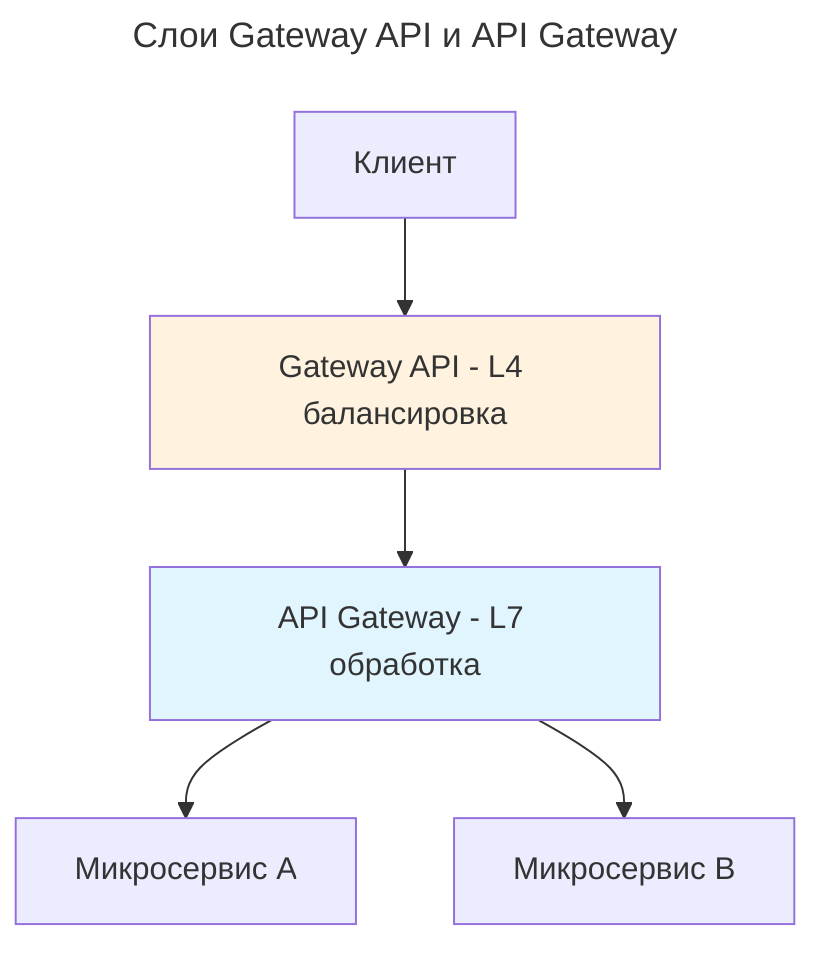

---
aliases:
  - API Gateway
  - API Gateway Kong
  - API-шлюз
  - Gateway API
  - Kong
  - Kubernetes Gateway API
  - Rate Limiting
  - Reverse Proxy
  - АПИ-шлюз
  - Обратный прокси
  - Ограничение скорости запросов
  - Шлюз API
---

---

## API Gateway

По сути API-шлюз `API Gateway` — это продвинутая и многофункциональная альтернатива обратному [[reverse-proxy|прокси-серверу]].

> **API Gateway выполняет функции прокси-сервера**, принимая все клиентские запросы и маршрутизируя их к соответствующим [[microservice|микросервисам]]. Позволяет скрыть внутреннюю структуру микросервисов от клиентов, предоставляет единый интерфейс для взаимодействия с системой. API Gateway также может выполнять множество дополнительных задач: трансформация запросов и ответов, кеширование, мониторинг, логирование, управление сессиями, аутентификация и авторизация.

С помощью конфигурации шлюза можно управлять эндпоинтами, применять политики безопасности и преобразовывать запросы или ответы.

К популярным API-шлюзам относятся Kong, Apigee, AWS API Gateway и Zuul.

### Kong (популярный API Gateway)

**Kong** — это популярный API Gateway с открытым исходным кодом, который поддерживает множество плагинов для управления трафиком, аутентификации, авторизации и мониторинга. Компании используют этот паттерн для надёжного и безопасного взаимодействия между микросервисами.

**Порядок настройки Kong:**

1. Установка API Gateway Kong.
2. Базовая конфигурация и настройка окружения.
3. Настройка маршрутизации запросов.
4. Настройка балансировки нагрузки:
   - **Round-robin** распределяет запросы по кругу между всеми доступными серверами;
   - **IP hash** направляет запросы к серверу на основе хеша IP-адреса клиента.
5. Настройка защиты от DDoS-атак:
   - **Rate Limiting** — лимитирование запросов и блокировка подозрительного трафика для предотвращения перегрузки сервиса;
   - **блокировка подозрительного трафика** — серия плагинов.

### Основные возможности

**Преимущества API-шлюзов:**

- **Унифицированная точка входа.** Шлюз обеспечивает единую, согласованную точку входа для всех сервисов. Это упрощает взаимодействие с клиентами.
- **Безопасность и аутентификация.** Он централизованно управляет системами безопасности, аутентификации и авторизации. Так будет проще обеспечить последовательное применение политик.
- **Ограничение скорости и дробление.** Шлюз контролирует скорость входящих запросов, чтобы защитить внутренние службы от перегрузки.
- **Аналитика и мониторинг.** У этой технологии есть встроенные возможности аналитики и мониторинга для отслеживания шаблонов запросов, производительности и ошибок.

**Задачи API Gateway в микросервисной архитектуре:**

- **Централизация маршрутизации запросов** — API Gateway принимает все клиентские запросы и маршрутизирует их к соответствующим микросервисам. Это упрощает управление маршрутами и позволяет легко изменять конфигурацию маршрутизации без необходимости вносить изменения в каждый отдельный микросервис.
- **Управление аутентификацией и авторизацией** — API Gateway может управлять аутентификацией и авторизацией, проверяя учётные данные клиентов и контролируя доступ к различным микросервисам на основе ролей и прав доступа.
- **Балансировка нагрузки и распределение трафика** — API Gateway распределяет входящий трафик между несколькими экземплярами микросервисов, обеспечивая равномерную нагрузку и высокую доступность системы.
- **Обеспечение безопасности** — API Gateway может применять политики безопасности: шифрование данных, защиту от DDoS-атак и ограничение скорости запросов (англ. rate limiting) — для защиты системы от угроз и атак.
- **Кеширование запросов** — API Gateway может кешировать ответы на часто запрашиваемые ресурсы, уменьшая нагрузку на микросервисы и повышая производительность системы.

Обычно команды выбирают между обратным прокси и шлюзом API, но оба варианта можно скомбинировать. Третья техника маршрутизации — [[service-mesh|service-mesh]] — представляет собой объединение двух техник в среде [[kubernetes|Kubernetes]]. Однако этот вариант самый сложный для реализации.

### Особенности

- ✅ **Единая точка входа.** Клиенты взаимодействуют с системой через единый интерфейс, что упрощает управление и мониторинг.
- ✅ **Безопасность.** API Gateway обеспечивает централизованную аутентификацию и авторизацию запросов.
- ✅ **Маршрутизация и балансировка нагрузки.** API Gateway маршрутизирует запросы к соответствующим микросервисам и балансирует нагрузку между ними.
- ✅ **Мониторинг и логирование.** API Gateway собирает и анализирует метрики и логи запросов, что помогает отслеживать производительность и обнаруживать проблемы.
- ❌ **Единая точка отказа.** API Gateway может стать единой точкой отказа, если не обеспечены механизмы высокой доступности.
- ❌ **Сложность.** Управление и настройка API Gateway могут быть сложными и требовать дополнительных ресурсов.

### Подходы к использованию

Существует несколько подходов к использованию API Gateway в микросервисной архитектуре, каждый из которых имеет свои преимущества и недостатки.

#### Монолитный API Gateway

- ✅ Единая точка управления всеми API-запросами, централизованное управление безопасностью и логированием.
- ❌ Единая точка отказа, возможная сложность управления при масштабировании системы.

#### Распределённый API Gateway

- ✅ Уменьшение единой точки отказа, улучшенная масштабируемость и производительность.
- ❌ Повышенная сложность управления и настройки, возможные проблемы с согласованностью данных.

#### Многослойный API Gateway

- ✅ Улучшенная безопасность, улучшенная масштабируемость, упрощённое управление и мониторинг, повышенная производительность.
- ❌ Повышенная сложность, трудности настройки, увеличение времени отклика, затраты на инфраструктуру.

#### Serverless API Gateway

- ✅ Высокая масштабируемость, отсутствие необходимости управления инфраструктурой, уменьшение затрат на ресурсы.
- ❌ Возможные ограничения в функциональности и производительности, зависимость от облачного провайдера.

### API Gateway vs Gateway API

**[[api-gateway|api-gateway]]** и **[[gateway-api|gateway-api]]** — это совершенно разные концепции, хотя их названия похожи.

- **API Gateway** = **продукт/паттерн** для управления API (бизнес-уровень).
- **Gateway API** = **стандарт/ресурс** для сетевой маршрутизации (инфраструктурный уровень).

**Сравнительная таблица**

| Критерий | **API Gateway** | **Gateway API** |
|---|---|---|
| **Уровень** | Приложение (L7) | Инфраструктура (L4-L7) |
| **Назначение** | Единая точка входа для клиентов | Стандарт для маршрутизации в K8s |
| **Объём** | Бизнес-логика, агрегация | Сетевая маршрутизация, балансировка |
| **Примеры** | Spring Cloud Gateway, Kong | GKE Gateway, Istio Gateway |
| **Где работает** | Над/вне кластера | Внутри Kubernetes кластера |
| **Основная задача** | API management | Traffic management |

Схема прохождения трафика через Gateway API и API Gateway:

