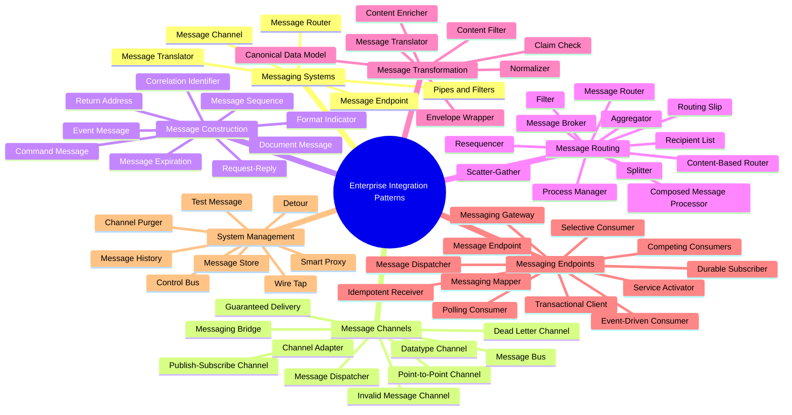
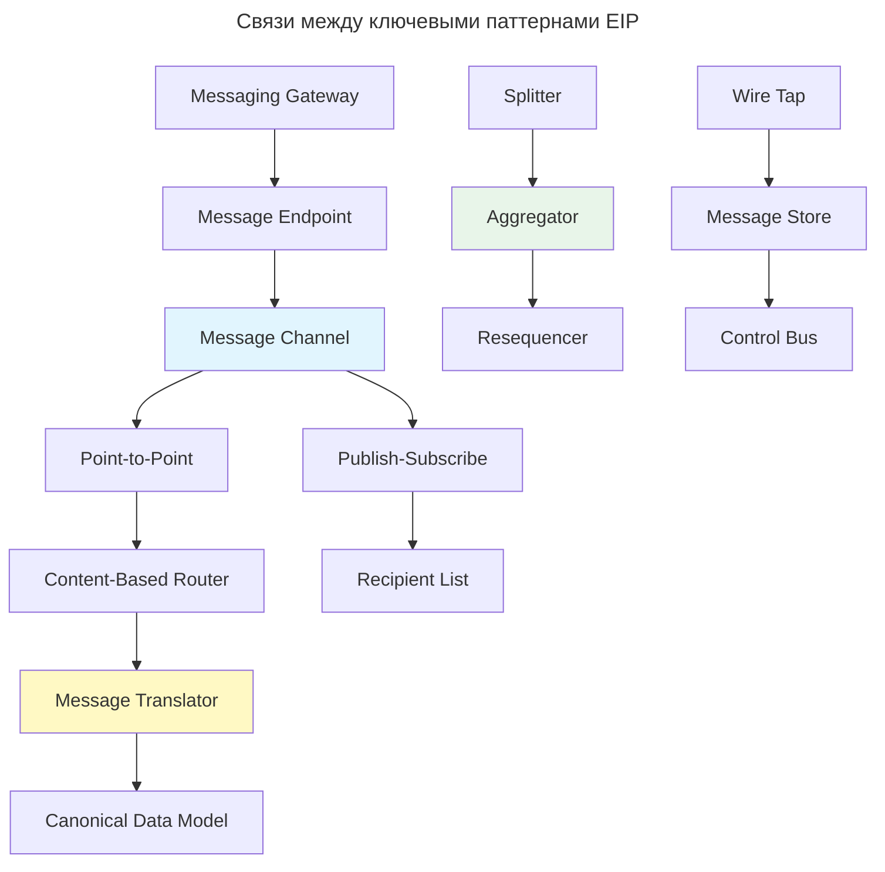
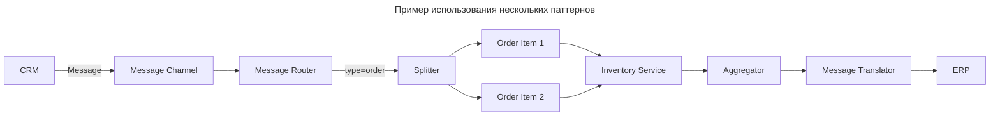

---
aliases:
  - Aggregator
  - Batch Consumer
  - Canonical Data Model
  - Channel Adapter
  - Claim Check
  - Command Message
  - Compensating Transaction
  - Competing Consumers
  - Composed Message Processor
  - Content Enricher
  - Content Filter
  - Content-Based Router
  - Control Bus
  - Correlation Identifier
  - Datatype Channel
  - Dead Letter Channel
  - Detour
  - Document Message
  - Durable Subscriber
  - Dynamic Router
  - EIP
  - Enterprise Integration Patterns
  - Envelope Wrapper
  - Event Message
  - Filter
  - Format Indicator
  - Guaranteed Delivery
  - Idempotent Receiver
  - Invalid Message Channel
  - Message
  - Message Broker
  - Message Bus
  - Message Channel
  - Message Dispatcher
  - Message Endpoint
  - Message Expiration
  - Message Filter
  - Message History
  - Message Router
  - Message Sequence
  - Message Store
  - Message Translator
  - Messaging Bridge
  - Messaging Gateway
  - Messaging Mapper
  - Normalizer
  - Pipes and Filters
  - Point-to-Point Channel
  - Polling Consumer
  - Priority Queue
  - Process Manager
  - Publish-Subscribe Channel
  - Recipient List
  - Request-Reply
  - Resequencer
  - Return Address
  - Routing Slip
  - Saga Pattern
  - Scatter-Gather
  - Selective Consumer
  - Service Activator
  - Smart Proxy
  - Splitter
  - Store-and-Forward
  - Test Message
  - Throttling
  - Transactional Client
  - Wire Tap
  - Агрегатор
  - Канал сообщений
  - Каталог паттернов интеграции
  - Маршрутизатор
  - Мертвая очередь
  - Общая модель данных
  - Преобразование сообщений
  - Разделитель
  - Событие
  - Сообщение
  - Шаблоны интеграции приложений
---

## Enterprise Integration Patterns

**Enterprise Integration Patterns (EIP)** — фундаментальный набор паттернов, описанный в книге Грегора Хёпхе #👨 и Боба Вульфа #👨 «Enterprise Integration Patterns: Designing, Building, and Deploying Messaging Solutions» #📘 (2003).

**Основная идея**

Как связать разрозненные системы (например, CRM → ERP → BI) через асинхронные, надёжные, гибкие каналы? EIP даёт универсальный язык и каталог решений для таких задач.

### Каталог паттернов

65 паттернов делятся на 8 групп.

#### Messaging Systems

- **Message** — атомарный пакет данных, передаваемый между приложениями.
- **Message Channel** — путь передачи сообщений («труба»: очередь или топик).
- **Pipes and Filters** — цепочка компонентов, обрабатывающих сообщения последовательно.
- **Message Router** — направляет сообщения по разным каналам в зависимости от правил.
- **Message Translator** — преобразует формат сообщения из одного вида в другой (SOAP → JSON).
- **Message Endpoint** — компонент, подключающий приложение к системе обмена сообщениями.

#### Messaging Channels

- **Point-to-Point Channel** — канал «один-к-одному»: сообщение получает только один потребитель.
- **Publish-Subscribe Channel** — канал «один-ко-многим»: сообщение получают все подписчики.
- **Datatype Channel** — канал, доставляющий сообщения определённого типа.
- **Invalid Message Channel** — канал для ошибочных сообщений (как DLQ).
- **Dead Letter Channel** — специальный канал для сообщений, которые не удалось доставить.
- **Guaranteed Delivery** — гарантия доставки сообщения даже при сбоях (ретраи, persistent queue).
- **Channel Adapter** — адаптер, подключающий приложение без поддержки сообщений к каналу (например, файловая система → [[kafka|Kafka]]).
- **Messaging Bridge** — соединяет две системы обмена сообщениями.
- **Message Bus** — централизованная шина обмена сообщениями для всей организации.

#### Message Construction

- **Command Message** — сообщение, передающее команду (`CreateOrder`, `SendEmail`).
- **Document Message** — сообщение, содержащее документ (PDF, XML, JSON).
- **Event Message** — сообщение-факт (`OrderPlaced`, `PaymentFailed`).
- **Request-Reply** — паттерн «запрос-ответ»: отправитель ожидает ответа на сообщение.
- **Return Address** — поле в сообщении, указывающее, куда отправить ответ (как `Reply-To` в email).
- **Correlation Identifier** — ID, позволяющий сопоставить запрос и ответ в асинхронных системах.
- **Message Sequence** — нумерация сообщений для сборки фрагментов в правильном порядке.
- **Message Expiration** — сообщение «умирает», если не обработано за установленное время.
- **Format Indicator** — указание формата данных сообщения.

#### Message Routing

- **Content-Based Router** — маршрутизирует сообщения на основе содержимого (поле `type=order` → очередь `orders`, `type=email` → `notifications`).
- **Message Filter** — отфильтровывает сообщения по условию.
- **Dynamic Router** — динамически определяет маршрут на основе бизнес-логики.
- **Recipient List** — отправляет сообщение нескольким получателям по списку.
- **Splitter** — разбивает одно сообщение на несколько частей (например, заказ → каждому товару).
- **Aggregator** — объединяет несколько сообщений в одно (например, результаты расчётов).
- **Resequencer** — переупорядочивает сообщения, если они пришли не по порядку.
- **Composed Message Processor** — обрабатывает составное сообщение: разбивает его на части, обрабатывает и собирает обратно.
- **Scatter-Gather** — рассылает запросы нескольким сервисам, собирает ответы и объединяет их.
- **Routing Slip** — список шагов маршрутизации, встроенный в сообщение.
- **Message Broker** — центральный маршрутизатор, управляющий всеми маршрутами.

#### Message Transformation

- **Message Translator** — преобразует формат одного сервиса в другой (например, CRM отправляет XML, ERP принимает JSON).
- **Envelope Wrapper** — добавляет метаданные в сообщение (например, `source`, `timestamp`).
- **Content Enricher** — дополняет сообщение данными из внешнего источника.
- **Content Filter** — удаляет из сообщения ненужные поля.
- **Claim Check** — заменяет содержимое сообщения ссылкой на данные, хранящиеся вне канала (например, URL в S3).
- **Normalizer** — приводит разные форматы сообщений к единому виду.
- **Canonical Data Model** — единая модель данных для всех интеграций, минимизирующая зависимости.

#### Messaging Endpoints

- **Messaging Gateway** — абстракция для взаимодействия с messaging-системой.
- **Messaging Mapper** — преобразует объекты приложения в сообщения и обратно.
- **Polling Consumer** — потребитель, который периодически опрашивает канал на наличие сообщений.
- **Event-Driven Consumer** — потребитель, автоматически уведомляемый о новых сообщениях (push-based).
- **Competing Consumers** — несколько потребителей, конкурирующих за сообщения в канале (повышает производительность).
- **Message Dispatcher** — распределяет сообщения между несколькими потребителями.
- **Selective Consumer** — выбирает сообщения по критериям, игнорируя остальные.
- **Durable Subscriber** — подписчик, который получает сообщения даже после перезапуска.
- **Idempotent Receiver** — компонент, способный обрабатывать дублирующиеся сообщения без побочных эффектов.
- **Service Activator** — активирует бизнес-сервис в ответ на полученное сообщение.
- **Transactional Client** — гарантирует, что операции с сообщениями выполняются в рамках транзакции.

#### System Management

- **Control Bus** — канал для управления компонентами системы (старт, стоп, мониторинг).
- **Detour** — «объезд»: временно перенаправляет сообщения для диагностики или обслуживания.
- **Wire Tap** — копирует сообщения для мониторинга без влияния на основной поток.
- **Message History** — отслеживает путь сообщения через систему.
- **Message Store** — хранит сообщения (например, для повторной обработки).
- **Smart Proxy** — прокси-компонент, добавляющий функциональность (аутентификация, логирование, ретраи, кэш).
- **Test Message** — тестовое сообщение для проверки работоспособности канала.
- **Channel Purger** — очищает канал от застрявших сообщений.

#### Дополнительные паттерны

- **Process Manager** — координирует сложные бизнес-процессы, состоящие из нескольких шагов.
- **Batch Consumer** — обрабатывает сообщения пакетами для повышения производительности.
- **Throttling** — «заслонка»: ограничивает частоту обработки сообщений для предотвращения перегрузки.
- **Priority Queue** — очередь с приоритетами: сообщения с высоким приоритетом обрабатываются первыми.
- **Store-and-Forward** — сохраняет сообщения локально и пересылает их позже, если получатель недоступен.
- **Compensating Transaction** — при провале транзакции выполняет компенсирующие действия (например, вернуть деньги).
- **Saga Pattern** — последовательность локальных транзакций с откатом через компенсацию.

Паттерны реализованы во многих технологиях: JMS, MSMQ, [[camel|Apache Camel]], Spring Integration, [[rabbit-mq|RabbitMQ]], Kafka и др.

---

## Карта паттернов

### Визуализация связей паттернов

---

## Пример: использование нескольких паттернов

Паттерны в примере:

- **Message** — сама запись
- **Message Channel** — очередь
- **Message Router** — направляет в Splitter
- **Splitter** — разбивает заказ на строки
- **Aggregator** — собирает результаты
- **Message Translator** — преобразует XML → JSON

---

## Современные аналоги

| EIP | Современная реализация |
|-----|------------------------|
| **Message Router** | Spring Integration, Apache Camel, Istio VirtualService |
| **Message Translator** | Kafka Connect (SMT), Camel Transformers |
| **Aggregator** | Kafka Streams, Flink, Spark |
| **Saga Pattern** | Axon Framework, Camunda |
| **Message Channel** | RabbitMQ, Kafka, SQS |
| **Message Store** | Kafka Topic, Event Store DB |

---

## Когда использовать EIP

| Сценарий | Рекомендация |
|----------|--------------|
| Интеграция CRM + ERP + BI | Да — EIP — стандарт |
| Микросервисы общаются через события | Да — Splitter, Aggregator, Router |
| Нужна отказоустойчивость | Dead Letter Channel, Retry, Compensating Transaction |
| Используются Kafka/RabbitMQ | Да — знайте паттерны |
| MVP, простой проект | Нет — слишком много абстракций |

---

## Лучшие практики

| Практика | Объяснение |
|---------|------------|
| **Используйте каноническую модель данных** | Чтобы все системы понимали одно сообщение |
| **Делайте потребителей idempotent** | На случай дублей |
| **Не бойтесь Dead Letter Queue** | Он спасает при ошибках |
| **Тестируйте конвейер** | Каждый паттерн должен быть протестирован |
| **Используйте EIP как язык** | Чтобы говорить «Здесь нужен Content-Based Router», а не описывать поведение словами |

---

## Чек-лист: применение EIP в проекте

- [ ] Определить границы контекстов (Bounded Contexts)
- [ ] Выбрать стиль взаимодействия: синхронный / асинхронный
- [ ] Спроектировать каналы: P2P или Pub/Sub
- [ ] Определить форматы сообщений и каноническую модель
- [ ] Выбрать паттерны маршрутизации (Router, Splitter, Aggregator)
- [ ] Реализовать обработку ошибок (Dead Letter, Invalid Message)
- [ ] Добавить мониторинг (Wire Tap, Control Bus, Message History)
- [ ] Протестировать с помощью Test Message и Channel Purger

---

## Итог

| Проблема | EIP-паттерн |
|----------|-------------|
| Разделить заказ на товары | **Splitter** |
| Собрать ответы от 3 сервисов | **Aggregator** |
| Отправить в зависимости от типа | **Content-Based Router** |
| Обработать ошибки | **Dead Letter Channel** |
| Избежать дублей | **Idempotent Receiver** |
| Сохранить порядок | **Resequencer** |
| Связать старую и новую систему | **[[Anti-Corruption Layer|Anti-Corruption Layer]]** (из DDD) |

| Для чего | Какие паттерны использовать |
|----------|-----------------------------|
| **Асинхронная коммуникация** | Message Channel, P2P, Pub/Sub |
| **Надёжная доставка** | Guaranteed Delivery, Dead Letter, Idempotent Receiver |
| **Обработка сложных потоков** | Splitter, Aggregator, Resequencer, Process Manager |
| **Интеграция разнородных систем** | Channel Adapter, Message Translator, Canonical Data Model |
| **Масштабирование** | Competing Consumers, Content-Based Router |
| **Отладка и аудит** | Wire Tap, Message History, Control Bus |
| **Управление состоянием** | Correlation Identifier, Message Sequence, Saga |

**Совет:** Не применяйте все паттерны сразу. Начинайте с базовых (Message Channel, Messaging Gateway, Point-to-Point) и добавляйте сложные (Aggregator, Process Manager) по мере роста требований к системе.
