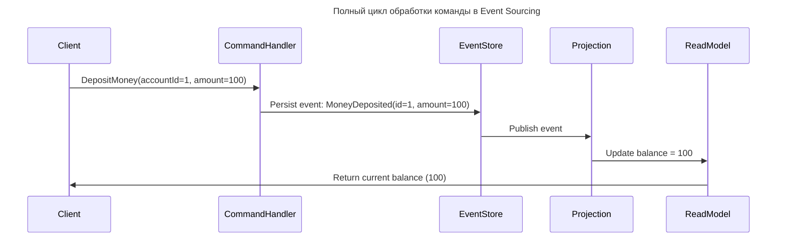
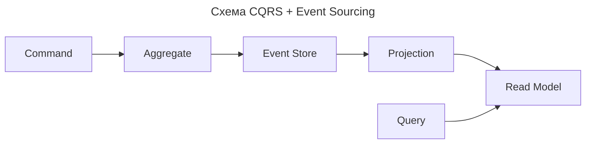

---
aliases:
  - Aggregate
  - Command
  - CQRS
  - ES
  - Event Sourcing
  - Event Store
  - EventStoreDB
  - Projection
  - Read Model
  - Агрегат
  - Команда
  - Модель чтения
  - Проекция
  - Разделение ответственности команд и запросов
  - Событийное хранилище
  - Событийный источник
  - Хранилище событий
---

## Что такое Event Sourcing

**Суть**

Event Sourcing (ES) — архитектурный подход к хранению состояния системы, который радикально отличается от традиционных методов. Вместо того чтобы хранить текущее состояние, он хранит все события, которые привели к этому состоянию.

**Определение**

Event Sourcing — паттерн проектирования, при котором все изменения состояния системы сохраняются как последовательность неизменяемых событий (events), а текущее состояние вычисляется путём воспроизведения этих событий.

Это как вести журнал событий (лог) вместо того, чтобы просто обновлять запись в таблице.

---

## Традиционный подход vs Event Sourcing

| Аспект | Традиционный подход | Event Sourcing |
| --- | --- | --- |
| Что хранится? | Текущее состояние объекта (например, `User` с балансом 1000) | Список событий: `UserCreated`, `MoneyDeposited(500)`, `MoneyWithdrawn(200)` |
| Как обновляется состояние? | `UPDATE users SET balance = 1000 WHERE id = 123` | `INSERT INTO events (type, payload) VALUES ('MoneyDeposited', {...})` |
| Как получить текущее состояние? | Прямой `SELECT` из таблицы | Воспроизведение всех событий для агрегата |
| История изменений | Утрачивается — только последняя версия | Полная история доступна всегда |
| Можно ли откатить? | Только через резервную копию или обратную транзакцию | Да — «перевоспроизвести» события до нужного момента |
| Производительность записи | Быстро — одна запись | Медленнее — много событий |
| Производительность чтения | Очень быстро | Медленнее — нужно воспроизводить события (можно кэшировать) |

---

## Пример: банковский счёт

**Традиционный подход**

Состояние на момент времени T:

```sql
-- Состояние на момент времени T
users:
id | name   | balance
1  | Alice  | 800
```

Перевод 200 → баланс становится 600:

```sql
UPDATE users SET balance = 600 WHERE id = 1;
```

История потеряна: никто не знает, что было 800 → 600. Нельзя восстановить состояние на прошлую дату и проверить, кто и когда сделал операцию.

**Event Sourcing**

Баланс не обновляется — записывается событие:

```text
events:
id | aggregate_id | type             | payload                     | timestamp
---|--------------|------------------|-----------------------------|-------------------
1  | user:1       | UserCreated      | { "name": "Alice" }         | 2024-01-01T10:00:00Z
2  | user:1       | MoneyDeposited   | { "amount": 500 }           | 2024-01-01T11:00:00Z
3  | user:1       | MoneyWithdrawn   | { "amount": 200 }           | 2024-01-01T12:00:00Z
4  | user:1       | MoneyDeposited   | { "amount": 300 }           | 2024-01-01T13:00:00Z
```

**Как получить текущий баланс**

Воспроизведите все события для `user:1`:

```js
let balance = 0;

events.filter(e => e.aggregate_id === 'user:1').forEach(event => {
  switch(event.type) {
    case 'MoneyDeposited':   balance += event.payload.amount; break;
    case 'MoneyWithdrawn':   balance -= event.payload.amount; break;
  }
});

console.log(balance); // 600
```

> Состояние — это производная от истории.

---

## Ключевые понятия

| Понятие | Описание |
| --- | --- |
| Event (Событие) | Неизменяемый факт о произошедшем действии (`OrderPlaced`, `PaymentApproved`). Должен быть именован в прошедшем времени |
| Aggregate (Агрегат) | Группа связанных сущностей, обрабатываемых как единое целое (например, `Order` со всеми `OrderLine`). Все события относятся к одному агрегату |
| Event Store | База данных для хранения событий (например, EventStoreDB, [[kafka|Kafka]], PostgreSQL с JSON) |
| Projection (Проекция) | Представление состояния, созданное на основе событий (например, `current_balance`). Используется для быстрого чтения |
| Command (Команда) | Запрос на изменение состояния (`DepositMoneyToAccount`) — вызывает событие. Команда ≠ событие |
| Read Model (Модель чтения) | Оптимизированная копия данных для запросов. Обновляется асинхронно через проекции |

> Command → Event → Projection → Read Model

---

## Как работает полный цикл



1. Клиент отправляет команду (`DepositMoney`).
2. Сервис проверяет бизнес-правила → если всё в порядке, генерирует событие.
3. Событие сохраняется в Event Store.
4. Проекция слушает события и обновляет Read Model (например, SQL-таблицу).
5. Для чтения клиент обращается к Read Model — быстро и эффективно.

> Event Store — источник правды (Single Source of Truth). Read Model — оптимизация для чтения.

---

## Преимущества Event Sourcing

| Преимущество | Объяснение |
| --- | --- |
| Полная история изменений | Восстановление состояния на любой момент в прошлом — для аудита, регуляторных требований (GDPR, FINRA) |
| Отказоустойчивость | События неизменяемы — нет конфликтов при обновлении |
| Лёгкое масштабирование | События обрабатываются асинхронно, параллельно, в очередях (Kafka, RabbitMQ) |
| Поддержка CQRS | Естественно сочетается с CQRS — разделение чтения и записи |
| Возможность «пересоздания» систем | Перестройка всех read models заново, например после изменения бизнес-логики |
| Простота отладки | Точное воспроизведение событий, приведших к ошибке |
| Поддержка временных моделей | Анализ изменения состояния во времени |

---

## Недостатки Event Sourcing

| Недостаток | Объяснение |
| --- | --- |
| Сложность разработки | Нужно мыслить событиями, а не объектами — переосмысление архитектуры |
| Сложность чтения | Получение текущего состояния требует воспроизведения событий — медленно без проекций |
| Сложность миграций | При изменении формата события нужно писать миграторы для старых событий |
| Дублирование данных | Read model — копия данных из событий → поддержание согласованности |
| Отсутствие стандартов | Нет единого фреймворка — каждая реализация уникальна |
| Ограниченная поддержка ORM | [[hibernate|Hibernate]], Entity Framework не работают с ES — нужны специальные библиотеки |

---

## Реальные примеры применения

| Отрасль | Пример использования |
| --- | --- |
| Финансы / Банки | Хранение всех транзакций для аудита, отчётов, восстановления при сбоях (PayPal, Stripe) |
| Электронная коммерция | Лог всех действий заказа: `OrderCreated`, `PaymentCaptured`, `Shipped`, `Delivered`, `Returned` |
| IoT / Мониторинг | Все показания датчиков — события: `TemperatureChanged`, `DoorOpened` |
| Логистика | История перемещения груза: `PickedUp`, `AtWarehouse`, `LoadedOnTruck`, `Delivered` |
| Биржи / HFT | Все сделки — события; можно полностью воспроизвести рынок за день |
| CRM / ERP | История взаимодействия с клиентом: `Contacted`, `QuoteSent`, `ContractSigned` |

> Stripe использует Event Sourcing для всех платежей — каждая операция является событием. Это позволяет делать точные отчёты, восстанавливать данные после сбоев и обеспечивать соответствие законам.

---

## Event Sourcing + CQRS

Часто Event Sourcing используется вместе с CQRS (Command Query Responsibility Segregation):

| Сторона CQRS | Описание |
| --- | --- |
| Command Side | Обработка команд → генерация событий → сохранение в Event Store |
| Query Side | Чтение данных из Read Models (SQL-таблицы, [[elastic-search|Elasticsearch]], Redis) — оптимизированных для запросов |



> CQRS + ES — сильная пара для сложных доменных систем.

---

## Инструменты для Event Sourcing

| Инструмент | Описание |
| --- | --- |
| EventStoreDB | Специализированная БД для Event Sourcing — потоки, подписки, транзакции |
| [[kafka|Apache Kafka]] | Распределённый стриминг-брокер — часто используется как Event Store |
| PostgreSQL + JSONB | Простой Event Store в .NET/Java-системах |
| Axon Framework (Java) | Полноценный фреймворк для CQRS+ES |
| EventFlow (.NET) | Лёгкий фреймворк для Event Sourcing |
| NEventStore (.NET) | Популярная библиотека для работы с ES |

---

## Когда использовать Event Sourcing

| Используйте, если | Избегайте, если |
| --- | --- |
| Нужна полная история изменений | Проект маленький, MVP |
| Есть требования аудита, compliance (GDPR, SOX, PCI-DSS) | Нет необходимости в истории |
| Сложная доменная логика (финансы, логистика) | Простые CRUD-операции |
| Строится масштабируемая система с CQRS | Нет готовности к сложности |
| Нужно воспроизводить поведение системы | Нельзя позволить себе задержки при чтении |
| Работа с временными данными | Команда не знакома с паттерном |

---

## Философия Event Sourcing

> «Не храните то, чем вы являетесь — храните то, что вас сформировало.»

Объект — это результат всех действий, решений и ошибок. Event Sourcing — это биография объекта.

---

## Заключение

| Традиционный подход | Event Sourcing |
| --- | --- |
| «Храним состояние» | «Храним историю» |
| `UPDATE balance = 1000` | `Append Event: BalanceChanged(from=800 to=1000)` |
| Текущая версия — правда | История событий — правда |
| Просто, но хрупко | Сложно, но надёжно |
| Работает для 90% систем | Работает для 10% критичных систем |

Event Sourcing — это выбор для систем, где нельзя позволить себе потерять историю. Он подходит там, где важно не только «что сейчас», но и «как оно стало таким».

- [Martin Fowler: Event Sourcing](https://martinfowler.com/eaaDev/EventSourcing.html) — классическая статья
- [EventStoreDB Documentation](https://eventstore.com/docs/)
- Книга #📘 «Implementing Domain-Driven Design» (Vaughn Vernon) — глава про ES
- Видео «Event Sourcing Explained» (канал Clean Code)
