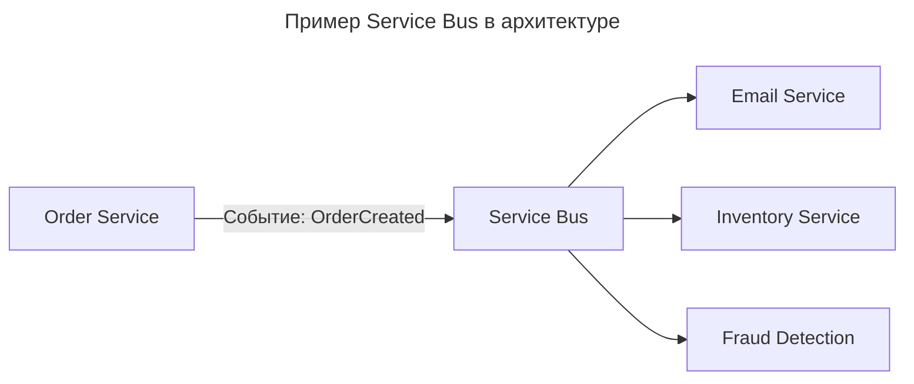

---
aliases:
  - Business Capability
  - Decoupling
  - Enterprise Service Bus
  - ESB
  - Event Bus
  - Message Broker
  - Message Queue
  - Pub/Sub
  - Service Bus
  - Брокер сообщений
  - Декуплинг
  - Корпоративная сервисная шина
  - Очередь сообщений
  - Публикация-подписка
  - Сервисная шина
  - Шина событий
---

## Сравнение Service Bus и Event Bus

Service Bus и [[event-bus]] — звучат похоже, но на самом деле **относятся к разным уровням абстракции**.

| Аспект | **Service Bus** | **Event Bus** |
| ------ | --------------- | ------------- |
| **Тип** | Архитектурный паттерн | Техническая реализация |
| **Определение** | Паттерн: система, где компоненты общаются через центральный брокер | Конкретная технология, реализующая messaging |
| **Примеры** | [[event-driven-architecture]], [[message-broker]] как концепция | Kafka, RabbitMQ, AWS EventBridge |
| **Уровень** | Концептуальный (архитектура) | Реализационный (инструмент) |
| **Аналогия** | Идея почтового ящика | Почта России |

**Key idea**

- **Service Bus** — это *концепция*.
- **Event Bus** — это *реализация* этой концепции в виде конкретной системы.

## Что такое Service Bus

**Определение**
> **Service Bus** — это **архитектурный паттерн**, при котором **разные сервисы обмениваются сообщениями через централизованный брокер** (шину), чтобы избежать прямых зависимостей.

Это **не инструмент**, а **принцип проектирования**:

- Сервис A не вызывает B напрямую — он отправляет сообщение в **шину**
- Сервис B **подписывается** на нужные события
- Никакой зависимости между A и B

**Цель Service Bus**

- Декуплинг (слабая связность)
- Асинхронность
- Масштабируемость
- Отказоустойчивость
- Управление трафиком (очереди, топики)

**Пример Service Bus в архитектуре**



`Order Service` ничего не знает о других сервисах — просто отправляет событие в шину.

## Что такое Event Bus

**Определение**
> **Event Bus** — это **конкретная система или инструмент**, реализующий **паттерн Service Bus** для **событий**.

Это **реализация**, а не паттерн.

**Примеры Event Bus**

| Инструмент | Тип |
|-----------|------|
| **Kafka** | Распределённая платформа потоковой обработки |
| **RabbitMQ** | Сообщения + очереди |
| **AWS EventBridge** | Managed event bus для SaaS и микросервисов |
| **Azure Event Grid** | Облачный Event Bus |
| **Google Cloud Pub/Sub** | Глобальная доставка событий |
| **Redis Streams** | Лёгкий Event Bus для небольших систем |

Event Bus — это то, что устанавливается, настраивается и масштабируется.

## Сравнение Service Bus vs Event Bus

| Критерий | **Service Bus** | **Event Bus** |
|----------|----------------|---------------|
| **Что это?** | Архитектурный паттерн | Конкретная технология |
| **Где используется?** | В описании архитектуры, документации | В CI/CD, Docker, Kubernetes |
| **Зависимость от технологии?** | Нет — можно реализовать любым способом | Да — зависит от Kafka, RabbitMQ и др. |
| **Можно ли заменить?** | Да — меняется только реализация | Да — например, RabbitMQ → Kafka |
| **Пример фразы** | «Мы используем Service Bus для интеграции сервисов» | «Мы используем Kafka как Event Bus» |
| **Цель** | Декуплинг, асинхронность | Реализовать паттерн Service Bus |
| **Связь** | Это **идея** | Это **инструмент** |

Service Bus — это «почта». Event Bus — это «Почта России».

## Как соотносятся

```mermaid
---
title: Реализация паттерна Service Bus через Event Bus
---
flowchart TB
    SB[Service Bus (паттерн)] -->|реализуется через| EB[Event Bus: Kafka, RabbitMQ]
```

Event Bus — это один из способов реализации Service Bus, но не единственный.

## Значения термина «Service Bus»

В разных контекстах этот термин может означать:

| Значение | Пример |
|---------|--------|
| **1. Паттерн (общее)** | Использование service bus для дедупликации микросервисов |
| **2. Конкретный продукт** | Azure Service Bus как message broker |
| **3. Enterprise Service Bus (ESB)** | Устаревшая корпоративная система (например, MuleSoft, WSO2) |

**Azure Service Bus ≠ Service Bus (паттерн)** — это **продукт Microsoft**, который **реализует паттерн**.

## Разница между Event Bus и Message Queue

| | **Event Bus** | **Message Queue** |
|--|-------------|------------------|
| **Фокус** | События (event-driven) | Очереди задач |
| **Топология** | Часто Pub/Sub | Чаще P2P |
| **Примеры** | Kafka, EventBridge | RabbitMQ, SQS |
| **Ключевая идея** | «Что-то произошло» | «Нужно сделать» |
| **Может быть частью Service Bus** | Да | Да |

Event Bus — подвид Service Bus, сфокусированный на **событиях (events)**.

## Примеры использования

### Паттерн Service Bus

> Принято решение не делать прямые вызовы между сервисами. Всё взаимодействие происходит через **шину сообщений** — это **Service Bus**.

Здесь — **архитектурное решение**.

### Event Bus как инструмент

> Для реализации Service Bus выбран **Apache Kafka** — он работает как **Event Bus**.

Здесь — **выбор технологии**.

### Объединённый пример

```mermaid
---
title: Event Bus на базе Kafka
---
graph LR
  A[Order Service] -->|Publish| B[Kafka (Event Bus)]
  B --> C[Email Service]
  B --> D[Inventory Service]
  B --> E[Analytics Service]

  style B fill:#f0ad4e,stroke:#c9510c,color:#fff
  style A,C,D,E fill:#dfe9f5,stroke:#000
```

- **Service Bus** — это **архитектурный подход**: «Мы используем централизованную шину для обмена сообщениями».
- **Kafka** — это **Event Bus**: «Наши события хранятся и маршрутизируются через Kafka».

## Когда что использовать

| Цель | Рекомендация |
|----------|--------------|
| Описание архитектуры | **Service Bus** |
| Выбор технологии | **Event Bus: Kafka / RabbitMQ / EventBridge** |
| Масштабирование | **Event Bus: Kafka** |
| Управление сложными интеграциями | **Azure Service Bus** |
| Event-driven система | **Event Bus + Service Bus как паттерн** |
| Документация | «Мы используем паттерн Service Bus. Реализован через Kafka как Event Bus» |

## Финальный вывод

| Вопрос | Ответ |
|--------|-------|
| **Чем отличается Service Bus от Event Bus?** | **Service Bus — это архитектурный паттерн. Event Bus — это его техническая реализация.** |
| **Можно ли иметь Service Bus без Event Bus?** | Теоретически да (например, через HTTP-уведомления), но **практически всегда нужен Event Bus** |
| **Можно ли использовать Event Bus вне Service Bus?** | Можно, но тогда используется только очередь — без архитектурного подхода |
| **Что лучше сказать?** | «Мы используем паттерн Service Bus, реализованный через Kafka как Event Bus» |

## Сводная таблица

| Понятие | Что это? | Примеры |
|--------|----------|---------|
| **Service Bus** | Архитектурный паттерн для декуплинга | Идея: «все сервисы общаются через шину» |
| **Event Bus** | Конкретная реализация Service Bus для событий | Kafka, RabbitMQ, AWS EventBridge |
| **Message Queue** | Подсистема внутри Event Bus | Очередь в Kafka или RabbitMQ |
| **Pub/Sub** | Шаблон доставки | Один источник → много подписчиков |

**Суть различения**

- **Service Bus** = «Как мы общаемся? Через шину».
- **Event Bus** = «Что за шина? Kafka».
