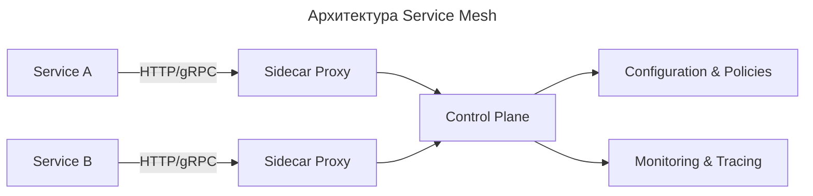

---
aliases:
  - Control Plane
  - Data Plane
  - Envoy
  - Istio
  - Kubernetes
  - mTLS
  - Observability
  - Service Mesh
  - Sidecar
  - Sidecar Proxy
  - Наблюдаемость
  - Плоскость данных
  - Плоскость управления
  - Сайдкар
  - Сайдкар-прокси
  - Сервисная сетка
---

## Service Mesh (сервисная сетка)

**Service Mesh** — это выделенный слой инфраструктуры для управления сетевыми взаимодействиями между микросервисами. Он работает вне приложений, как «сетевой транспорт», который автоматически добавляется к сервисам: перехватывает сетевой трафик с помощью [[sidecar|сайдкар]]-прокси, развёрнутых рядом с каждым микросервисом, и централизованно управляет маршрутизацией запросов, балансировкой нагрузки, шифрованием, аутентификацией, логированием и мониторингом — без изменения кода самих сервисов.

**Основные функции и возможности Service Mesh:**

- **Балансировка нагрузки:** распределение трафика между несколькими экземплярами сервиса для повышения производительности и отказоустойчивости.
- **Безопасность:** шифрование трафика (например, mTLS), аутентификация и авторизация запросов между сервисами.
- **Управление трафиком:** динамическая маршрутизация, «сине-зелёные» и «канареечные» развёртывания с поэтапным разделением трафика.
- **Наблюдаемость (Observability):** сбор метрик, трассировка запросов и ведение логов распределённой системы.
- **Отказоустойчивость:** автоматическое отключение сбойных экземпляров сервиса и их повторное подключение при восстановлении работоспособности.

**Как работает Service Mesh:**

1. **Сайдкары ([[sidecar]]):** рядом с каждым микросервисом разворачивается лёгковесный прокси-контейнер, например, на базе [[envoy]] — высокопроизводительного прокси-сервера с открытым исходным кодом.
2. **Перехват трафика:** все входящие и исходящие сетевые запросы микросервиса перехватываются сайдкаром.
3. **Управление трафиком:** сайдкар маршрутизирует запросы, выполняет шифрование/дешифрование, балансировку нагрузки и другие операции в соответствии с политиками, заданными в слой управления (Control Plane).
4. **Контрольная панель (Control Plane):** управляет сайдкарами, настраивает правила маршрутизации и распространяет их по сети.

**Компоненты:**

| Часть | Описание |
| ----------------- | --------------------------------------------------------------------------------------------------------- |
| **Data Plane** | Сеть **sidecar-прокси** (например, [[envoy]]), которые обрабатывают входящий/исходящий трафик каждого сервиса |
| **Control Plane** | Центральный компонент, который **конфигурирует** прокси (политики, маршруты, сертификаты) |
| **Sidecar Proxy** | Маленький прокси-сервер, запущенный **вместе с каждым микросервисом** в одном поде (в Kubernetes) |

**Цели Service Mesh:**

| Цель | Объяснение |
| ----------------------------------------------- | ---------------------------------------------------------------------------- |
| **Декуплинг логики приложения и сетевых задач** | Не нужно писать retry, timeout, circuit breaker в коде — всё делает mesh |
| **Наблюдаемость (Observability)** | Автоматическая сборка метрик, трассировка, логи всех вызовов между сервисами |
| **Безопасность** | mTLS (шифрование трафика), политики доступа, аутентификация сервисов |
| **Управление трафиком** | Canary-развертывания, A/B тесты, балансировка нагрузки, fault injection |
| **Политики** | Rate limiting, quotas, circuit breaking — без изменения кода |

[[istio]] — один из инструментов, который позволяет организовать [[service-mesh]] в среде [[kubernetes|Kubernetes]].

**Преимущества Service Mesh:**

- **Упрощение для разработчиков:** разработчики сосредотачиваются на бизнес-логике приложения, освобождаясь от задач управления сетевыми взаимодействиями.
- **Централизованное управление:** единая точка настройки и мониторинга всей сетевой инфраструктуры микросервисов.
- **Улучшение производительности и надёжности:** за счёт умной балансировки нагрузки, отказоустойчивости и оптимизации соединений.

**Аналогия:**

> Service Mesh подобен автоматическому диспетчеру дорожного движения для каждого сервиса-автомобиля: он запоминает, куда тот ездил, проверяет, не перегружен ли путь, шифрует сообщения между машинами и автоматически перенаправляет, если дорога забита.
