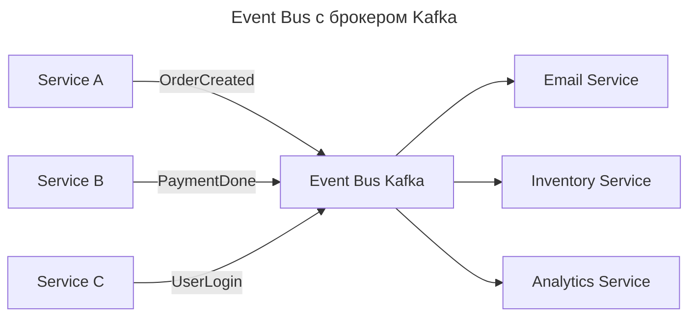
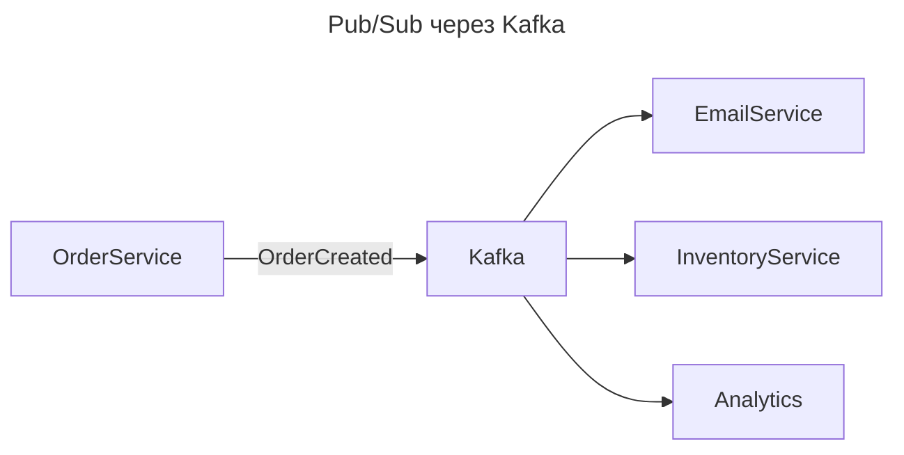
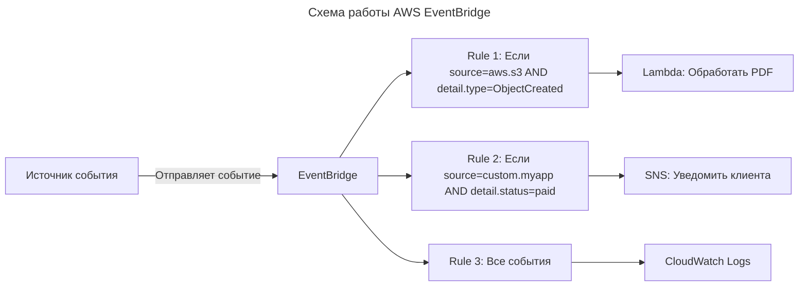

---
aliases:
  - AWS Event Bridge
  - AWS Event Grid
  - AWS EventBridge
  - Event Bus
  - Event-Driven Architecture
  - Kafka
  - NATS
  - Pub/Sub
  - Publish/Subscribe
  - Publisher
  - RabbitMQ
  - Redis Streams
  - Subscriber
  - Издатель
  - Подписчик
  - Событийно-ориентированная архитектура
  - Шина событий
---

# Publish/Subscribe (Pub/Sub)

**Суть**

Паттерн Pub/Sub — это паттерн проектирования, при котором компоненты системы выступают в роли издателей (publisher) или подписчиков (subscriber).

Паттерн Pub/Sub можно реализовать с помощью разных технологий. Одна из них — [[event-bus]].

**[[event-bus]] (шина событий)** — это система обмена сообщениями, которая основана на паттерне Pub/Sub. События публикуют в шине событий. Компоненты-подписчики регистрируются в шине и указывают список событий, которые они хотят получать.

## Когда использовать паттерн

Эта стратегия подходит, если в проекте:

- **Предпочтительно несвязанное соединение.** Системы Pub/Sub используются, когда нужно несвязанное взаимодействие между [[microfrontend|микрофронтендами]]. Такой подход позволяет компонентам взаимодействовать без прямых зависимостей и упрощает добавление, удаление или обновление микрофронтендов.
- **Архитектура, управляемая событиями (event-driven architecture, [[event-driven-architecture]]).** Действия или обновления в одной части приложения вызывают реакции в других частях. Паттерн Pub/Sub идеально подходит таким приложениям — он эффективен для обновлений в реальном времени и [[asynchronous-integration|асинхронных коммуникаций]].
- **Независимое развёртывание.** Микрофронтенды должны разворачиваться независимо друг от друга. Паттерн Pub/Sub помогает отделить логику взаимодействия от фактической реализации.

## Event Bus vs Pub/Sub

Event Bus и Pub/Sub (Publish/Subscribe) часто используются как синонимы, но между ними есть важные архитектурные различия, которые влияют на масштабируемость, надёжность и сложность системы.

**Краткий ответ**

| Аспект | Event Bus | Pub/Sub |
| --------------------- | ------------------------------------------------------------------------------ | ------------------------------------------------------------------------------------------------ |
| Суть | Централизованный канал для передачи событий — может быть реализацией Pub/Sub | Архитектурный паттерн: отправители (publishers) и получатели (subscribers) не знают друг о друге |
| Структура | Часто один центральный брокер (например, Kafka, RabbitMQ) | Может быть реализован через Event Bus, но не обязан быть централизованным |
| Жёсткость связи | Слабая — все события проходят через один узел | Слабая — отправитель и подписчик полностью декуплены |
| Масштабируемость | Зависит от брокера — может стать узким местом | Легко масштабируется — можно использовать несколько брокеров или распределённые сети |
| Гибкость | Меньше гибкости — все события идут через одну «магистраль» | Высокая гибкость — можно использовать разные топики, фильтрацию, маршрутизацию |
| Пример реализации | Kafka, RabbitMQ, AWS EventBridge | Сам паттерн — реализуется через Kafka, Redis, NATS и др. |

> Ключевое:
> - Event Bus — это часто техническая реализация паттерна Pub/Sub.
> - Pub/Sub — архитектурный принцип, который может быть реализован через Event Bus, но не обязан.

**Что такое Pub/Sub (Publish/Subscribe)**

Pub/Sub — это архитектурный паттерн, при котором:

- Издатели (Publishers) отправляют сообщения (события) без знания о том, кто их получит.
- Подписчики (Subscribers) регистрируются на определённые типы событий (темы / топики).
- Нет прямой связи между издателем и подписчиком — они взаимодействуют через посредника (или даже без него).

**Ключевые характеристики**

| Характеристика | Описание |
|----------------|----------|
| Декуплинг | Издатель и подписчик не знают друг о друге — могут меняться независимо |
| Тематизация | События группируются по темам (topics) — например, `order.created`, `payment.success` |
| Фильтрация | Подписчик может подписаться на несколько тем или использовать фильтры |
| Одно событие → много получателей | Одно событие может получить множество подписчиков |
| Асинхронность | Никаких блокировок — издатель «бросает» событие и забывает |
| Брокер не обязателен | Теоретически можно реализовать в памяти (например, через Observer в Java), но в продакшене почти всегда используется брокер |

**Пример**

```mermaid
---
title: Pub/Sub: один издатель, три подписчика
---
flowchart LR
    O[Order Service] -->|OrderCreated| E[Email Service]
    O -->|OrderCreated| I[Inventory Service]
    O -->|OrderCreated| A[Analytics Service]
```

Все три сервиса получают одно событие — никто никого не вызывает.

**Что такое Event Bus**

Event Bus — конкретная техническая реализация механизма передачи событий, обычно централизованный компонент, который:

- принимает события от всех источников;
- распределяет их подписчикам;
- обеспечивает доставку, порядок и надёжность.

Это инфраструктурный элемент, а не абстрактный паттерн.

**Ключевые характеристики Event Bus**

| Характеристика | Описание |
|----------------|----------|
| Централизация | Всё проходит через один брокер (Kafka, RabbitMQ, EventBus в Spring) |
| Транспорт | Часто реализован как сообщения в очередях/топиках |
| Постоянство | События могут храниться (persistent) — для восстановления после сбоев |
| Масштабирование | Брокер может быть кластеризован (Kafka) — но всё равно остаётся единой точкой входа |
| Работает как Pub/Sub | Почти всегда поддерживает публикацию/подписку — но может делать и больше |

**Пример**



Здесь Event Bus = Kafka. Он реализует Pub/Sub, но также обеспечивает:

- Persistence (хранение)
- Replication (репликация)
- Ordering (порядок в partition)
- Scale (масштабирование)

Event Bus — это «железо», а Pub/Sub — «логика».

**Сравнительная таблица**

| Критерий | Event Bus | Pub/Sub |
|----------|---------------|-------------|
| Уровень | Конкретная реализация (технология) | Архитектурный паттерн (концепция) |
| Цель | Передавать события надёжно и масштабируемо | Декуплинг компонентов через события |
| Зависимость | Часто реализует Pub/Sub | Может быть реализован без Event Bus (например, через внутренний observer) |
| Централизация | Обычно централизован (один брокер) | Не требует централизации — может быть децентрализованным |
| Гибкость | Ниже — зависит от возможностей брокера | Выше — можно реализовать любую логику доставки |
| Надёжность | Высокая (если брокер надёжен — Kafka, RabbitMQ) | Зависит от реализации — может быть ненадёжным |
| Производительность | Зависит от брокера — может быть очень высокой | Может быть быстрее, если реализован в памяти |
| Сложность | Выше — нужно управлять брокером, кластером, репликацией | Ниже — можно реализовать просто через слушатели в коде |
| Примеры | Kafka, RabbitMQ, AWS EventBridge, Spring Event Bus | Сам паттерн — реализуется через Kafka, Redis, NATS или даже `java.util.Observable` |

**Реальные примеры**

Пример 1: Pub/Sub без Event Bus — внутренний Observer Pattern в одном процессе:

```java
public class OrderService {
    private List<OrderListener> listeners = new ArrayList<>();

    public void addListener(OrderListener listener) {
        listeners.add(listener);
    }

    public void createOrder() {
        // ... создаём заказ
        for (OrderListener l : listeners) {
            l.onOrderCreated(order); // вызываем прямо, в том же потоке
        }
    }
}

// EmailService и InventoryService регистрируются как слушатели
emailService.addListener(orderService);
inventoryService.addListener(orderService);
```

Это Pub/Sub без Event Bus — всё внутри одного JVM. Нет брокера, сети и масштабирования. Подходит только для внутренней логики приложения.

Пример 2: Pub/Sub через Event Bus (Kafka):



Это Pub/Sub, реализованный через Event Bus (Kafka). Система становится распределённой, масштабируемой и отказоустойчивой.

Пример 3: Event Bus с другими функциями (не только Pub/Sub):

| Функция | Описание |
|--------|----------|
| Event Sourcing | Сохраняет все события в хранилище |
| CQRS | Разделяет команды и запросы |
| Saga Pattern | Управляет распределёнными транзакциями |
| Dead-Letter Queue | Перенаправляет необработанные события |
| Schema Registry | Проверяет формат событий (Avro/Protobuf) |

Event Bus — это не только Pub/Sub, а целая платформа событий.

**Когда что использовать**

| Сценарий | Рекомендация |
|----------|--------------|
| Микросервисная система с десятками сервисов | Event Bus + Pub/Sub (Kafka, RabbitMQ) |
| Нужна надёжность, масштабируемость, восстановление после сбоев | Event Bus (Kafka) |
| Внутренняя логика в одном приложении (например, Spring Boot) | Pub/Sub через `@EventListener` (без Kafka!) |
| Минимальное количество зависимостей | Pub/Sub в памяти (Observer pattern) |
| Удобная документация и интеграция с облачными сервисами | AWS EventBridge или Azure Event Grid — Event Bus с управляемым Pub/Sub |
| IoT или HFT (высокая производительность) | NATS или Redis Streams — легковесные Event Bus с Pub/Sub |

**Кто использует что**

| Компания | Использует |
|----------|------------|
| Netflix | Kafka (Event Bus) + Pub/Sub для всех событий |
| Uber | Kafka + Custom Event Bus |
| LinkedIn | Kafka как основной Event Bus |
| Amazon | EventBridge (облачный Event Bus) |
| Spring Boot | `ApplicationEventPublisher` — внутренний Pub/Sub (в рамках JVM) |
| Angular / React | RxJS Subject — Pub/Sub в UI-фреймворках |

> Все крупные системы используют Event Bus (Kafka и т.д.) для реализации Pub/Sub, но Pub/Sub — это концепция, которая существует и вне Event Bus.

**Ключевое отличие**

| Термин | Что это? |
|--------|----------|
| Pub/Sub | Архитектурный принцип: «отправитель не знает получателя» — идея |
| Event Bus | Технология/реализация: «центральный брокер, который пересылает события» — инструмент |

Аналогия: Event Bus — это автомобиль. Pub/Sub — это правило дорожного движения: «не звони в дверь соседа — просто положи письмо в почтовый ящик». Pub/Sub можно реализовать на любом «транспорте» — от Observer в одном процессе до облачных брокеров, но Event Bus — это тот «автобус», который перевозит письма между городами.

**Практический совет**

- Для микросервисов — Event Bus (Kafka, RabbitMQ).
- Для простого приложения — внутренний Pub/Sub (Observer, EventEmitter).
- `EventBus` не стоит называть просто «Pub/Sub» — это как называть MySQL «SQL»: Pub/Sub — это то, что делается, а Event Bus — как это делается.

## AWS EventBridge

AWS EventBridge — это полностью управляемый сервис событий (event bus) от Amazon Web Services, предназначенный для построения реактивных, событийно-ориентированных (event-driven) микросервисных систем в облаке.

**Определение**

AWS EventBridge — серверный (serverless) сервис, который позволяет создавать, отправлять, маршрутизировать и обрабатывать события между различными AWS-сервисами, SaaS-приложениями и собственными приложениями без необходимости управлять инфраструктурой.

Это облачный Event Bus, реализующий паттерн Pub/Sub (Publish/Subscribe) с расширенными возможностями: фильтрация, интеграция с SaaS, правила маршрутизации, аудит и масштабируемость до миллионов событий в секунду.

**Ключевые особенности**

| Особенность | Описание |
| ----------------------------------- | ------------------------------------------------------------------------------------------------------------------------- |
| Полностью управляемый | Нет необходимости развертывать, масштабировать или обслуживать брокеры (в отличие от Kafka) |
| Интеграция с AWS-сервисами | Автоматически получает события из [[EC2]], S3, Lambda, RDS, CloudWatch, CodePipeline и др. |
| Интеграция с SaaS-приложениями | Поддерживает подключение к 200+ SaaS-провайдерам: Zendesk, Salesforce, PagerDuty, Datadog, GitHub и др. |
| Правила маршрутизации (Rules) | Настройка фильтров на основе содержимого события — например, «если событие от S3 с файлом `.pdf` → вызвать Lambda» |
| Шаблоны событий (Event schemas) | Автоматическое обнаружение и генерация JSON-схем для событий |
| Поддержка Custom Events | Можно отправлять собственные события из любых источников (например, из приложения через API) |
| События в реальном времени | Задержка < 100 мс, высокая доступность (99.99%) |
| Масштабируемость | До 100 000+ событий в секунду на один event bus |
| Логирование и аудит | Интеграция с CloudTrail и CloudWatch для трассировки и мониторинга |

**Как работает EventBridge**



Примеры источников событий:

- `aws.s3` — файл загружен в S3
- `aws.ec2` — экземпляр запущен/остановлен
- `custom.myapp` — приложение отправило событие через API
- `salesforce.com` — новый лид создан в Salesforce
- `datadog.com` — алерт сработал

Примеры целей (Targets):

- AWS Lambda
- SQS очередь
- SNS тема
- EventBridge Archive (для хранения)
- Step Functions
- Kinesis Data Stream
- HTTP endpoint (через API Gateway)

**Пример: автоматическая обработка загрузки файлов**

Сценарий: когда пользователь загружает PDF-файл в S3, нужно автоматически конвертировать его в PNG-изображения, отправить уведомление в Slack и записать метаданные в DynamoDB.

Без EventBridge:

- Cron-задача, которая каждые 5 минут сканирует S3.
- Или слушатель S3 + Lambda — но тогда нужна логика фильтрации внутри кода.

С EventBridge:

1. S3 генерирует событие:
   ```json
   {
     "source": "aws.s3",
     "detail-type": "Object Created",
     "detail": {
       "bucket": { "name": "my-bucket" },
       "object": { "key": "invoice.pdf" }
     }
   }
   ```
2. Создаётся правило в EventBridge: фильтр `detail.object.key` заканчивается на `.pdf`, цель — `Lambda: ConvertPdfToImages`.
3. Lambda получает событие → конвертирует → сохраняет в S3.
4. Дополнительное правило: фильтр `detail-type = "PDF Converted"`, цель — `SNS → Slack webhook`.

Результат: нет кода для мониторинга S3, нет циклов polling, реакция происходит за миллисекунды.

**EventBridge vs Kafka / RabbitMQ**

| Характеристика | AWS EventBridge | Kafka / RabbitMQ |
|----------------|---------------------|------------------------|
| Управление | Полностью serverless — AWS управляет всем | Требует управления кластером, репликацией, масштабированием |
| Интеграция с SaaS | ✅ Встроенная поддержка 200+ провайдеров | ❌ Только через кастомные адаптеры |
| Фильтрация событий | ✅ Гибкие правила на основе JSON-паттернов | ❌ Только на уровне топиков/очередей (можно добавить через consumer) |
| Масштабируемость | До 100K+ событий/сек | Очень высокая (Kafka — до 1M+/сек) |
| Хранение событий | ✅ Автоматическое архивирование (до 365 дней) | ✅ Да, но требует настройки retention |
| Стоимость | Плата за события — $1.00 за 1 млн событий | Плата за инстансы, хранилище, сетевой трафик |
| Гибкость | Ниже — ограничения AWS | Выше — можно настраивать всё |
| Лучше для | Быстрое создание реактивных систем, интеграция с SaaS, нет DevOps-ресурсов | Масштабируемые системы с высокой нагрузкой, внутренние микросервисы, полный контроль |

> EventBridge идеален для бизнес-логики в облаке, Kafka — для high-throughput, low-latency и кастомной инфраструктуры.

**Отправка события в EventBridge**

Через AWS CLI:

```bash
aws events put-events \
  --entries '[
    {
      "Source": "com.mycompany.myapp",
      "DetailType": "PaymentProcessed",
      "Detail": "{\"orderId\":\"123\",\"amount\":99.99,\"status\":\"success\"}",
      "EventBusName": "default"
    }
  ]'
```

Через SDK (Python + boto3):

```python
import boto3

client = boto3.client('events')

response = client.put_events(
    Entries=[
        {
            'Source': 'com.mycompany.myapp',
            'DetailType': 'UserLoggedIn',
            'Detail': '{"userId":"alice123","ip":"192.168.1.1"}',
            'EventBusName': 'default'
        }
    ]
)
```

Через Lambda:

```python
import json
import boto3

def lambda_handler(event, context):
    events_client = boto3.client('events')
    events_client.put_events(
        Entries=[{
            'Source': 'com.mycompany.order',
            'DetailType': 'OrderCompleted',
            'Detail': json.dumps({'orderId': 'xyz', 'total': 150}),
            'EventBusName': 'default'
        }]
    )
```

**EventBridge + SaaS: реальный пример**

Сценарий: когда пользователь создаёт заявку в Zendesk, создаётся задача в Jira.

1. Zendesk отправляет событие в EventBridge (через преднастроенную интеграцию).
2. EventBridge фильтрует события по типу `TicketCreated`.
3. Правило EventBridge вызывает Lambda.
4. Lambda читает данные из события и создаёт задачу в Jira через REST API.

Нет прямого соединения между Zendesk и Jira — всё через EventBridge: безопасно, надёжно, масштабируемо.

**EventBridge в сравнении с другими AWS-сервисами**

| Сервис | Для чего | Чем отличается от EventBridge |
|--------|----------|-------------------------------|
| SNS | Рассылка уведомлений (email, SMS, HTTP) | SNS — просто рассылка текста. EventBridge — события с контекстом, фильтрами, схемами |
| SQS | Очереди сообщений | SQS — очереди с FIFO/standard. EventBridge — реактивные события с маршрутизацией |
| CloudWatch Events | Устаревший аналог (с 2020 года заменён на EventBridge) | EventBridge — новая версия CloudWatch Events с поддержкой SaaS и расширенной фильтрацией |
| API Gateway | HTTP-интерфейсы | API Gateway — запрос-ответ. EventBridge — асинхронные события |

> ⚠️ CloudWatch Events больше не существует — он был переименован в EventBridge в 2020 году.

**Когда использовать EventBridge**

| Используйте EventBridge, если: | Не используйте, если: |
|----------------------------------|---------------------------|
| Нужна интеграция с SaaS (Salesforce, GitHub, Datadog и др.) | Строится система внутри одного VPC с низкой нагрузкой |
| Нужна реактивная архитектура без polling | Нужен максимальный контроль над брокером (например, Kafka) |
| Нужна фильтрация событий по JSON-полям | Требуются микросекунды задержки (HFT, финансы, IoT) |
| Нет желания управлять инфраструктурой | Уже используется Kafka в Kubernetes |
| Нужен audit trail и архивирование событий | Система не в облаке AWS (или используется Azure/GCP) |

**Лучшие практики**

| Практика | Объяснение |
|---------|-----------|
| Используйте именованные EventBus | Отдельный `event-bus-prod`, `event-bus-dev` — для изоляции окружений |
| Используйте схемы событий | Опишите структуру событий через EventBridge Schema Registry — IDE и тесты будут понимать формат |
| Не передавайте чувствительные данные в событиях | События могут быть логированы — используйте только ID, а не пароли/токены |
| Настройте Dead-Letter Queue | Для недоступных целей перенаправляйте ошибочные события в SQS |
| Мониторьте метрики | `Invocations`, `FailedInvocations`, `IncomingEvents` в CloudWatch |

**Итог**

EventBridge — это «Event Bus как услуга»: собственный облачный Kafka без установки, без кластеров и без DevOps-сопровождения. Он объединяет AWS-сервисы, код и SaaS-приложения в единую реактивную систему, идеален для бизнес-логики, а не для HFT или Big Data, и является ключевым компонентом современной serverless-архитектуры.
