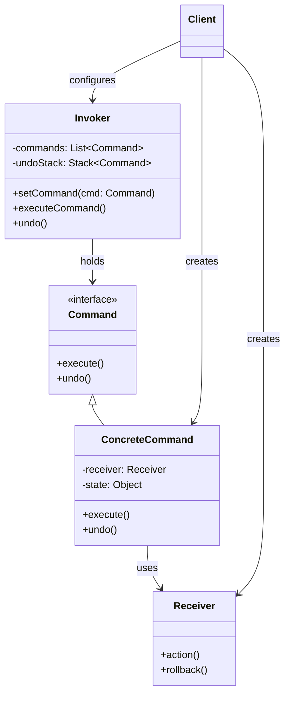
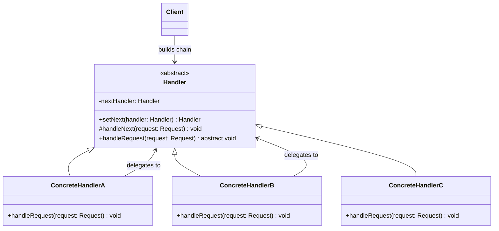

# GoF: Chain of Responsibility vs Command
Отлично! Вот **полное сравнение паттернов GoF Command и Chain of Responsibility** с диаграммами классов, живыми примерами на Java и детальным анализом.

---

## 📚 Обзор паттернов GoF

| Паттерн | Категория | Суть |
|---------|-----------|------|
| **Command** | Поведенческий | Инкапсулирует запрос как объект, позволяя параметризовать клиентов с различными запросами, ставить запросы в очередь, логировать их и поддерживать отмену операций |
| **Chain of Responsibility** | Поведенческий | Позволяет избежать привязки отправителя запроса к его получателю, давая шанс обработать запрос нескольким объектам. Запрос передаётся по цепочке получателей |

---

## 🖼️ Диаграммы классов (Mermaid)

### Command Pattern


### Chain of Responsibility Pattern


---

## 💻 Живые примеры на Java

### 🔘 Command Pattern: Текстовый редактор с отменой

```java
// Receiver
class TextEditor {
    private final StringBuilder content = new StringBuilder();
    
    public void insertText(String text) {
        content.append(text);
        System.out.println("Inserted: '" + text + "' | Current: " + content);
    }
    
    public void deleteText(int chars) {
        int start = Math.max(0, content.length() - chars);
        String removed = content.substring(start);
        content.delete(start, content.length());
        System.out.println("Deleted: '" + removed + "' | Current: " + content);
    }
    
    public String getContent() { return content.toString(); }
}

// Command Interface
interface Command {
    void execute();
    void undo();
}

// Concrete Commands
class InsertCommand implements Command {
    private final TextEditor editor;
    private final String text;
    private int position;
    
    public InsertCommand(TextEditor editor, String text) {
        this.editor = editor;
        this.text = text;
    }
    
    public void execute() {
        position = editor.getContent().length();
        editor.insertText(text);
    }
    
    public void undo() {
        editor.deleteText(text.length());
    }
}

class DeleteCommand implements Command {
    private final TextEditor editor;
    private final String deletedText;
    private final int position;
    
    public DeleteCommand(TextEditor editor, int chars) {
        this.editor = editor;
        this.position = editor.getContent().length();
        // Сохраняем текст для отмены
        String current = editor.getContent();
        this.deletedText = (position >= chars) 
            ? current.substring(position - chars) 
            : current;
    }
    
    public void execute() {
        editor.deleteText(deletedText.length());
    }
    
    public void undo() {
        editor.insertText(deletedText);
    }
}

// Invoker
class EditorInvoker {
    private final java.util.Stack<Command> history = new java.util.Stack<>();
    private final java.util.Stack<Command> redoStack = new java.util.Stack<>();
    
    public void executeCommand(Command cmd) {
        cmd.execute();
        history.push(cmd);
        redoStack.clear(); // Очищаем redo при новой команде
    }
    
    public void undo() {
        if (!history.isEmpty()) {
            Command cmd = history.pop();
            cmd.undo();
            redoStack.push(cmd);
        }
    }
    
    public void redo() {
        if (!redoStack.isEmpty()) {
            Command cmd = redoStack.pop();
            cmd.execute();
            history.push(cmd);
        }
    }
}

// Клиентский код
public class CommandDemo {
    public static void main(String[] args) {
        TextEditor editor = new TextEditor();
        EditorInvoker invoker = new EditorInvoker();
        
        // Выполняем команды
        invoker.executeCommand(new InsertCommand(editor, "Hello"));
        invoker.executeCommand(new InsertCommand(editor, " World"));
        invoker.executeCommand(new DeleteCommand(editor, 6)); // Удаляем " World"
        
        // Отменяем последнюю операцию
        invoker.undo(); // Восстанавливает " World"
        invoker.undo(); // Удаляет " World"
        
        // Повторяем
        invoker.redo(); // Снова добавляет " World"
        
        /* Вывод:
        Inserted: 'Hello' | Current: Hello
        Inserted: ' World' | Current: Hello World
        Deleted: ' World' | Current: Hello
        Inserted: ' World' | Current: Hello World
        Deleted: ' World' | Current: Hello
        Inserted: ' World' | Current: Hello World
        */
    }
}
```

---

### 🔗 Chain of Responsibility: Система обработки запросов на отпуск

```java
// Общий запрос
class LeaveRequest {
    private final String employee;
    private final int days;
    
    public LeaveRequest(String employee, int days) {
        this.employee = employee;
        this.days = days;
    }
    
    public String getEmployee() { return employee; }
    public int getDays() { return days; }
}

// Абстрактный обработчик
abstract class Approver {
    protected Approver nextApprover;
    
    public Approver setNext(Approver approver) {
        this.nextApprover = approver;
        return approver;
    }
    
    public void processRequest(LeaveRequest request) {
        if (canApprove(request)) {
            doApprove(request);
        } else if (nextApprover != null) {
            System.out.println(getClass().getSimpleName() + " перенаправляет запрос " + 
                             request.getEmployee() + " (" + request.getDays() + " дней) → " + 
                             nextApprover.getClass().getSimpleName());
            nextApprover.processRequest(request);
        } else {
            System.out.println("⚠️ Запрос " + request.getEmployee() + 
                             " отклонён: превышает лимит всех уровней");
        }
    }
    
    protected abstract boolean canApprove(LeaveRequest request);
    protected abstract void doApprove(LeaveRequest request);
}

// Конкретные обработчики
class TeamLead extends Approver {
    protected boolean canApprove(LeaveRequest request) {
        return request.getDays() <= 3;
    }
    
    protected void doApprove(LeaveRequest request) {
        System.out.println("✅ TeamLead одобрил отпуск " + request.getEmployee() + 
                         " на " + request.getDays() + " дня(ей)");
    }
}

class Manager extends Approver {
    protected boolean canApprove(LeaveRequest request) {
        return request.getDays() <= 10;
    }
    
    protected void doApprove(LeaveRequest request) {
        System.out.println("✅ Manager одобрил отпуск " + request.getEmployee() + 
                         " на " + request.getDays() + " дня(ей)");
    }
}

class Director extends Approver {
    protected boolean canApprove(LeaveRequest request) {
        return true; // Директор может всё
    }
    
    protected void doApprove(LeaveRequest request) {
        System.out.println("✅ Director одобрил отпуск " + request.getEmployee() + 
                         " на " + request.getDays() + " дня(ей)");
    }
}

// Клиентский код
public class ChainDemo {
    public static void main(String[] args) {
        // Собираем цепочку
        Approver teamLead = new TeamLead();
        Approver manager = new Manager();
        Approver director = new Director();
        
        teamLead.setNext(manager).setNext(director);
        
        // Тестируем разные сценарии
        teamLead.processRequest(new LeaveRequest("Анна", 2));   // Обработает TeamLead
        teamLead.processRequest(new LeaveRequest("Борис", 7));  // Обработает Manager
        teamLead.processRequest(new LeaveRequest("Виктор", 15)); // Обработает Director
        teamLead.processRequest(new LeaveRequest("Галина", 30)); // Обработает Director
        
        /* Вывод:
        ✅ TeamLead одобрил отпуск Анна на 2 дня(ей)
        TeamLead перенаправляет запрос Борис (7 дней) → Manager
        ✅ Manager одобрил отпуск Борис на 7 дня(ей)
        TeamLead перенаправляет запрос Виктор (15 дней) → Manager
        Manager перенаправляет запрос Виктор (15 дней) → Director
        ✅ Director одобрил отпуск Виктор на 15 дня(ей)
        TeamLead перенаправляет запрос Галина (30 дней) → Manager
        Manager перенаправляет запрос Галина (30 дней) → Director
        ✅ Director одобрил отпуск Галина на 30 дня(ей)
        */
    }
}
```

---

## 🆚 Глубокое сравнение

| Критерий | **Command** | **Chain of Responsibility** |
|----------|-------------|-----------------------------|
| **Основная цель** | Инкапсуляция операции как объекта | Делегирование запроса по цепочке обработчиков |
| **Структура** | Один получатель на команду | Несколько обработчиков в цепочке |
| **Отмена операции** | Встроенная поддержка (`undo()`) | Не поддерживается напрямую |
| **Порядок обработки** | Фиксированный (один получатель) | Динамический (цепочка до первого обработчика) |
| **Связность** | Слабая связь между инициатором и получателем | Слабая связь между отправителем и обработчиками |
| **Типичные сценарии** | Отмена/повтор, очереди, макросы, логирование | Валидация, авторизация, обработка событий, middleware |
| **Количество обработчиков** | Один (или группа для макроса) | Несколько (цепочка) |
| **Возврат результата** | Часто возвращает результат выполнения | Может не возвращать результат (только обработать) |
| **Гибкость конфигурации** | Команды можно комбинировать в макросы | Цепочку можно динамически перестраивать |
| **Сложность отладки** | Проще (фиксированный путь) | Сложнее (динамический путь обработки) |

---

## 💡 Комбинация паттернов: Реальный пример

**Сценарий**: Веб-приложение с middleware-цепочкой, где каждый шаг — команда

```java
// Command для каждого шага middleware
interface MiddlewareCommand {
    boolean execute(HttpRequest request);
    void undo(HttpRequest request); // Для отката при ошибке
}

// Обработчик в цепочке CoR
abstract class MiddlewareHandler {
    protected MiddlewareHandler next;
    
    public MiddlewareHandler setNext(MiddlewareHandler next) {
        this.next = next;
        return next;
    }
    
    public final boolean process(HttpRequest request) {
        if (!handle(request)) return false;
        if (next != null) return next.process(request);
        return true;
    }
    
    protected abstract boolean handle(HttpRequest request);
}

// Конкретный обработчик с использованием Command
class AuthMiddleware extends MiddlewareHandler {
    private final MiddlewareCommand authCommand = new AuthCommand();
    private final MiddlewareCommand rateLimitCommand = new RateLimitCommand();
    
    protected boolean handle(HttpRequest request) {
        // Выполняем команды последовательно
        if (!authCommand.execute(request)) return false;
        if (!rateLimitCommand.execute(request)) {
            authCommand.undo(request); // Откат при ошибке
            return false;
        }
        return true;
    }
}

// Использование
public class CombinedPatternDemo {
    public static void main(String[] args) {
        MiddlewareHandler auth = new AuthMiddleware();
        MiddlewareHandler logging = new LoggingMiddleware();
        MiddlewareHandler validation = new ValidationMiddleware();
        
        auth.setNext(logging).setNext(validation);
        
        HttpRequest request = new HttpRequest("/api/data", "GET");
        boolean handled = auth.process(request);
        
        if (handled) System.out.println("✅ Запрос обработан успешно");
        else System.out.println("❌ Запрос отклонён на одном из этапов");
    }
}
```

**Где это используется в реальности**:
- **Spring Security**: `FilterChain` (CoR) + `AuthenticationProvider` (Command)
- **Express.js**: Middleware chain (CoR) с каждым middleware как командой
- **GUI Frameworks**: Обработка событий через цепочку с возможностью отмены

---

## ✅ Когда выбирать какой паттерн?

| Ваша задача | Выберите |
|-------------|----------|
| Нужна операция **отмены/повтора** | ➤ **Command** |
| Запрос должен пройти через **несколько этапов обработки** | ➤ **Chain of Responsibility** |
| Хотите **ставить задачи в очередь** | ➤ **Command** |
| Не знаете заранее, **кто обработает запрос** | ➤ **Chain of Responsibility** |
| Нужно **логировать все операции** | ➤ **Command** |
| Обработка зависит от **уровня полномочий** | ➤ **Chain of Responsibility** |
| Хотите **динамически менять обработчики** | ➤ **Chain of Responsibility** |
| Нужны **макросы из нескольких операций** | ➤ **Command** |

---

## 💬 Ключевая цитата GoF

> **Command**:  
> *"Encapsulate a request as an object, thereby letting you parameterize clients with different requests, queue or log requests, and support undoable operations."*

> **Chain of Responsibility**:  
> *"Avoid coupling the sender of a request to its receiver by giving more than one object a chance to handle the request. Chain the receiving objects and pass the request along the chain until an object handles it."*

---

✅ **Итог**:  
Оба паттерна снижают связанность и повышают гибкость, но решают разные задачи:  
🔹 **Command** — управление *операциями* (что сделать и как управлять)  
🔹 **Chain of Responsibility** — маршрутизация *запросов* (кто и в каком порядке обработает)  

Выбирайте по задаче, а при сложных сценариях — комбинируйте! 🚀