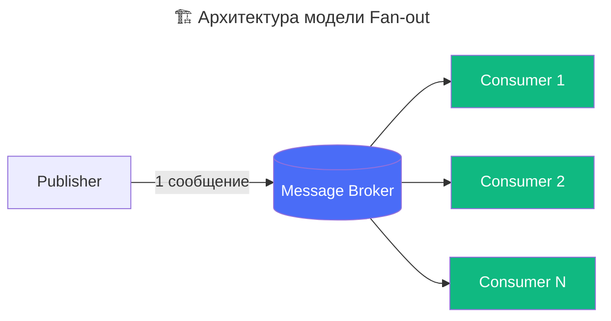

---
aliases:
  - fan-out
  - P2MP
  - Point-to-Multipoint
  - fan-in
---
# fan-out

**Что такое Fan-out**

**Fan-out** («разветвление», «распространение») — это **паттерн распределения сообщений**, при котором **одно сообщение рассылается нескольким получателям одновременно**.

> 💡 Простыми словами:  
> *«Один отправитель → много получателей»*  
> Как вентилятор (fan), который «раздувает» поток воздуха в разные стороны.


**Происхождение термина**

Термин **fan-out** заимствован из **электроники и схемотехники**:
- В цифровой электронике **fan-out** — это **максимальное количество входов**, которые может управлять один выход логического элемента (например, один gate управляет 10 
> 🔁 Позже термин перешёл в **распределённые системы** и **мессенджерские архитектуры**, где означает **один → много**.


**Архитектурные модели Fan-out**



---

**Типы Fan‑out в программных системах**

1. **Synchronous fan‑out.** Отправитель ждёт ответов от всех получателей, прежде чем продолжить работу. Используется, когда нужен агрегированный ответ.
    * *Пример:* API Gateway параллельно запрашивает данные у сервисов User, Orders и Payments, затем объединяет их в один JSON‑ответ для клиента.

2. **Asynchronous fan‑out.** Отправитель отправляет сообщения в очередь/брокер и сразу продолжает работу, не дожидаясь ответов.
    * *Пример:* событие `UserRegistered` публикуется в Kafka или RabbitMQ; несколько независимых сервисов (Email, Profile, Analytics) обрабатывают его в фоновом режиме.

3. **write‑time fan‑out** Данные заранее дублируются и распределяются по хранилищам/кешам при создании или изменении. Ускоряет последующие операции чтения.
    * *Пример:* при публикации поста в соцсети система сразу записывает его в ленты всех подписчиков.

4. **read‑time fan‑out** Данные не реплицируются заранее. При запросе система динамически собирает информацию из нескольких источников.
    * *Пример:* построение ленты новостей — при открытии страницы система запрашивает обновления от всех пользователей, на которых подписан клиент.

5. **notification fan‑out.** Одно событие запускает рассылку по нескольким каналам.
    * *Пример:* регистрация пользователя → отправка приветственного письма (email), SMS и push‑уведомления.

6. **Transactional fan‑out**
	* Используется в базах данных для распространения изменений: одна запись в WAL (Write‑Ahead Log) может быть обработана несколькими репликами или подписчиками (Change Data Capture).


**🧩 Типы Fan-out по деталям реализации**

1. **Fan-out / Fan-in** (классическая пара)
	- **Fan-out**: одно сообщение → несколько потребителей  
	- **Fan-in**: несколько источников → один потребитель (обратный процесс)
2. **Point-to-Multipoint (P2MP)**
	- Один издатель → N подписчиков (типично для **pub/sub**)
3. **Broadcast Fan-out**
	- Сообщение доставляется **всем** подписчикам без фильтрации  
		* → Например: `Kafka topic` без групп потребителей, `Redis Pub/Sub`
4. **Filtered Fan-out**
	- Сообщение доставляется только тем, кто соответствует правилу 
		* → Например: `Kafka + consumer groups`, `RabbitMQ with routing keys`, `AWS SNS + SQS`
5. **Fan-out with Acknowledgement**
	- Каждый получатель подтверждает получение (`ACK`)  
		- → Используется в системах с гарантией доставки (например, RabbitMQ, Kafka с `enable.auto.commit=false`)

**🆚 Fan-out vs Fan-in vs Broadcast**

| Паттерн       | Направление | Пример                               |
| ------------- | ----------- | ------------------------------------ |
| **Fan-out**   | 1 → N       | Kafka topic → 3 consumer groups      |
| **Fan-in**    | N → 1       | Много IoT-устройств → один агрегатор |
| **Broadcast** | 1 → все     | Redis Pub/Sub, UDP multicast         |

> 💡 **Fan-out ≠ Broadcast**:  
> - Broadcast — *все подключённые* получатели  
> - Fan-out — *выбранные* получатели (по подписке, routing key, group)

---

## 🛠️ Fan-out на практике

Пример: Уведомления в соцсети

```plaintext
Пользователь A публикует пост
       ↓
[Message Broker: Kafka topic "posts"]
       ↓
→ Consumer 1: Feed Service (добавляет в ленту друзей)
→ Consumer 2: Notification Service (отправляет push)
→ Consumer 3: Analytics Service (считает метрики)
→ Consumer 4: Search Indexer (обновляет ElasticSearch)
```

✅ Все сервисы работают **асинхронно и независимо**.

---

**🌐 Реальные сценарии применения**

| Сценарий                         | Как используется Fan-out                                        |
| -------------------------------- | --------------------------------------------------------------- |
| **Система уведомлений**          | Один event → push, email, SMS, in-app                           |
| **Аналитика в реальном времени** | Лог события → аналитика, мониторинг, ML-обработка               |
| **Интеграция систем**            | Изменение заказа → обновление склада, бухгалтерии, CRM          |
| **Микросервисная архитектура**   | Event Sourcing: доменные события → обновление проекций          |
| **IoT**                          | Датчик отправляет метрику → база данных, аларм-система, дашборд |

---

**Примеры реализации:**

| Система           | Механизм Fan-out                                                                       |
| ----------------- | -------------------------------------------------------------------------------------- |
| **Kafka**         | Topic → Consumer Groups (одна группа = один экземпляр; несколько групп = true fan-out) |
| **RabbitMQ**      | Exchange (fanout/direct/topic) → несколько очередей                                    |
| **AWS SNS**       | Topic → множество подписок (SQS, Lambda, Email, SMS)                                   |
| **Redis Pub/Sub** | Channel → все подключённые клиенты получают сообщение                                  |
| **Apache Pulsar** | Topic → multiple subscriptions (shared, exclusive, failover)                           |

---


## 💬 Итог

> **Fan-out — это фундаментальный паттерн асинхронной коммуникации**, который позволяет:
> - Разделить ответственность между сервисами  
> - Построить масштабируемые и отказоустойчивые системы  
> - Реализовать Event-Driven Architecture без жёсткой связанности

> 📌 **Ключевое правило**:  
> *«Если один факт должен быть известен многим — используйте Fan-out».*

---


