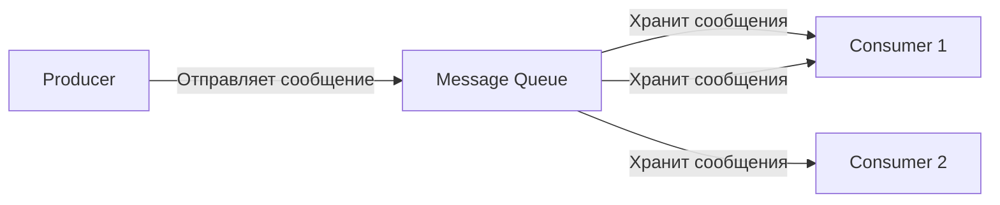
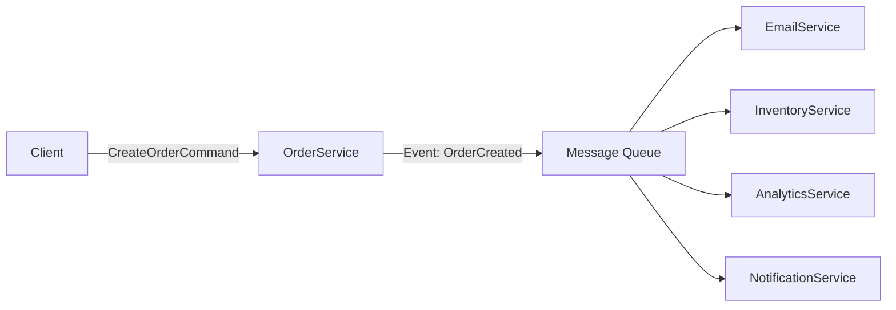
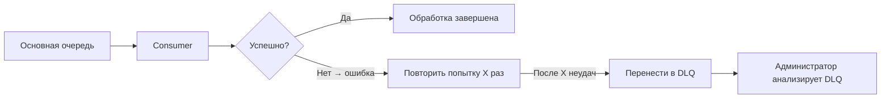

**Message Queueing (очередь сообщений)** — это фундаментальный паттерн архитектуры распределённых систем, который позволяет **асинхронно и надёжно обмениваться данными между компонентами**. Это один из ключевых инструментов для построения **масштабируемых, отказоустойчивых и гибких систем**.

---

## ✅ Что такое **Message Queueing**?

### 🔹 Определение:
> **Message Queueing** — это механизм, при котором **отправители (producers)** отправляют сообщения в **очередь (queue)**, а **получатели (consumers)** забирают их оттуда **по мере готовности**, без необходимости быть одновременно активными.

Это как **почтовый ящик**:  
- Вы кладёте письмо в ящик → не ждёте ответа.  
- Почтальон забирает его позже и доставляет адресату.  
- Адресат читает письмо, когда удобно — **не сразу, не синхронно**.

---

## 🔄 Как это работает? (Простая схема)



- **Producer** — сервис, который создаёт сообщение (например, заказ создан).
- **Queue** — буфер, где сообщения хранятся до обработки.
- **Consumer** — сервис, который получает и обрабатывает сообщение (например, отправка email, обновление аналитики).

> ✅ **Производитель и потребитель не знают друг о друге — они взаимодействуют только через очередь.**

---

## 💡 Зачем нужна Message Queueing?

| Проблема | Решение через Message Queue |
|----------|-----------------------------|
| **Синхронная зависимость** — сервис A ждёт ответа от сервиса B | → A отправляет сообщение и продолжает работу — **асинхронность** |
| **Перегрузка сервиса** — слишком много запросов за раз | → Очередь сглаживает нагрузку (buffering) |
| **Надёжность** — если B упал, сообщения теряются | → Сообщения сохраняются в очереди до успешной обработки |
| **Масштабирование** — нужно больше обработчиков | → Можно запустить 10 потребителей — все читают из одной очереди |
| **Разделение ответственности** — одна система делает одно, другая — другое | → Чёткое разделение: кто создаёт, кто обрабатывает |

---

## 🔧 Ключевые характеристики Message Queue

| Характеристика | Описание |
|----------------|----------|
| **Асинхронность** | Отправитель не ждёт ответа — он "бросает" сообщение и идёт дальше |
| **Декуплинг (Decoupling)** | Производитель и потребитель не зависят друг от друга — могут меняться независимо |
| **Буферизация (Buffering)** | Очередь сглаживает пики нагрузки — например, 10K заказов за 1 сек → обрабатываются по 100/сек |
| **Надёжность** | Сообщения **не теряются** даже при сбое потребителя — сохраняются на диске |
| **Повторная доставка** | Если обработка не удалась — сообщение можно вернуть в очередь (retry) |
| **Гарантии доставки** | At-least-once, at-most-once, exactly-once (зависит от реализации) |
| **Параллелизм** | Много потребителей могут читать из одной очереди — масштабируется горизонтально |

---

## 🆚 Типы очередей: Point-to-Point vs Publish/Subscribe

| Тип                                   | Описание                                                                                              | Использование                                            |
| ------------------------------------- | ----------------------------------------------------------------------------------------------------- | -------------------------------------------------------- |
| **Point-to-Point (P2P)**              | Одно сообщение — **один потребитель**. Как почтовый ящик: кто первый забрал — тот и обработал.        | Обработка заказа, отправка email, обновление базы данных |
| **Publish/Subscribe ([[Publish-Subscribe]])** | Одно сообщение — **множество подписчиков**. Как рассылка новостей: все, кто подписан, получают копию. | Логирование, кэширование, триггер уведомлений, аналитика |

> ✅ В реальных системах часто используют **оба типа вместе**.

---

## 🏗️ Архитектурный пример: Интернет-магазин

### ❌ Без очереди (синхронный):
```plaintext
Клиент → [Создать заказ] → [Оплатить] → [Уменьшить запас] → [Отправить email] → [Обновить аналитику] → Ответ клиенту
```
→ Если **сервис email** упал — вся транзакция проваливается.  
→ Задержки — всё блокируется.  
→ Невозможно масштабировать.

### ✅ С очередью (асинхронный):


- `OrderService` просто записывает событие `OrderCreated` в очередь и **немедленно возвращает успех клиенту**.
- Все остальные сервисы (**Email, Inventory, Analytics**) слушают очередь и обрабатывают события **своими темпами**.
- Если `EmailService` упал — сообщение остаётся в очереди, пока он не восстановится.
- Можно запустить 5 экземпляров `InventoryService` — все будут работать параллельно.

> ✅ **Система стала быстрее, надёжнее и масштабируемой.**

---

## 📦 Популярные технологии Message Queueing

| Инструмент | Тип | Особенности | Используется в |
|-----------|-----|-------------|----------------|
| **RabbitMQ** | P2P / Pub/Sub | Гибкий, поддерживает сложные маршрутизации, легко настраивается | Enterprise-системы, банковские приложения |
| **Apache Kafka** | Pub/Sub + Stream Processing | Высокопроизводительный, масштабируемый, хранит миллионы сообщений, поддерживает потоковую обработку | Netflix, LinkedIn, Uber, Airbnb |
| **Amazon SQS** | P2P | Managed-сервис AWS, простой, надёжный, low-cost | Приложения в AWS |
| **Azure Service Bus** | P2P / Pub/Sub | Microsoft-решение, поддерживает транзакции, сессии | Корпоративные системы на .NET |
| **Redis Streams** | Pub/Sub + Stream | Очень быстрый, но менее надёжный (если не настроен persistence) | Реалтайм-приложения, кэширование |
| **NATS** | Pub/Sub | Лёгкий, быстрый, для микросервисов | Cloud-native, IoT |

> ⚠️ **Kafka ≠ обычный message queue** — это **распределённый стриминг-платформа**. Она хранит данные часами/днями, поддерживает репликацию, лог-компакцию и обработку в реальном времени.

---

## 🔐 Гарантии доставки сообщений

| Тип | Описание | Когда использовать |
|-----|----------|-------------------|
| **At-most-once** | Сообщение может быть потеряно, но не обработано дважды | Логи, метрики, где дубли не критичны |
| **At-least-once** | Сообщение гарантированно будет обработано **хотя бы один раз** — возможны дубликаты | Большинство бизнес-сценариев: заказы, оплаты, email |
| **Exactly-once** | Сообщение обработано **ровно один раз** — идеально, но сложно | Финансовые операции, бухгалтерия, переводы денег |

> 💡 **Exactly-once** достигается комбинацией:  
> - Idempotent consumers (потребители, которые безопасно повторяют обработку)  
> - Transactional writes (запись сообщения + изменение состояния в одной транзакции)

---

## ✅ Преимущества Message Queueing

| Преимущество | Объяснение |
|--------------|------------|
| **Высокая доступность** | Сервисы работают независимо — сбой одного не ломает весь процесс |
| **Масштабируемость** | Добавляете больше потребителей — обработка ускоряется |
| **Устойчивость к перегрузкам** | Очередь — буфер. Если нагрузка растёт — очередь растёт, а не падает система |
| **Легкая отладка** | Можно посмотреть историю сообщений, переобработать ошибочные |
| **Поддержка CQRS и Event Sourcing** | Очереди — естественный канал передачи событий |
| **Интеграция разных технологий** | Java-сервис может отправить сообщение в Kafka, а Python-скрипт его прочитать |

---

## ⚠️ Недостатки и сложности

| Проблема | Описание |
|---------|----------|
| **Сложность** | Нужно управлять жизненным циклом сообщений, обработкой ошибок, retry-логикой |
| **Задержки** | Асинхронность = задержка между созданием и обработкой (миллисекунды — секунды) — не подходит для HFT |
| **Порядок сообщений** | Не всегда гарантируется (особенно в Kafka — только внутри partition) |
| **Отладка** | Трассировка через несколько сервисов сложнее, чем в синхронных вызовах |
| **Дублирование** | Из-за at-least-once нужно делать **идемпотентные потребители** |
| **Операционная сложность** | Нужно мониторить очередь, размеры, lag, dead-letter queues |

---

## 🛠️ Пример: Идемпотентный потребитель (чтобы избежать дублей)

```python
def process_order_created(event):
    order_id = event['order_id']
    
    # Проверяем: уже обрабатывали ли это сообщение?
    if redis.get(f"processed:{order_id}"):
        return  # Уже сделано — игнорируем
    
    # Выполняем действие
    send_email_to_customer(order_id)
    update_inventory(order_id)
    
    # Помечаем как обработанное
    redis.setex(f"processed:{order_id}", 86400, "true")  # 24 часа
```

> ✅ Так вы гарантируете, что даже если сообщение придёт дважды — **действие выполнится только один раз**.

---

## 🌟 Когда использовать Message Queueing?

| ✅ Используйте, если: | ❌ Не используйте, если: |
|----------------------|--------------------------|
| Вам нужна **асинхронность** | Вы делаете API с прямым ответом (например, `/login`) |
| Есть **долгие операции** (email, SMS, PDF-генерация) | Вы требуете < 10 мс отклика (HFT) |
| Нужна **надёжность** и **отказоустойчивость** | Ваша система — маленький скрипт или MVP |
| Вы хотите **разделить сервисы** | Все компоненты живут в одном процессе |
| Вы используете **Event Sourcing / CQRS** | Вам не нужны масштабирование и декуплинг |
| Вы строите **микросервисную архитектуру** | Вы не готовы к дополнительной сложности |

---

## 💬 Цитата от профессионалов

> _“If you’re not using a message queue in your distributed system, you’re probably building a brittle monolith with HTTP calls.”_  
> — **Martin Fowler** #👨 

> _“Queues are the plumbing of modern software.”_  
> — **AWS Architect**

---

## ✅ Финальный вывод: Message Queueing — это **инфраструктурный фундамент**

| Концепция | Аналогия |
|----------|----------|
| **HTTP-вызов** | Звонок по телефону — ты ждёшь ответа |
| **Message Queue** | Посылка в почту — ты не ждёшь, она придет, когда сможет |

> ✅ **Message Queueing — это то, что делает современные системы масштабируемыми, надёжными и устойчивыми к сбоям.**  
> Он не обязателен для всех проектов, но **без него невозможно построить настоящую распределённую систему**.

Если вы работаете с микросервисами, событиями, высокой нагрузкой — **message queueing — ваш лучший друг**.  
И если вы ещё не используете её — самое время начать.

---

## 📚 Где учиться дальше?

- [RabbitMQ Tutorials](https://www.rabbitmq.com/getstarted.html) — отличный старт
- [Kafka: The Definitive Guide](https://www.confluent.io/resources/books/kafka-the-definitive-guide/) — книга от создателей Kafka
- [Designing Data-Intensive Applications — Martin Kleppmann](https://dataintensive.net/) — главы про очереди и распределённые системы
- YouTube: *“How Kafka Works”* — канал *TechWorld with Nana*

---

💡 **Не спрашивайте: «Нужна ли очередь?»**  
**Спросите: «Что произойдёт, если мой сервис упадёт прямо сейчас?»**  
Если ответ — *«Все заказы потеряются»* — вам **срочно нужна очередь**.

Отличный вопрос — **lag** и **dead-letter queues (DLQ)** — это два критически важных понятия в системах с **message queueing**, особенно при использовании таких технологий, как **Kafka, RabbitMQ, SQS, Apache Pulsar** и других. Они помогают **диагностировать проблемы** и **обеспечивать надёжность** обработки сообщений.

---

# Lag, Dead-letter
## ✅ 1. Что такое **Lag**?

### 🔹 Определение:
> **Lag (задержка)** — это **количество непрочитанных сообщений в очереди**, которые ещё не были обработаны потребителями (consumers).

Это показатель **разницы между тем, сколько сообщений было отправлено в очередь, и сколько уже обработано**.

### 🔹 Как измеряется?
- В **Kafka**: lag = `end offset` – `consumer offset`
- В **RabbitMQ**: lag = количество сообщений в очереди, ожидающих потребления
- В **Amazon SQS**: можно мониторить через CloudWatch — метрика `ApproximateAgeOfOldestMessage`

#### 💡 Пример:
```plaintext
Producer отправил: 1000 сообщений
Consumer обработал: 850 сообщений
→ Lag = 1000 - 850 = **150 сообщений**
```

> Это значит: **150 сообщений "застоялись" в очереди** — их ещё не взяли на обработку.

---

### 🔍 Почему lag — это важно?

| Значение lag | Что это значит? |
|--------------|------------------|
| **Lag = 0** | Система работает идеально — всё обрабатывается в реальном времени |
| **Lag > 0** | Есть **проблема**: потребители медленно работают, упали, перегружены |
| **Lag растёт** | Проблема усугубляется — система не справляется с нагрузкой |
| **Lag падает** | Проблема решается — потребители догоняют |

> ⚠️ **Растущий lag — это красный флаг!** Он означает, что **система отстаёт** — заказы не отправляются, аналитика не обновляется, email не доходит.

---

### 📈 Причины роста lag:

| Причина | Объяснение |
|--------|------------|
| **Потребители упали или зависли** | Сервис потребителя аварийно завершился или застрял в бесконечном цикле |
| **Недостаточно потребителей** | Одного инстанса недостаточно для нагрузки — нужно масштабировать |
| **Медленная обработка** | Бизнес-логика занимает слишком много времени (например, вызов внешнего API без таймаута) |
| **Ошибки в коде** | Потребитель падает при обработке сообщения → сообщение возвращается в очередь → снова падает → цикл |
| **Сетевые проблемы** | Потребитель не может подключиться к базе данных или внешнему сервису |
| **Неправильные настройки** | Например, маленький `batch.size`, высокий `max.poll.interval.ms` в Kafka |

---

### 🔧 Как мониторить и реагировать на lag?

| Инструмент | Как использовать |
|-----------|------------------|
| **Kafka** | `kafka-consumer-groups.sh --describe --group my-group` → покажет `LAG` для каждого partition |
| **RabbitMQ** | Admin UI → очередь → `Ready` / `Unacked` |  
| **Prometheus + Grafana** | Метрики: `kafka_consumer_lag`, `rabbitmq_queue_messages_ready` |
| **CloudWatch (AWS SQS)** | Метрика `ApproximateAgeOfOldestMessage` — если > 60 сек — тревога |
| **Alerting** | Настроить алерт: `если lag > 1000 → отправить Slack/Telegram/Email` |

> 💡 **Пример алерта:**  
> _“Lag в очереди ‘order-events’ достиг 2500 сообщений. Обработка заказов задерживается более 30 минут.”_

---

## ✅ 2. Что такое **Dead-Letter Queue (DLQ)**?

### 🔹 Определение:
> **Dead-Letter Queue (DLQ)** — это **специальная очередь**, куда попадают **сообщения, которые не удалось обработать после нескольких попыток**.

Это своего рода **«мусорный бак» для проблемных сообщений**, чтобы они **не засоряли основную очередь** и не блокировали обработку новых.

### 🔹 Как это работает?



### 🔹 Пример:
Вы отправляете событие `OrderCreated` в очередь.  
Потребитель пытается отправить email, но SMTP-сервер недоступен → ошибка.  
→ Попытка №1: ❌  
→ Попытка №2: ❌  
→ Попытка №3: ❌  
→ Сообщение **перемещается в DLQ**

Теперь:
- Основная очередь **продолжает работать** — новые сообщения обрабатываются.
- Админ видит: *«Ошибка отправки email для заказа #4567 — SMTP timeout»*
- Ручное исправление: обновить адрес клиента → повторить сообщение из DLQ

---

### 🔧 Почему DLQ — критически важен?

| Проблема без DLQ | Решение с DLQ |
|------------------|---------------|
| Сообщение постоянно падает → очередь «застревает» | Очередь чистая — новые сообщения обрабатываются |
| Невозможно выявить проблемные сообщения | Все “плохие” сообщения собраны в одном месте |
| Система не может восстановиться сама | Админ может вручную проанализировать и переобработать |
| Логи теряются | DLQ — источник правды для аудита и диагностики |

> 💬 **DLQ — это ваша “медицинская карта” системы: здесь лежат все “больные” сообщения.**

---

### 🔧 Как настроить DLQ?

#### ✅ В **RabbitMQ**:
- Настройка **TTL (Time-To-Live)** и **dead-letter exchange (DLX)**.
- Если сообщение не обработано за 30 сек → перенаправляется в DLX → в DLQ.

```bash
# При создании очереди:
x-dead-letter-exchange: my-dlx
x-dead-letter-routing-key: dead-letter-key
x-message-ttl: 30000  # 30 секунд
```

#### ✅ В **Apache Kafka**:
- Kafka не имеет встроенного DLQ — его реализуют **в приложении**.
- Обработка ошибки → запись в отдельный топик `orders-dlq`.

```java
try {
    process(event);
} catch (Exception e) {
    if (retryCount >= MAX_RETRIES) {
        producer.send(new ProducerRecord<>("orders-dlq", event)); // Переносим в DLQ
    } else {
        throw e; // Повторить попытку
    }
}
```

#### ✅ В **Amazon SQS**:
- Можно настроить **Redrive Policy**:
  - После N попыток (`maxReceiveCount`) → автоматически переносится в DLQ-очередь.

> ✅ **SQS — самый простой вариант**: просто выберите DLQ-очередь в консоли AWS.

---

### 🔍 Что делать с сообщениями в DLQ?

| Действие | Описание |
|----------|----------|
| ✅ **Анализ** | Посмотреть содержимое: какой тип ошибки? JSON невалиден? Нет доступа к БД? |
| ✅ **Ручная переобработка** | Исправить данные → отправить обратно в основную очередь |
| ✅ **Логирование и алертинг** | Отправить уведомление в Slack/email: *“DLQ содержит 12 сообщений — проверьте!”* |
| ✅ **Автоматизация** | Создать скрипт, который автоматически исправляет известные ошибки (например, добавляет missing field) |
| ❌ **Игнорировать** | **НЕЛЬЗЯ!** — это как игнорировать ошибки в логах. Со временем DLQ станет мусорной свалкой. |

> 💡 **Лучшая практика:**  
> Каждый день проверять DLQ. У вас должна быть **процедура восстановления**.

---

## 🆚 Сравнение: Lag vs Dead-Letter Queue

| Характеристика | **Lag** | **Dead-Letter Queue (DLQ)** |
|----------------|---------|------------------------------|
| **Что измеряет?** | Количество **необработанных** сообщений в очереди | Количество **неподдающихся** сообщений, **отправленных в специальную очередь** |
| **Цель** | Диагностика производительности | Диагностика **качества** обработки |
| **Причина появления** | Потребители медленные, недостаточно инстансов, перегрузка | Ошибки в бизнес-логике, невалидные данные, временные сбои |
| **Как решать?** | Масштабировать потребителей, оптимизировать код | Исправить ошибку, переобработать сообщения, улучшить валидацию |
| **Влияет ли на работу системы?** | Да — замедляет всю систему | Нет — DLQ не мешает основной очереди |
| **Самоисправление?** | Может исчезнуть, если потребители догонят | Требует **ручного вмешательства** |
| **Инструменты мониторинга** | Kafka CLI, Prometheus, CloudWatch | Анализ содержимого DLQ, логи, UI-панели |

> ✅ **Lag — это “скорость”. DLQ — это “качество”.**  
> Вы можете иметь **низкий lag** (быстро обрабатываете), но **много DLQ** (много ошибок).  
> Или **высокий lag** (медленно), но **нулевой DLQ** (всё обрабатывается правильно).

---

## 🛠️ Пример: Реальный сценарий с lag и DLQ

### 🏢 Ситуация:
Вы строите систему онлайн-магазина:
- `OrderService` → отправляет событие `OrderCreated` в Kafka-топик `order-events`.
- `EmailService` и `InventoryService` читают этот топик.

### 📉 Возникает проблема:
- `EmailService` случайно использует **устаревший SMTP-хост** → начинает падать с ошибкой `Connection refused`.
- Каждое сообщение `OrderCreated` падает → попадает в retry → после 3 попыток → отправляется в **DLQ `order-events-dlq`**.
- **Lag в `order-events` растёт** — потому что `EmailService` не работает.

### 🔎 Что делаем?
1. **Мониторим lag**:  
   ```bash
   kafka-consumer-groups.sh --bootstrap-server localhost:9092 \
     --group email-service-group --describe
   ```
   → Видим: `LAG: 850`

2. **Смотрим DLQ**:  
   Читаем сообщения из `order-events-dlq` → вижу:
   ```json
   {
     "orderId": 123,
     "email": "invalid-email",
     "error": "SMTP connect failed: Connection refused"
   }
   ```

3. **Решаем**:
   - Исправляем конфиг `EmailService` → указываем правильный SMTP
   - Переотправляем все сообщения из DLQ обратно в основной топик
   - Увеличиваем число инстансов `EmailService` с 1 до 3
   - Настраиваем алерт: `если lag > 100 или DLQ > 5 → SMS админу`

4. **Результат**:
   - Lag падает до 0
   - DLQ очищается
   - Email-уведомления снова приходят клиентам

---

## ✅ Лучшие практики

| Практика | Объяснение |
|---------|------------|
| **Всегда настраивайте DLQ** | Даже если кажется, что ошибок не будет — они будут. |
| **Не игнорируйте DLQ** | Это не “мусор”, это **ваша диагностическая база**. |
| **Мониторьте lag в реальном времени** | Настройте алерты на `lag > X` и `age of oldest message > Y`. |
| **Делайте потребителей idempotent** | Чтобы дубликаты не ломали систему при повторной обработке. |
| **Тестируйте сбои** | Принудительно сломайте потребителя — убедитесь, что DLQ сработает. |
| **Автоматизируйте восстановление** | Для известных ошибок (например, невалидный email) — пишите скрипты, которые исправляют и переотправляют. |

---

## 💬 Финальная мысль

> **Lag говорит: «Мы не успеваем».**  
> **DLQ говорит: «Мы не умеем».**  
>  
> **Исправьте lag — получите скорость.**  
> **Исправьте DLQ — получите надёжность.**

> ✅ **Без DLQ — вы не можете быть уверены, что ничего не потерялось.**  
> ✅ **Без мониторинга lag — вы не знаете, когда система вот-вот упадёт.**

---

## 📚 Где учиться дальше?

- [Kafka Consumer Lag Monitoring](https://docs.confluent.io/platform/current/kafka/monitoring.html)
- [RabbitMQ Dead Letter Exchanges](https://www.rabbitmq.com/dlx.html)
- [AWS SQS Dead Letter Queues](https://docs.aws.amazon.com/AWSSimpleQueueService/latest/SQSDeveloperGuide/sqs-dead-letter-queues.html)
- Book: *Designing Data-Intensive Applications* — глава 8: Message Brokers

---

💡 **Если вы строите распределённую систему — lag и DLQ должны быть в вашем мониторинге так же обязательно, как CPU и память.**  
Иначе вы живёте в иллюзии, что всё работает — пока не узнаете, что 1000 заказов не были отправлены.