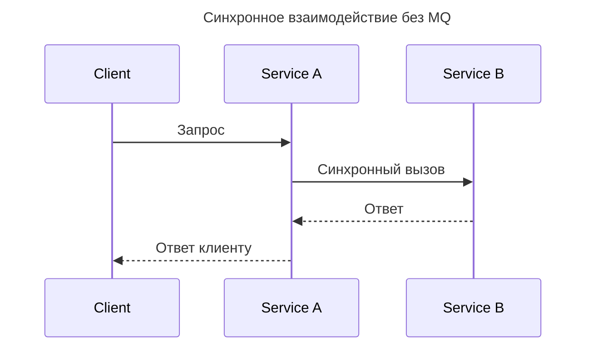
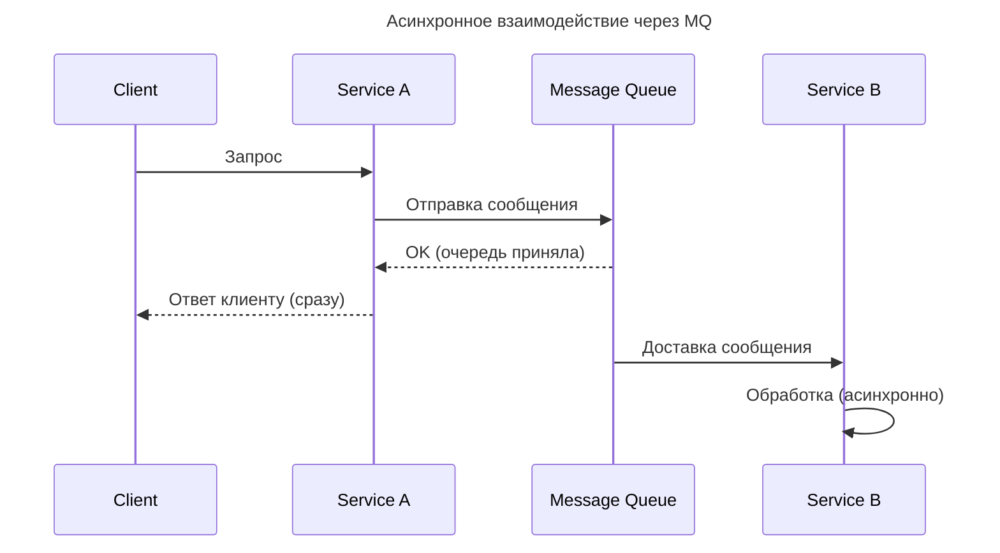
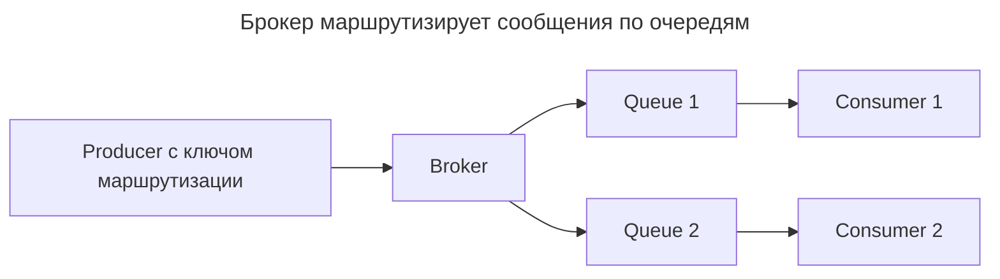
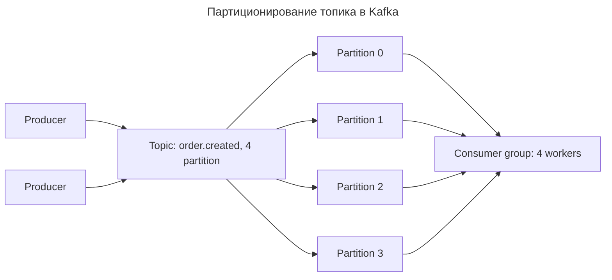
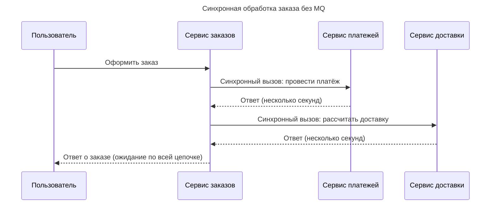
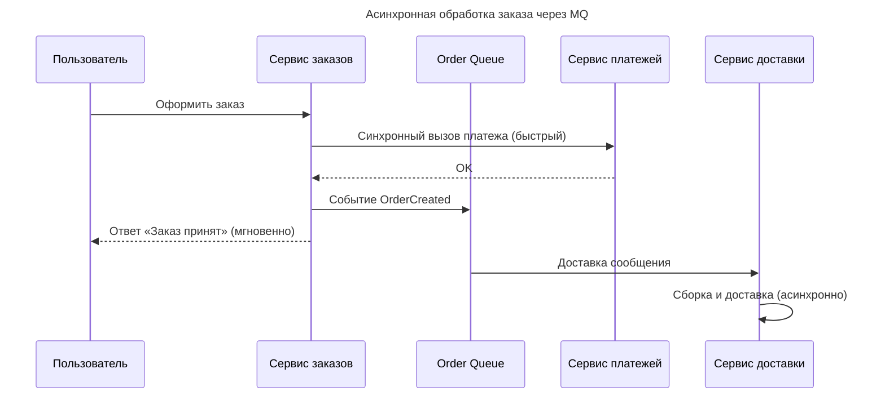
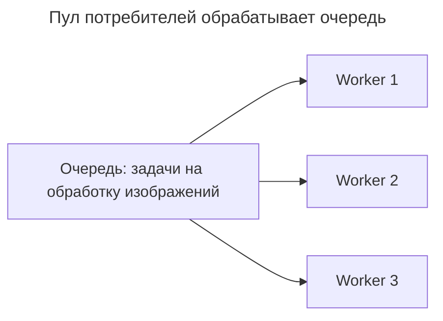

---
aliases:
  - ActiveMQ
  - Amazon SQS
  - Apache Kafka
  - Apache Pulsar
  - At-least-once
  - At-most-once
  - Azure Service Bus
  - Broker
  - Consumer
  - Dead Letter Queue
  - Dead-Letter Queue
  - DLQ
  - Exactly-once
  - Idempotent consumer
  - Kafka
  - Lag
  - Message Broker
  - Message Queue
  - Message Queueing
  - Message Queuing
  - NATS
  - P2P
  - Point-to-Point
  - Producer
  - Pulsar
  - RabbitMQ
  - Redis Streams
  - SQS
  - Worker Pool
  - брокер
  - задержка
  - идемпотентный потребитель
  - очередь недоставленных сообщений
  - очередь сообщений
  - потребитель
  - производитель
---

# Очередь сообщений (Message Queue)

## Что такое очередь сообщений

| Вопрос | Ответ |
|--------|-------|
| Что это? | Компонент системы, обеспечивающий асинхронный обмен данных между производителями и потребителями |
| Синонимы | Message Queue, Message Queuing, Message Queueing, Message Broker |
| Главная задача | «Развязать» производителя и потребителя, чтобы каждый работал независимо |
| Типичные представители | RabbitMQ, Apache Kafka, ActiveMQ, Redis Streams, Apache Pulsar, NATS |

## Основные концепции

**Сообщение (Message)** — данные, передаваемые от отправителя получателю. Может содержать тело и метаданные (заголовки).

**Производитель (Producer)** — компонент, который создаёт и отправляет сообщения в очередь.

**Потребитель (Consumer)** — компонент, который получает и обрабатывает сообщения из очереди.

**Брокер (Broker)** — сервер, хранящий сообщения и управляющий их передачей.

**Очередь (Queue)** — структура хранения сообщений (обычно FIFO).

Очередь сообщений — это компонент системы, в которой сообщения передаются от производителя (producer) к потребителю (consumer) асинхронно. Она «развязывает» производителя и потребителя: производитель не ждёт, пока потребитель обработает сообщение.

## Проблемы, которые решает

- **Немедленные ответы клиенту.** Клиент отправляет запрос и сразу получает ответ, а не ждёт выполнения тяжёлой фоновой работы.
- **Разделение ресурсов.** Тяжёлая обработка (конвертация видео, отправка email, генерация PDF) выполняется асинхронно, освобождая основное приложение.
- **Масштабирование (вертикальное и горизонтальное).** Можно добавить N потребителей — и обработка ускорится без изменений в коде.
- **Отказоустойчивость.** Если потребитель временно лежит, сообщения «ждут» в очереди и не теряются (при durability-настройках).
- **Декомпозиция системы.** Каждый сервис работает со своим темпом, не блокируя других.

**Пример: без очереди сообщений**



**Пример: с очередью сообщений**



## Как это работает

Простой сценарий: у производителя есть сообщение, которое нужно отправить — он отправляет его в брокер. Брокер хранит сообщение в очереди, продвигая его по принципу FIFO (первым пришёл — первым вышел). Потребитель забирает сообщение из очереди и обрабатывает его.



- Producer может отправлять сообщения с указыванием ключа маршрутизации (routing key) — брокер сам решает, в какую очередь положить сообщение.
- Потребитель определяет, какие очереди он слушает и как потребляет. У каждой очереди свои правила.
- Одно и то же сообщение не попадает в руки двум разным потребителям одной и той же очереди (в режиме P2P).
- В режиме Pub/Sub (см. [[publish-subscribe]]) сообщение рассылается всем подписчикам топика.
- Брокеры могут хранить сообщения (например, для повторного чтения или обработки сбоев) — Kafka и RabbitMQ хранят сообщения фиксированное время (retention policy).
- Сервер автоматически масштабирует списки потребления: несколько потребителей одной очереди автоматически балансируют нагрузку между собой.

## Характеристики и настраиваемость

| Характеристика | Что означает | Настройка в MQ |
|----------------|--------------|-----------------|
| Долговечность (Durability) | Сообщения переживают перезапуск брокера | `durable` / `persistent` |
| Время жизни (TTL) | Сообщение удаляется, если не обработано за время | `expires` / `x-message-ttl` |
| Максимальный размер | Ограничение на размер сообщения | `max-size` (Kafka), `max message size` (RabbitMQ) |
| Поведение при переполнении | Что делать, если очередь полна | Отказ, удаление старых (LRU), блокировка производителя |
| Priоритеты | Сообщения с высоким приоритетом выдаются раньше | `priority` (RabbitMQ) |
| Acknowledgements (acks) | Когда сообщение считается обработанным | auto / manual acks |
| Дедлайн обработки | Время, выделенное потребителю на обработку | `visibility timeout` (SQS), `consumers` (RabbitMQ) |

## Гарантии доставки

MQ поддерживают три уровня гарантий доставки:

| Уровень | Описание | Пример |
|---------|----------|--------|
| At-most-once | Сообщение доставляется не более одного раза — может быть потеряно | Fire-and-forget, не критичные данные |
| At-least-once | Сообщение доставляется как минимум один раз — могут быть дубли | Практически все очереди (RabbitMQ, Kafka) |
| Exactly-once | Сообщение доставляется ровно один раз — без потерь и дублей | Kafka `enable.idempotence=true`, SQS FIFO |

**Дубликаты — это норма.** Если очередь гарантирует at-least-once, потребитель должен быть готов к повторной доставке. Это решается идемпотентностью обработчика — повторная обработка того же сообщения не меняет состояние системы.

```javascript
// Пример: идемпотентная обработка в Lambda
async function handler(event) {
    const orderId = event.orderId;

    // Ключ идемпотентности: повторная обработка пропускается
    const lock = await redis.setnx(`order:${orderId}:processed`, '1');

    if (!lock) {
        console.log(`Заказ ${orderId} уже обработан`);
        return;
    }

    await createOrder(orderId);
}
```

## Порядок сообщений

Сохранение порядка — одна из самых сложных задач в MQ. Общие подходы:

- **Один потребитель на очередь.** Пока очередь читает один потребитель, порядок сохраняется гарантированно.
- **Ключ сортировки.** Производитель добавляет поле (например, `sequence`), а потребитель сортирует сообщения перед обработкой.
- **Ограничение конкурентности.** Разрешить параллельную обработку, но на одном ключе (например, на одного клиента) — обрабатывать строго последовательно.

```python
# Пример: сохранение порядка сообщений
# Производитель добавляет поле sequence,
# потребитель сортирует по нему перед обработкой

message_1 = {"order": 1, "client": "A", "timestamp": "12:00:01"}
message_2 = {"order": 2, "client": "A", "timestamp": "12:00:05"}

# Для одного client=«A» обработка идёт строго по order
def process_client_A():
    process(message_1)
    process(message_2)
```

**Отказ в обработке.** Если потребитель не смог обработать сообщение, очередь может:

- вернуть сообщение в очередь (requeue);
- положить в очередь недоставленных сообщений (DLQ);
- игнорировать и потерять.

## Виды Message Queues

| Очередь | Тип | Язык/Технология | Особенности |
|---------|-----|-----------------|-------------|
| RabbitMQ | Классическая очередь | Erlang | Гибкие протоколы (AMQP, MQTT), routing, продвинутые очереди |
| Apache Kafka | Лог / поток событий | Scala/Java | Высокая производительность (1M+ мсг/сек), партиционирование, replay |
| ActiveMQ | Классическая очередь | Java | JMS, поддержка многих протоколов |
| Redis Streams | Поток | Redis | Простота, встроенная подписка, лёгкая |
| NATS | Легковесная очередь | Go | Низкая задержка, P2P и Pub/Sub, используется в JetStream |
| Apache Pulsar | Совмещённый | Java | Мульти-тенаит, geo-replication, слоёное хранилище |
| Amazon SQS | Облачный managed | AWS | Полностью управляемый, visibility timeout, FIFO режим |
| Azure Service Bus | Облачный managed | Azure | Интеграция с Azure, многопоточность |

## Как выбрать MQ

| Критерий | Если нужно | Выбирайте |
|----------|-----------|-----------|
| Простота | Быстро внедрить, небольшой проект | Redis Streams, RabbitMQ, SQS |
| Производительность | 100K+ сообщений/сек | Apache Kafka |
| Гарантия доставки | Exactly-once | Kafka, SQS FIFO |
| Облачная инфраструктура | AWS/Azure | SQS, Azure Service Bus |
| Низкая задержка | < 10 мс | NATS, RabbitMQ |
| Порядок сообщений | Строгий порядок на ключ | SQS FIFO, Kafka partition |

## Производительность и масштабирование

Главный инструмент масштабирования в MQ — **партиционирование** (partitioning). Топик разбивается на партиции, и сообщения распределяются по ним (по ключу — `order_id`, `client_id`, round-robin).



- Внутри партиции порядок сохраняется.
- Разным партициям соответствуют разные потребители.
- Это позволяет увеличивать пропускную способность простым добавлением потребителей.

**Задержка (Lag)** — разница между количеством сообщений в партиции и количеством обработанных. Высокий lag означает, что потребители не справляются с нагрузкой.

## Пример: онлайн-магазин

**Синхронная схема (без MQ, проблемная)**

Клиент оформляет заказ → сервис заказов должен:

- провести платёж (ожидание ответа платёжного шлюза);
- рассчитать доставку (ожидание ответа сервиса доставки).



**Асинхронная схема (с MQ)**



Пользователь получает ответ мгновенно, тяжёлая работа выполняется фоном.

## Dead Letter Queue (DLQ)

**Dead Letter Queue (DLQ)** — очередь «недоставленных» или «проблемных» сообщений. Когда сообщение не может быть обработано (ошибка, таймаут, превышение попыток), оно перенаправляется в DLQ вместо того, чтобы блокировать основную очередь.

Зачем нужна DLQ:

- **Не терять сообщения.** Проблемные сообщения не удаляются, а накапливаются для разбора.
- **Диагностика.** По DLQ можно понять, какие типы сообщений «ломаются».
- **Восстановление.** «Проблемные» сообщения можно обработать позже (исправив код и запустив реплей).

```mermaid
---
title: Обработка сообщения через DLQ
---
flowchart LR
    P[Producer] --> Q[Queue: заявки на обработку]
    Q --> F[Потребитель]
    F --> D1{Ошибка при обработке?}
    D1 -->|нет| OK[Обработано]
    D1 -->|да| R[Повторные попытки (например, 3 раза)]
    R -->|не удалось| DLQ[Dead-Letter Queue]
    DLQ --> M[Разбор вручную / анализ]
```

**Настройка в RabbitMQ (пример)**

```yaml
# Очередь объявляется с указанием DLQ
queue:
  name: main-queue
  arguments:
    x-dead-letter-exchange: dlq-exchange
    x-message-ttl: 300000   # 5 минут на обработку
    x-max-length: 1000      # максимум 1000 сообщений
```

## Пул потребителей (Worker Pool)

Чтобы обрабатывать очередь быстрее, можно поднять несколько потребителей, которые «разбирают» очередь параллельно. Это называют Worker Pool.



Каждый worker забирает следующее сообщение из очереди — сообщения не дублируются (валидность берёт на себя брокер). Один worker может упасть — другие продолжат.

## P2P vs Pub/Sub

| Характеристика | Point-to-Point (P2P) | Publish/Subscribe (Pub/Sub) |
|----------------|----------------------|-----------------------------|
| Модель | Одна очередь: одно сообщение → один потребитель | Топик: одно сообщение → все подписчики |
| Привязка | Да, сообщение связано с очередью | Нет, сообщение рассылается по подпискам |
| Пример | Worker Pool, задачи | Event-driven, broadcast, лента новостей |
| Потребители | Сообщение прочитается только одним потребителем | Каждый подписчик получает свою копию |

Расширенная модель — см. [[publish-subscribe]] и [[Point-to-Point]].

## Итог

| Вопрос | Ответ |
|--------|-------|
| Когда нужна очередь? | Когда есть асинхронные задачи, тяжёлая фоновая работа, необходимость масштабирования |
| Основная выгода | Декуплинг производителя и потребителя, мгновенные ответы клиенту |
| Главный риск | Дубликаты при at-least-once — решается идемпотентностью |
| Масштабирование | Партиции + несколько потребителей (Worker Pool) |
| Против сбоев | DLQ для проблемных сообщений, durability для хранения |
