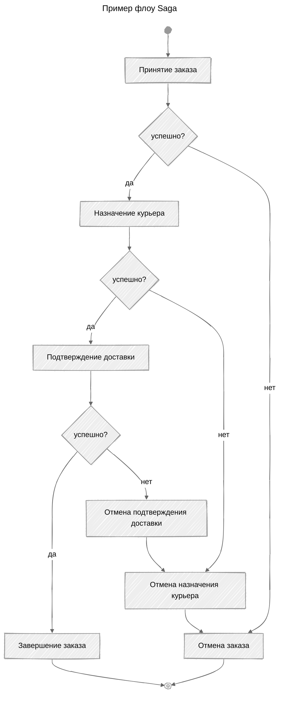

---
aliases:
  - Choreography-based Saga
  - Orchestration-based Saga
  - SAGA
  - Saga
  - Saga pattern
  - Паттерн Saga
  - Сага
  - Хореография
  - хореографическая сага
  - оркестрация
  - оркестратор
---
## Saga

Паттерн Saga позволяет согласованно управлять состоянием системы, разделяя большую транзакцию на серию меньших шагов, каждый из которых может быть выполнен автономно. Каждый шаг транзакции имеет соответствующую компенсирующую операцию, которая выполняется в случае неудачи. Это позволяет эмулировать атомарное поведение в многокомпонентных (контейнерных) системах и обеспечивает возможность отката в случае необходимости.

**Цель**

Обеспечить [[ACID]]-свойства для группы микросервисов:

- Atomicity — атомарность,
- Consistency — целостность,
- Isolation — изолированность,
- Durability — надёжность.

Паттерн Saga дробит мультисервисную транзакцию на шаги, которыми занимаются разные микросервисы. В случае ошибки система активирует отмену действия, которая распространяется на все вовлечённые микросервисы, что обеспечивает целостность данных.

**Подходы к реализации Saga**

Паттерн можно реализовать двумя способами. Транзакциями управляют через **оркестрацию** или **хореографию**. Оркестрация подразумевает наличие отдельного сервиса-оркестратора, а хореография — обмен событиями между микросервисами.

### Orchestration-based Saga

В оркестровочной реализации Saga (Orchestration-based Saga) есть центральный координатор (оркестратор), который управляет выполнением всех шагов транзакции и вызывает каждый шаг поочерёдно. Оркестратор отслеживает состояние выполнения и в случае ошибки инициирует выполнение компенсирующих операций. Подход подходит для сложных сценариев с множеством условий.

### Choreography-based Saga

В хореографической реализации Saga (Choreography-based Saga) каждый микросервис отвечает за выполнение своего шага и вызывает следующий микросервис через обмен сообщениями. Здесь нет центрального координатора, и каждый шаг самостоятельно уведомляет следующий шаг о завершении своей работы. Сервисы взаимодействуют напрямую через события, и каждый сервис самостоятельно решает, какое действие выполнить на основе полученного события.

### Как работает паттерн SAGA

1. **Разбиение.** Большая распределённая транзакция делится на серию локальных транзакций, каждая из которых выполняется в рамках одного микросервиса.
2. **Выполнение.** Шаги выполняются последовательно или параллельно. Каждый успешный шаг публикует событие, запускающее следующий шаг.
3. **Компенсация.** При ошибке запускается цепочка компенсационных действий, которые отменяют изменения, сделанные на предыдущих шагах.

**Пример:** оформление заказа в интернет-магазине:

1. Резервирование товара (успех).
2. Списание средств (успех).
3. Планирование доставки (ошибка).
4. **Компенсации:** возврат средств → отмена резервирования товара.

Пример флоу Saga:

### Документирование применения Saga

Документирование применения Saga включает описание всех шагов транзакции, компенсирующих операций и моделей данных, используемых в процессе. Это обеспечивает прозрачность и упрощает процесс поддержки и развития системы.

Альтернатива данному паттерну — [[two-phase-commit]].

---

**SAGA** в контексте паттернов проектирования не является аббревиатурой — у неё нет официальной расшифровки по буквам.

Это именно **название паттерна** (от англ. *saga* — «сага», «длинная история»), которое метафорически отражает суть подхода: сложная транзакция представляется как длинная цепочка (или «повествование») из отдельных шагов.

### История возникновения

Паттерн был впервые предложен в **1987 году** исследователями **Гектором Гарсиа-Молиной** #👨 (Hector Garcia-Molina) и **Кеннетом Б. Кимом** #👨 (Kenneth A. Salem) в научной статье *«Sagas»*. Авторы использовали слово *saga*, чтобы описать **долгоживущую транзакцию** — процесс, состоящий из последовательности локальных транзакций в распределённой системе.

### Смысл названия

Название подчёркивает ключевые особенности:

- **Последовательность.** Как в эпической саге, процесс состоит из множества связанных шагов.
- **Долговечность.** Транзакция может длиться долго (минуты, часы), в отличие от классических ACID-транзакций.
- **Возможность «отката истории».** Если какой-то шаг завершается ошибкой, система выполняет **компенсационные транзакции** — отменяет эффекты предыдущих шагов в обратном порядке (как если бы «переписывала» часть саги).

### Когда применяют SAGA

Паттерн актуален в **микросервисной архитектуре**, где классические ACID-транзакции (с двухфазной фиксацией) неэффективны или невозможны. Типичные примеры:

- бронирование поездки (рейс + отель + аренда авто);
- обработка банковского перевода между разными системами;
- оформление сложного заказа с участием нескольких сервисов (склад, оплата, логистика).

**Итог:** SAGA — это не аббревиатура, а образное название паттерна для управления распределёнными транзакциями через цепочку локальных операций с возможностью компенсации. Оно подчёркивает структурированность, длительность и обратимость процесса.
