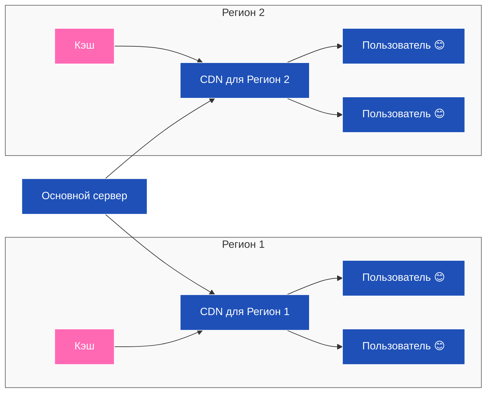

# Content Delivery Network

**Content Delivery Network, или CDN,** — это распределённые узлы хранения и доставки информации. Сервис представляет собой систему, которая в ответ на запросы от клиента запрашивает, получает и кеширует данные от источника и отдаёт их клиенту.
* Когда пользователь заходит на сайт, запрос направляется к ближайшему CDN-серверу. Если запрашиваемая информация кеширована на нём, данные сразу отдаются пользователю. Если данные запрашиваются впервые или они устарели, CDN-сервер сначала загружает их с сервера-источника, а затем отдаёт клиенту.

**Точка присутствия (пограничный узел, Point of presence, PoP)** — это базовый компонент CDN. Здесь находятся копии или кешированные версии контента, полученного от основного источника. Их количество и географическое расположение влияет на эффективность использования CDN. Чем ближе они к пользователям интернет-ресурса, тем быстрее доставляется им контент. Чем больше их количество, тем меньше нагрузка на исходный сервер.

Есть два метода разделения данных на основе DNS — каждый со своими особенностями.
1. **GeoDNS**
	* GeoDNS (solitary traffic directors,  global traffic directors)
	* это метод географических доменных имён, который использует алгоритм определения геокоординат по IP-адресу пользователя. Клиент отправляет запрос, DNS-сервер определяет местоположение пользователя по IP-адресу и находит ближайшую точку присутствия.
2. **Anycast**
	*  **Anycast** — это метод сетевой адресации и маршрутизации, при котором один IP-адрес присваивается нескольким серверам в сети. Серверы при этом находятся в разных точках присутствия.
	* Anycast DNS можно представить как единый IP-адрес с несколькими точками присутствия. Он позволяет повысить производительность и устойчивость DNS, но не даёт контролировать трафик в зависимости от страны или региона.

## 🌐 Что такое BGP?

**BGP (Border Gateway Protocol)**, или Протокол граничного шлюза, — это основной протокол маршрутизации, который используется для обмена информацией о достижимости маршрутов между **автономными системами (АС)** в сети Интернет.

Проще говоря, BGP — это **"язык"**, на котором общаются крупнейшие сети (провайдеры, дата-центры, крупные корпорации) по всему миру, чтобы решить, какой путь является **самым лучшим и быстрым** для передачи данных от одного адреса в Интернете к другому.

### Ключевые особенности BGP:

- **Протокол внешнего шлюза (Exterior Gateway Protocol, EGP):** Он работает между разными АС (например, между двумя крупными интернет-провайдерами), в отличие от внутренних протоколов (например, OSPF или EIGRP), которые работают внутри одной АС.
    
- **Автономная Система (АС):** Это группа IP-сетей и маршрутизаторов, управляемых одним или несколькими операторами, которые придерживаются единой политики маршрутизации. Каждой АС присвоен уникальный номер (ASN).
    
- **Маршрутизация на основе политик:** BGP не просто ищет "кратчайший" путь (по количеству узлов), он учитывает множество атрибутов (политики, предпочтения, стоимость), чтобы выбрать наиболее подходящий маршрут. Это позволяет владельцам сетей контролировать, куда и откуда должен идти их трафик.
    

---

## 🚀 Как BGP связан с CDN (Content Delivery Network)?

**CDN** — это географически распределенная сеть прокси-серверов и их центров обработки данных. Основная цель CDN — **доставить контент (видео, изображения, скрипты) пользователю как можно быстрее**, кэшируя его на серверах, расположенных близко к конечному потребителю.

Связь BGP и CDN является **критической** и лежит в основе того, как CDN достигает своей цели:

1. **Анонсирование маршрутов (Anycast):** CDN-провайдеры используют BGP для анонсирования **одного и того же IP-адреса** (техника называется **Anycast**) с множества своих географически распределенных узлов (PoP – Points of Presence).
    
2. **Выбор ближайшего узла:** Когда пользователь в Москве запрашивает сайт, обслуживаемый CDN, его запрос отправляется на этот общий IP-адрес. Благодаря BGP, интернет-маршрутизаторы видят, что этот адрес "доступен" из разных точек (например, из Франкфурта, Москвы и Лондона). **BGP-протокол автоматически выбирает путь к ближайшему узлу CDN** (например, к московскому PoP), потому что он является наиболее коротким или предпочтительным с точки зрения сети.
    
3. **Оптимизация трафика:** BGP позволяет CDN динамически управлять трафиком. Если один узел перегружен или вышел из строя, BGP-маршруты могут быть автоматически изменены, чтобы направить трафик на следующий ближайший и работоспособный узел.
    

Таким образом, **BGP** — это **инфраструктурный механизм**, который позволяет CDN эффективно использовать свое географическое преимущество, направляя каждого пользователя к ближайшему серверу для обеспечения **максимальной скорости загрузки**.