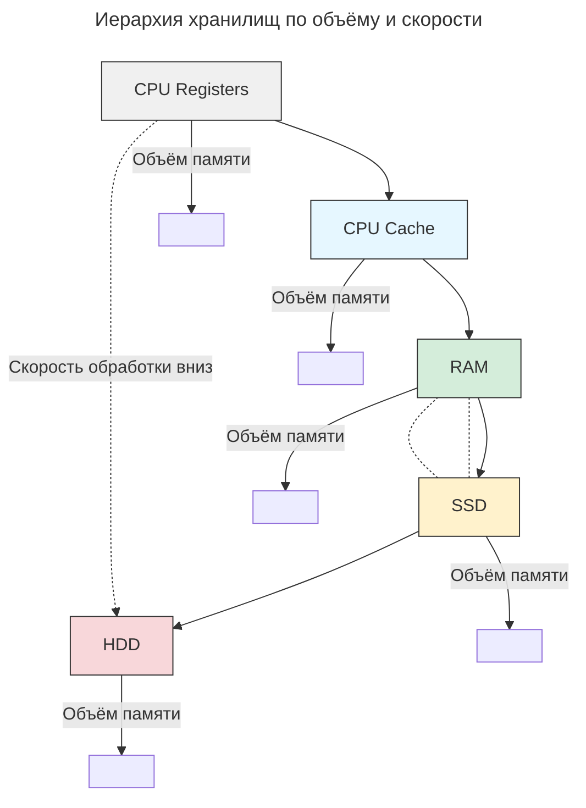

---
aliases:
  - Cache
  - CPU Cache
  - CPU Registers
  - Distributed caching
  - HDD
  - RAM
  - SSD
  - Кеш
  - Распределённое кеширование
---

## Распределённое облачное кеширование

Высокая доступность данных — ключевое преимущество распределённого облачного кеширования. Это то, на что в первую очередь необходимо ориентироваться при принятии решения о внедрении этого способа [[data-scaling|масштабирования]].

### Выбор хранилища для кеширования

Кеш — это те же данные, и их необходимо где-то хранить. Для этого существует четыре типа хранилищ:

- **HDD** — обладают большим объёмом, но низкой скоростью обмена данными. Стоимость низкая.
- **SSD** — обладают меньшим объёмом, но высокой скоростью обмена данными. Стоимость выше, чем у HDD, но не слишком высокая.
- **RAM, оперативная память** — оптимальное соотношение цены и объёма обработки данных.
- **CPU Cache и CPU Registers** — самые дорогие и быстрые. Объём низкий.

RAM — золотая середина по соотношению цены и скорости обработки. Но на практике чаще используют более дешёвые SSD-диски для внешних задач и ещё более дешёвые HDD для внутренних.

