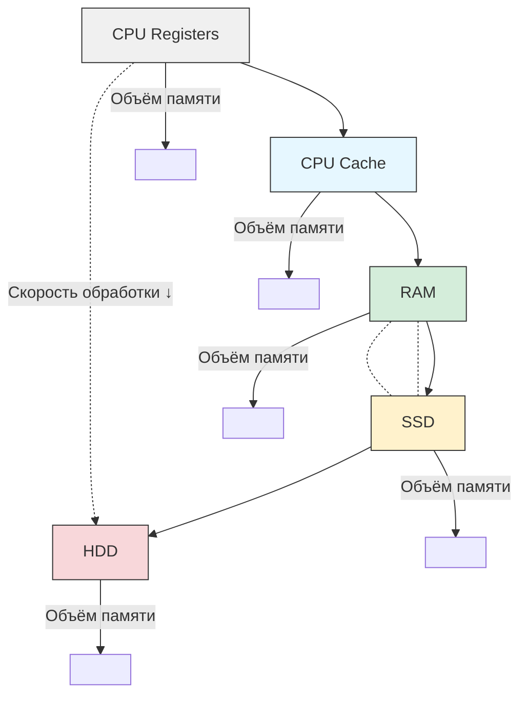

# Распределённое облачное кеширование

Высокая доступность данных — ключевое преимущество распределённого облачного кеширования. Это то, на что в первую очередь необходимо ориентироваться при принятии решения о внедрении этого способа масштабирования.
## Выбор хранилища для кеширования

Кеш — это те же данные, и их необходимо где-то хранить. Для этого существует четыре типа хранилищ:

- **HDD** Обладают большим объёмом, но низкой скоростью обмена данными. Стоимость — низкая.
- **SSD** Обладают меньшим объёмом, но высокой скоростью обмена данными. Стоимость — выше, чем у HDD, но не слишком высокая.
- **RAM, оперативная память** Оптимальное соотношение цены и объёма обработки данных.
- **CPU Cashe и CPU Registers** Самые дорогие и быстрые. Объём низкий.

☝ RAM — золотая середина по соотношению цены и скорости обработки. Но на практике чаще используют более дешёвые SSD-диски для внешних задач и ещё более дешёвые HDD для внутренних.

