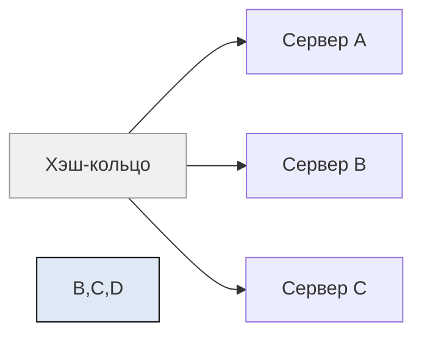

**Consistent Hashing (согласованное хеширование)** — это **интеллектуальный способ распределения данных или запросов между узлами**, который минимизирует перераспределение при добавлении/удалении серверов.

Оно широко используется в:
- **Distributed databases**: Cassandra, DynamoDB, Riak
- **Load balancers**
- **Caching systems**: Redis Cluster, Memcached (с библиотекой)
- **CDN**
- **P2P сетях**

---

## ✅ Что не так с обычным хешированием?

### ❌ Проблема: `hash(key) % N`

Допустим, у вас 3 сервера (`S0`, `S1`, `S2`)  
Вы используете:

```python
server_index = hash(key) % 3
```

→ Ключ `user_123` → попадает на `S1`

### 🔥 А если вы добавите 4-й сервер?

Теперь `N = 4` → формула меняется

→ **Почти все ключи сместятся**  
→ `user_123` теперь может быть на `S0`  
→ Придётся **перемещать 75% данных**

> ❌ Это катастрофа при масштабировании!

---

## ✅ Решение: **Consistent Hashing**

> **Consistent Hashing** — это способ, при котором **при изменении числа узлов только часть данных перераспределяется**, а не всё.

---

## 🔄 Как работает Consistent Hashing?

### Шаг 1: Представьте **кольцо (хэш-кольцо)**

- Хеш-пространство: от `0` до `2^32 - 1` (или `2^128`)
- Все значения отображаются на этом кольце



(К сожалению, Mermaid не поддерживает круговые диаграммы, но представьте себе кольцо)

---

### Шаг 2: Расположите серверы по кольцу

- Возьмите имя сервера → пропустите через хеш-функцию → получите позицию на кольце
- Например:
  - `hash("server-A") = 120`
  - `hash("server-B") = 300`
  - `hash("server-C") = 600`

---

### Шаг 3: Распределите данные

- Для каждого ключа: `hash("user_123") = 350`
- Найдите **ближайший сервер по часовой стрелке** → `server-B` (300 → 350 → следующий: `600`? нет, это `server-C`?)

> ⚠️ На самом деле:
> - `350` → ищем первый узел **по часовой стрелке**
> - После `350` → `600` → `server-C`?
> - Но если `600` — это `server-C`, то он и будет владельцем

---

### 🔁 Добавляем новый сервер: `server-D` (hash=500)

- Теперь `user_123` (`350`) → всё ещё `server-C` (`600`)
- А `key_X` (`450`) → раньше был `server-C`, теперь → `server-D` (`500`)
- Только **небольшая часть** перемещается

✅ Вместо 75% — всего 25%

---

## ✅ Преимущества Consistent Hashing

| Плюс | Объяснение |
|------|------------|
| ✅ **Минимальное перемещение данных** | При добавлении/удалении узлов — только часть реплицируется |
| ✅ **Горизонтальное масштабирование** | Можно легко добавить 100 серверов |
| ✅ **Равномерное распределение** | Если использовать "виртуальные узлы" |
| ✅ **Подходит для P2P** | BitTorrent, IPFS |
| ✅ **Используется в реальных системах** | Cassandra, DynamoDB, Akka, Kafka |

---

## 🔧 Трюк: Virtual Nodes (виртуальные узлы)

Без них — сервера могут занять неравные участки кольца → дисбаланс

### 💡 Решение:  
Каждый физический сервер → **множество виртуальных узлов** на кольце

```text
server-A → vA1, vA2, vA3, ..., vA100
server-B → vB1, vB2, ..., vB100
```

→ Даже если один сервер слабее — он будет получать меньше данных

✅ Это делает распределение **почти идеально равномерным**

---

## ✅ Где используется?

| Система | Использование |
|--------|----------------|
| **Apache Cassandra** | Да — ключи шардируются через consistent hashing |
| **Amazon DynamoDB** | Да — основа sharding'а |
| **Riak** | Да |
| **Akka Cluster** | Распределение акторов |
| **Kafka** | Частично — partitioner'ы используют его идеи |
| **Memcached (с библиотекой)** | Такие как `libketama` |
| **Redis Cluster** | Да — 16384 хэш-слотов |
| **CDN / Load Balancer** | Для сохранения session affinity |

---

## ✅ Пример: Redis Cluster

- Redis использует **16384 слотов** (не физические серверы)
- Каждая пара `(ключ, значение)` → `CRC16(key) % 16384`
- Эти слоты распределены между мастерами
- При добавлении нового узла — **только некоторые слоты мигрируют**

```bash
# Пример:
GET user:123 → hash_slot = CRC16("user:123") % 16384 = 5000
# Slot 5000 → принадлежит master-A
```

> ✅ Redis Cluster — живой пример Consistent Hashing

---

## ✅ Алгоритм (псевдокод)

```python
nodes = [NodeA, NodeB, NodeC]
ring = {}  # hash_value → node

# Добавляем виртуальные узлы
for node in nodes:
    for replica in range(100):
        key = f"{node.id}#{replica}"
        h = hash(key)
        ring[h] = node

def get_node_for_key(key):
    h = hash(key)
    sorted_keys = sorted(ring.keys())
    for k in sorted_keys:
        if k >= h:
            return ring[k]
    return ring[sorted_keys[0]]  # обход кольца
```

---

## ❌ Когда **не нужен**?

| Сценарий | Почему |
|----------|--------|
| ✅ Маленькая система (< 5 узлов) | Перемещение всех данных приемлемо |
| ✅ Вы используете центральный шардер | Например, Vitess для MySQL |
| ✅ Вам нужно точное распределение | Consistent Hashing — вероятностное |

---

## ✅ Финальный вывод

| Обычное хеширование | Consistent Hashing |
|---------------------|--------------------|
| `hash(key) % N` | `hash(key)` → кольцо |
| При `N+1` → 90% данных переезжают | При `N+1` → ~1/N переезжает |
| Подходит для статичных систем | Идеален для динамических |
| Простое | Умнее, гибче, масштабируемее |

> 🔑 **Consistent Hashing — это когда ваша система может расти и падать — а данные почти не двигаются.**

---

## 💬 Цитата

> _“With consistent hashing, adding or removing a server affects only the keys near it on the ring.”_

---

## 📚 Где учиться дальше?

- Book: *“Designing Data-Intensive Applications”* — Martin Kleppmann
- [Wikipedia: Consistent Hashing](https://en.wikipedia.org/wiki/Consistent_hashing)
- YouTube: *“Consistent Hashing Explained”* — TechWorld with Nana
- Redis Cluster Docs: https://redis.io/docs/reference/cluster-spec/

---

✅ **Consistent Hashing — основа современных распределённых систем.**  
Если вы строите что-то с горизонтальным масштабированием — знайте этот паттерн.