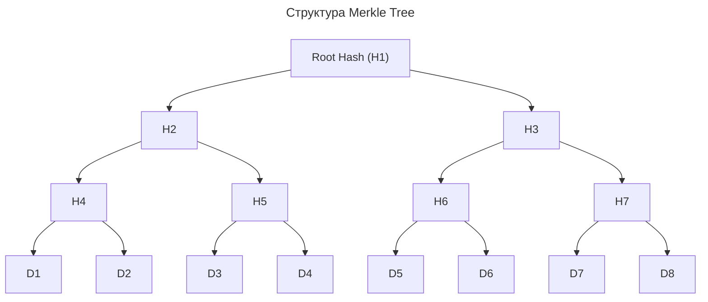
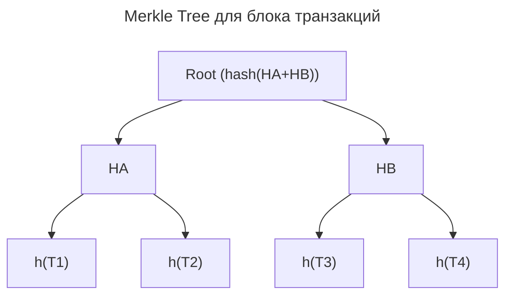

---
aliases:
  - Binary Merkle Tree
  - Hash Tree
  - Merkle Hash Tree
  - Merkle Patricia Trie
  - Merkle Root
  - Merkle Tree
  - Proof of Inclusion
  - Sparse Merkle Tree
  - Дерево Меркла
  - Доказательство включения
---

## Merkle Tree

**Merkle Tree (дерево Меркла)** — это **структура данных**, которая позволяет **эффективно и надёжно проверять целостность и согласованность больших объёмов данных** в распределённых системах.

Она широко используется в **блокчейне, Git, IPFS, ZFS, NoSQL-базах и P2P-сетях**.

**Суть**
Merkle Tree — это **двоичное дерево хешей**, где:

- Каждый листовой узел содержит **хеш данных**
- Каждый родительский узел содержит **хеш от хешей своих детей**

**Главная идея**
Один корневой хеш → гарантирует целостность всех данных ниже.

## Структура Merkle Tree



Где:

- `D1`–`D8` — исходные данные (файлы, транзакции, строки)
- `H4 = hash(D1 + D2)`
- `H2 = hash(H4 + H5)`
- `H1 = hash(H2 + H3)` → **корень дерева**

## Зачем нужен

### Проверка целостности без полного сравнения

Не нужно сравнивать все файлы — достаточно **корневого хеша**.

**Пример**
Есть 1 ТБ данных. Отправляется адресату **один хеш (H1)** — он проверяет, совпадает ли его H1. Если да — всё в порядке. Если нет — находится, какой блок изменился.

### Доказательство включения (Proof of Inclusion)

Можно доказать, что **определённая транзакция есть в блоке**, не передавая весь блок.

Используется в **Light Nodes (легковесных клиентах)** в Bitcoin/Ethereum. Чтобы доказать, что D1 есть в дереве:

- Предоставить: D1, H2, H3
- Сервер пересчитывает H1 и сверяет с корнем

### Сравнение больших наборов данных

Вместо сравнения миллионов строк:

- Построить Merkle Tree по обе стороны
- Сравнить **корневые хеши**
- Если отличаются — спуститься по дереву, чтобы найти **конкретное расхождение**

Используется в **Cassandra, DynamoDB, Rsync** (аналогично).

## Где используется

| Система | Как используется |
|--------|------------------|
| **Bitcoin** | Корень Merkle Tree в заголовке блока — подтверждает, какие транзакции включены |
| **Ethereum** | Использует **Merkle Patricia Trie** — улучшенная версия |
| **Git** | `git commit` содержит хеш от предыдущего коммита + хеш дерева файлов |
| **IPFS** | Каждый блок имеет уникальный CID — это хеш |
| **ZFS** | Файловая система использует Merkle Tree для обнаружения битых блоков |
| **NoSQL DBs** | Cassandra, Riak — для репликации и repair |
| **Blockchain** | Основа для доверия без централизации |

## Пример в блокчейне

Блок с 4 транзакциями:

```text
T1: Alice → Bob $10
T2: Carol → Dave $5
T3: Eve → Frank $3
T4: Grace → Hugo $7
```

Строим дерево:



- `h(T1)` — хеш первой транзакции
- `HA = hash(h(T1), h(T2))`
- `Root = hash(HA, HB)` — записывается в **заголовок блока**

Легковесный кошелёк может проверить, что T1 в блоке, не скачивая все транзакции.

**Особенности**

- ✅ Эффективная проверка — хватает одного хеша, O(log n) вместо O(n)
- ✅ Надёжность — любое изменение меняет корень, видно сразу
- ✅ Поддержка доказательств — можно доказать включение элемента без полного дерева
- ✅ Работает в P2P — нет доверия, только криптография
- ✅ Используется повсюду — Git, Blockchain, базы данных
- ❌ Только для фиксированного набора — нужно знать, сколько листьев
- ❌ Не защищает от DoS — только от подмены данных
- ❌ Требует построения — дополнительные вычисления при добавлении/изменении

## Разновидности

| Название | Особенность |
|----------|-------------|
| **Binary Merkle Tree** | Классическое — 2 ребёнка на узел |
| **Sparse Merkle Tree** | Для очень больших пространств (например, Ethereum) |
| **Merkle Patricia Trie** | Смесь Merkle и префиксного дерева — в Ethereum |
| **Hash Tree** | То же самое, но не обязательно криптографический хеш |

## Реализация на Python

```python
import hashlib

def hash(data):
    return hashlib.sha256(data.encode()).hexdigest()

# Данные
data = ["Alice", "Bob", "Carol", "Dave"]

# Шаг 1: хешируем листья
leaf_hashes = [hash(d) for d in data]

# Шаг 2: строим дерево
def build_merkle_tree(leaves):
    if len(leaves) == 1:
        return leaves[0]

    parents = []
    for i in range(0, len(leaves), 2):
        left = leaves[i]
        right = leaves[i+1] if i+1 < len(leaves) else left
        parents.append(hash(left + right))
    return build_merkle_tree(parents)

root = build_merkle_tree(leaf_hashes)
print("Merkle Root:", root)
```

Корень — **цифровая подпись всего набора данных**.

## Сценарии использования

| Сценарий | Применимость |
|----------|--------------|
| Блокчейн / DLT | Да — основа безопасности |
| P2P-обмен файлами | Да — как в BitTorrent |
| Распределённые базы данных | Да — для проверки согласованности |
| Доказательство включения элемента | Да — например, NFT в коллекции |
| VCS (как Git) | Да — уже используется |
| Простая валидация файла | Нет — достаточно одного SHA-256 |

**Ключевое понятие**

- **SHA-256** — хеш файла.
- **Merkle Root** — хеш **всех файлов**, который **позволяет проверять каждый отдельно**.

Merkle Tree — это «отпечаток пальца» для большого набора данных. Он позволяет убедиться, что ничего не подделано, доказать, что элемент существует, и эффективно синхронизировать данные между узлами. Без него **блокчейн невозможен**, а с ним — можно **проверить миллионы транзакций одним хешем**.
