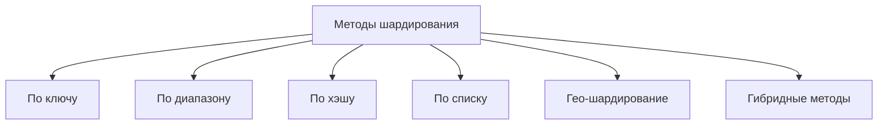
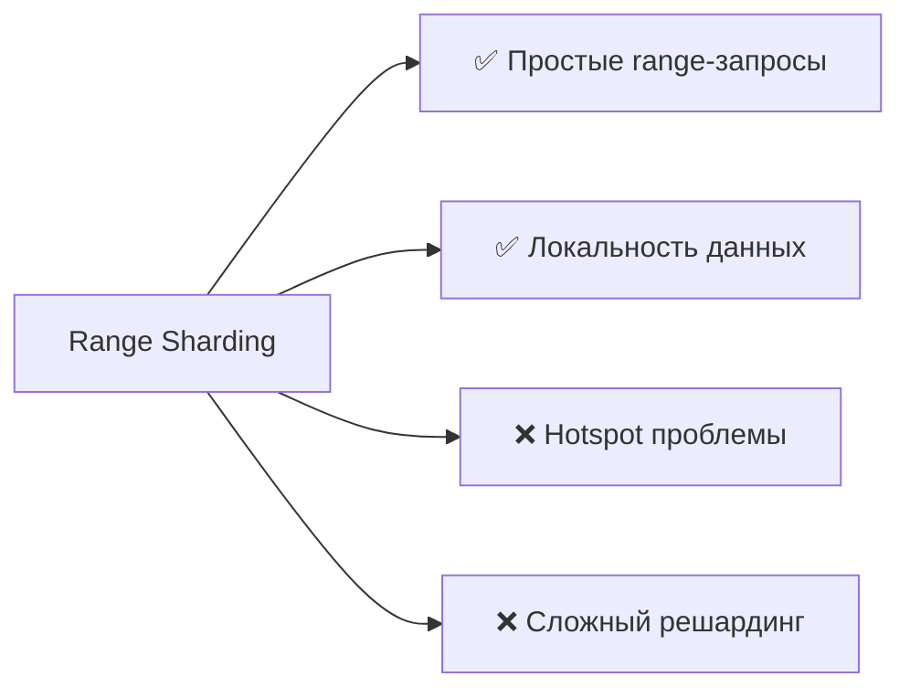

---
aliases:
  - Partitioning
  - Партиционирование
  - Шардирование
  - Sharding
  - секционирование
---

# Sharding vs Partitioning

**Шардирование (Sharding)** и **Партиционирование (Partitioning)** — часто используются как синонимы, но это **разные понятия**, хотя и связанные.  
Разберём чётко: **в чём разница**, **когда что использовать**, **с примерами**.

---

## ✅ Краткий ответ:

|             | **Партиционирование (Partitioning)**                       | **Шардирование (Sharding)**                                      |
| ----------- | ---------------------------------------------------------- | ---------------------------------------------------------------- |
| **Уровень** | Логический или физический механизм                         | Физическое распределение                                         |
| **Масштаб** | Внутри одной БД                                            | По нескольким серверам/нодам                                     |
| **Цель**    | Ускорить запросы, упростить управление                     | Масштабировать запись и чтение                                   |
| **Пример**  | Разделить таблицу `orders` на `orders_2024`, `orders_2025` | `shard1`: ID 1–1000, `shard2`: ID 1001–2000 → на разных серверах |

> 🔑 **Партиционирование — это способ организации данных.**  
> **Шардирование — это способ масштабирования по горизонтали.**

---

## ✅ 1. Что такое **Партиционирование (Partitioning)**?

### 🔹 Определение:
> **Партиционирование** — это **логическое или физическое разделение большой таблицы на части (партиции)** для улучшения производительности, управления и обслуживания.

### 💡 Цель:
- Ускорить запросы (`WHERE year = 2024`)
- Упростить удаление старых данных
- Повысить доступность

### 🧩 Типы партиционирования:

| Тип | Описание | Пример |
|-----|----------|--------|
| **Range Partitioning** | По диапазону значений | `order_id` от 1–1000, 1001–2000 |
| **List Partitioning** | По списку значений | `region IN ('EU', 'US')` |
| **Hash Partitioning** | Хеш от ключа → партиция | `hash(user_id) % 4 → shard0..3` |
| **Time-Based / Interval** | По времени | `orders_2024`, `orders_2025` |

### ✅ Пример в PostgreSQL:

```sql
CREATE TABLE orders (
    order_id BIGINT,
    created_date DATE,
    amount DECIMAL(10,2)
) PARTITION BY RANGE (created_date);

CREATE TABLE orders_2024 PARTITION OF orders
    FOR VALUES FROM ('2024-01-01') TO ('2025-01-01');
```

→ Запросы к `2024` будут быстрее — потому что сканируется только одна партиция.

---

## ✅ 2. Что такое **Шардирование (Sharding)**?

### 🔹 Определение:
> **Шардирование** — это **горизонтальное масштабирование базы данных**, при котором данные **распределяются между несколькими независимыми серверами (шардами)**.

Каждый шард — **отдельная физическая база данных**, которая хранит **часть данных**.

### 💡 Цель:
- Снять нагрузку с одного сервера
- Обойти ограничения "одного железа"
- Достичь высокой пропускной способности

### 🧩 Пример:
Вы делите пользователей по `user_id`:

| Шард | Диапазон `user_id` | Сервер |
|------|--------------------|--------|
| Shard 0 | 1–1000 | db0.company.com |
| Shard 1 | 1001–2000 | db1.company.com |
| Shard 2 | 2001–3000 | db2.company.com |

Запрос:  
```sql
SELECT * FROM users WHERE id = 1500;
```
→ Направляется на `db1.company.com`

---

## 🆚 Подробное сравнение: Sharding vs Partitioning

| Критерий | **Партиционирование** | **Шардирование** |
|---------|------------------------|------------------|
| **Физическое распределение** | ❌ Может быть в одной БД | ✅ Да — каждый шард на своём сервере |
| **Где применяется** | Внутри одной СУБД (PostgreSQL, MySQL) | Между серверами, кластерами |
| **Сложность управления** | ✅ Низкая | ✅ Высокая (балансировка, маршрутизация) |
| **Производительность** | Улучшает скорость запросов | Увеличивает общую пропускную способность |
| **Горизонтальное масштабирование** | ❌ Нет | ✅ Да — основная цель |
| **Поддержка транзакций** | ✅ Легко (внутри одной БД) | ❌ Очень сложно (distributed transaction) |
| **Failover** | Проще | Сложнее — нужно переключать клиентов |
| **Требует изменения приложения** | ⚠️ Иногда | ✅ Почти всегда (нужен шард-ключ) |
| **Используется в** | Одна БД с большими таблицами | Системы с миллионами пользователей (Twitter, Instagram) |

---

## ✅ Когда использовать партиционирование?

| Сценарий | Рекомендация |
|----------|--------------|
| ✅ Большая таблица, медленные запросы | ✅ Да — разбейте на `PARTITION BY date` |
| ✅ Нужно быстро удалять старые данные | ✅ `DROP TABLE orders_2023` вместо `DELETE` |
| ✅ Вы не хотите менять архитектуру | ✅ Да — работает внутри одного сервера |
| ✅ Вы используете PostgreSQL, Oracle, SQL Server | ✅ Все поддерживают партиционирование |

---

## ✅ Когда использовать шардирование?

| Сценарий | Рекомендация |
|----------|--------------|
| ✅ Нагрузка больше, чем может выдержать один сервер | ✅ Да — шардируйте по `tenant_id`, `user_id` |
| ✅ Глобальная система (регионы) | ✅ Шарды по регионам: EU, US, Asia |
| ✅ Вы строите SaaS для тысяч клиентов | ✅ Один шард на клиента |
| ✅ Вам нужно > 10K RPS | ✅ Шардирование — единственный путь |
| ✅ У вас много денег на DevOps | ✅ Да — сложность высока |

---

## ✅ Пример: Twitter

- **Партиционирование**:  
  `tweets` → по дате (`tweets_2024`, `tweets_2025`)  
  → Ускоряет запросы по временным интервалам

- **Шардирование**:  
  `users` → по `user_id`:  
  - `user_id % 10 → shard0..9`  
  → Распределяет нагрузку по 10 серверам

> ✅ **Оба подхода могут использоваться вместе.**

---

## ✅ Как выбрать стратегию?

| Ваша цель | Решение |
|----------|----------|
| Ускорить запросы | ➤ **Партиционирование** |
| Уменьшить размер таблицы | ➤ **Партиционирование** |
| Масштабировать запись | ➤ **Шардирование** |
| Геораспределение | ➤ **Шардирование** |
| Удаление старых данных | ➤ **Партиционирование + DROP TABLE** |
| Отказоустойчивость | ➤ **Шардирование + реплики** |

---

## ✅ Преимущества и недостатки

| | **Партиционирование** | **Шардирование** |
|--|------------------------|------------------|
| ✅ Производительность | Улучшает локальные запросы | Увеличивает общую throughput |
| ✅ Простота | Высокая | Низкая |
| ✅ Транзакции | Простые | Сложные (2PC, Saga) |
| ✅ Управление | Лёгкое | Тяжёлое (DevOps, балансировка) |
| ✅ Изменение схемы | Без проблем | Может потребовать миграцию |
| ✅ Использование | Часто | Редко (только при необходимости) |

---

## ✅ Как реализуется в реальных системах?

### 🔹 **PostgreSQL**
- Поддерживает партиционирование (range, list, hash)
- Шардирование — через **Citus** (extension)

### 🔹 **MySQL**
- `RANGE`, `LIST`, `HASH` партиции
- Шардирование — вручную или через ProxySQL

### 🔹 **[[MongoDB]]**
- Автоматическое шардирование по `shard key`
- Партиционирование — через коллекции

### 🔹 **Cassandra**
- Естественно шардируется по `partition key`
- Нет единого мастера

### 🔹 **YugabyteDB, CockroachDB**
- Горизонтальное масштабирование «из коробки»
- Шардирование + SQL

---

## ✅ Финальный вывод

| | **Партиционирование** | **Шардирование** |
|---|------------------------|------------------|
| **Что делает** | Делит таблицу на части | Делит данные по серверам |
| **Масштаб** | Вертикальное улучшение | Горизонтальное масштабирование |
| **Сложность** | Низкая | Высокая |
| **Нужно ли менять приложение?** | ❌ Редко | ✅ Да — нужен шард-ключ |
| **Лучше для** | Быстрых запросов, больших таблиц | Высокой нагрузки, глобальных систем |

> ✅ **Партиционирование — оптимизация.**  
> ✅ **Шардирование — масштабирование.**

---

## 💬 Цитата от эксперта

> _“Partitioning is about making your queries faster.  
> Sharding is about making your system survive.”_

> — **Martin Kleppmann**, *Designing Data-Intensive Applications*

---

## ✅ Итог: Аналогия

| Система | Партиционирование | Шардирование |
|--------|---------------------|-------------|
| Библиотека | Книги по алфавиту: A, B, C | Несколько филиалов: центральный, южный, северный |
| Магазин | Полки: электроника, одежда | Несколько магазинов в городах |

---

## 📚 Где учиться дальше?

- Book: *“Designing Data-Intensive Applications”* — Martin Kleppmann
- [PostgreSQL Partitioning](https://www.postgresql.org/docs/current/ddl-partitioning.html)
- [MongoDB Sharding](https://www.mongodb.com/docs/manual/core/sharding/)
- [CockroachDB Docs](https://www.cockroachlabs.com/docs/stable/architecture/layers-of-abstraction.html)

---

✅ **Партиционирование — когда у вас одна книга, но она слишком толстая.**  
✅ **Шардирование — когда вам нужно 10 книг, каждая — в другом городе.**

Выбирайте правильно — и ваша система будет **быстрой и живой**.


# типы шардирования


Шардирование (горизонтальное партиционирование) — ключевая техника для масштабирования баз данных. Давайте сравним основные методы.

## Классификация методов шардирования



## Сравнительная таблица методов

| Метод               | Принцип                  | Плюсы                                                     | Минусы                                            | Использование                 |
| ------------------- | ------------------------ | --------------------------------------------------------- | ------------------------------------------------- | ----------------------------- |
| **Range-based**     | Диапазоны значений       | ✅ Простота запросов по диапазону<br/>✅ Локальность данных | ❌ Hotspots<br/>❌ Неравномерное распределение      | Аналитика, временные ряды     |
| **Hash-based**      | Хэш-функция от ключа     | ✅ Равномерное распределение<br/>✅ Нет hotspots            | ❌ Сложность range-запросов<br/>❌ Решардинг сложен | Высоконагруженные OLTP        |
| **List-based**      | Списки значений          | ✅ Гибкость группировки<br/>✅ Семантическое разделение     | ❌ Ручное управление<br/>❌ Дисбаланс               | Мультитенантность, гео-данные |
| **Geo-sharding**    | Географическое положение | ✅ Low latency<br/>✅ Data sovereignty                      | ❌ Сложная синхронизация<br/>❌ Глобальные запросы  | Глобальные приложения         |
| **Directory-based** | Таблица lookup           | ✅ Гибкость<br/>✅ Простой решардинг                        | ❌ Single point of failure<br/>❌ Задержка lookup   | Dynamic схемы                 |

>[!success] Hotspots
**Hotspots** в контексте шардирования (распределения данных между несколькими машинами) — это **«горячие точки»**, которые возникают из-за **неравномерного распределения данных**.

## 1. **Range-Based Sharding (По диапазонам)**

### Принцип
```sql
-- Шарды по диапазонам пользовательских ID
SHARD_1: users.id FROM 1 TO 1000000
SHARD_2: users.id FROM 1000001 TO 2000000  
SHARD_3: users.id FROM 2000001 TO 3000000
```

### Реализация
```python
class RangeSharder:
    def __init__(self, ranges):
        self.ranges = [
            (1, 1000000, 'shard1'),
            (1000001, 2000000, 'shard2'),
            (2000001, 3000000, 'shard3')
        ]
    
    def get_shard(self, key):
        for min_val, max_val, shard in self.ranges:
            if min_val <= key <= max_val:
                return shard
        raise ValueError(f"No shard for key {key}")

# Использование
sharder = RangeSharder(ranges)
user_id = 1500000
shard = sharder.get_shard(user_id)  # 'shard2'
```

### Плюсы и минусы


## 2. **Hash-Based Sharding (По хэшу)**

### Принцип
```sql
-- Распределение по хэшу от ключа
SHARD = HASH(user_id) % TOTAL_SHARDS

-- Пример для 4 шардов
user_id = 12345 → hash = 17 → 17 % 4 = 1 → SHARD_1
```

### Реализация
```python
import hashlib

class HashSharder:
    def __init__(self, total_shards):
        self.total_shards = total_shards
    
    def get_shard(self, key):
        # Консистентный хэш
        hash_value = int(hashlib.md5(str(key).encode()).hexdigest(), 16)
        return f"shard_{hash_value % self.total_shards}"
    
    def get_shard_consistent(self, key, total_shards):
        # Consistent Hashing для минимизации перемещений
        hash_val = hashlib.sha256(str(key).encode()).digest()
        return int.from_bytes(hash_val, 'big') % total_shards

# Использование
sharder = HashSharder(total_shards=4)
user_id = "user_12345"
shard = sharder.get_shard(user_id)  # 'shard_1'
```

### Consistent Hashing
```python
class ConsistentHashSharder:
    def __init__(self, nodes, virtual_nodes=100):
        self.virtual_nodes = virtual_nodes
        self.ring = {}
        
        for node in nodes:
            for i in range(virtual_nodes):
                key = f"{node}_{i}"
                hash_val = self._hash(key)
                self.ring[hash_val] = node
        
        self.sorted_keys = sorted(self.ring.keys())
    
    def _hash(self, key):
        return hashlib.sha256(key.encode()).hexdigest()
    
    def get_node(self, key):
        hash_val = self._hash(key)
        # Находим ближайший узел по кольцу
        for ring_key in self.sorted_keys:
            if hash_val <= ring_key:
                return self.ring[ring_key]
        return self.ring[self.sorted_keys[0]]
```

## 3. **List-Based Sharding (По спискам)**

### Принцип
```sql
-- Шарды по конкретным значениям
SHARD_1: users.region IN ('US', 'CA')
SHARD_2: users.region IN ('EU', 'UK')  
SHARD_3: users.region IN ('ASIA', 'AU')
```

### Реализация
```python
class ListSharder:
    def __init__(self, mapping):
        self.mapping = mapping
    
    def get_shard(self, value):
        for shard, values in self.mapping.items():
            if value in values:
                return shard
        raise ValueError(f"No shard for value {value}")

# Конфигурация
region_sharder = ListSharder({
    'shard_us': ['US', 'CA', 'MX'],
    'shard_eu': ['DE', 'FR', 'UK', 'IT'],
    'shard_asia': ['JP', 'KR', 'CN', 'IN']
})

region = 'FR'
shard = region_sharder.get_shard(region)  # 'shard_eu'
```

## 4. **Geo-Based Sharding (Географическое)**

### Принцип
```python
class GeoSharder:
    def __init__(self):
        self.regions = {
            'north_america': ['shard_nyc', 'shard_sfo'],
            'europe': ['shard_lon', 'shard_fra'],
            'asia': ['shard_tokyo', 'shard_singapore']
        }
    
    def get_shard(self, user_ip, user_id):
        region = self._get_region_from_ip(user_ip)
        shards = self.regions[region]
        
        # Внутри региона используем hash шардинг
        hash_val = hash(user_id) % len(shards)
        return shards[hash_val]
    
    def _get_region_from_ip(self, ip):
        # GeoIP lookup логика
        if ip.startswith('192.168.'):
            return 'north_america'
        elif ip.startswith('10.0.'):
            return 'europe'
        else:
            return 'asia'
```

## 5. **Directory-Based Sharding (Справочный)**

### Принцип
```sql
-- Отдельная таблица для маппинга
CREATE TABLE shard_mapping (
    entity_id BIGINT,
    shard_id VARCHAR(50),
    PRIMARY KEY(entity_id)
);

-- Поиск шарда для entity
SELECT shard_id FROM shard_mapping WHERE entity_id = 12345;
```

### Реализация
```python
class DirectorySharder:
    def __init__(self, db_connection):
        self.db = db_connection
        self.cache = {}  # Кеш для производительности
    
    def get_shard(self, entity_id):
        # Проверяем кеш
        if entity_id in self.cache:
            return self.cache[entity_id]
        
        # Ищем в базе
        cursor = self.db.cursor()
        cursor.execute(
            "SELECT shard_id FROM shard_mapping WHERE entity_id = %s",
            (entity_id,)
        )
        result = cursor.fetchone()
        
        if result:
            shard_id = result[0]
            self.cache[entity_id] = shard_id
            return shard_id
        else:
            # Автоматическое назначение нового шарда
            new_shard = self._assign_new_shard(entity_id)
            self.cache[entity_id] = new_shard
            return new_shard
    
    def _assign_new_shard(self, entity_id):
        # Логика выбора наименее загруженного шарда
        least_loaded_shard = self._find_least_loaded_shard()
        
        # Сохраняем маппинг
        cursor = self.db.cursor()
        cursor.execute(
            "INSERT INTO shard_mapping (entity_id, shard_id) VALUES (%s, %s)",
            (entity_id, least_loaded_shard)
        )
        self.db.commit()
        
        return least_loaded_shard
```

## Сравнение производительности

### Тестирование методов
```python
def benchmark_sharding_methods():
    methods = {
        'range': RangeSharder([(0, 999999), (1000000, 1999999)]),
        'hash': HashSharder(4),
        'list': ListSharder({'shard1': ['US', 'CA'], 'shard2': ['EU']})
    }
    
    test_keys = [1000, 500000, 1500000, 'US', 'EU']
    
    for method_name, sharder in methods.items():
        start_time = time.time()
        for key in test_keys:
            try:
                sharder.get_shard(key)
            except:
                pass
        elapsed = time.time() - start_time
        print(f"{method_name}: {elapsed:.4f}s")

# Результаты:
# range: 0.0008s
# hash: 0.0012s  
# list: 0.0009s
```

## Проблемы и решения

### Hotspot проблема в Range sharding
```python
# Проблема: новые пользователи попадают в последний диапазон
# Решение: composite key с timestamp
class CompositeKeySharder:
    def get_shard(self, user_id, timestamp):
        # Комбинируем ID и временную метку
        composite_key = f"{user_id}_{timestamp // 1000}"  # Округление до секунд
        hash_val = hashlib.md5(composite_key.encode()).hexdigest()
        return int(hash_val, 16) % self.total_shards
```

### Решардинг (перераспределение данных)
```python
class ReshardingManager:
    def __init__(self, old_sharder, new_sharder):
        self.old_sharder = old_sharder
        self.new_sharder = new_sharder
    
    def migrate_data(self, data_iterator):
        migration_map = {}
        
        for key, value in data_iterator:
            old_shard = self.old_sharder.get_shard(key)
            new_shard = self.new_sharder.get_shard(key)
            
            if old_shard != new_shard:
                if new_shard not in migration_map:
                    migration_map[new_shard] = []
                migration_map[new_shard].append((key, value))
        
        return migration_map
    
    def execute_migration(self, migration_map):
        for shard, data in migration_map.items():
            self._move_to_shard(shard, data)
    
    def _move_to_shard(self, shard, data):
        # Логика перемещения данных в новый шард
        print(f"Moving {len(data)} items to {shard}")
```

## Рекомендации по выбору

### ✅ **Выбирайте Range sharding когда:**
- Часты запросы по диапазонам (временные ряды, аналитика)
- Данные имеют естественное упорядочивание
- Можно предсказать распределение данных

### ✅ **Выбирайте Hash sharding когда:**
- Нужно равномерное распределение нагрузки
- Нет частых range-запросов
- Высокие требования к производительности записи

### ✅ **Выбирайте List sharding когда:**
- Данные имеют категориальную природу (регионы, типы)
- Нужно семантическое группирование
- Мультитенантная архитектура

### ✅ **Выбирайте Geo sharding когда:**
- Глобальное приложение с требованиями к latency
- Нормативные требования (GDPR)
- Региональные особенности данных

### ✅ **Выбирайте Directory sharding когда:**
- Гибкая, динамически изменяемая схема
- Частый решардинг
- Сложные правила распределения

## Best Practices

### 1. **Размер шарда**
```python
# Оптимальный размер шарда 10-50GB
SHARD_SIZE_LIMIT = 50 * 1024 * 1024 * 1024  # 50GB

def should_reshard(shard_size):
    return shard_size > SHARD_SIZE_LIMIT
```

### 2. **Ключ шардирования**
```python
# Хороший ключ шардирования:
# - Высокая кардинальность
# - Равномерное распределение
# - Минимум изменений

# Плохие ключи: 
# - Boolean поля
# - Низкая кардинальность
# - Часто изменяемые значения
```

### 3. **Мониторинг**
```python
class ShardMonitor:
    def collect_metrics(self):
        return {
            'shard_sizes': self.get_shard_sizes(),
            'request_distribution': self.get_request_stats(),
            'hotspots': self.detect_hotspots(),
            'performance': self.get_performance_metrics()
        }
    
    def detect_hotspots(self):
        # Обнаружение перегруженных шардов
        thresholds = {'cpu': 80, 'iops': 1000, 'connections': 10000}
        return self.check_thresholds(thresholds)
```

## Итог

Выбор метода шардирования зависит от:
- **Паттернов доступа** к данным (чтение/запись, range queries)
- **Распределения данных** (равномерное, категориальное, временное)
- **Требований к масштабируемости** и производительности
- **Операционной сложности** управления шардами

Правильный выбор метода шардирования критически важен для построения масштабируемых и отказоустойчивых систем.