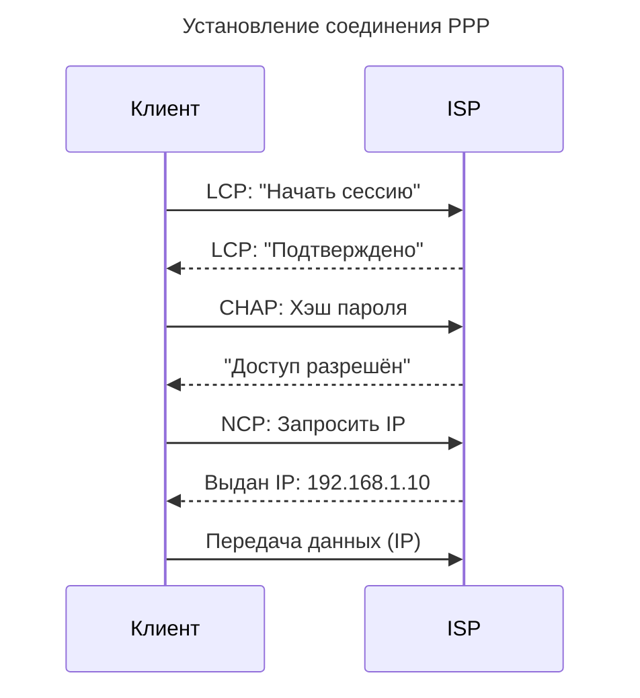

---
aliases:
  - L2
  - LCP
  - Link Control Protocol
  - NCP
  - Network Control Protocol
  - Point-to-Point Protocol
  - PPP
  - PPPoE
  - PPTP
  - канальный уровень
  - протокол точка-точка
  - Протокол точка-точка
---
## PPP (Point-to-Point Protocol)

> **PPP** — это **канальный уровень (Data Link Layer, L2)** протокол, используемый для **подключения двух узлов напрямую**, чаще всего:

- Модем → провайдер
- Серийный порт → роутер
- VPN-соединения (PPTP)

**Уровень:** OSI Layer 2 (Data Link)

**Назначение:** установление соединения между двумя точками

**Примеры использования**

| Сценарий | Описание |
| -------- | -------- |
| **DSL / Dial-up** | PPPoE (PPP over Ethernet) — как вы подключались к интернету в 2000-х |
| **Серийные линии (Serial Links)** | Между роутерами в legacy-сетях |
| **VPN (PPTP)** | Устаревший, но иногда встречается |

**Функции PPP**

| Возможность | Объяснение |
| ----------- | ---------- |
| **LCP (Link Control Protocol)** | Устанавливает, проверяет и настраивает канал |
| **NCP (Network Control Protocol)** | Конфигурирует сетевой протокол (например, IPCP для IP) |
| **Аутентификация** | Поддержка PAP, CHAP, EAP |
| **Мультиплексирование** | Передача нескольких протоколов (IP, IPX) по одному каналу |
| **Обнаружение ошибок** | [[crc-errors|CRC]], контроль потока |

**Как работает PPP**

**Современный статус**

| Плюс | Минус |
| ---- | ----- |
| ✅ Работает поверх любого соединения | ❌ Устарел для широкого доступа |
| ✅ Поддержка аутентификации | ❌ PPPoA, PPPoE заменены на DHCP + 802.1X |
| ✅ Используется в IoT, промышленных системах | ❌ Не масштабируется |

**Сегодня используется в:**

- Встроенных системах
- LTE-модемах (AT commands)
- Serial WAN links

---

## Сравнение PPP и [[vlan|vlan]]

| Критерий | **PPP** | **VLAN** |
| -------- | ------- | -------- |
| **Уровень OSI** | Data Link (L2) | Data Link (L2) |
| **Тип соединения** | Point-to-point | Логическая сеть |
| **Масштабируемость** | Низкая | Высокая |
| **Использование** | Соединение клиента с провайдером | Сегментация внутренней сети |
| **Тегирование** | Нет | Да ([[vlan|802.1Q]]) |
| **Шифрование** | Нет (но можно добавить PPTP/IPsec) | Нет (используйте IPSec) |
| **Аутентификация** | ✅ (PAP, CHAP) | ❌ Нет (но есть 802.1X) |
| **Где используется** | DSL, serial, модемы | Корпоративные сети, дата-центры |

---

## Когда что использовать

| Сценарий | Используйте |
| -------- | ----------- |
| Подключение к интернету через DSL | **PPPoE** |
| Подключение офисов через serial link | **PPP** |
| Сегментация сети по отделам | **VLAN** |
| Гостевой Wi-Fi | **VLAN 30 (Guest)** |
| Видеонаблюдение отдельно | **VLAN 50** |
| Вы хотите контролировать broadcast | **VLAN** |

---

## Финальный вывод

| PPP | VLAN |
| --- | ---- |
| ✅ **Создаёт надёжное соединение между двумя точками** | ✅ **Разделяет одну сеть на несколько логических** |
| ✅ **Поддерживает аутентификацию** | ✅ **Поддерживает изоляцию и безопасность** |
| ✅ **Использовался в эпоху dial-up** | ✅ **Жив и актуален сегодня** |
| ❌ Устаревает | ✅ Эволюционирует (Private VLAN, Voice VLAN) |

> *"PPP connects two points. VLAN divides one network into many."*

**PPP и VLAN — основа старой и новой сетевой инфраструктуры.**
