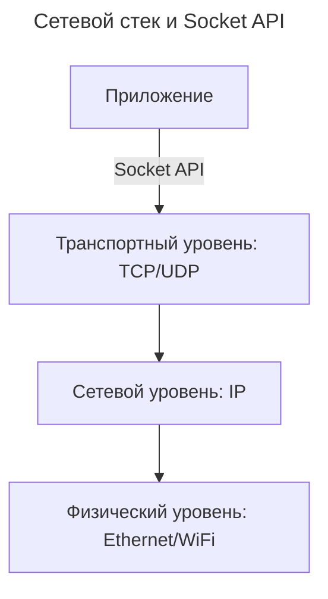

---
aliases:
  - Fetch
  - Socket
  - TCP socket
  - UDP socket
  - WebSocket
  - Сокет
  - Сокеты
---

Что такое socket (сокет) — просто, глубоко и с примерами.

## Что такое Socket

**Socket (сокет)** — это **программный интерфейс (API)**, который позволяет приложению отправлять и получать данные через сеть — будь то интернет, локальная сеть или даже один компьютер.

Можно представить его как «телефонный разъём» в доме:

- в розетку (сокет) «вставляется» телефон (приложение);
- с его помощью можно «звонить» другому телефону (другому приложению) на другом конце сети.

## Техническое определение

**Socket** — это **конечная точка соединения** в сетевой коммуникации.

Он связывает:

- **IP-адрес** (где находится компьютер),
- **порт** (какая «дверь» открыта на этом компьютере),
- и **протокол** (TCP или UDP).

То есть, сокет = **IP + Порт + Протокол**.

Пример: `192.168.1.10:8080/TCP` — это сокет, на котором работает веб-сервер.

## Как работает

Сокеты работают на уровне **транспортного протокола** (ниже HTTP, выше физического кабеля).

Их используют для реализации таких протоколов, как:

- **TCP** — надёжный, ориентированный на соединение (например, веб-серверы, почта).
- **UDP** — быстрый, но ненадёжный (например, видео-звонки, онлайн-игры).

### Пример: TCP Socket — клиент и сервер

**Сервер (Python):**

```python
import socket

server = socket.socket(socket.AF_INET, socket.SOCK_STREAM)
server.bind(('localhost', 8080))  # Привязываемся к IP и порту
server.listen()                   # Ждём подключения

print("Сервер запущен...")

client, addr = server.accept()    # Клиент подключился
print(f"Подключился {addr}")

data = client.recv(1024)          # Получаем данные (до 1024 байт)
print("Получено:", data.decode())

client.send(b"Привет от сервера!")  # Отправляем ответ
client.close()
```

**Клиент (Python):**

```python
import socket

client = socket.socket(socket.AF_INET, socket.SOCK_STREAM)
client.connect(('localhost', 8080))  # Подключаемся к серверу

client.send(b"Привет, сервер!")      # Отправляем сообщение

response = client.recv(1024)
print("Ответ:", response.decode())

client.close()
```

**Результат:** клиент отправляет `"Привет, сервер!"` → сервер получает и отвечает `"Привет от сервера!"`.

## Для чего нужны сокеты

| Задача | Почему нужен socket? |
|--------|----------------------|
| Веб-сервер (Nginx, Apache) | Использует TCP-сокеты, чтобы принимать HTTP-запросы на порту 80/443 |
| Чат-сервер | Держит постоянные TCP-сокеты с каждым клиентом |
| FTP / SMTP / SSH | Все эти протоколы работают поверх сокетов |
| Онлайн-игры | Используют UDP-сокеты для быстрой передачи позиций игроков |
| IoT-устройства | Отправляют данные с датчиков по сокетам на облако |

> **Все сетевые приложения — напрямую или косвенно — используют сокеты.**

## Сокет vs WebSocket vs Fetch

| Технология | Уровень | Назначение | Пример |
|-----------|---------|------------|--------|
| **Socket** | Низкоуровневый (транспортный) | Общаться по TCP/UDP напрямую | Сервер на Python, игра на C++ |
| **WebSocket** | Высокоуровневый (прикладной) | Реальное время в браузере (поверх TCP) | Чат в вебе |
| **Fetch** | Высокоуровневый (HTTP) | Запрос-ответ по HTTP | `fetch('/api/users')` |

> ✅ **WebSocket и Fetch используют сокеты под капотом**, но скрывают сложность.
> Сокет — это **основа всех сетевых коммуникаций**.

## Абстракция: как устроена сеть



Сокет — это **интерфейс между кодом приложения и сетевым стеком ОС**.

## Ключевые особенности сокетов

| Особенность | Описание |
|-------------|----------|
| **Независимость от языка** | Есть в C, Python, Java, Go, Rust — все имеют свои socket API |
| **Бинарные данные** | Можно отправлять любые данные: текст, изображения, видео, бинарные команды |
| **Работает вне браузера** | Сокеты — это системный инструмент, а не только веб-технология |
| **Можно делать всё** | От простого чата до сложных прокси, VPN, торрент-клиентов |

## Простая аналогия

> Отправка письма другу:
>
> - **Fetch** — это как отправить **одно письмо** по почте и ждать ответа.
> - **WebSocket** — это как установить **постоянный телефонный разговор** с другом.
> - **Socket** — это **все телефоны, провода, розетки и операторы**, которые делают возможными и письма, и звонки.

## Когда использовать сокеты

| Ситуация | Почему socket? |
|----------|----------------|
| Сервер на C/Go для IoT-устройств | Нужна максимальная производительность и контроль |
| Игровой сервер с частыми обновлениями позиций | UDP-сокеты дают минимальную задержку |
| Прокси-сервер или VPN | Требуется работа на уровне TCP/UDP |
| Обмен бинарными данными без HTTP-накладных расходов | Сокеты — легче и быстрее |

## Вывод

> **Socket — это фундаментальная технология, которая позволяет программам общаться по сети.**
> Это **не протокол**, а **инструмент** для создания сетевых соединений.
> Все современные протоколы (HTTP, WebSocket, FTP, SSH) строятся **на основе сокетов**.

**Ключевая мысль:**

> Если приложение «подключается к серверу», оно использует **socket**.
> Даже при `fetch()` в браузере за кулисами браузер создаёт TCP-сокет!
