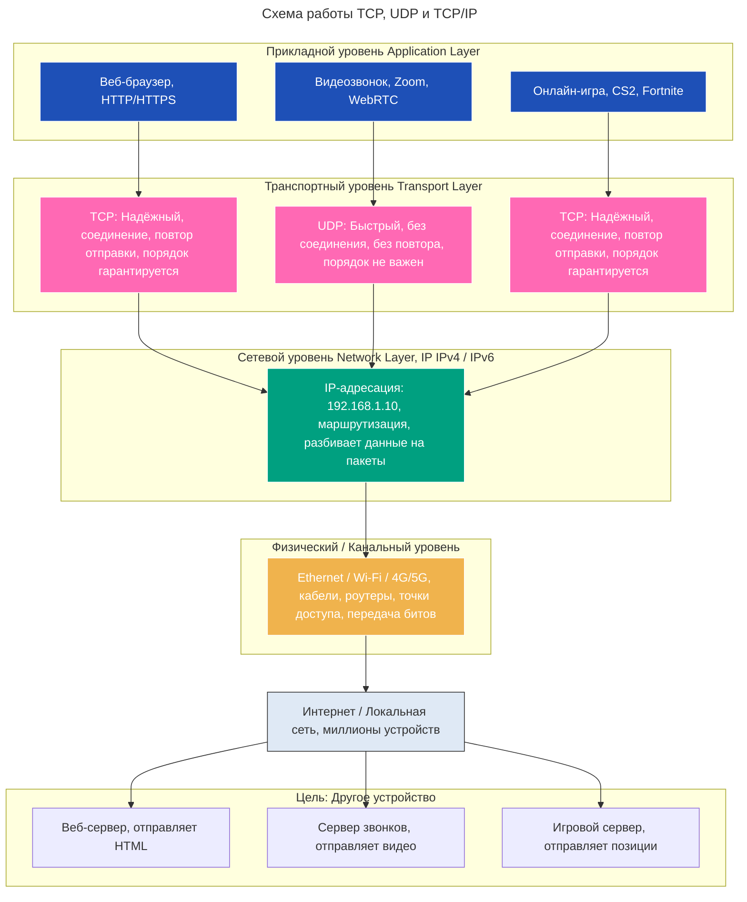

---
aliases:
  - 3-way handshake
  - Application layer
  - Internet layer
  - IP
  - IP address
  - IP-адрес
  - IPv4
  - IPv6
  - TCP
  - TCP/IP
  - Transmission Control Protocol
  - Transport layer
  - UDP
  - User Datagram Protocol
  - Прикладной уровень
  - Протокол управления передачей
  - Сетевой уровень
  - Транспортный уровень
  - Трёхэтапное рукопожатие
---

## TCP/IP

**Суть**

TCP/IP — это набор протоколов, лежащий в основе всего интернета. Это не один протокол, а модель из нескольких уровней, которая описывает, как данные передаются по сети.

Она состоит из 4 основных уровней:

| Уровень | Протоколы |
| --- | --- |
| Приложения | HTTP, FTP, SMTP, DNS, SSH |
| Транспорт | TCP, UDP |
| Интернет (сетевой) | IP (IPv4, IPv6) |
| Ссылки (доступ к сети) | Ethernet, Wi-Fi, PPP |

> TCP/IP = IP + TCP + UDP + другие протоколы + правила их взаимодействия.

TCP и UDP — это части TCP/IP. IP — тоже часть TCP/IP.

> TCP/IP — это «язык», на котором говорит весь интернет. TCP и UDP — это два «диалекта» этого языка для передачи данных.

---

## TCP

**Суть**

Протокол транспортного уровня в модели TCP/IP. Обеспечивает надёжную, ориентированную на соединение передачу данных.

**Особенности**

| Характеристика | TCP |
| --- | --- |
| Надёжность | ✅ Гарантирует доставку |
| Соединение | ✅ Есть («рукопожатие» 3-way handshake) |
| Порядок | ✅ Пакеты приходят в правильном порядке |
| Повторная отправка | ✅ Если пакет потерялся — отправит заново |
| Скорость | ❌ Медленнее (из-за проверок) |
| Используется в | Веб (HTTP/HTTPS), почта (SMTP), файлы (FTP), SSH |

**Пример**

Аналогия — письмо по почте с уведомлением о вручении:

- пишете письмо и отправляете;
- получаете подтверждение, что оно вручено;
- если не вручили — отправляете снова.

Это TCP.

---

## UDP

**Суть**

Протокол транспортного уровня в модели TCP/IP. Ненадёжный и без соединения — зато быстрый.

**Особенности**

| Характеристика | UDP |
| --- | --- |
| Надёжность | ❌ Пакеты могут потеряться |
| Соединение | ❌ Просто отправил и забыл |
| Порядок | ❌ Пакеты могут прийти в другом порядке |
| Повторная отправка | ❌ Если потерял — пропало |
| Скорость | ✅ Очень быстрая (минимум накладных расходов) |
| Используется в | Видеозвонки (Zoom), стриминг (YouTube Live), онлайн-игры, DNS, VoIP |

**Пример**

Аналогия — крик через окно соседу: «Эй, выключи свет!». Сосед может не услышать, ответить позже или вообще не ответить — это не важно.

Это UDP.

---

## Сравнение TCP, UDP и TCP/IP

| Критерий | TCP | UDP | TCP/IP |
| --- | --- | --- | --- |
| Что это? | Протокол транспортного уровня (4 уровень [[osi]]) | Протокол транспортного уровня | Семейство протоколов (модель сети) |
| Уровень | Транспортный | Транспортный | Многоуровневая модель (включает TCP, UDP, IP и др.) |
| Надёжность | ✅ Высокая | ❌ Низкая | ✅ Обеспечивает надёжность через TCP или быстроту через UDP |
| Соединение | ✅ Есть (3-way handshake) | ❌ Нет | Поддерживает оба варианта |
| Скорость | ❌ Медленнее | ✅ Быстрее | Зависит от выбранного протокола (TCP/UDP) |
| Порядок данных | ✅ Гарантируется | ❌ Не гарантируется | Зависит от выбора TCP/UDP |
| Используется в | Веб, почта, файлы | Видео, игры, DNS | Всё в интернете — без TCP/IP нет интернета |
| Аналогия | Почта с уведомлением о вручении | Крик через окно | Язык, на котором говорят все в интернете |

---

## Простая аналогия: «Сеть как городская телефонная система»

| Компонент | Аналогия |
| --- | --- |
| TCP/IP | Вся телефонная сеть города — провода, станции, правила подключения, номера абонентов |
| IP | Номер телефона — кто кому звонит (например, 555-1234) |
| TCP | Звонок по стационарному телефону: набираете, ждёте ответа, говорите, уверены, что вас услышали |
| UDP | Крик через окно: кричите «Эй!», но не знаете, услышал ли вас сосед — и не ждёте ответа |

> TCP и UDP — это два способа позвонить. TCP/IP — это вся система, которая позволяет вообще звонить.

---

## Когда что использовать

| Задача | Лучший выбор |
| --- | --- |
| Открыть сайт (HTTP) | ✅ TCP (нужна надёжность) |
| Скачать файл | ✅ TCP (нужен целый архив) |
| Видеозвонок (Zoom, FaceTime) | ✅ UDP (лучше пропустить кадр, чем ждать) |
| Онлайн-игра (CS2, Fortnite) | ✅ UDP (задержка — поражение) |
| DNS-запрос (перевод google.com → IP) | ✅ UDP (быстро, коротко, не критично, если потеряется) |
| Передача данных в интернете вообще | ✅ TCP/IP — без него ничего не работает |

---

## Вывод простыми словами

| Термин | Что это? |
| --- | --- |
| TCP | Надёжный, но медленный способ передать данные — как письмо с уведомлением |
| UDP | Быстрый, но рискованный способ — как крик в толпе |
| TCP/IP | Целая система, которая позволяет использовать и TCP, и UDP, и IP-адреса, и маршрутизацию — то есть весь интернет |

> TCP и UDP — это два инструмента внутри системы TCP/IP. Без TCP/IP ни TCP, ни UDP не работают. Без TCP/UDP TCP/IP не мог бы передавать данные.

---

## Запоминание простыми словами

TCP/IP — это семья. TCP — старший сын (ответственный, надёжный). UDP — младший брат (быстрый, дерзкий, иногда забывает, что делал). Они оба живут в одном доме — TCP/IP.

---

## Схема: как TCP, UDP и TCP/IP работают вместе

---

## Как данные движутся (на примере загрузки сайта)

Заход на `https://google.com` использует TCP.

1. Приложение: браузер запрашивает `https://google.com`.
2. Транспортный уровень: использует TCP, устанавливает соединение с сервером (3-way handshake), разбивает HTML на пакеты, нумерует их, ждёт подтверждений.
3. Сетевой уровень: каждый пакет обёртывается в IP-заголовок с адресами — «От: 192.168.1.10, Кому: 142.250.189.206».
4. Физический уровень: пакеты идут через Wi-Fi, роутер, интернет-провайдера, сервер Google.
5. На сервере: обратный путь — сервер отвечает по тому же пути, используя TCP; браузер собирает все пакеты в правильном порядке и показывает сайт.

> Это TCP поверх IP = TCP/IP.

---

## Данные при видеозвонке (UDP)

1. Приложение: Zoom начинает запись микрофона и камеры.
2. Транспортный уровень: использует UDP, отправляет поток аудио/видео без ожидания подтверждения; если кадр потерялся — он пропускается, повторная отправка не ждётся.
3. Сетевой уровень: все пакеты обёрнуты в IP.
4. Физический уровень: передаются через Wi-Fi, роутер, интернет.
5. На другом конце: видеоплеер получает поток, игнорирует потерянные кадры, но не ждёт; задержка минимальна — разговор идёт живо.

> Это UDP поверх IP = тоже TCP/IP. UDP — часть TCP/IP, даже если не использует TCP.

> TCP/IP — система доставки писем. TCP — почта с уведомлением о вручении. UDP — курьер-экспресс, который бросает посылку и убегает.
