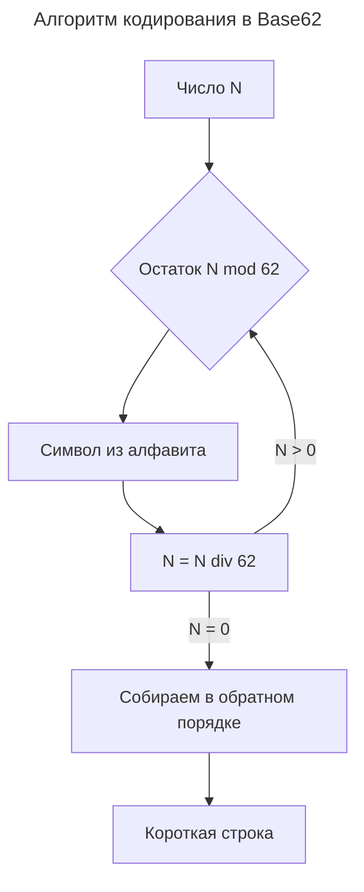

---
aliases:
  - base62
  - Base62
  - Base64Url
  - URL-safe Base64
  - Кодирование Base62
  - Короткая ссылка
  - Короткий URL
---

## Base62

**Base62** — это система счисления (кодирование) с алфавитом из **62 символов**: цифры `0-9`, строчные `a-z`, прописные `A-Z`. Число записывается компактнее, чем в десятичной системе, поэтому Base62 часто используется для коротких ссылок и компактных идентификаторов.

## Что такое Base62

Базовый алфавит:

```text
0-9        → 10 символов
a-z        → 26 символов
A-Z        → 26 символов
итого: 62 символа
```

- Похоже на Base64, но **без символов `+`, `/` и `=`** — поэтому безопасно для URL.
- Чем больше основание системы, тем короче представление числа.

## Зачем нужно

| Применение | Пример |
|------------|--------|
| **Короткие ссылки** | Замена `id=987654321` на `/x7Kp2` |
| **Короткие идентификаторы** | Ключи коллекций, трекеры, реферальные коды |
| **Компактные ключи кэша** | Меньше место/байты в URL-адресах |
| **Соль для хэшей** | Компактная форма для хранения |

## Как кодируется число

Пример для числа `987654321`:

1. Число делится на 62, остаток соответствует символу из алфавита.
2. Деление продолжается, пока число не станет нулём.
3. Остатки собираются в обратном порядке.

В итоге `987654321` в Base62 записывается короче, чем десятичное представление.

## Пример кода

**Python**

```python
ALPHABET = "0123456789abcdefghijklmnopqrstuvwxyzABCDEFGHIJKLMNOPQRSTUVWXYZ"

def to_base62(n: int) -> str:
    if n == 0:
        return ALPHABET[0]
    result = []
    while n:
        n, r = divmod(n, 62)
        result.append(ALPHABET[r])
    return "".join(reversed(result))

print(to_base62(987654321))
```

**JavaScript**

```javascript
const ALPHABET = "0123456789abcdefghijklmnopqrstuvwxyzABCDEFGHIJKLMNOPQRSTUVWXYZ";

function toBase62(n) {
    if (n === 0) return ALPHABET[0];
    let result = "";
    while (n > 0) {
        result = ALPHABET[n % 62] + result;
        n = Math.floor(n / 62);
    }
    return result;
}
```

## Алгоритм



1. Взять остаток от деления на 62.
2. Сопоставить остаток символу алфавита.
3. Разделить число на 62 нацело.
4. Повторять, пока число больше нуля.
5. Записать символы в обратном порядке.

## Обратное кодирование

- Разбор строки в число: для каждого символа — его индекс в алфавите, затем умножение и сложение.
- Позволяет вернуть исходный `id` из короткой строки.

```python
def from_base62(s: str) -> int:
    n = 0
    for ch in s:
        n = n * 62 + ALPHABET.index(ch)
    return n
```

## Сравнение кодирований

| Кодирование | Алфавит | В URL безопасно | Длина для числа 1000 |
|-------------|---------|-----------------|----------------------|
| **Hex** | 16 символов | Да | 4 |
| **Base32** | 32 символа | Да | 2–3 |
| **Base62** | 62 символа | Да | 2 |
| **Base64** | 64 символа (с `+/=_`) | Нет (требует URL-safe) | 2 |

## Особенности

- ✅ Компактная запись чисел и идентификаторов.
- ✅ Без специальных символов — безопасно для URL.
- ✅ Детерминированный обратный декодинг.
- ❌ Не шифрует данные — это кодирование, а не защита.
- ❌ Символы чувствительны к регистру (путаница `O`/`0`, `l`/`I`).
- ❌ Случайный порядок алфавита (перемешанный) нужен только для защиты от угадывания.

## Когда использовать Base62

| Ситуация | Рекомендация |
|----------|--------------|
| Короткие ссылки для публичных URL | Подходит — компактно и безопасно |
| Идентификаторы в API (id → slug) | Подходит |
| Пароли или ключи доступа | Не использовать — нужно шифрование и случайность |
| Компактный hash-ключ для хранилищ | Подходит |
| Максимальная безопасность | Нет — использовать hash + соль |

## Итог

**Base62** — простая и компактная схема кодирования для коротких ссылок и идентификаторов. Она не даёт безопасности сама по себе, но позволяет получить короткие, URL-safe строки, которые можно однозначно перевести обратно в число.
