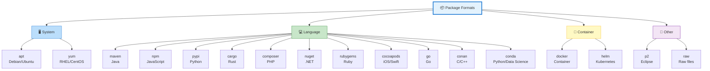
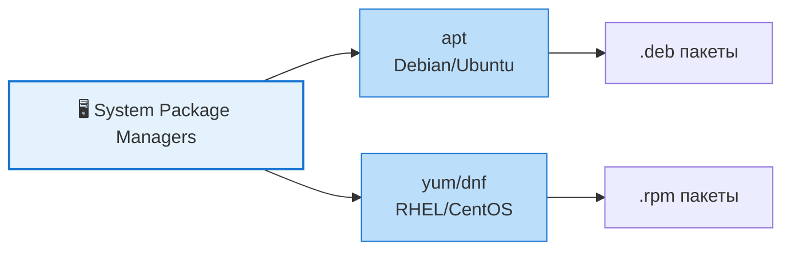
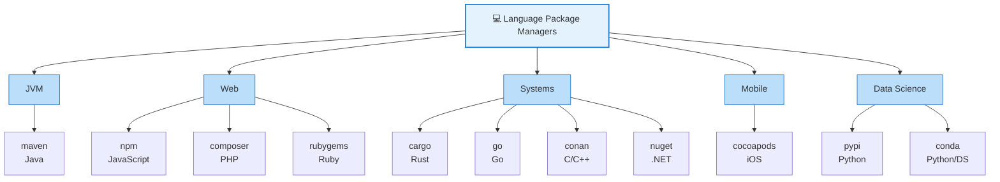
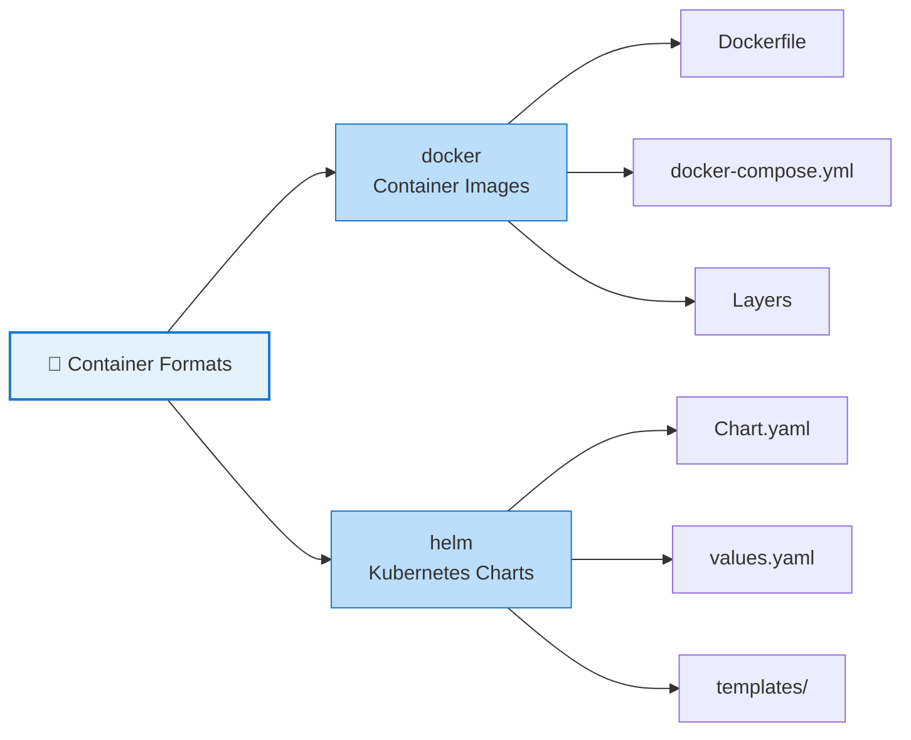
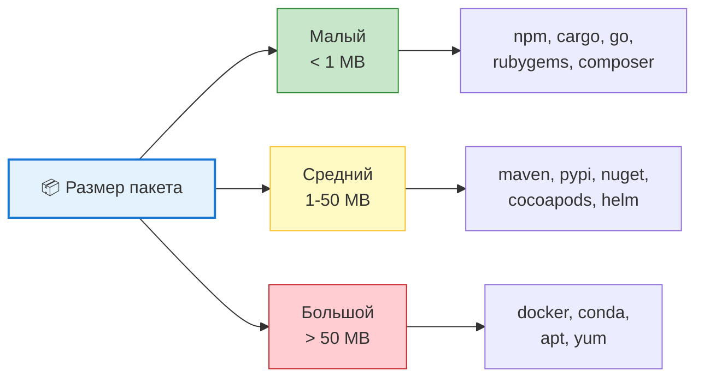
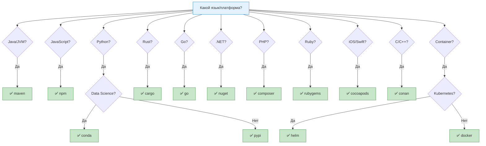
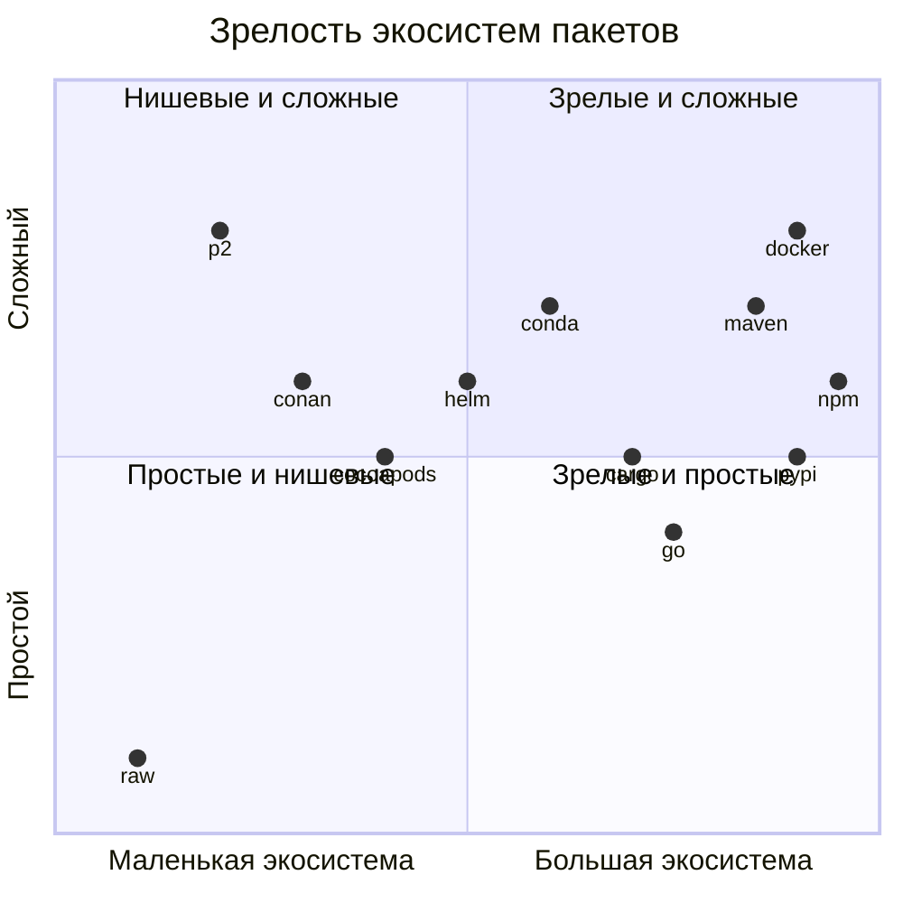

---
aliases:
  - apt
  - artifact formats
  - artifact repositories
  - Artifact types
  - build ecosystems
  - cargo
  - cocoapods
  - composer
  - conan
  - conda
  - Dependency ecosystems
  - docker
  - go
  - helm
  - maven
  - npm
  - nuget
  - p2
  - package format
  - Package managers
  - Package repositories
  - package-format
  - pypi
  - raw
  - Registry types
  - rubygems
  - yum
---
## Artifact formats

### 📦 Сравнение форматов пакетов

#### 🗺️ Общая карта экосистем



---

### 📊 Полная сравнительная таблица

| Формат | Язык/Платформа | Менеджер | Реестр | Файл манифеста | Версионирование |
|--------|----------------|----------|--------|----------------|-----------------|
| **apt** | Linux (Debian/Ubuntu) | `apt` | Debian/Ubuntu repos | `control` | SemVer-like |
| **yum** | Linux (RHEL/CentOS) | `yum`/`dnf` | CentOS/Fedora repos | `.spec` | RPM version |
| **maven** | Java/JVM | `mvn` | Maven Central | `pom.xml` | SemVer |
| **npm** | JavaScript/Node.js | `npm`/`yarn` | npmjs.com | `package.json` | SemVer |
| **pypi** | Python | `pip` | pypi.org | `setup.py`/`pyproject.toml` | SemVer |
| **cargo** | Rust | `cargo` | crates.io | `Cargo.toml` | SemVer |
| **composer** | PHP | `composer` | packagist.org | `composer.json` | SemVer |
| **nuget** | .NET/C# | `nuget`/`dotnet` | nuget.org | `.csproj`/`packages.config` | SemVer |
| **rubygems** | Ruby | `gem` | rubygems.org | `Gemfile`/`.gemspec` | SemVer |
| **cocoapods** | iOS/Swift | `pod` | cocoapods.org | `Podfile` | SemVer |
| **go** | Go | `go mod` | proxy.golang.org | `go.mod` | SemVer |
| **conan** | C/C++ | `conan` | conan.io/center | `conanfile.txt/py` | SemVer |
| **conda** | Python/Data Science | `conda` | anaconda.org/conda-forge | `environment.yml` | Custom |
| **docker** | Container | `docker` | Docker Hub/Registry | `Dockerfile` | Tags |
| **helm** | Kubernetes | `helm` | Artifact Hub | `Chart.yaml` | SemVer |
| **p2** | Eclipse/OSGi | `p2` | Eclipse Update Sites | `feature.xml`/`MANIFEST.MF` | OSGi version |
| **raw** | Any | N/A | File system/URL | N/A | N/A |

---

### 🏗️ Категории по назначению

#### 1️⃣ Системные пакетные менеджеры



| Характеристика | **apt** | **yum** |
|----------------|---------|---------|
| **Платформа** | Debian, Ubuntu, Mint | RHEL, CentOS, Fedora |
| **Формат пакета** | `.deb` | `.rpm` |
| **Установка** | `apt install <pkg>` | `yum install <pkg>` |
| **Обновление** | `apt update && apt upgrade` | `yum update` |
| **Поиск** | `apt search <pkg>` | `yum search <pkg>` |
| **Удаление** | `apt remove <pkg>` | `yum remove <pkg>` |
| **Зависимости** | Автоматическое разрешение | Автоматическое разрешение |
| **Репозитории** | `/etc/apt/sources.list` | `/etc/yum.repos.d/` |
| **Кэш** | `/var/cache/apt/` | `/var/cache/yum/` |

---

#### 2️⃣ Языковые пакетные менеджеры



##### Сравнение языковых менеджеров

| Критерий | **maven** | **npm** | **pypi** | **cargo** | **go** | **nuget** |
|----------|-----------|---------|----------|-----------|--------|-----------|
| **Язык** | Java/JVM | JavaScript | Python | Rust | Go | .NET/C# |
| **Манифест** | `pom.xml` | `package.json` | `pyproject.toml` | `Cargo.toml` | `go.mod` | `.csproj` |
| **Lock файл** | ❌ Нет | `package-lock.json` | `requirements.txt` | `Cargo.lock` | `go.sum` | `packages.lock.json` |
| **Реестр** | Maven Central | npmjs.com | pypi.org | crates.io | proxy.golang.org | nuget.org |
| **Версионирование** | SemVer | SemVer | SemVer | SemVer | SemVer | SemVer |
| **Транзитивные зависимости** | ✅ Да | ✅ Да | ✅ Да | ✅ Да | ✅ Да | ✅ Да |
| **Scope/Optional** | ✅ Да | ✅ Да | ⚠️ Частично | ✅ Да | ✅ Да | ✅ Да |
| **Private registry** | ✅ Да | ✅ Да | ✅ Да | ✅ Да | ✅ Да | ✅ Да |
| **Размер пакета** | Средний | Малый | Малый | Малый | Малый | Средний |
| **Скорость установки** | 🟡 Средняя | 🟢 Быстрая | 🟢 Быстрая | 🟢 Быстрая | 🟢 Быстрая | 🟡 Средняя |

---

#### 3️⃣ Контейнерные форматы



| Характеристика | **docker** | **helm** |
|----------------|------------|----------|
| **Назначение** | Контейнеризация приложений | Оркестрация Kubernetes |
| **Формат** | OCI Image (слои) | Chart (архив YAML) |
| **Манифест** | `Dockerfile` | `Chart.yaml` + `values.yaml` |
| **Реестр** | Docker Hub, ECR, GCR, ACR | Artifact Hub, ChartMuseum |
| **Версионирование** | Tags (`latest`, `v1.0.0`) | SemVer |
| **Установка** | `docker pull/run` | `helm install` |
| **Обновление** | `docker pull` | `helm upgrade` |
| **Зависимости** | Базовые образы (`FROM`) | Chart dependencies |
| **Размер** | Большой (100MB-2GB) | Малый (KB-MB) |
| **Иммутабельность** | ✅ Да (по digest) | ✅ Да (по версии) |

---

#### 4️⃣ Специальные форматы

| Формат | Назначение | Особенности |
|--------|------------|-------------|
| **p2** | Eclipse/OSGi плагины | Метаданные в `feature.xml`, `MANIFEST.MF`, Update Sites |
| **raw** | Произвольные файлы | Без метаданных, без версионирования, просто файлы |
| **conda** | Python/Data Science | Бинарные пакеты, управление окружениями, кросс-платформенность |

---

### 📋 Детальное сравнение по критериям

#### 1. **Версионирование**

| Формат | Схема | Пример | Примечание |
|--------|-------|--------|------------|
| **SemVer** | `MAJOR.MINOR.PATCH` | `2.1.3` | maven, npm, cargo, pypi, go, nuget, composer, rubygems, cocoapods, helm |
| **RPM** | `VERSION-RELEASE` | `1.2.3-1.el7` | yum |
| **Debian** | `EPOCH:VERSION-REVISION` | `1:2.1.3-1` | apt |
| **OSGi** | `MAJOR.MINOR.MICRO.QUALIFIER` | `2.1.3.SNAPSHOT` | p2 |
| **Tags** | Произвольные | `latest`, `v1.0`, `sha256:...` | docker |
| **Custom** | Зависит от пакета | `2023.1`, `4.6.0` | conda |
| **N/A** | Нет | — | raw |

---

#### 2. **Управление зависимостями**

| Формат | Разрешение | Конфликты | Lock файл |
|--------|------------|-----------|-----------|
| **maven** | ✅ Автоматическое | ❌ Last-wins | ❌ Нет |
| **npm** | ✅ Автоматическое | ✅ `npm ls` | ✅ `package-lock.json` |
| **pypi** | ✅ Автоматическое | ⚠️ Ручное | ⚠️ `pip freeze > requirements.txt` |
| **cargo** | ✅ Автоматическое | ✅ `cargo tree` | ✅ `Cargo.lock` |
| **go** | ✅ Автоматическое | ✅ `go mod graph` | ✅ `go.sum` |
| **conda** | ✅ SAT solver | ✅ Автоматическое | ✅ `environment.yml` |
| **docker** | ⚠️ Через `FROM` | ⚠️ Ручное | ❌ Нет |
| **helm** | ✅ Через `requirements.yaml` | ⚠️ Ручное | ⚠️ `Chart.lock` |
| **apt/yum** | ✅ Автоматическое | ✅ Автоматическое | ❌ Нет |

---

#### 3. **Размер и производительность**



---

#### 4. **Безопасность**

| Формат | Подписи | Сканирование | Аудит |
|--------|---------|--------------|-------|
| **maven** | ⚠️ PGP (опционально) | ✅ OWASP Dependency Check | ✅ `mvn dependency:tree` |
| **npm** | ⚠️ npm audit | ✅ `npm audit` | ✅ `npm ls` |
| **pypi** | ⚠️ PGP (опционально) | ✅ `pip-audit` | ✅ `pip list` |
| **cargo** | ⚠️ crates.io проверке | ✅ `cargo audit` | ✅ `cargo tree` |
| **docker** | ✅ Docker Content Trust | ✅ Trivy, Snyk | ✅ `docker scan` |
| **helm** | ⚠️ Helm signatures | ✅ Trivy | ✅ `helm lint` |
| **apt/yum** | ✅ GPG signatures | ⚠️ Ограничено | ✅ `apt list --installed` |

---

#### 5. **Кросс-платформенность**

| Формат | Linux | macOS | Windows | Примечание |
|--------|-------|-------|---------|------------|
| **maven** | ✅ | ✅ | ✅ | JVM-based |
| **npm** | ✅ | ✅ | ✅ | Node.js |
| **pypi** | ✅ | ✅ | ✅ | Python |
| **cargo** | ✅ | ✅ | ✅ | Rust |
| **go** | ✅ | ✅ | ✅ | Go |
| **nuget** | ✅ | ✅ | ✅ | .NET Core |
| **composer** | ✅ | ✅ | ✅ | PHP |
| **rubygems** | ✅ | ✅ | ✅ | Ruby |
| **cocoapods** | ❌ | ✅ | ❌ | Только macOS |
| **conda** | ✅ | ✅ | ✅ | Кросс-платформенный |
| **docker** | ✅ | ✅ | ✅ | Через Docker Desktop |
| **helm** | ✅ | ✅ | ✅ | Go-based |
| **apt** | ✅ | ❌ | ❌ | Только Debian-based |
| **yum** | ✅ | ❌ | ❌ | Только RHEL-based |
| **p2** | ✅ | ✅ | ✅ | Eclipse |
| **raw** | ✅ | ✅ | ✅ | Просто файлы |

---

### 🎯 Рекомендации по выбору

#### По языку/платформе



---

#### По сценарию использования

| Сценарий | Рекомендация | Почему |
|----------|--------------|--------|
| **Java-приложение** | ✅ maven | Стандарт JVM, Maven Central |
| **Фронтенд (React/Vue)** | ✅ npm | Экосистема JavaScript |
| **Python-скрипт** | ✅ pypi | Простота, pip |
| **Python Data Science** | ✅ conda | Бинарные зависимости, окружения |
| **Системная библиотека** | ✅ cargo/go/conan | Компиляция в бинарник |
| **Микросервис** | ✅ docker | Изоляция, переносимость |
| **Kubernetes приложение** | ✅ helm | Шаблоны, версии, репозитории |
| **iOS приложение** | ✅ cocoapods | Стандарт iOS-разработки |
| **Linux сервер** | ✅ apt/yum | Системные пакеты |
| **Eclipse плагин** | ✅ p2 | OSGi, Update Sites |
| **Простой файл** | ✅ raw | Без метаданных |

---

### 📊 Матрица зрелости экосистем



---

### 📌 Памятка

```
┌─────────────────────────────────────────────────────────────┐
│  Форматы пакетов — краткая шпаргалка                        │
│                                                             │
│  🖥️ Системные: apt, yum                                     │
│  💻 Языковые: maven, npm, pypi, cargo, go, nuget,          │
│              composer, rubygems, cocoapods, conan, conda    │
│  🐳 Контейнеры: docker, helm                                │
│  🔧 Специальные: p2, raw                                    │
│                                                             │
│  ✅ SemVer — стандарт версионирования (большинство)         │
│  ✅ Lock-файлы — фиксируют версии (npm, cargo, go)          │
│  ✅ Реестры — централизованные хранилища пакетов            │
│  ✅ Подписи — гарантия целостности (docker, apt, yum)       │
│                                                             │
│  🎯 Выбор зависит от языка/платформы                        │
└─────────────────────────────────────────────────────────────┘
```

---

### 🚀 Итог

| Вопрос | Ответ |
|--------|-------|
| **Сколько форматов рассмотрено?** | 17 |
| **Какой самый популярный?** | npm (JavaScript), maven (Java), pypi (Python) |
| **Какой для контейнеров?** | docker |
| **Какой для Kubernetes?** | helm |
| **Какой для Data Science?** | conda |
| **Какой самый простой?** | raw (просто файлы) |
| **Какой самый сложный?** | p2 (Eclipse/OSGi) |
| **Какой стандарт версионирования?** | SemVer (большинство) |

> 💡 **Совет:** Не сравнивайте форматы напрямую — они решают разные задачи. **apt/yum** для ОС, **maven/npm/pypi** для языков, **docker** для контейнеров, **helm** для Kubernetes. Выбор определяется **языком и платформой**, а не личными предпочтениями.


## vs
### 📊 Сводная таблица форматов пакетов

| Формат | Формат архива/сжатия | Имя манифеста | Где искать | Макс. кол-во манифестов |
| :--- | :--- | :--- | :--- | :--- |
| **GO** | `.zip` (стандартный ZIP) | `go.mod` (+ `go.sum`) | В корне архива | **1** |
| **NUGET** | `.zip` (переименованный в `.nupkg`) | `<package-id>.nuspec` | В корне архива | **1** |
| **CARGO** | `.tar.gz` (Gzip + TAR, расширение `.crate`) | `Cargo.toml` | В папке `<name>-<version>/` | **1** |
| **DOCKER** | Слои: `.tar.gz`. Образ: `.tar` | `manifest.json` / `index.json` | В корне `.tar` | **1** (+ N платформенных в multi-arch) |
| **MAVEN** | `.jar` / `.war` / `.pom` (ZIP) | `META-INF/MANIFEST.MF` + `pom.xml` | В корне архива | **1** MANIFEST.MF, **1+** pom.xml |
| **NPM** | `.tgz` (Gzip + TAR) | `package/package.json` | В папке `package/` | **1** |
| **PYPI** | `.whl` (ZIP) или `.tar.gz` | `*.dist-info/METADATA` или `PKG-INFO` | В `.dist-info/` или корне | **1** |
| **RAW** | Без сжатия (произвольный формат) | Отсутствует | N/A | **0** (нет стандарта) |

---

### 🔍 Детальный разбор по каждому формату

#### 1. GO (Go Modules)
* **Формат сжатия:** Стандартный **ZIP**.
* **Манифест:** `go.mod` (обязательно) + `go.sum` (опционально, контрольные суммы).
* **Расположение:** Строго в **корне** ZIP-архива.
* **Максимум:** **1** `go.mod` на пакет. Go-прокси упаковывает только файлы конкретной модульной директории.

---

#### 2. NUGET (.NET)
* **Формат сжатия:** **ZIP** (файл `.nupkg` — это обычный ZIP, можно переименовать и открыть).
* **Манифест:** `<package-id>.nuspec` (XML-файл с метаданными).
* **Расположение:** В **корне** архива.
* **Максимум:** **Ровно 1** `.nuspec`. Спецификация NuGet это строго требует.

---

#### 3. CARGO (Rust)
* **Формат сжатия:** **TAR + GZIP** (`.tar.gz`), расширение `.crate`.
* **Манифест:** `Cargo.toml`.
* **Расположение:** Внутри папки `<name>-<version>/` (например, `serde-1.0.193/Cargo.toml`).
* **Максимум:** **1** `Cargo.toml` на `.crate` архив.

---

#### 4. DOCKER (Container Images)
* **Формат сжатия:**
    * В реестре: JSON-манифест + слои `.tar.gz`.
    * При `docker save`: один `.tar` архив (слои внутри — `.tar.gz`).
* **Манифест:**
    * `manifest.json` (для одноархитектурного образа).
    * `index.json` (для multi-arch, OCI Image Index).
* **Расположение:** В **корне** `.tar` архива.
* **Максимум:** **1** главный манифест/индекс + **N** платформенных манифестов (для `linux/amd64`, `linux/arm64` и т.д.).

---

#### 5. MAVEN (Java/JVM)
* **Формат сжатия:** **ZIP** (файлы `.jar`, `.war`, `.ear` — это ZIP-архивы с другим расширением).
* **Манифесты:**
    * **`META-INF/MANIFEST.MF`** — стандартный Java-манифест (метаданные JAR: Main-Class, Class-Path, версии).
    * **`pom.xml`** — Maven-манифест (зависимости, плагины, сборка). Обычно в корне, но может быть в `META-INF/maven/<groupId>/<artifactId>/pom.xml`.
* **Расположение:**
    * `MANIFEST.MF` — в `META-INF/`.
    * `pom.xml` — в корне или в `META-INF/maven/`.
* **Максимум:**
    * **Ровно 1** `META-INF/MANIFEST.MF` (иначе JAR невалиден).
    * **1+** `pom.xml` (в multi-module проектах может быть родительский + дочерние pom.xml, упакованные вместе).

---

#### 6. NPM (JavaScript/Node.js)
* **Формат сжатия:** **TAR + GZIP** (`.tgz`).
* **Манифест:** `package.json`.
* **Расположение:** В папке **`package/`** внутри архива (например, `package/package.json`). Имя папки всегда `package`, независимо от имени пакета.
* **Максимум:** **Ровно 1** `package.json`. Это корневой манифест пакета.

---

#### 7. PYPI (Python)

PyPI поддерживает **два формата** дистрибутивов:

##### a) Wheel (`.whl`) — бинарный дистрибутив
* **Формат сжатия:** **ZIP** (расширение `.whl`).
* **Манифест:** `<name>-<version>.dist-info/METADATA` (текстовый файл в формате RFC 822).
* **Расположение:** В папке `<name>-<version>.dist-info/` внутри архива.
* **Дополнительно:** `WHEEL` (метаданные формата wheel), `RECORD` (контрольные суммы файлов).

##### b) Source Distribution (`.tar.gz`) — исходный дистрибутив
* **Формат сжатия:** **TAR + GZIP**.
* **Манифест:** `PKG-INFO` (тот же формат, что и `METADATA`).
* **Расположение:** В корне архива, внутри папки `<name>-<version>/`.
* **Максимум:** **Ровно 1** `METADATA` или `PKG-INFO` на пакет.

---

#### 8. RAW (Произвольные файлы)
* **Формат сжатия:** **Отсутствует**. Это просто файлы без упаковки.
* **Манифест:** **Отсутствует** по определению. Формат RAW не предполагает стандартизированных метаданных.
* **Расположение:** N/A.
* **Максимум:** **0** (нет стандарта). Если пользователь положил какие-то JSON/YAML файлы — это его собственная конвенция, не стандарт формата.

---

### 📌 Памятка

```
┌─────────────────────────────────────────────────────────────┐
│  Форматы пакетов и их манифесты                             │
│                                                             │
│  📦 ZIP-форматы: Go, NuGet, Maven (.jar), PyPI (.whl)      │
│  📦 TAR+GZ: Cargo, NPM, PyPI (.tar.gz)                     │
│  📦 TAR (без сжатия): Docker (при docker save)             │
│  📦 Без упаковки: Raw                                       │
│                                                             │
│  🔍 Манифесты:                                              │
│  • Go: go.mod                                               │
│  • NuGet: *.nuspec                                          │
│  • Cargo: Cargo.toml                                        │
│  • Docker: manifest.json / index.json                       │
│  • Maven: META-INF/MANIFEST.MF + pom.xml                    │
│  • NPM: package/package.json                                │
│  • PyPI: *.dist-info/METADATA или PKG-INFO                  │
│  • Raw: нет                                                 │
│                                                             │
│  ✅ В каждом пакете обычно 1 манифест (кроме Docker/MAVEN) │
└─────────────────────────────────────────────────────────────┘
```

---

### 🚀 Итог

| Формат | Архив | Манифест | Макс. кол-во |
|--------|-------|----------|--------------|
| **Go** | ZIP | `go.mod` | 1 |
| **NuGet** | ZIP | `*.nuspec` | 1 |
| **Cargo** | TAR.GZ | `Cargo.toml` | 1 |
| **Docker** | TAR | `manifest.json` | 1 + N платформенных |
| **Maven** | ZIP (JAR) | `MANIFEST.MF` + `pom.xml` | 1 + 1+ |
| **NPM** | TAR.GZ | `package.json` | 1 |
| **PyPI** | ZIP / TAR.GZ | `METADATA` / `PKG-INFO` | 1 |
| **Raw** | Нет | Нет | 0 |

> 💡 **Совет:** При написании парсера используйте библиотеки для работы с архивами (`java.util.zip`, `org.apache.commons.compress`), а не пытайтесь парсить бинарный формат вручную. Для Docker лучше использовать специализированные библиотеки (например, `containers/image` или `docker-java`).
