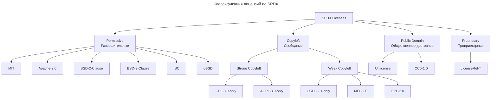
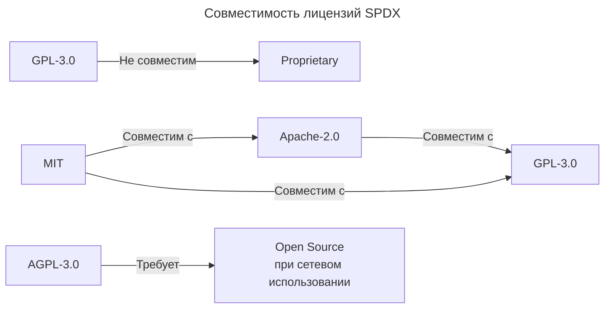

---
aliases:
  - FOSSology
  - ISO 5962
  - ISO 5962 SPDX
  - ISO/IEC 5962:2021
  - LicenseRef
  - LicenseRef-*
  - SBOM
  - ScanCode
  - Software Bill of Materials
  - Software Package Data Exchange
  - SPDX
  - SPDX ID
  - SPDX Identifier
  - SPDX License Expression
  - SPDX License List
  - SPDX Tools
  - SPDX-идентификатор
  - Syft
  - Trivy
  - Выражение лицензии SPDX
  - Список лицензий SPDX
  - Список материалов ПО
---

---

## SPDX (Software Package Data Exchange)

**SPDX** (Software Package Data Exchange) — это открытый стандарт для документирования и обмена данными о лицензиях, авторских правах и происхождении программного обеспечения. Он развивается под эгидой Linux Foundation и признан как международный стандарт (ISO/IEC 5962:2021).

### Что решает

В первую очередь SPDX нужен, чтобы снять неопределённость в вопросах:

- **Какие лицензии используются** в проекте и его зависимостях.
- **Как эти лицензии сочетаются** между собой (например, «MIT + GPL-3.0 with classpath exception»).
- **Откуда взялся каждый компонент** (пакет, файл, фрагмент кода).
- **Есть ли у компонента известные уязвимости** и какие условия использования нужно соблюдать.

Это критично для compliance, аудита и безопасности цепочки поставок ПО (supply chain security).

### Ключевые части стандарта

1. **Формат документа SPDX.** Позволяет описать весь проект и его зависимости в одном файле. Поддерживаются форматы: SPDX-Tag, JSON, YAML, RDF/XML, Turtle.
2. **SPDX License List.** Канонический список лицензий с короткими уникальными идентификаторами (SPDX IDs): `MIT`, `Apache-2.0`, `GPL-3.0`, `AGPL-3.0-only` и т.д. Вместо копирования полного текста лицензии в метаданных указывают её ID.
3. **Правила идентификации лицензий.** Включают рекомендации, как сопоставлять текст лицензии с ID, а также выражения для сложных случаев (например, `MIT OR Apache-2.0`).
4. **Модель данных.** Описывает сущности: пакеты (packages), файлы (files), отношения (зависимости, производные работы и т.п.), лицензии, уведомления (notices).

### Как это выглядит на практике

**SPDX ID в коде**

Самый простой и распространённый способ — добавить в начало файла комментарий:

```java
// SPDX-License-Identifier: MIT
```

или для нескольких лицензий:

```java
// SPDX-License-Identifier: GPL-3.0-or-later AND MIT
```

Это сразу даёт юридическую ясность: какой лицензией покрывается именно этот файл.

**SPDX-документ (SBOM)**

Для всего проекта создают файл (например, `spdx.json` или `spdx.rdf`), где перечисляют:

- пакеты и их версии;
- лицензии каждого пакета;
- отношения между компонентами;
- ссылки на исходники, контрольные суммы и т.п.

Такой документ — это по сути SBOM (Software Bill of Materials) в формате SPDX.

### Работа со SPDX в Java

- **Валидация SPDX ID.** Строку (например, результат детектора лицензий) можно проверить через `SpdxId.isValid()` из `java-spdx-library`. Это гарантирует, что ID действительно существует в списке SPDX.
- **Нормализация.** `SpdxId.toCanonical()` приводит ID к единому виду: убирает лишние пробелы, нормализует регистр.
- **Получение эталонных текстов.** Через `LicenseListVersion.getLatest()` можно получить все известные лицензии и их тексты — базу для детектора (сравнение по схожести, расстоянию Левенштейна и т.п.).
- **Генерация SPDX-документа.** После определения лицензий для компонентов (в том числе из ZIP-архивов) собирается полноценный SPDX-SBOM (JSON/YAML) с помощью `spdx-jackson-store` или `spdx-v3jsonld-store`.
- **Интеграция с инструментами.** FOSSology, ScanCode и другие сканеры выдают результаты в терминах SPDX ID, что удобно для дальнейшей обработки в Java.

### Java-библиотеки для работы со SPDX

| Библиотека | Роль в работе со SPDX |
| --- | --- |
| `java-spdx-library` | Доступ к списку лицензий, валидация ID, утилиты для сравнения. |
| `spdx-java-core` | Модели данных (классы для пакетов, файлов, лицензий, отношений). |
| `spdx-jackson-store` | Сериализация/десериализация SPDX-документов в JSON. |
| `spdx-v3jsonld-store` | Работа с SPDX v3 в формате JSON-LD. |

### SPDX ID — единый идентификатор лицензии

**Краткий ответ**

SPDX ID (Software Package Data Exchange Identifier) — это стандартизированный короткий идентификатор лицензии, определённый спецификацией SPDX (ISO/IEC 5962). Цель — унифицировать названия лицензий в экосистеме ПО, чтобы инструменты могли автоматически распознавать и сравнивать лицензии.

**Что такое SPDX**

| Характеристика | Описание |
|----------------|----------|
| Полное название | Software Package Data Exchange |
| Стандарт | ISO/IEC 5962:2021 |
| Организация | Linux Foundation |
| Версия списка | SPDX License List v3.22+ (обновляется ежеквартально) |
| Количество лицензий | 600+ в официальном списке |
| Формат | JSON, XML, YAML, RDF, Tag:Value |

**Зачем нужен SPDX ID**

Проблема без SPDX: одна лицензия — много названий. `Apache 2.0`, `Apache License 2.0`, `Apache-2.0`, `Apache License, Version 2.0`, `ASL 2.0`, `Apache Software License 2.0` — инструменты не могут понять, что это одна и та же лицензия.

Решение с SPDX: SPDX ID — единый идентификатор. Все варианты выше приводятся к `Apache-2.0`. Инструменты автоматически распознают лицензию, могут проверять совместимость и генерировать отчёты.

**Примеры популярных SPDX ID**

| SPDX ID | Полное название | Тип |
|---------|-----------------|-----|
| `MIT` | MIT License | Permissive |
| `Apache-2.0` | Apache License 2.0 | Permissive |
| `GPL-3.0-only` | GNU General Public License v3.0 only | Copyleft |
| `GPL-3.0-or-later` | GNU GPL v3.0 or later | Copyleft |
| `LGPL-2.1-only` | GNU Lesser GPL v2.1 only | Weak Copyleft |
| `BSD-2-Clause` | BSD 2-Clause "Simplified" | Permissive |
| `BSD-3-Clause` | BSD 3-Clause "New" or "Revised" | Permissive |
| `0BSD` | BSD Zero Clause License | Permissive |
| `ISC` | ISC License | Permissive |
| `MPL-2.0` | Mozilla Public License 2.0 | Weak Copyleft |
| `AGPL-3.0-only` | GNU Affero GPL v3.0 | Strong Copyleft |
| `Unlicense` | The Unlicense | Public Domain |
| `CC-BY-4.0` | Creative Commons Attribution 4.0 | Creative Commons |
| `EPL-2.0` | Eclipse Public License 2.0 | Weak Copyleft |

**Где используется SPDX ID**

В манифестах пакетов.

[[artifact-format|npm]] (`package.json`):

```json
{
  "name": "my-package",
  "version": "1.0.0",
  "license": "MIT"
}
```

[[artifact-format|Maven]] (`pom.xml`):

```xml
<licenses>
  <license>
    <name>Apache License, Version 2.0</name>
    <url>https://www.apache.org/licenses/LICENSE-2.0</url>
    <distribution>repo</distribution>
  </license>
</licenses>
```

[[artifact-format|Cargo]] (`Cargo.toml`):

```toml
[package]
name = "my-crate"
version = "1.0.0"
license = "MIT OR Apache-2.0"  # ← SPDX expression
```

Go (`go.mod`):

```go
// LICENSE файл + аннотации
// SPDX-License-Identifier: MIT
```

Python (`pyproject.toml`):

```toml
[project]
name = "my-package"
license = {text = "MIT"}
```

В заголовках исходных файлов:

```java
/*
 * SPDX-License-Identifier: Apache-2.0
 * Copyright 2024 Example Corp
 */
public class MyClass { }
```

```python
# SPDX-License-Identifier: MIT
# Copyright (c) 2024 Example Corp

def main():
    pass
```

В SBOM (Software Bill of Materials):

```json
{
  "spdxVersion": "SPDX-2.3",
  "name": "my-application-sbom",
  "packages": [
    {
      "name": "spring-boot",
      "versionInfo": "3.2.0",
      "licenseConcluded": "Apache-2.0",
      "licenseDeclared": "Apache-2.0",
      "copyrightText": "Copyright 2024 VMware Inc."
    },
    {
      "name": "jackson-databind",
      "versionInfo": "2.15.2",
      "licenseConcluded": "Apache-2.0",
      "licenseDeclared": "Apache-2.0"
    }
  ]
}
```

**Памятка**

- SPDX ID — стандартизированный идентификатор лицензии.
- Стандарт: ISO/IEC 5962 (Linux Foundation).
- Примеры: `MIT`, `Apache-2.0`, `GPL-3.0-only`.
- Кастомные: `LicenseRef-<name>`.
- Назначение: унификация названий лицензий, автоматическое распознавание инструментами, проверка совместимости, генерация SBOM и compliance-отчётов.
- Где используется: `package.json`, `pom.xml`, `Cargo.toml`, `go.mod`, заголовки файлов (`SPDX-License-Identifier`), SBOM (формат SPDX-2.3), CI/CD-проверки лицензий.
- Инструменты: Syft, Trivy, FOSSA, Black Duck.

### SPDX License Expressions

SPDX поддерживает составные выражения для двойного лицензирования и исключений.

**Операторы**

| Оператор | Значение | Пример |
|----------|----------|--------|
| `AND` | Обе лицензии применяются | `Apache-2.0 AND MIT` |
| `OR` | Выбор из лицензий | `MIT OR Apache-2.0` |
| `WITH` | Лицензия с исключением | `GPL-2.0-only WITH Classpath-exception-2.0` |

**Примеры выражений**

```text
# Двойное лицензирование (выбор пользователя)
MIT OR Apache-2.0

# Обе лицензии одновременно
Apache-2.0 AND BSD-3-Clause

# GPL с исключением для classpath
GPL-2.0-only WITH Classpath-exception-2.0

# Сложное выражение
(MIT OR Apache-2.0) AND BSD-3-Clause
```

**Где это используется**

| Экосистема | Пример |
|------------|--------|
| Rust (Cargo) | `license = "MIT OR Apache-2.0"` |
| Linux Kernel | `GPL-2.0-only WITH Linux-syscall-note` |
| OpenJDK | `GPL-2.0-only WITH Classpath-exception-2.0` |
| Eclipse | `EPL-2.0 OR GPL-2.0-only WITH Classpath-exception-2.0` |

### Классификация лицензий по SPDX



### LicenseRef: кастомные лицензии

Если лицензия не входит в официальный SPDX-список, используется префикс `LicenseRef-`:

```text
LicenseRef-Proprietary
LicenseRef-Company-Internal
LicenseRef-Commercial-EULA
```

> ⚠️ `LicenseRef-*` — это не стандартная лицензия SPDX, а внутренняя/кастомная.

### Инструменты, работающие с SPDX

| Инструмент | Назначение | Команда/Формат |
|------------|------------|----------------|
| SPDX Tools | Валидация и конвертация | `spdx-tools validate file.spdx` |
| Syft | Генерация SBOM | `syft packages dir:/app -o spdx-json` |
| Trivy | Сканирование лицензий | `trivy fs --scanners license .` |
| FOSSA | Compliance анализ | SaaS |
| Black Duck | Enterprise compliance | SaaS |
| license-maven-plugin | Maven отчёт | `mvn license:check` |
| licensee | Определение лицензии | `licensee detect ./repo` |
| npm license-checker | Проверка npm-зависимостей | `npx license-checker` |

### Пример: генерация SBOM с SPDX

**Syft**

```bash
# Генерация SBOM в формате SPDX
syft packages dir:/app -o spdx-json > sbom.spdx.json

# Результат:
{
  "spdxVersion": "SPDX-2.3",
  "packages": [
    {
      "name": "spring-core",
      "licenseConcluded": "Apache-2.0"
    }
  ]
}
```

**Trivy**

```bash
# Сканирование лицензий
trivy fs --scanners license --severity HIGH,CRITICAL .

# Результат:
# LICENSE: Apache-2.0 (ALLOWED)
# LICENSE: GPL-3.0-only (BLOCKED)
```

### Совместимость лицензий



| Лицензия | Можно использовать в коммерческом ПО? | Обязательства |
|----------|---------------------------------------|---------------|
| MIT | ✅ Да | Сохранить copyright notice |
| Apache-2.0 | ✅ Да | Сохранить notice + указать изменения |
| BSD-3-Clause | ✅ Да | Сохранить copyright notice |
| GPL-3.0 | ⚠️ Только если открыть код | Производные работы → GPL |
| AGPL-3.0 | ⚠️ Только если открыть код | Сетевое использование → open source |
| Proprietary | ⚠️ По условиям EULA | Зависит от лицензии |

### Как определить SPDX ID пакета

**Через npm**

```bash
# Посмотреть лицензию пакета
npm view express license
# → MIT

# Все лицензии зависимостей
npx license-checker --summary
```

**Через Maven**

```bash
# Лицензии зависимостей
mvn license:third-party-full-report
```

В `pom.xml`:

```xml
<licenses>
  <license>
    <name>Apache-2.0</name>
  </license>
</licenses>
```

**Через Cargo**

```bash
cargo license
# → MIT OR Apache-2.0
```

**Через Syft (SBOM)**

```bash
syft packages dir:/app -o spdx-json | jq '.packages[].licenseConcluded'
```

### Итог

| Вопрос | Ответ |
|--------|-------|
| Что такое SPDX? | Стандарт обмена данными о пакетах ПО (ISO/IEC 5962) |
| Что такое SPDX ID? | Короткий идентификатор лицензии (например, `Apache-2.0`) |
| Зачем нужен? | Унификация названий лицензий для автоматизации |
| Где используется? | Манифесты пакетов, SBOM, заголовки файлов |
| Что если лицензия кастомная? | Префикс `LicenseRef-` (например, `LicenseRef-Proprietary`) |
| Какие инструменты? | Syft, Trivy, FOSSA, Black Duck, license-maven-plugin |
| Что такое SPDX expression? | Составные лицензии: `MIT OR Apache-2.0`, `GPL-2.0 WITH exception` |
