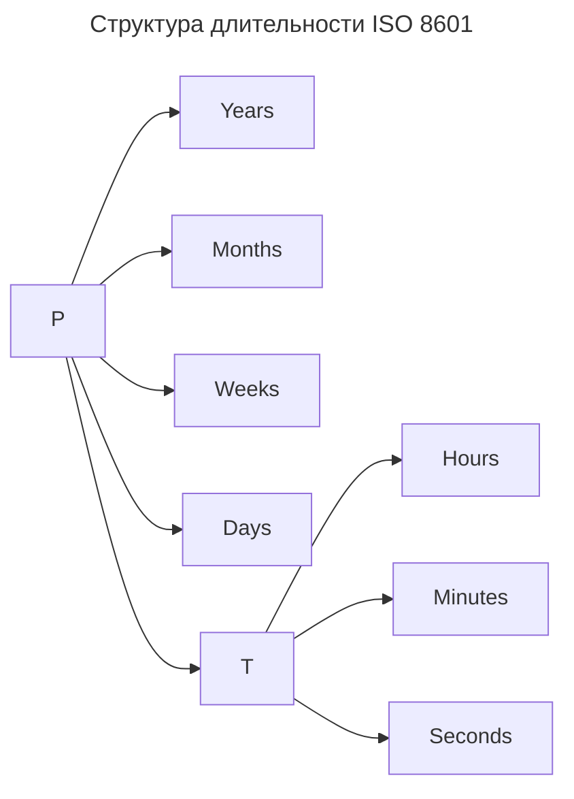
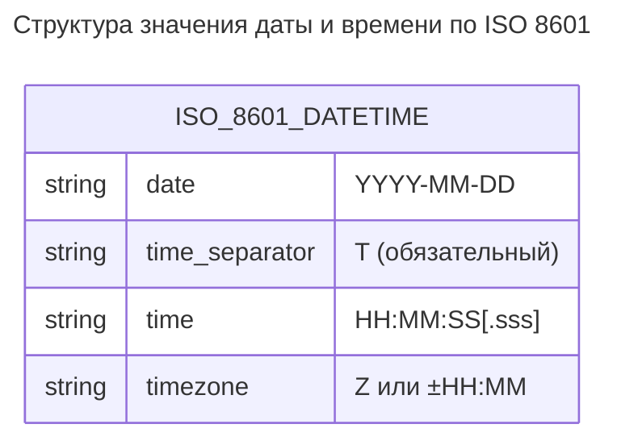

---
aliases:
  - date format
  - datetime
  - ISO 8601
  - ISO-8601
  - time format
  - Дата и время
  - Формат времени
  - Формат даты
---

## ISO 8601

**ISO 8601** — это международный стандарт, разработанный Международной организацией по стандартизации (ISO), который определяет единый, машиночитаемый формат для представления дат, времени, временных интервалов и периодов.

Главная цель стандарта — **устранить неоднозначность** при обмене временными данными между системами, странами и культурами.

> **Ключевой принцип:** от большего к меньшему (`Год → Месяц → День → Часы → Минуты → Секунды`).

### Краткая шпаргалка

```text
📅 Дата:          2026-03-06
🕐 Время:         14:30:00
🌍 UTC:           2026-03-06T14:30:00Z
🌐 С поясом:      2026-03-06T17:30:00+03:00
⏱  Длительность:  P1DT2H30M
🔁 Интервал:      2026-03-06T10:00:00Z/2026-03-06T12:00:00Z
🔄 Повтор:        R5/2026-03-06T09:00:00Z/P1D
📆 Неделя:        2026-W10-5
🔢 День года:     2026-065
```

Если дата/время передаются между системами, используйте **полный ISO 8601 с указанием часового пояса**. Это избавит от 99% проблем с временными зонами и локалями.

---

### Основные форматы

#### Дата (Calendar Date)

**Формат**

```text
YYYY-MM-DD
```

**Компоненты**

| Компонент | Описание | Пример |
|-----------|----------|--------|
| `YYYY` | Год (4 цифры) | `2026` |
| `MM` | Месяц (01–12) | `03` |
| `DD` | День (01–31) | `06` |

**Примеры**

```text
2026-03-06          # 6 марта 2026 года (рекомендуемый формат)
20260306            # Базовый формат (без разделителей, реже используется)
2026-03             # Только год и месяц
2026                # Только год
```

#### Время (Time of Day)

**Формат**

```text
THH:MM:SS[.sss][Z|±HH:MM]
```

**Компоненты**

| Компонент | Описание | Пример |
|-----------|----------|--------|
| `T` | Разделитель даты и времени (буква) | `T` |
| `HH` | Часы (00–23) | `14` |
| `MM` | Минуты (00–59) | `30` |
| `SS` | Секунды (00–59, могут быть дробные) | `45.123` |
| `Z` | Время по UTC (Zero/Zone) | `Z` |
| `±HH:MM` | Смещение часового пояса | `+03:00` |

**Примеры**

```text
14:30:00          # 2:30 дня (локальное время)
14:30:00.500      # С миллисекундами
14:30:00Z         # UTC время
14:30:00+03:00    # Москва (UTC+3)
09:30:00-05:00    # Нью-Йорк (UTC-5)
```

#### Дата и время вместе (Combined)

**Формат**

```text
YYYY-MM-DDTHH:MM:SS[.sss][Z|±HH:MM]
```

**Примеры**

```text
2026-03-06T14:30:00Z           # UTC
2026-03-06T17:30:00+03:00      # Москва
2026-03-06T09:30:00-05:00      # Нью-Йорк
2026-03-06T14:30:00.123456Z    # С микросекундами
```

> ⚠️ **Важно:** буква `T` — обязательный разделитель между датой и временем. В некоторых контекстах (например, RFC 3339) допускается пробел, но канонический ISO 8601 требует `T`.

---

### Специальные форматы

#### Недельная дата (Week Date)

Используется в бизнес-планировании и отчётности.

**Формат**

```text
YYYY-Www-D
```

**Компоненты**

| Компонент | Описание |
|-----------|----------|
| `YYYY` | Год |
| `Www` | Номер недели (01–53) |
| `D` | День недели (1=Пн, 7=Вс) |

**Примеры**

```text
2026-W10-5      # Пятница 10-й недели 2026 года (6 марта 2026)
2026-W01-1      # Первый понедельник 2026 года
```

#### Порядковая дата (Ordinal Date)

**Формат**

```text
YYYY-DDD
```

**Компоненты**

| Компонент | Описание |
|-----------|----------|
| `DDD` | День года (001–366) |

**Примеры**

```text
2026-065        # 65-й день 2026 года (6 марта)
2024-366        # 366-й день високосного года (31 декабря 2024)
```

#### Длительность (Duration) — формат PnYnMnDTnHnMnS

Начинается с буквы `P` (Period), время отделяется буквой `T`.



**Примеры**

```text
P3Y6M4DT12H30M5S   # 3 года, 6 месяцев, 4 дня, 12 часов, 30 минут, 5 секунд
PT1H30M            # 1 час 30 минут
P7D                # 7 дней
P2W                # 2 недели
PT30S              # 30 секунд
```

#### Временные интервалы (Intervals)

**Формат**

```text
[start]/[end]  или  [start]/[duration]  или  [duration]/[end]
```

**Примеры**

```text
2026-03-06T10:00:00Z/2026-03-06T12:00:00Z   # Конкретный интервал
2026-03-06T10:00:00Z/P2H                    # С 10:00 на 2 часа
P1D/2026-03-06T23:59:59Z                    # За день до конца суток
```

#### Повторяющиеся интервалы (Repeating Intervals)

**Формат**

```text
R[n]/[interval]
```

**Компоненты**

| Компонент | Описание |
|-----------|----------|
| `R` | Префикс повторения |
| `n` | Количество повторений (опционально, если пусто — бесконечно) |

**Примеры**

```text
R3/2026-03-06T09:00:00Z/P1D      # 3 раза, начиная с 6 марта, каждый день
R/2026-01-01T00:00:00Z/P1M       # Бесконечно, каждый месяц с 1 января
R5/PT1H                          # 5 раз с интервалом в 1 час (без начальной точки)
```

---

### Часовые пояса и UTC

| Обозначение | Значение | Пример |
|-------------|----------|--------|
| `Z` | UTC (Coordinated Universal Time) | `2026-03-06T12:00:00Z` |
| `+HH:MM` | Смещение вперёд от UTC | `+03:00` (Москва) |
| `-HH:MM` | Смещение назад от UTC | `-08:00` (Лос-Анджелес) |

> ✅ **Рекомендация:** всегда храните время в **UTC** (`Z`), а отображайте в локальном поясе на клиенте.

---

### Структура ISO 8601



**Разбор примера `2026-03-06T14:30:00.500+03:00`**

| Компонент | Значение |
|-----------|----------|
| Год | 2026 |
| Месяц | 03 |
| День | 06 |
| Часы | 14 |
| Минуты | 30 |
| Секунды | 00.500 |
| Пояс | Москва (UTC+3) |

---

### Преимущества ISO 8601

| Преимущество | Объяснение |
|--------------|------------|
| ✅ **Сортировка** | Лексикографическая сортировка строк совпадает с хронологической |
| ✅ **Однозначность** | Нет путаницы между 03/04 (4 марта или 3 апреля?) |
| ✅ **Машиночитаемость** | Легко парсится в любом языке программирования |
| ✅ **Гибкость** | Поддерживает даты, время, интервалы, повторения |
| ✅ **Глобальность** | Не зависит от локали, языка или региона |

---

### Поддержка в языках программирования

| Язык | Класс/Модуль | Пример парсинга |
|------|-------------|-----------------|
| **Java** | `java.time.Instant`, `ZonedDateTime` | `Instant.parse("2026-03-06T12:00:00Z")` |
| **Python** | `datetime.fromisoformat()`, `dateutil` | `datetime.fromisoformat("2026-03-06T12:00:00+03:00")` |
| **JavaScript** | `Date`, `Temporal` (proposal) | `new Date("2026-03-06T12:00:00Z")` |
| **C#** | `DateTimeOffset`, `System.Text.Json` | `DateTimeOffset.Parse("2026-03-06T12:00:00Z")` |
| **PostgreSQL** | `TIMESTAMP WITH TIME ZONE` | `'2026-03-06T12:00:00Z'::timestamptz` |

> ⚠️ **Внимание:** не все реализации поддерживают все расширения ISO 8601 (например, недельные даты или дробные секунды). Всегда проверяйте документацию.

---

### Частые ошибки

```text
2026/03/06          # Неправильный разделитель (должен быть дефис)
06.03.2026          # Европейский формат, не ISO
3/6/2026 2:30 PM    # US-формат, неоднозначный
2026-03-06 14:30:00 # Пробел вместо T (допустимо в некоторых контекстах, но не канонично)
2026-03-06T14:30    # Без секунд — допустимо, но лучше указывать полностью
+0300               # Неправильный формат пояса (должно быть +03:00)
```

---

### Практические рекомендации

1. **Всегда используйте расширенный формат** с разделителями (`-`, `:`, `T`) — он читаемее.
2. **Храните время в UTC** (`Z`), конвертируйте в локальное только для отображения.
3. **Включайте смещение часового пояса**, если время не в UTC.
4. **Используйте миллисекунды**, если важна точность (логи, события, финансы).
5. **Документируйте формат** в API (например, в OpenAPI: `format: date-time`).

**Пример OpenAPI / Swagger**

```yaml
created_at:
  type: string
  format: date-time  # ISO 8601
  example: "2026-03-06T14:30:00Z"
```
