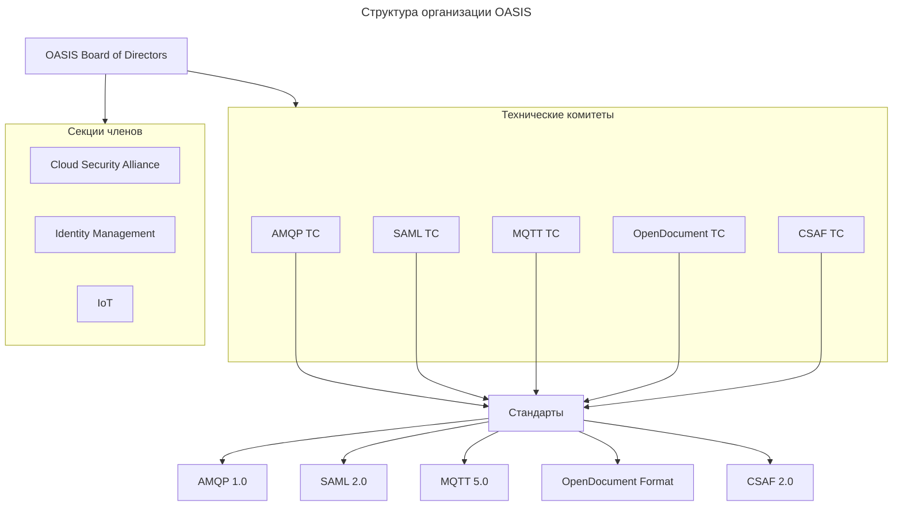
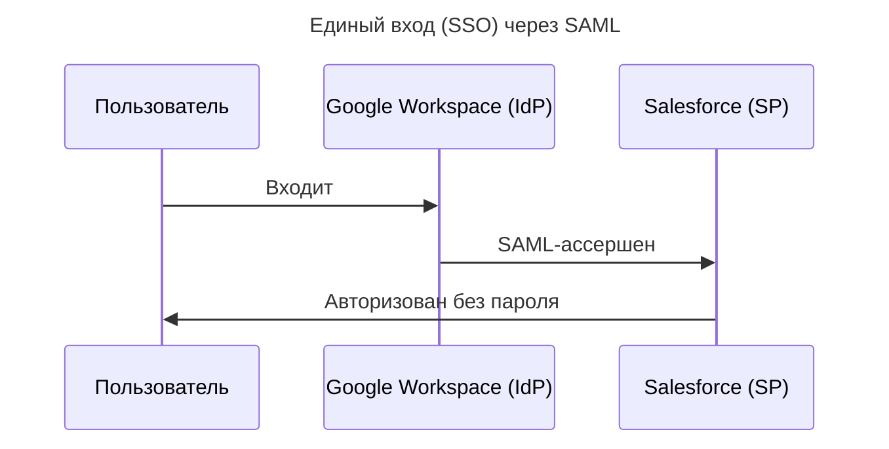

---
aliases:
  - AMQP
  - CSAF
  - IETF
  - MQTT
  - OASIS
  - ODF
  - OpenDocument
  - Organization for the Advancement of Structured Information Standards
  - SAML
  - TOSCA
  - W3C
  - XACML
  - Консорциум OASIS
---

## Что такое OASIS

**OASIS** (Organization for the Advancement of Structured Information Standards) — это **международный консорциум**, занимающийся разработкой и продвижением **открытых стандартов** для обмена структурированной информацией в цифровых системах.

**Ключевая миссия:**

> Создавать технологические стандарты, которые **не привязаны к конкретному вендору** и обеспечивают **интероперабельность** между разными системами.

## Основные факты об OASIS

| Параметр | Значение |
|----------|----------|
| **Основан** | 1993 год (как «SGML Open»), переименован в OASIS в 1998 |
| **Тип** | Некоммерческий консорциум (501(c)(6) в США) |
| **Членство** | Более 600 организаций: корпорации (Google, Microsoft, IBM), стартапы, правительства, университеты |
| **Стандарты** | Более 100 утверждённых спецификаций |
| **Управление** | Открытое: любой может участвовать в технических комитетах |
| **Лицензирование** | Все стандарты — **бесплатные для внедрения**, без роялти |

## Структура организации



## Известные стандарты, управляемые OASIS

| Стандарт | Область применения | Реальные примеры |
|----------|-------------------|------------------|
| **AMQP 1.0** | Обмен сообщениями | Azure Service Bus, ActiveMQ Artemis |
| **SAML 2.0** | Федеративная аутентификация | Единый вход ([[SSO|SSO]]) в корпоративные системы |
| **MQTT 5.0** | IoT-коммуникации | Умные дома, промышленные датчики |
| **OpenDocument Format (ODF)** | Документы | LibreOffice, Apache OpenOffice |
| **CSAF** | Кибербезопасность | Формат уведомлений об уязвимостях (аналог CVE) |
| **TOSCA** | Оркестрация облака | Описание развёртывания приложений в облаке |
| **PKCS #11** | Криптография | Аппаратные модули безопасности ([[hardware-security-module|HSM]]) |
| **XACML** | Управление доступом | Политики авторизации на основе атрибутов |

## OASIS vs другие организации по стандартам

| Организация | Фокус | Примеры стандартов | Отличие от OASIS |
|-------------|-------|-------------------|------------------|
| **OASIS** | Структурированные данные, безопасность, обмен сообщениями | AMQP, SAML, MQTT | Открытые комитеты, быстрая разработка |
| **W3C** | Веб-технологии | HTML, CSS, XML, RDF | Фокус на веб-платформе |
| **IETF** | Сетевые протоколы | HTTP, TCP/IP, TLS | Консенсус через RFC, фокус на интернет-инфраструктуре |
| **ISO/IEC** | Международные стандарты | ISO 27001, ISO 9001 | Медленный процесс, национальные комитеты |
| **IEEE** | Электротехника и ИТ | IEEE 802.11 (Wi-Fi) | Академический фокус, патенты |

**Ключевое преимущество OASIS:**

> Быстрое принятие решений через **технические комитеты** с участием реальных практиков (не только теоретиков).

## Как работает процесс стандартизации в OASIS

1. **Инициация** — любой член может предложить новый технический комитет (TC).
2. **Разработка** — комитет публикует черновики (Working Drafts), собирает отзывы.
3. **Рецензирование** — 15-дневный публичный комментарий + 60-дневный комментарий членов.
4. **Утверждение** — голосование членов комитета → статус **OASIS Standard**.
5. **Передача в международные органы** — некоторые стандарты становятся **ISO/IEC** (например, ODF → ISO/IEC 26300).

## Реальные кейсы использования стандартов OASIS

### SAML 2.0 в корпоративной среде



Используется в 90% крупных компаний для безопасного доступа к облаку.

### MQTT 5.0 в промышленности

```python
# Подключение датчика температуры к облаку
client = mqtt.Client(protocol=mqtt.MQTTv5)
client.connect("iot-broker.example.com", 1883)
client.publish("factory/line1/temp", "24.5°C")  # Стандартный формат
```

Стандарт для 70% промышленных IoT-устройств.

### OpenDocument Format (ODF)

```text
# Файл документа LibreOffice — это ZIP-архив со структурированным XML
unzip document.odt
├── content.xml    # Текст документа
├── styles.xml     # Стили
├── meta.xml       # Метаданные
```

Альтернатива проприетарному `.docx`, поддерживается ООН и ЕС для официальных документов.

## Важные нюансы

| Нюанс | Объяснение |
|-------|------------|
| **Не путать с Oasis Network** | Это криптовалютный проект — не связан с консорциумом OASIS |
| **AMQP 0.9.1 ≠ AMQP 1.0** | [[rabbit-mq|RabbitMQ]] использует 0.9.1 (не управляется OASIS), Azure Service Bus — 1.0 (стандарт OASIS) |
| **Бесплатное внедрение ≠ бесплатные инструменты** | Стандарты бесплатны, но реализации (брокеры) могут быть коммерческими |

## Итог

> **OASIS — это «фабрика открытых стандартов» для критически важных технологий:**
> - безопасность (SAML, XACML);
> - обмен сообщениями (AMQP, MQTT);
> - документы (ODF);
> - кибербезопасность (CSAF).

> **OASIS standards power the invisible infrastructure of modern digital business.**

> **Главное:** стандарты OASIS обеспечивают **интероперабельность без привязки к вендору** — ключевой фактор для устойчивых цифровых систем.
