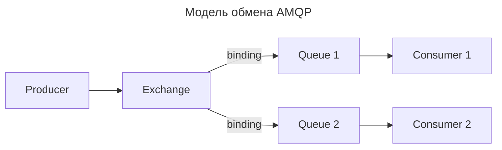
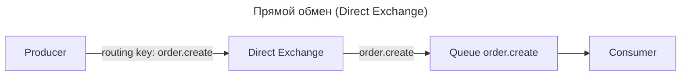
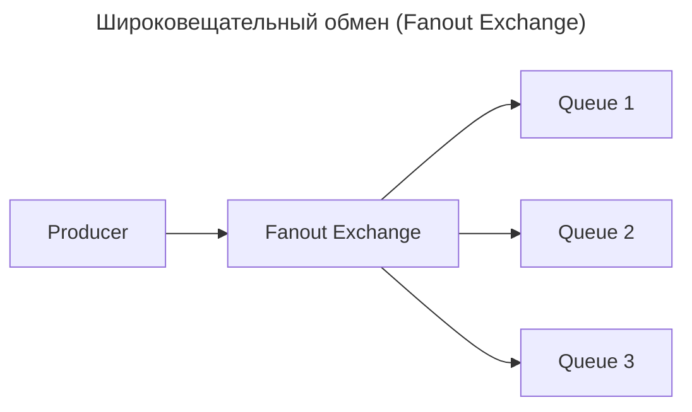
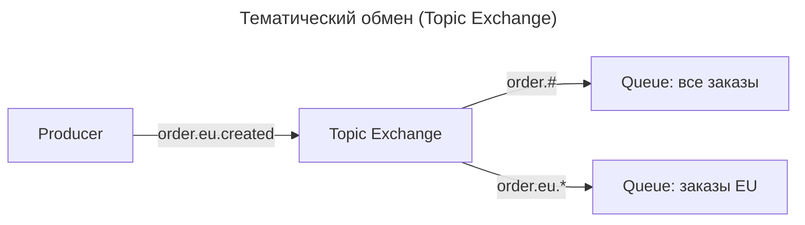

---
aliases:
  - Advanced Message Queuing Protocol
  - AMQP
  - Binding
  - Consumer
  - Direct Exchange
  - Exchange
  - Fanout Exchange
  - Header Exchange
  - Kafka
  - Message Queue
  - MQTT
  - Producer
  - RabbitMQ
  - Topic Exchange
  - Обменник
  - Очередь сообщений
---

## AMQP

**AMQP (Advanced Message Queuing Protocol)** — это открытый протокол для **надёжной асинхронной передачи сообщений** между приложениями. Он определяет формат сообщений, правила маршрутизации и модель обмена (producer → broker → consumer).

Протокол не зависит от языка и платформы, поэтому разные сервисы (Python, Go, Java, PHP, .NET) могут общаться через один брокер сообщений. Самый известный брокер, реализующий AMQP, — **RabbitMQ**.

## Что такое AMQP

**Определение**

> **AMQP** — протокол прикладного уровня, который за счёт стандартизированных компонентов (Exchange, Queue, Binding) обеспечивает **гибкую маршрутизацию** сообщений от производителя к потребителю.

- Клиент («producer») отправляет сообщение в **Exchange**.
- Exchange по правилам (**Binding**) кладёт сообщение в нужные **Queue**.
- Consumer забирает сообщение из очереди.
- Связь «Exchange → Queue» описывается правилом маршрутизации.

## Основные компоненты

| Компонент | Роль |
|-----------|------|
| **Producer** | Отправитель сообщений |
| **Exchange** | Маршрутизатор: принимает сообщения и направляет их в очереди |
| **Binding** | Связка: «какие сообщения из Exchange попадают в очередь» |
| **Queue** | Буфер сообщений, ожидающих обработки |
| **Consumer** | Получатель (подписчик) сообщений |
| **Broker** | Сервер, реализующий AMQP (RabbitMQ, Apache Qpid) |

## Модель обмена



## Почему «A» в названии

- **Advanced** — расширенный набор функций (маршрутизация, подтверждения, транзакции).
- **Message** — единица передачи.
- **Queuing** — модель очередей.
- **Protocol** — формализованная схема взаимодействия.

AMQP позиционировался как «HTTP для обмена сообщениями» — единый стандарт, дополняющий паттерны вроде [микросервисов](microservice).

## Подход при передаче сообщения

Передача происходит так:

1. Producer отправляет сообщение в Exchange.
2. Exchange по типу обменника и ключу маршрутизации определяет очереди-получатели.
3. Binding связывает Exchange и Queue через `routing key`.
4. Consumer потребляет из очереди и подтверждает обработку (ack).

## Именно Exchange определяет правила маршрутизации

Без понимания типов Exchange нельзя спроектировать систему на RabbitMQ.

| Тип Exchange | Принцип маршрутизации |
|--------------|-----------------------|
| **Direct** | Точечная доставка по точному равенству ключа |
| **Fanout** | Широковещательная рассылка во все связанные очереди |
| **Topic** | Гибкие шаблоны (wildcards `*` и `#`) |
| **Headers** | Маршрутизация по заголовкам сообщения |

### Direct Exchange



- Сообщение попадает в очередь, если `routing key` точно равен ключу подписки.
- Используется: обработка конкретных команд, шардирование по ключу.

### Fanout Exchange



- Копия сообщения уходит во **все** связанные очереди.
- Используется: события для нескольких потребителей (аналитика, логирование, уведомления).

### Topic Exchange



- Шаблон с `*` (одно слово) и `#` (ноль и больше слов).
- Используется: гибкая подписка на категории событий.

### Headers Exchange

- Игнорирует `routing key`, маршрутизирует по **заголовкам** сообщения (`x-match: all` / `x-match: any`).

## Пример конфигурации (RabbitMQ)

```yaml
# yaml-схема декларации компонентов
exchanges:
  - name: order.exchange
    type: topic

queues:
  - name: order.create.queue
  - name: order.cancel.queue

bindings:
  - exchange: order.exchange
    queue: order.create.queue
    routing_key: "order.create"
  - exchange: order.exchange
    queue: order.cancel.queue
    routing_key: "order.cancel"
```

## Пример кода

**Producer (Python)**

```python
import pika

connection = pika.BlockingConnection(pika.ConnectionParameters("localhost"))
channel = connection.channel()

channel.exchange_declare(exchange="order.exchange", exchange_type="topic")

channel.basic_publish(
    exchange="order.exchange",
    routing_key="order.create",
    body=b"New order created",
)
print("Сообщение отправлено")

connection.close()
```

**Consumer (Python)**

```python
import pika

def callback(ch, method, properties, body):
    print(f"Получено: {body}")

connection = pika.BlockingConnection(pika.ConnectionParameters("localhost"))
channel = connection.channel()

channel.exchange_declare(exchange="order.exchange", exchange_type="topic")
queue = channel.queue_declare(queue="order.create.queue").method.queue
channel.queue_bind(queue=queue, exchange="order.exchange", routing_key="order.create")

channel.basic_consume(queue=queue, on_message_callback=callback, auto_ack=True)
print("Слушаем очередь...")
channel.start_consuming()
```

## Транспортные концепции

| Концепция | Описание |
|-----------|----------|
| **Доставка с подтверждением (acks)** | Consumer подтверждает обработку; при сбое сообщение возвращается в очередь |
| **Persistent messages** | Сообщения переживают перезапуск брокера |
| **Prefetch / QoS** | Сколько сообщений выдаётся потребителю за раз |
| **Dead Letter Queue (DLQ)** | Очередь для «мёртвых» сообщений (после повторных сбоев) |
| **Consumer ACK/NACK** | Подтверждение или отклонение сообщения клиентом |

## Сравнение AMQP, MQTT, Kafka

| Критерий | **AMQP** (RabbitMQ) | **MQTT** | **Kafka** |
|----------|---------------------|----------|-----------|
| **Модель** | Очереди, exchanges | Публикация-подписка | Лог (топики, партиции) |
| **Потребление** | Один раз из очереди | По теме | Группы, каждое сообщение хранится |
| **Транспорт** | TCP | TCP (лёгкий) | TCP |
| **Производительность** | Очень высокая | Высокая (для IoT) | Очень высокая, потоковая |
| **Надёжность** | Высокая (DLQ, acks) | Средняя (сохраняет QoS-уровни) | Высокая (реплики) |
| **Использование** | Сервисы, микросервисы, микросервисные интеграции | IoT, датчики, телефония | Логи, аналитика, event streaming |
| **Сложность** | Средняя | Низкая | Высокая |

## Частые вопросы

| Вопрос | Ответ |
|--------|-------|
| **Что важнее: Exchange или Queue?** | Exchange — логика маршрутизации, Queue — хранение. Роли равнозначны |
| **Можно ли без Exchange?** | Да — отправка напрямую в очередь (default exchange), но теряется гибкость |
| **AMQP переживёт Kafka?** | Kafka и AMQP решают разные задачи; AMQP остаётся стандартом сервисных интеграций |
| **Что выбрать: RabbitMQ или Kafka?** | Для маршрутизации «1 сообщение — 1 обработчик» — RabbitMQ. Для потоков данных и аналитики — Kafka |

## Итог

**AMQP** — стандарт надёжного обмена сообщениями между сервисами. Ключ к пониманию — модель **Exchange → Binding → Queue → Consumer**. Типы Exchange определяют паттерн маршрутизации: direct (точно), fanout (всем), topic (по шаблону), headers (по заголовкам).
