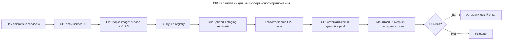

---
aliases:
  - Argo CD
  - CI/CD
  - Continuous Delivery
  - Continuous Deployment
  - Continuous Integration
  - Continuous Integration Continuous Delivery
  - Flux
  - GitHub Actions
  - GitLab CI/CD
  - GitOps
  - Jenkins
  - Monorepo
  - PaC
  - Pipeline as Code
  - Непрерывная доставка
  - Непрерывная интеграция
  - Непрерывное развёртывание
  - СI/CD
---

## CI/CD

CI/CD — это набор практик и методологий, который направлен на автоматизацию процессов разработки, тестирования и развёртывания программного обеспечения.

| Аббревиатура | Расшифровка | Суть |
|-------------|------------|------|
| **CI** | **Continuous Integration** | Частая интеграция изменений кода (несколько раз в день) → автоматическая сборка, тестирование, статический анализ |
| **CD** | **Continuous Delivery** | Гарантия, что код всегда готов к релизу — можно запустить релиз вручную в любой момент |
| **CD** | **Continuous Deployment** | Каждое изменение, прошедшее CI → автоматически деплоится в production (без ручного вмешательства) |

**CI = проверка кода. CD = доставка кода в продакшен.**

### Этапы перед CI/CD

CI/CD предшествует два шага:

1. **Планирование (Plan).** Команды разработки определяют, какие изменения или новые функции необходимо реализовать. Планирование включает обсуждение требований, создание задач и распределение работы между разработчиками.
2. **Написание кода (Code).** Разработчики пишут код для новых функций или исправлений на локальных машинах.

### Continuous Integration (CI)

Процесс непрерывной интеграции предполагает регулярное интегрирование изменений в общую кодовую базу и автоматические проверки нового кода на наличие ошибок и конфликтов.

Здесь три шага:

1. **Работа с системой контроля версий (Code).** Разработчики фиксируют изменения кода в системе контроля версий — например, в Git. Это позволяет отслеживать изменения, управлять различными ветками разработки и координировать работу нескольких разработчиков.
2. **Сборка (Build).** Каждый раз, когда разработчик вносит изменения в код, они автоматически интегрируются в центральный репозиторий. После интеграции система CI автоматически запускает процесс сборки проекта — чтобы новый код компилировался и работал вместе с остальной кодовой базой.
3. **Автоматическое тестирование (Automated Testing).** После сборки система CI запускает автоматические тесты, чтобы проверить корректность новых изменений. Это могут быть юнит-тесты, интеграционные тесты и другие виды тестирования. Тесты помогают выявить ошибки и дефекты на ранних этапах разработки.

### Continuous Delivery (CD)

Непрерывная доставка предполагает автоматизацию развёртывания и тестирования. Она помогает добиться того, чтобы каждая версия программного обеспечения была готова к выпуску в любое время.

Здесь идут следующие два шага:

1. **Подготовка к развёртыванию (Release).** Когда все тесты прошли успешно, приложение нужно подготовить к развёртыванию. На этом этапе система может выполнить дополнительную проверку качества, а затем создаст сборки и пакеты, которые нужны для развёртывания.
2. **Развёртывание в тестовые среды (Staging/Pre-production Deployment).** Готовое приложение развёртывается в тестовых средах, где выполняются дополнительные проверки и тесты. Это помогает убедиться, что приложение работает корректно в условиях, близких к продакшн-среде.

### Continuous Deployment

Этот шаг идёт уже после Continuous Delivery. Постоянное развёртывание предполагает, что каждое успешное изменение автоматически развёртывается в рабочую среду.

1. **Автоматическое развёртывание (Production Deployment).** Как только изменение прошло процессы CI и CD, система автоматически доставляет его конечным пользователям.

### Pipeline as Code

[[pipeline-as-code]] — это подход, при котором конвейеры CI/CD описывают с помощью кода. Управляют ими тоже через код.

---

### CI/CD в монолите и микросервисах

В контексте монолита и микросервисов CI/CD реализуется радикально по-разному — из-за различий в архитектуре, масштабе, зависимостях и рисках.

#### Особенности монолитного приложения

- Один кодбаза (`/src`).
- Один бинарник/докер-образ.
- Все функции взаимозависимы.
- Одна точка сбоя.
- Одна база данных.
- Одна точка деплоя.

#### CI/CD для монолитного приложения


**Особенности**

- ✅ Простота: один образ → один деплой.
- ✅ Легко тестировать целиком.
- ✅ Нет сложных зависимостей между сервисами.
- ✅ Меньше инфраструктуры (один Helm-чарт, один Ingress).

| Проблема | Объяснение |
|----------|------------|
| ❌ Высокий риск релиза | Любая ошибка ломает весь продукт: падение одного модуля = падение всего |
| ❌ Долгие тесты | Тесты занимают 20–60 минут → медленная обратная связь |
| ❌ Зависимость от одной команды | Только одна команда может менять весь код — замедляет развитие |
| ❌ Сложные откаты | При ошибке нужно откатывать весь монолит, даже если проблема в одном экране |
| ❌ Частые «большие релизы» | Из-за рисков выпускают раз в неделю/месяц — противоречит CI/CD |

**Пример: монолит в банке**

- Изменение: добавили новый способ оплаты через QR-код.
- Всё — UI, API, бухгалтерия, уведомления — в одном коде.
- Тесты: 45 минут.
- Деплой: только ночью, в выходные.
- Откат: перезапуск старого образа → теряются все изменения за неделю.

> Это не настоящий CI/CD — это «CI» с ручным «CD». Настоящий CI/CD здесь невозможен без фундаментальных изменений.

#### Особенности микросервисного приложения

- Множество независимых сервисов (10–100+).
- Каждый сервис — отдельный репозиторий / Git-репо.
- Каждый сервис — отдельный Docker-образ.
- Каждый сервис — отдельный деплой.
- Разные команды, разные языки, разные технологии.
- Используются Service Mesh, Event Bus, API Gateway.

#### CI/CD для микросервисного приложения



**Особенности**

| Преимущество | Объяснение |
|--------------|------------|
| ✅ Независимые релизы | Команда frontend может выйти в прод с новым интерфейсом — не дожидаясь backend |
| ✅ Быстрая обратная связь | Тесты одного сервиса — 2–5 минут |
| ✅ Маленькие релизы | Ошибка затрагивает только один сервис — легко откатить |
| ✅ Canary / Blue-Green | Можно выпускать 1% трафика на новую версию — безопасно |
| ✅ Масштабируемость | 100 команд могут работать параллельно |
| ✅ Интеграция с Istio, Kafka, Prometheus | Полный контроль трафика, трассировки, метрик |

| Проблема | Объяснение |
|----------|------------|
| ❌ Сложность инфраструктуры | Нужны десятки пайплайнов, Helm-чартов, CI-агентов |
| ❌ Целостность системы | Как гарантировать, что все сервисы вместе работают → нужен **End-to-End тестирование** |
| ❌ Управление зависимостями | Сервис A зависит от версии сервиса B — как избежать несовместимости → нужны **Contract Testing, Schema Registry** |
| ❌ Операционная сложность | Нужно мониторить 50+ сервисов, их логи, метрики, трассировки |
| ❌ Парадокс «micro» | Может быть больше конфигов, чем кода |

**Пример: микросервисы в Uber**

| Сервис | CI/CD |
|--------|-------|
| `ride-request` | Деплой каждые 10 минут — новые алгоритмы подбора водителя |
| `payment` | Деплой раз в день — строгий review, canary, мониторинг финансовых метрик |
| `notifications` | Деплой каждые 2 часа — нет критичных данных |
| `maps` | Деплой раз в неделю — большие данные, долгая загрузка |

Каждый сервис имеет свой пайплайн, свою политику, свои тесты и свои SLA.

#### Сравнение монолита и микросервисов

| Критерий | Монолит | Микросервисы |
|----------|-------------|------------------|
| Частота релизов | Раз в неделю / месяц | Десятки раз в день |
| Объём изменений | Большой (весь код) | Маленький (один сервис) |
| Риск релиза | Высокий (всё ломается) | Низкий (ломается один сервис) |
| Автоматизация деплоя | Часто ручной | Почти всегда автоматический |
| Откат | Откат всего приложения | Откат одного сервиса |
| Тестирование | Интеграционные, E2E — долго | Unit + Contract + Smoke — быстро |
| Инструменты | Jenkins, GitLab CI, TeamCity | Argo CD, Flux, GitHub Actions, Tekton |
| Инфраструктура | Простая | Сложная (K8s, Service Mesh, Helm, ConfigMaps) |
| Команды | Одна команда | Множество cross-functional команд (Squad) |
| Зависимости | Внутренние — управляемы | Внешние — требуют контрактов (OpenAPI, Avro) |
| Архитектурный подход | Waterfall / Semi-agile | DevOps / GitOps / Continuous Delivery |

---

### Форматы CI/CD для микросервисов

#### Per-Service Pipeline

Каждый сервис — отдельный репозиторий → отдельный CI/CD.

```bash
repo/ride-service/
├── .github/workflows/ci.yaml
├── Dockerfile
├── helm/
└── tests/
```

Подходит для крупных компаний (Netflix, Spotify).

#### Monorepo + Multi-Pipeline

Все сервисы в одном репозитории, но CI запускается только для изменённых сервисов.

```bash
monorepo/
├── services/
│   ├── ride-service/
│   └── payment-service/
├── shared/
└── .github/workflows/ci.yaml # скрипт определяет, какие сервисы изменились
```

Используется в Google, Facebook, Airbnb.

#### GitOps (Argo CD / Flux)

- Изменения в коде автоматически создают PR в Git-репозиторий с Helm-чартами.
- Argo CD следит за этим репозиторием и автоматически применяет изменения в Kubernetes.


Это золотой стандарт современных CI/CD.

---

### Выбор стратегии CI/CD

| Сценарий                                              | Рекомендация                                                            |
| ----------------------------------------------------- | ----------------------------------------------------------------------- |
| Небольшая компания, MVP, 1–3 сервиса                  | Монолит + простой CI/CD (Jenkins/GitHub Actions)                        |
| Компания с 10+ сервисами, высокая скорость            | Микросервисы + GitOps + per-service pipelines                           |
| Финансовый/медицинский проект, где важна стабильность | Микросервисы + strict gating + canary + manual approval                 |
| Полная автоматизация релизов                          | Continuous Deployment (каждый commit → prod) — только для микросервисов |
| Legacy-система                                        | Монолит + постепенная миграция в микросервисы ([[Strangler Pattern]])   |

---

### «Настоящий» CI/CD в монолите

Сделать CI/CD «настоящим» можно — но с ограничениями.

Пример: **Amazon** до 2000-х использовала монолит, но имела CI/CD с 1000+ деплоев в день.

Как:

- Разбивали монолит на модули внутри кода.
- Использовали **feature flags** — включали/выключали функции без деплоя.
- Деплоили **частично** — только изменения в конкретном модуле.
- Использовали **canary release** внутри одного образа.

Это предвестник микросервисов: монолит начинает вести себя как набор сервисов. В итоге микросервисы делают CI/CD возможным и естественным, а монолит — дорогим и опасным, но его можно «подогнать» под требования скорости.

### Инструменты CI/CD

Базовый CI/CD-конвейер строится на сервере автоматизации. Jenkins — один из самых популярных инструментов для автоматизации сборки и развёртывания. Обзор инструментов см. в [[ci-cd-tools|CI/CD Tools]].

Помимо Jenkins, существует множество других инструментов для настройки CI/CD-конвейеров:

- **GitLab CI/CD** — инструмент для CI/CD, интегрированный в GitLab. Предлагает удобные и мощные функции для управления конвейерами.
- **CircleCI** — облачный сервис для CI/CD, который позволяет быстро настраивать и масштабировать конвейеры.
- **Travis CI** — ещё один облачный сервис для CI/CD, легко интегрируется с GitHub и поддерживает множество языков программирования.
- **Azure DevOps** — инструмент от Microsoft, интегрированный с другими сервисами Azure. Предоставляет широкий спектр возможностей для CI/CD.
- **GitHub Actions** — инструмент для автоматизации рабочих процессов непосредственно в GitHub. Поддерживает CI/CD и множество других задач.
