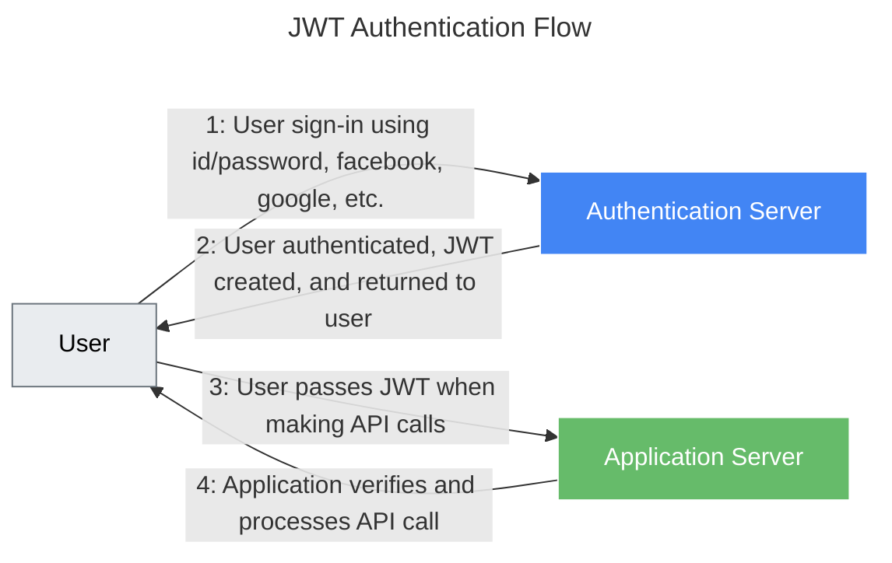

---
aliases:
  - JOSE
  - JSON Web Token
  - JWA
  - JWE
  - JWK
  - JWS
  - access token
  - jwt
  - refresh token
---

# JWT

## JWT standards

Стандарты **JWK, JWA, JWS, JWE** — часть семейства спецификаций **JOSE (Javascript Object Signing and Encryption)**, разработанных [[org-ietf]]. Они тесно связаны с **JWT (JSON Web Token, RFC 7519)** и определяют, **как JWT подписывается, шифруется и проверяется**.

JWT сам по себе — это **формат токена** (структура данных), а JWS/JWE/JWK/JWA — это **механизмы его защиты и обработки**.

### JWT (JSON Web Token)

**RFC 7519**

**Что это:** стандартный формат для передачи утверждений (claims) между сторонами в виде JSON-объекта.

**Структура:** `header.payload.signature` (Base64Url-кодированные части).

**Пример JWT (неподписанный):**

```json
// Header
{
  "alg": "RS256",
  "typ": "JWT"
}

// Payload
{
  "sub": "1234567890",
  "name": "John Doe",
  "iat": 1516239022,
  "exp": 1516242622
}
```

> ⚠️ **JWT без подписи/шифрования небезопасен!** Для защиты используются **JWS** (подпись) или **JWE** (шифрование).

### JWS (JSON Web Signature)

**RFC 7515**

**Что это:** спецификация **подписи** данных (включая JWT) для обеспечения **целостности и подлинности**.

**Как связан с JWT:** большинство JWT на практике — это **JWS-токены** (подписанные JWT).

**Пример структуры JWS (Compact Serialization):**

```text
BASE64URL(UTF8(JWS Protected Header)) || '.' ||
BASE64URL(JWS Payload) || '.' ||
BASE64URL(JWS Signature)
```

**Пример подписанного JWT (JWS):**

```text
eyJhbGciOiJSUzI1NiIsInR5cCI6IkpXVCJ9.  // Header: {"alg":"RS256","typ":"JWT"}
eyJzdWIiOiIxMjM0NTY3ODkwIiwibmFtZSI6IkpvaG4gRG9lIiwiaWF0IjoxNTE2MjM5MDIyfQ. // Payload
[...подпись RS256...]
```

> 🔑 **Проверка:** получатель использует **публичный ключ** (из JWK) и алгоритм (из JWA), чтобы проверить подпись через JWS.

### JWE (JSON Web Encryption)

**RFC 7516**

**Что это:** спецификация **шифрования** данных (включая JWT) для обеспечения **конфиденциальности**.

**Как связан с JWT:** JWT может быть **зашифрован как JWE-токен** (используется реже, чем JWS).

**Пример структуры JWE (Compact Serialization):**

```text
BASE64URL(UTF8(JWE Protected Header)) || '.' ||
BASE64URL(JWE Encrypted Key) || '.' ||
BASE64URL(JWE Initialization Vector) || '.' ||
BASE64URL(JWE Ciphertext) || '.' ||
BASE64URL(JWE Authentication Tag)
```

**Когда использовать:**

- Когда payload содержит **чувствительные данные** (например, ПДн).
- Пример: `{"ssn": "123-45-6789"}` → шифруется в JWE.

> 🔑 **Расшифровка:** получатель использует **приватный ключ** (из JWK) и алгоритмы (из JWA) через JWE.

### JWK (JSON Web Key)

**RFC 7517**

**Что это:** формат представления **криптографических ключей** в JSON.

**Как связан с JWT:** используется для **распределения публичных ключей**, необходимых для проверки JWS или расшифровки JWE.

**Пример JWK (RSA публичный ключ):**

```json
{
  "kty": "RSA",
  "use": "sig",
  "kid": "abc123",
  "n": "0vx7agoebGcQSuuPiLJXZptN9nndrQmbPep...",
  "e": "AQAB"
}
```

**Где применяется:**

- **JWKS (JSON Web Key Set):** эндпоинт `/jwks.json`, откуда клиенты получают публичные ключи для проверки JWT.
  ```json
  {
    "keys": [
      { /* JWK 1 */ },
      { /* JWK 2 */ }
    ]
  }
  ```
- **OpenID Connect:** провайдеры (Google, Auth0) публикуют JWKS для верификации ID-токенов.

> 🔑 **Связь:**
> - JWS использует JWK для получения ключа проверки подписи.
> - JWE использует JWK для получения ключа расшифровки.

### JWA (JSON Web Algorithms)

**RFC 7518**

**Что это:** регистр **криптографических алгоритмов**, используемых в JWS/JWE/JWK.

**Как связан с JWT:** указывает, **какой алгоритм** применять для подписи/шифрования.

**Примеры алгоритмов из JWA:**

| Тип | Алгоритмы | Назначение |
|-----|-----------|------------|
| **Подпись (JWS)** | `HS256`, `RS256`, `ES256` | HMAC, RSA, ECDSA |
| **Шифрование (JWE)** | `RSA-OAEP`, `A128KW` | Шифрование ключа |
| **Шифрование контента** | `A128CBC-HS256`, `A128GCM` | Шифрование payload |

**Где указывается:**

- В **заголовке JWT** (поле `alg`):
  ```json
  { "alg": "RS256", "typ": "JWT" } // Используется алгоритм из JWA
  ```

> ⚠️ **Важно:** неправильный выбор алгоритма (например, `none`) ведёт к уязвимостям!

### Как всё работает вместе: сценарий использования JWT

1. **Сервер генерирует JWT:**
   - Создаёт payload с claims.
   - Выбирает алгоритм из **JWA** (например, `RS256`).
   - Подписывает токен через **JWS** с использованием приватного ключа.
   - Отправляет клиенту JWT (на самом деле — JWS-токен).
2. **Клиент получает JWT:**
   - Извлекает `kid` из заголовка JWT.
   - Запрашивает **JWKS** (`/jwks.json`) у сервера.
   - Находит соответствующий **JWK** (публичный ключ).
   - Проверяет подпись через **JWS**, используя алгоритм из **JWA**.
3. **Если требуется конфиденциальность:**
   - Сервер шифрует JWT через **JWE** (алгоритмы из **JWA**).
   - Клиент расшифровывает через **JWE**, используя свой приватный ключ из **JWK**.

### Роли в экосистеме JWT

| Компонент | Роль | Аналогия |
|-----------|------|----------|
| **JWT** | Формат токена | «Конверт с письмом» |
| **JWS** | Подпись токена | «Печать на конверте» (гарантирует, что письмо не подделано) |
| **JWE** | Шифрование токена | «Запечатанный конверт» (только адресат прочтёт содержимое) |
| **JWK** | Хранение ключей | «Справочник печатей/ключей» |
| **JWA** | Алгоритмы | «Правила изготовления печатей и замков» |

Без JWS/JWE/JWK/JWA JWT был бы просто незащищённым JSON-объектом. Эти стандарты делают его **безопасным, верифицируемым и стандартизированным** инструментом для аутентификации и авторизации.

## JSON Web Token

JWT (JSON Web Token) — это лишь строка в формате **`header.payload.signature`**.



Стандарт (RFC 7519) для создания токенов доступа, основанный на формате JSON. Как правило, используется для передачи данных для аутентификации в клиент-серверных приложениях. Токены создаются сервером, подписываются секретным ключом и передаются клиенту, который в дальнейшем использует данный токен для подтверждения подлинности аккаунта.

Токен JWT состоит из трёх частей:

- **заголовок `header`:**

  ```json
  {
    "alg": "HS512",
    "typ": "JWT"
  }
  ```

- **полезная нагрузка `payload`:**

  ```json
  {
    "id": "12345",
    "name": "John Gold",
    "admin": true
  }
  ```

- **подпись или шифрование данных `signature`:**
  - Вычисляется на основании первых и зависит от выбранного алгоритма.
  - В случае использования неподписанного JWT может быть опущена.

Первые два элемента — это JSON-объекты определённой структуры.

### Компактное представление токена

Токены могут быть перекодированы в компактное представление (JWS/JWE Compact Serialization): к заголовку и полезной нагрузке применяется алгоритм кодирования Base64-URL, после чего добавляется подпись и все три элемента разделяются точками «`.`».

```text
eyJhbGciOiJIUzUxMiIsInR5cCI6IkpXVCJ9.
eyJzdWIiOiIxMjM0NSIsIm5hbWUiOiJKb2huIEdvbGQiLCJhZG1pbiI6dHJ1ZX0K.
LIHjWCBORSWMEibq-tnT8ue_deUqZx1K0XxCOXZRrBI
```

## Access и refresh токены

**`Access-токен`** — это токен, который предоставляет доступ его владельцу к защищённым ресурсам сервера. Обычно он имеет короткий срок жизни и может нести дополнительную информацию, такую как IP-адрес стороны, запрашивающей данный токен.

**`Refresh-токен`** — это токен, позволяющий клиентам запрашивать новые access-токены. Данные токены обычно выдаются на длительный срок.

### Схема работы

- **Клиент проходит аутентификацию** в приложении (например, с использованием логина и пароля).
- В случае успешной аутентификации **сервер отправляет клиенту access- и refresh-токены**.
- При дальнейшем обращении к серверу клиент использует access-токен. Сервер проверяет токен на валидность и предоставляет клиенту доступ к ресурсам.
- Если access-токен становится невалидным, клиент отправляет refresh-токен, в ответ на который сервер предоставляет два обновлённых токена.
- Если refresh-токен становится невалидным, клиент опять должен пройти процесс аутентификации (goto п. 1).

### Защита от атак

#### CSRF

**CSRF** (`cross-site request forgery`, «межсайтовая подделка запроса»), также известен как XSRF — вид атак на посетителей веб-сайтов, использующий недостатки протокола HTTP. Если жертва заходит на сайт, созданный злоумышленником, от её лица тайно отправляется запрос на другой сервер (например, на сервер платёжной системы), который осуществляет вредоносную операцию (например, перевод денег на счёт злоумышленника).

Один из методов борьбы с `CSRF` — добавление специальных заголовков с зашифрованной информацией, подтверждающей отправку запроса с доверенного сервера.

#### XSS

**XSS** (`cross-site scripting`, «межсайтовый скриптинг») — тип атаки на веб-системы, заключающийся во внедрении в выдаваемую веб-системой страницу вредоносного кода (который будет выполнен на компьютере пользователя при открытии страницы) и взаимодействии этого кода с веб-сервером злоумышленника.

JSON-токены могут храниться в браузере двумя способами: в DOM-хранилище или в куки. В первом случае система может быть подвержена XSS-атаке, так как JavaScript имеет доступ к DOM-хранилищу и злоумышленник может извлечь оттуда токен для дальнейшего использования от имени пользователя. При использовании куки можно выставить HttpOnly-флаг, который предотвращает доступ JavaScript к хранилищу. Таким образом, злоумышленник не сможет извлечь токен, и приложение становится защищённым от XSS.
