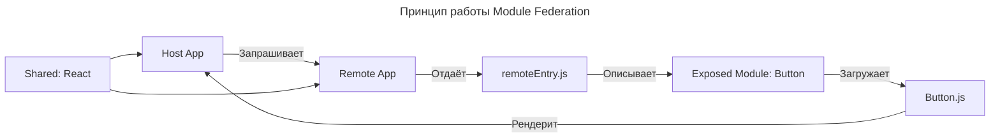

---
aliases:
  - Build-time MF
  - CORS
  - Federation Build
  - Host
  - Host App
  - MF
  - Micro Frontend
  - Microfrontend
  - Module Federation
  - Module Federation Build
  - Remote
  - Remote App
  - Remote Entry
  - remoteEntry.js
  - Shared
  - Webpack
  - Webpack Module Federation Plugin
  - Микрофронтенд
---

## Module Federation

**Module Federation** — это функция Webpack 5, которая переносит микросервисную архитектуру во фронтенд. Она позволяет динамически подключать код из одного приложения в другое на этапе выполнения — без сборки всего в один бандл.

## Что такое Module Federation

**Module Federation (MF)** — это механизм в Webpack 5, позволяющий одному приложению динамически загружать и использовать компоненты, экспортированные другим приложением — в реальном времени, в браузере.

Это не сборка в один бандл — это реальное «подключение» модулей на лету, как если бы они были библиотеками, но созданными независимыми командами.

**Цель**

Создавать независимые фронтенд-приложения (микрофронтенды), которые могут совместно использовать компоненты, стили и логику — без монолитной сборки.

---

## Как устроен Module Federation

### Основные понятия

| Понятие          | Описание                                                                                                      |
| ---------------- | ------------------------------------------------------------------------------------------------------------- |
| **Host**         | Приложение, которое использует компоненты из других приложений                                                 |
| **Remote**       | Приложение, которое экспортирует компоненты для других                                                         |
| **Remote Entry** | Файл (например, `remoteEntry.js`), который содержит метаданные о том, какие модули экспортирует Remote         |
| **Shared**       | Зависимости, которые разделяются между Host и Remote (например, React, Redux)                                 |

### Принцип работы



1. **Host** (например, главный портал) хочет использовать кнопку из **Remote** (например, каталога товаров).
2. Host договаривается с Remote: «Я хочу использовать компонент `Button` из вашего приложения».
3. Host загружает `remoteEntry.js` — файл, который описывает, какие модули доступны.
4. Host загружает нужный модуль (`Button.js`) через динамический импорт.
5. Оба приложения используют один экземпляр React (из `shared`), чтобы не было дублирования.

Все происходит в браузере — без сборки.

**Module Federation Build** — это результат процесса сборки отдельного микрофронтенда с использованием Webpack Module Federation Plugin.

- **Webpack** — сборщик модулей JavaScript с открытым исходным кодом. Написан на JavaScript, но может преобразовывать и внешние ресурсы, такие как HTML, CSS и изображения, если включены соответствующие загрузчики.
- Официальный сайт: webpack.js.org.

По сути, это собранный артефакт (набор JS и CSS файлов), который:

- **Предоставляет («exposes»)** какие-то свои модули (компоненты, утилиты, страницы) для использования другими приложениями.
- **Использует («remotes»)** модули из других Federated Builds.

**Webpack Module Federation Host** (или просто **Host**) — это центральное приложение, которое на этапе своей сборки интегрирует в себя один или несколько **Module Federation Build** от других приложений (которые в этом контексте называются **Remote**).

Здесь заключается суть Build-Time композиции: Host-приложение во время своей сборки «видит» Remote-приложения (их Federation Builds) и включает их код в свой финальный бандл.

---

## Зачем нужен Module Federation

### Проблемы без MF

| Проблема                          | Объяснение                                                                                                             |
| --------------------------------- | ---------------------------------------------------------------------------------------------------------------------- |
| **Монолитный фронтенд**           | Все компоненты собраны в один бандл → медленная сборка, сложная разработка, все команды работают в одном репозитории   |
| **Независимый деплой невозможен** | Чтобы обновить кнопку — нужно пересобрать и перезалить всё приложение                                                  |
| **Дублирование зависимостей**     | Два микрофронтенда используют React — и в итоге в бандле два React                                                     |
| **Команды зависят друг от друга** | Команда A не может выпустить новую версию, пока команда B не готова                                                    |

### Решение: Module Federation

| Преимущество             | Объяснение                                                                                    |
| ------------------------ | --------------------------------------------------------------------------------------------- |
| **Независимые релизы**   | Команда A может обновить свой микрофронтенд — без пересборки приложения B                     |
| **Общие зависимости**    | React, Lodash, CSS-библиотеки — загружаются один раз и разделяются между приложениями         |
| **Разные технологии**    | Одно приложение — React, другое — Vue, третье — Angular — все могут работать вместе           |
| **Масштабируемость**     | Можно добавлять новые микрофронтенды как плагины                                              |
| **Гибкость**             | Можно «выключить» или «заместить» компонент на лету                                           |

Module Federation — это «микросервисы для фронтенда».

---

## Пример: создание Module Federation

Представим:

- **Host App** — главный портал (`main-app`).
- **Remote App** — каталог товаров (`catalog-app`).

### Настройка Remote App (catalog-app)

**webpack.config.js** (Remote)

```js
const { ModuleFederationPlugin } = require('@webpack-cli/webpack');

module.exports = {
  plugins: [
    new ModuleFederationPlugin({
      name: 'catalog', // Имя Remote — будет использоваться в Host
      filename: 'remoteEntry.js', // Файл, который будет загружать Host
      exposes: {
        './Button': './src/Button', // Экспортируем компонент Button
        './ProductList': './src/ProductList',
      },
      shared: {
        react: { singleton: true, requiredVersion: '^18.0.0' },
        'react-dom': { singleton: true, requiredVersion: '^18.0.0' },
      },
    }),
  ],
};
```

- `exposes` — что можно использовать извне.
- `shared` — зависимости, которые разделяются (не дублируются).

### Настройка Host App (main-app)

**webpack.config.js** (Host)

```js
const { ModuleFederationPlugin } = require('@webpack-cli/webpack');

module.exports = {
  plugins: [
    new ModuleFederationPlugin({
      name: 'main',
      remotes: {
        catalog: 'catalog@http://localhost:3001/remoteEntry.js', // URL к remoteEntry.js
      },
      shared: {
        react: { singleton: true, requiredVersion: '^18.0.0' },
        'react-dom': { singleton: true, requiredVersion: '^18.0.0' },
      },
    }),
  ],
};
```

- `remotes` — где искать Remote-приложения.
- `shared` — должны совпадать с Remote.

### Использование компонента в Host

**main-app/src/App.jsx**

```jsx
import React, { Suspense, lazy } from 'react';

const Button = lazy(() => import('catalog/Button'));
const ProductList = lazy(() => import('catalog/ProductList'));

function App() {
  return (
    <div>
      <h1>Главный портал</h1>
      <Suspense fallback="Загрузка...">
        <Button /> {/* Используем компонент из Remote */}
        <ProductList />
      </Suspense>
    </div>
  );
}

export default App;
```

`import('catalog/Button')` — это не обычный импорт, а динамический импорт через Module Federation.

---

## Как это работает в браузере

1. Host загружает `index.html`.
2. Загружается `main.bundle.js`.
3. `main.bundle.js` встречает `import('catalog/Button')`.
4. Он запрашивает `http://localhost:3001/remoteEntry.js` (через JSONP или Fetch).
5. Получает метаданные:

   ```js
   {
     "./Button": () => import("http://localhost:3001/static/js/Button.js")
   }
   ```

6. Загружает `Button.js` по ссылке.
7. Запускает компонент — и он работает так, как будто он из того же приложения.

Все компоненты работают в одном React-экземпляре — потому что `react` объявлен в `shared`.

---

## Практические советы

### Всегда используйте `shared` для React и React DOM

```js
shared: {
  react: { singleton: true, requiredVersion: '^18.0.0' },
  'react-dom': { singleton: true, requiredVersion: '^18.0.0' },
}
```

Без этого — `два React` → ошибки, потеря состояния, дублирование хуков.

### Используйте `singleton: true`

- Гарантирует, что загружается только один экземпляр библиотеки.
- Иначе, если два Remote используют разные версии React, будет конфликт.

### Используйте `import()` с динамическим путём

```js
// Правильно:
const Button = lazy(() => import('catalog/Button'));

// НЕ правильно:
import Button from 'catalog/Button'; // Webpack не знает remote на этапе сборки
```

### Используйте Suspense

Динамические импорты оборачиваются в `<Suspense>`, потому что модуль загружается асинхронно.

```jsx
<Suspense fallback={<div>Загрузка...</div>}>
  <Button />
</Suspense>
```

### Настройте CORS

Remote-приложение должно разрешать запросы с Host-домена.

```js
app.use((req, res, next) => {
  res.header('Access-Control-Allow-Origin', 'http://localhost:3000');
  res.header('Access-Control-Allow-Headers', '*');
  next();
});
```

### Используйте `@module-federation/nextjs` для Next.js

Для Next.js есть официальный плагин:

```bash
npm install @module-federation/nextjs
```

---

## Когда использовать Module Federation

| Сценарий                                                | Подходит?      | Почему                                                   |
| ------------------------------------------------------- | -------------- | -------------------------------------------------------- |
| Микрофронтенды в корпоративном портале                  | Да             | Разные команды, разные релизы                            |
| Постепенная миграция с Angular на React                 | Да             | Можно запускать старые и новые компоненты вместе         |
| SaaS-платформа с плагинами                              | Да             | Плагины — это Remote-приложения                          |
| MVP с 2 компонентами                                    | Нет            | Перебор — сложность не оправдана                         |
| Максимальная скорость загрузки                          | Осторожно      | Первый запрос `remoteEntry.js` — задержка, потом кэш     |
| Монорепозиторий (Nx, Turborepo)                         | Да             | Идеальный способ разделять код без сборки всего          |

---

## Module Federation vs Build-time MF

| Критерий                         | **Module Federation (runtime)**          | **Build-time MF**                            |
| -------------------------------- | ---------------------------------------- | -------------------------------------------- |
| **Когда компоненты собираются**  | На клиенте, при запуске                  | На CI/CD, при сборке                          |
| **Загрузка компонентов**         | Динамическая (через `import()`)          | Через `<script>` в `index.html`              |
| **Версии**                       | Можно менять без пересборки              | Нужно пересобрать главное приложение          |
| **Скорость загрузки**            | Медленнее (1+ HTTP-запрос)               | Быстрее (один HTML)                           |
| **Сложность**                    | Высокая (CORS, версии, shared)           | Низкая                                        |
| **Независимость релизов**        | Высокая                                  | Низкая                                        |
| **Поддержка старых браузеров**   | Плохо (требуется Fetch, ES6)             | Хорошо                                        |
| **Использование в продакшене**   | Да (Spotify, Microsoft, AWS)             | Да (Netflix, Airbnb)                          |

Module Federation — жизнеспособный подход для больших систем; Build-time — для простых, статичных систем.

---

## Примеры реальных компаний

| Компания       | Использование                                                      |
| -------------- | ------------------------------------------------------------------ |
| **Microsoft**  | Office Online — 10+ микрофронтендов (Word, Excel, Teams)          |
| **Spotify**    | Веб-приложение — 30+ микросервисов, все через Module Federation   |
| **AWS**        | AWS Console — разные команды, разные релизы, единый интерфейс      |
| **TikTok**     | Веб-версия — гибкая архитектура с плагинами                        |
| **Zalando**    | Электронная коммерция — независимые команды по категориям товаров  |

---

## Как отладить Module Federation

| Инструмент                 | Зачем                                                                                     |
| -------------------------- | ----------------------------------------------------------------------------------------- |
| **Webpack Bundle Analyzer**| Проверить, что React не дублируется                                                       |
| **DevTools → Network**     | Убедиться, что `remoteEntry.js` загружается                                               |
| **Console**                | Искать ошибки: `Uncaught Error: Module not found` — значит, `remoteEntry.js` недоступен    |
| **React DevTools**         | Проверить, что компоненты работают в одном React-экземпляре                               |

Если React DevTools показывает два экземпляра React — `shared` настроен неправильно.

---

## Лучшие практики

| Правило                                                        | Объяснение                                   |
| -------------------------------------------------------------- | -------------------------------------------- |
| Всегда используйте `shared` для React и React DOM              | Без этого сломается всё                       |
| Используйте `singleton: true`                                  | Гарантирует один экземпляр                    |
| Используйте `requiredVersion`                                  | Чтобы не было конфликта версий                |
| Не экспортируйте `App` — экспортируйте компоненты               | `Button`, `Card`, `Modal` — не целое приложение|
| Публикуйте `remoteEntry.js` на CDN                             | S3 + CloudFront, Vercel, Netlify              |
| Используйте CI/CD для деплоя Remote                            | Каждый Remote — отдельный pipeline            |
| Пишите документацию                                           | Какие компоненты, какие версии, какие зависимости|

---

## Расширения Module Federation

| Технология                              | Назначение                                                    |
| --------------------------------------- | ------------------------------------------------------------- |
| Module Federation + React Router        | Маршруты работают между приложениями                          |
| Module Federation + Micro Frontend Framework | Single SPA управляет загрузкой нескольких MF |
| Module Federation + TypeScript          | `@module-federation/typescript` — типы работают               |
| Module Federation + Webpack 6           | Меньше багов, больше фич                                      |

---

## Итог

| Вопрос                     | Ответ                                                                                                          |
| -------------------------- | -------------------------------------------------------------------------------------------------------------- |
| **Что такое Module Federation?** | Механизм Webpack 5, позволяющий динамически подключать компоненты из других приложений                     |
| **Для чего нужен?**        | Чтобы независимые команды могли работать в одном интерфейсе, без монолита                                       |
| **Как устроен?**           | Host загружает `remoteEntry.js` → узнаёт, какие модули есть → загружает нужный JS-файл → использует его          |
| **Как пользоваться?**      | 1. Настройте `ModuleFederationPlugin` в Webpack. 2. Экспортируйте компоненты (`exposes`). 3. Разделите зависимости (`shared`). 4. Используйте `import('remote/Component')` |
| **Когда использовать?**    | Большая команда, много команд, нужны независимые релизы                                                         |
| **Когда не использовать?** | Одна команда и один проект — перебор                                                                           |

---

## Module Federation и CORS

### Краткий ответ

Module Federation загружает удалённые модули через `<script>` теги, а не через XHR/Fetch.

`<script src="...">` не подпадает под CORS-ограничения браузера.

### Как работает загрузка модулей

#### Область применения CORS

| Ресурс                        | CORS? | Почему                       |
| ----------------------------- | ----- | ---------------------------- |
| `fetch()` / `XMLHttpRequest`  | Да    | Запрос через JavaScript      |
| `WebSocket`                   | Да    | Сетевое соединение           |
| `@font-face`                  | Да    | Шрифты через CSS             |
| `` + canvas              | Да    | Чтение пикселей              |
| **`<script src="...">`**      | Нет   | Исторически разрешено        |
| **`<link rel="stylesheet">`** | Нет   | Исторически разрешено        |

**Module Federation использует `<script>` теги**

```javascript
// webpack runtime создаёт что-то вроде:
const script = document.createElement('script');
script.src = 'https://remote-app.com/remoteEntry.js';
document.head.appendChild(script);

// Это НЕ запускает проверку CORS
```

### Визуализация процесса

```mermaid
---
title: Процесс загрузки remoteEntry.js без CORS
---
sequenceDiagram
    participant Host as Host App (localhost:3000)
    participant Remote as Remote App
    participant API as API-сервер

    Host->>Remote: Загружает remoteEntry.js через &lt;script&gt;
    Note over Host,Remote: Без CORS
    Remote-->>Host: remoteEntry.js
    Host->>Remote: webpack runtime запрашивает модуль (vendors.js)
    Note over Host,Remote: Без CORS
    Remote-->>Host: vendors.js
    Note over Host: Код выполняется в контексте Host App
    Host->>API: API-вызовы из кода
    Note over Host,API: CORS применяется
```

### Детали реализации webpack

#### Загрузка remoteEntry.js

```javascript
// Упрощённый код из webpack runtime
function loadScript(url) {
    return new Promise((resolve, reject) => {
        const script = document.createElement('script');
        script.src = url;
        script.onload = resolve;
        script.onerror = reject;
        document.head.appendChild(script);
    });
}

// Вызов:
loadScript('https://remote-app.com/remoteEntry.js');
// Никаких CORS заголовков не требуется
```

#### Почему `<script>` работает без CORS

| Причина                     | Объяснение                                                    |
| --------------------------- | ------------------------------------------------------------- |
| **Историческая совместимость** | Веб всегда позволял загрузку скриптов с CDN                  |
| **CDN работают так**        | jQuery, React, analytics — всё через `<script>`               |
| **Изоляция выполнения**     | Скрипт выполняется в вашем origin, не имеет доступа к другим  |
| **Риск XSS**                | Обратная сторона: если remote скомпрометирован — это XSS      |

### Когда CORS применяется

#### API-вызовы из микрофронтенда

```javascript
// remote-app.com/src/Component.js
export function fetchData() {
    return fetch('https://api.backend.com/data');
    // CORS применяется! Нужны заголовки от api.backend.com
}
```

#### Загрузка ассетов через JavaScript

```javascript
// CORS применяется
const img = new Image();
img.crossOrigin = 'anonymous';
img.src = 'https://cdn.example.com/image.png';

// CORS не применяется (прямой HTML)

```

#### Fetch для загрузки модулей (если кастомизировано)

```javascript
// Если вы переопределили загрузчик:
fetch('https://remote-app.com/remoteEntry.js')
    .then(r => r.text());
// CORS применяется! Нужны заголовки
```

### Безопасность: о чём нужно знать

#### Риски Module Federation

| Риск                       | Описание                                                        | Митигация                                        |
| -------------------------- | --------------------------------------------------------------- | ------------------------------------------------ |
| **XSS через remote**       | Если remote скомпрометирован — выполняется в вашем origin       | Доверяйте только контролируемым remote           |
| **Нет Subresource Integrity** | webpack не поддерживает SRI для Module Federation             | Используйте HTTPS + доверяйте источнику          |
| **Утечка данных**          | Remote код имеет доступ к вашему DOM, localStorage, cookie      | Изолируйте через sandbox/iframe, если нужно      |
| **Supply chain attack**    | Зависимости remote могут быть скомпрометированы                 | Lock версии, используйте private registry        |

#### Лучшие практики безопасности

```javascript
// Настройте trusted remotes в webpack.config.js
new ModuleFederationPlugin({
    remotes: {
        remoteApp: 'remoteApp@https://trusted-domain.com/remoteEntry.js'
    },
    // Фиксируйте версии shared зависимостей
    shared: {
        react: { singleton: true, requiredVersion: '^18.0.0' },
        'react-dom': { singleton: true, requiredVersion: '^18.0.0' }
    }
});

// Используйте HTTPS для всех remote
// Избегайте HTTP (риск MITM атаки)

// Мониторьте remote на изменения
// Имейте план отката, если remote сломался
```

### Примеры появления CORS

#### Module Federation без CORS

```javascript
// host-app.com
import { RemoteComponent } from 'remoteApp/Component';
// Загружается через <script> — нет CORS
```

#### API-вызов из remote — CORS применяется

```javascript
// remote-app.com/Component.js
export function RemoteComponent() {
    useEffect(() => {
        fetch('https://api.host-app.com/data')
            // CORS! api.host-app.com должен вернуть:
            // Access-Control-Allow-Origin: https://remote-app.com
    }, []);
}
```

#### Кастомная загрузка — CORS применяется

```javascript
// Если вы сами загружаете модули через fetch:
const module = await fetch('https://remote.com/module.js');
// Нужны CORS заголовки от remote.com
```

### Чек-лист для production

- Все remote на HTTPS.
- Remote домены под вашим контролем.
- API-вызовы имеют правильные CORS заголовки.
- Shared-зависимости зафиксированы (singleton).
- Есть мониторинг доступности remote.
- План отката при проблемах с remote.
- Content Security Policy настроен.
- Subresource Integrity (если возможно).

### Памятка

- Module Federation → `<script>` теги → нет CORS.
- API-вызовы → fetch/XHR → CORS применяется.
- Безопасность: доверяйте только контролируемым remote.
- Remote-код выполняется в вашем origin (риск XSS).

### Итог

| Вопрос                                   | Ответ                                          |
| ---------------------------------------- | ---------------------------------------------- |
| **Почему нет CORS для модулей?**         | Загрузка через `<script>` теги                 |
| **Применяется ли CORS вообще?**          | Да, для API-вызовов из кода                    |
| **Безопасно ли это?**                    | Только если доверяете remote                   |
| **Можно ли загрузить любой remote?**     | Технически да, но это риск XSS                 |
| **Нужны ли CORS заголовки от remote?**   | Нет для модулей, да для API                    |

### Настройка CORS для API

Если микрофронтенды делают API-вызовы:

```javascript
// Node.js (Express)
app.use((req, res, next) => {
    res.header('Access-Control-Allow-Origin', 'https://host-app.com');
    res.header('Access-Control-Allow-Methods', 'GET, POST, PUT, DELETE');
    res.header('Access-Control-Allow-Headers', 'Content-Type, Authorization');
    next();
});
```

```java
// Spring Boot
@Configuration
public class CorsConfig {
    @Bean
    public WebMvcConfigurer corsConfigurer() {
        return new WebMvcConfigurer() {
            public void addCorsMappings(CorsRegistry registry) {
                registry.addMapping("/api/**")
                    .allowedOrigins("https://host-app.com", "https://remote-app.com");
            }
        };
    }
}
```
