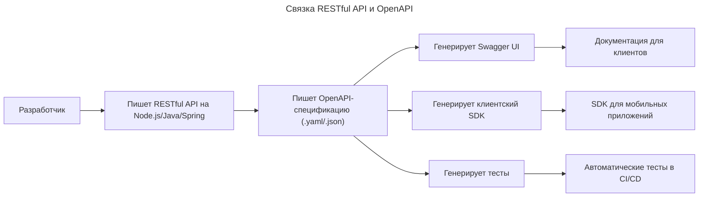

---
aliases:
  - Client-Server
  - Collection+JSON
  - HATEOAS
  - HAL
  - HTTP
  - Hypertext Transfer Protocol
  - JSON-LD
  - OpenAPI
  - REST
  - REST API
  - RESTful
  - Roy Fielding
  - Siren
  - Swagger
  - Swagger UI
  - Uniform Interface
  - Гипермедиа как двигатель состояния приложения
  - Репрезентативная передача состояния
  - Рой Филдинг
---

## REST, REST API и RESTful

**Суть**
HTTP, REST, REST API и RESTful — это не синонимы, а разные уровни абстракции. HTTP — протокол передачи данных, REST — архитектурный стиль, REST API — реализация API по принципам REST, RESTful — характеристика API, соответствующего принципам REST.

## HTTP

**Определение**

HTTP (HyperText Transfer Protocol) — это протокол передачи данных для распределённых гипертекстовых систем. Он определяет, как клиент и сервер обмениваются сообщениями по сети.

**Ключевые особенности**
- Протокол прикладного уровня (уровень 7 модели OSI).
- Работает поверх TCP/IP.
- Запрос-ответ: клиент отправляет запрос → сервер возвращает ответ.
- Без состояния (stateless) — каждый запрос независим.
- Использует методы (verbs): `GET`, `POST`, `PUT`, `DELETE`, `PATCH` и др.
- Использует заголовки (headers) и тело (body) сообщений.
- Поддерживает коды состояния: `200 OK`, `404 Not Found`, `500 Internal Server Error`.

**Пример HTTP-запроса**

```http
GET /users/123 HTTP/1.1
Host: api.example.com
Accept: application/json
```

**Ответ**

```http
HTTP/1.1 200 OK
Content-Type: application/json

{
  "id": 123,
  "name": "Alice"
}
```

HTTP — это транспорт. Как почта: конверт, марка, адрес. Он ничего не говорит о том, что внутри письма — только как его доставить.

## REST

**Определение**

REST (Representational State Transfer) — это архитектурный стиль, предложенный Рой Филдинг (Roy Fielding) #👨 в 2000 году в его диссертации. Это набор принципов и ограничений, которые описывают, как должны быть устроены масштабируемые, надёжные и простые веб-системы.

**Шесть ограничений REST**

| Ограничение | Описание |
| ----------- | ------- |
| Client-Server | Разделение интерфейса и данных — клиент и сервер независимы |
| Stateless | Каждый запрос должен содержать всю информацию для его выполнения — сервер не хранит состояние сессии |
| Cacheable | Ответы должны помечаться как кэшируемые или нет — чтобы улучшить производительность |
| Uniform Interface | Единый интерфейс между клиентом и сервером — основной принцип |
| Layered System | Клиент не знает, есть ли промежуточные слои (балансировщики, кэши, шлюзы) |
| Code on Demand (опционально) | Сервер может отправлять исполняемый код (например, JavaScript) для расширения клиента |

**Uniform Interface**

Uniform Interface — самое важное ограничение REST. Оно включает 4 подпринципа:
1. Идентификация ресурсов — всё является ресурсом (User, Product, Order), идентифицируется через URI (например, `/users/123`).
2. Манипуляция ресурсами через представления — клиент работает с представлением ресурса (JSON, XML), а не с самим ресурсом.
3. Самоописываемые сообщения — каждый запрос/ответ содержит метаданные (Media Type, encoding, headers), чтобы клиент понял, как его обработать.
4. Гипермедиа как движущая сила состояния (HATEOAS) — ответы должны содержать ссылки на другие действия (например, `"next": "/users?after=123"`).

REST — это не протокол, не стандарт, не технология. Это философия проектирования.

## REST API

**Определение**

REST API — это реализация API (Application Programming Interface), которая следует принципам REST. Это конкретная реализация архитектурного стиля REST на основе HTTP.

**Пример REST API**

```http
GET    /api/users           → список всех пользователей
GET    /api/users/123       → получить пользователя с ID=123
POST   /api/users           → создать нового пользователя
PUT    /api/users/123       → обновить полностью пользователя
PATCH  /api/users/123       → частично обновить пользователя
DELETE /api/users/123       → удалить пользователя
```

- Использует HTTP методы (`GET`, `POST` и т. д.).
- Все ресурсы имеют URI.
- Данные передаются в формате JSON/XML.
- Ответы содержат правильные HTTP-статусы (`201 Created`, `404 Not Found`).

**Почему это REST API**
- ✔️ Ресурсы идентифицируются через URI
- ✔️ Используются стандартные HTTP методы
- ✔️ Без сохранения состояния на сервере
- ✔️ Сообщения самоописываемы (Content-Type: application/json)
- ❌ HATEOAS часто игнорируется — но это не обязательное требование в практике

REST API — это то, что реально видно в продакшене: веб-API, который использует HTTP и соответствует основным принципам REST.

## RESTful

**Определение**

RESTful — это прилагательное, означающее «соответствующий принципам REST»:
- Если API соблюдает все или большинство ограничений REST — он RESTful.
- Если он использует HTTP, но не имеет URI-ресурсов или игнорирует методы — он не RESTful.

## Сводная таблица: HTTP vs REST vs REST API vs RESTful

| Термин | Что это? | Пример | Можно ли использовать без другого? |
|--------|----------|--------|-----------------------------------|
| **HTTP** | Протокол передачи данных | `GET /users HTTP/1.1` | Да — можно использовать отдельно (например, для загрузки файлов) |
| **REST** | Архитектурный стиль | Принципы: stateless, uniform interface, HATEOAS | Да — теоретическая модель, не требует HTTP |
| **REST API** | Реализация API по REST-принципам | `GET /users/123` → JSON | Да — это конкретный API, обычно на HTTP |
| **RESTful** | Прилагательное: «соответствует REST» | API RESTful, потому что использует правильные методы и URI | Нет — это характеристика, а не объект. Нельзя иметь RESTful без REST API |

**Аналогия**
- HTTP — как почтовая система (почтовые отделения, конверты, марки).
- REST — как правила хорошего письма: «пиши ясно, указывай адрес, включи ссылку на следующее письмо».
- REST API — конкретное письмо, написанное по этим правилам.
- RESTful — «это письмо написано правильно» → значит, оно RESTful.

## Практические различия: REST API vs RPC-style

| Характеристика | Не RESTful (RPC-style) | RESTful |
|----------------|------------------------|---------|
| **URI** | `/getUserById?id=123` | `/users/123` |
| **Методы** | Все `POST` → `action=createUser`, `action=deleteUser` | `GET /users`, `POST /users`, `DELETE /users/123` |
| **Статусы** | Всегда `200 OK`, ошибки в теле JSON | `404 Not Found`, `400 Bad Request`, `201 Created` |
| **Формат данных** | JSON/XML | JSON/XML, но с `Content-Type` |
| **HATEOAS** | ❌ Нет ссылок | Иногда есть: `{ "links": [{ "rel": "next", "href": "/users?page=2" }] }` |
| **Состояние** | Может хранить сессию на сервере | Никакого состояния — каждый запрос самостоятельный |
| **Кэширование** | Обычно не используется | Используется через `Cache-Control` |

Большинство «REST» API в мире — не полностью RESTful, потому что HATEOAS почти никогда не реализован. Но если они используют HTTP методы + URI-ресурсы + правильные статусы — их всё равно называют REST API.

## Почему много путаницы

1. **REST — это архитектура**, а не спецификация.
   - Люди говорят «REST», когда имеют в виду просто «HTTP + JSON».
2. **Google, Facebook, Twitter** используют HTTP+JSON — и называют это «REST API», хотя не соблюдают HATEOAS.
   - Это стало де-факто стандартом — даже если формально не REST.
3. **Слово «RESTful»** звучит солиднее, чем «HTTP API» — поэтому его используют даже там, где это не совсем верно.

**На практике**
- REST API = HTTP + JSON/XML + CRUD-методы + URI-ресурсы
- RESTful = «хороший» REST API (хотя бы с соблюдением 4–5 из 6 ограничений)
- Настоящий REST (с HATEOAS) — редкость. Примеры: [HAL](https://github.com/mikekelly/hal-spec), [Siren](https://github.com/kevinswiber/siren)

## Когда что использовать

| Цель | Рекомендация |
|------|--------------|
| Создать современный веб-API для мобильных/веб-клиентов | REST API (HTTP + JSON + URI + методы) — стандарт де-факто |
| Сделать API максимально стандартизированным и автономным | RESTful с HATEOAS (для внутренних систем, где нужна самоописуемость) |
| Построить высокопроизводительный микросервис | gRPC — лучше, чем REST, для внутренней коммуникации |
| Публичный API для сторонних разработчиков | REST API — самый удобный, понятный, поддерживаемый |
| Запросить данные из внешнего сервиса (например, погоду) | HTTP + JSON — неважно, RESTful или нет — главное, чтобы работало |

## Цитата Роя Филдинга

> «REST is not a standard. It's an architectural style. Most of what people call 'REST APIs' are just HTTP APIs. If you're using HTTP and returning JSON, you're not necessarily RESTful — but you're doing fine.»

Рой Т. Филдинг, автор REST.

Вывод:
- Не обязательно делать HATEOAS, чтобы быть успешным.
- Достаточно использовать HTTP правильно — и API будет называться «REST API», даже если не идеально RESTful.

## Финальный вывод

| Термин | Что это? | Главная идея |
|--------|----------|---------------|
| **HTTP** | Протокол | Как передавать данные по сети |
| **REST** | Архитектурный стиль | Как проектировать масштабируемые системы (6 ограничений) |
| **REST API** | Реализация API | Использование HTTP + URI + методы + JSON/XML |
| **RESTful** | Характеристика | «Этот API соответствует принципам REST» — более или менее строго |

- Все REST API работают поверх HTTP, но не все HTTP API — REST API.
- Все RESTful API — REST API, но не все REST API — RESTful.
- HTTP — основа. REST — дизайн. REST API — реализация. RESTful — оценка качества.

**Метафора**

> HTTP — это дорога.
> REST — это правила дорожного движения: езжай по полосе, не пересекай сплошную, стой на красный.
> REST API — это автомобиль, который едет по этой дороге по правилам.
> RESTful — это машина, которая ездит идеально: с поворотниками, светом и даже с GPS, который подсказывает следующую дорогу (HATEOAS).

API на HTTP-методах, URI-ресурсах, правильных статусах и JSON — это уже REST API. HATEOAS красив, но в большинстве случаев избыточен. Главное — быть последовательным, предсказуемым и простым.

## HATEOAS

**Определение**

HATEOAS — один из самых важных, но при этом наиболее непонятных и часто игнорируемых принципов архитектуры REST.

Полное название — Hypermedia As The Engine Of Application State (гипермедиа как двигатель состояния приложения).

Определение (по Рою Филдингу, автору REST): клиент должен взаимодействовать с API не через заранее известные URL-шаблоны, а через гиперссылки, получаемые в ответах от сервера. То есть сервер говорит клиенту, какие действия можно выполнить next, а не клиент «знает» заранее, что нужно вызвать `/users/123/orders`.

**Как работает технически**

Обычный (не HATEOAS) API:

```http
GET /api/users/123
```

```json
{
  "id": 123,
  "name": "Alice",
  "email": "alice@example.com"
}
```

Клиент должен знать заранее, что:
- чтобы получить заказы — нужно вызвать `GET /api/users/123/orders`
- чтобы обновить — `PUT /api/users/123`
- чтобы удалить — `DELETE /api/users/123`

Это жёсткая связь между клиентом и сервером. Если сервер изменит структуру URL (`/users/123/profile` вместо `/users/123`) — клиент сломается.

**HATEOAS-ответ**

```http
GET /api/users/123
```

```json
{
  "id": 123,
  "name": "Alice",
  "email": "alice@example.com",
  "_links": {
    "self": { "href": "/api/users/123" },
    "orders": { "href": "/api/users/123/orders", "method": "GET" },
    "update": { "href": "/api/users/123", "method": "PUT" },
    "delete": { "href": "/api/users/123", "method": "DELETE" },
    "avatar": { "href": "/api/users/123/avatar", "type": "image/png" }
  }
}
```

| Элемент | Значение |
|--------|----------|
| `_links` | Специальное поле с гиперссылками (не часть данных, а метаданные о доступных действиях) |
| `self` | Ссылка на текущий ресурс |
| `orders` | Можно получить список заказов этого пользователя |
| `update` | Можно обновить пользователя (PUT) |
| `delete` | Можно удалить пользователя (DELETE) |
| `avatar` | Можно получить аватар (бинарные данные) |

Клиент не знает заранее, какие URL существуют. Он парсит `_links` и выбирает действие на основе имени связи (`"orders"`, `"update"`), а не по жёстко заданному пути.

**Почему это важно**

| Проблема без HATEOAS | Как решает HATEOAS |
|----------------------|-------------------|
| Клиент «знает» структуру API — если URL меняется — всё ломается | Сервер сам говорит, куда идти — клиент не зависит от структуры URL |
| Нужно документировать все возможные эндпоинты | Документация сводится к одной начальной точке — дальше клиент «ходит» по ссылкам |
| Сложно масштабировать (например, добавить новую функцию) | Новая функция = новый `_link` — клиенты, которые её не понимают, просто её игнорируют |
| Трудно создать универсальный клиент | Клиент может быть общим — он умеет только читать `_links` и делать HTTP-запросы по ним |

HATEOAS превращает API из статической схемы в динамическую, самоописываемую систему.

**Аналогия: веб-браузер vs REST API**

| Веб-браузер | Не HATEOAS API | HATEOAS API |
|-------------|----------------|--------------|
| Открываете `https://example.com` | Звонок в поддержку: «Где кнопка оплаты?» | Заходите на сайт — и все кнопки уже есть |
| Кликаете по ссылкам — они ведут на другие страницы | Использование фиксированного URL `/pay` | Видите `<a href="/pay">Оплатить</a>` |
| Не знаете, как устроен сайт — следуете ссылкам | Нужно знать, что `/pay` существует | Не знаете, что будет дальше — но подсказывают, куда идти |
| Браузер работает с любым сайтом | Клиент ломается, если URL изменился | Клиент работает с любым HATEOAS-API, даже если он поменялся |

HATEOAS делает API таким же гибким, как интернет: структура Wikipedia неизвестна заранее, но её можно исследовать, переходя по ссылкам.

**Реальные примеры HATEOAS**

Формат HAL (Hypertext Application Language) — самый популярный формат для реализации HATEOAS:

```json
{
  "id": 123,
  "name": "Alice",
  "_embedded": {
    "orders": [
      {
        "id": 456,
        "total": 99.99,
        "_links": {
          "self": { "href": "/orders/456" },
          "cancel": { "href": "/orders/456/cancel", "method": "POST" }
        }
      }
    ]
  },
  "_links": {
    "self": { "href": "/users/123" },
    "profile": { "href": "/profiles/user" },
    "next_page": { "href": "/users?page=2" }
  }
}
```

Клиент видит:
- у пользователя есть заказы (`_embedded`)
- каждый заказ имеет ссылку на отмену
- есть ссылка на следующую страницу пользователей

Формат Siren (альтернатива HAL):

```json
{
  "class": ["user"],
  "properties": {
    "id": 123,
    "name": "Alice"
  },
  "actions": [
    {
      "name": "update-user",
      "method": "PUT",
      "href": "/users/123",
      "fields": [
        { "name": "name", "type": "text" }
      ]
    }
  ],
  "links": [
    { "rel": ["orders"], "href": "/users/123/orders" }
  ]
}
```

В Siren не просто ссылки — можно даже узнать, какие поля нужны для PUT.

**Почему HATEOAS почти не используется**

| Причина | Объяснение |
| ------- | ---------- |
| **Сложность для клиентов** | Нужно писать парсеры, а не просто `fetch('/users/123')` |
| **Нет стандартной библиотеки** | В React/Angular/Flutter нет встроенной поддержки HATEOAS |
| **Замедляет разработку** | Разработчикам проще жестко кодировать URL |
| **Избыточность** | Внутренние микросервисы не нуждаются в динамическом обнаружении — им всё известно заранее |
| **Документация важнее** | Компании предпочитают Swagger/[[open-api]] — человек читает, а не клиент ходит по ссылкам |
| **HTTP/REST уже стал синонимом «JSON + CRUD»** | Многие считают, что `GET /users` — это уже REST. HATEOAS — «перебор» |

> Roy Fielding: «If you're not using HATEOAS, you're not building a RESTful system. But if you're building an API for internal use or mobile apps, it's fine to ignore it — just don't call it 'REST' if you're not following all the constraints.»

**Когда использовать HATEOAS**

| Сценарий | Рекомендация |
|----------|--------------|
| Публичный API для сторонних разработчиков | Идеально — клиенты адаптируются к изменениям без перекомпиляции |
| Долгоживущие системы с частыми изменениями | Например, банки, страховые компании — можно менять структуру без сломанных клиентов |
| Автономные/дисконтинуированные клиенты | Например, мобильное приложение, работающее офлайн — HATEOAS позволяет ему «обновиться» при следующем подключении |
| Машинно-машинное взаимодействие без человеческой документации | Например, IoT-устройства — они «учатся» по ссылкам |
| Внутренние микросервисы | Избыточно — все сервисы контролируются одной командой |
| Быстрый прототип или MVP | Усложнять не стоит — достаточно простого REST API |

**Как внедрить HATEOAS**

**Форматы**
- **HAL** — самый распространённый, поддерживается Spring, ASP.NET, Node.js
- **Siren** — более мощный, с действиями и полями
- **JSON-LD** — для семантического веба
- **Collection+JSON** — простой, но малоизвестный

**Настройка сервера**

**Пример на Spring Boot (Java)**

```java
@RestController
public class UserController {

    @GetMapping("/users/{id}")
    public EntityModel<User> getUser(@PathVariable Long id) {
        User user = userService.findById(id);
        EntityModel<User> model = EntityModel.of(user);
        model.add(Link.of("/users/" + id + "/orders", "orders"));
        model.add(Link.of("/users/" + id, "update").withMethod(HttpMethod.PUT));
        return model;
    }
}
```

Возвращает HAL-формат автоматически.

**Пример на Node.js (Express + halson)**

```js
app.get('/users/:id', (req, res) => {
  const user = db.findUser(req.params.id);
  const hal = new Halson(user);
  hal.link('orders', `/users/${user.id}/orders`);
  hal.link('update', `/users/${user.id}`, { method: 'PUT' });
  res.json(hal.toJSON());
});
```

**Клиент, читающий `_links`**

```js
// Не пишите: fetch('/users/123/orders')
// Пишите:
const response = await fetch('/users/123');
const data = await response.json();

const ordersLink = data._links?.orders?.href;
if (ordersLink) {
  const orders = await fetch(ordersLink);
  // ... дальше
}
```

Клиент становится устойчивым к изменениям — если URL изменится, сервер сам скажет, куда идти.

**Финальный вывод**

| Вопрос | Ответ |
|--------|-------|
| **Это обязательная часть REST?** | Да — по определению Роя Филдинга. Без HATEOAS это не полноценный REST |
| **Нужно ли его использовать в продакшене?** | Не обязательно — большинство успешных API (Twitter, GitHub, Stripe) его не используют |
| **Стоит ли его внедрять?** | Только если: API публичный, долгосрочный, клиенты — сторонние разработчики, и есть готовность к дополнительной сложности |
| **Как его называть?** | Если используется HATEOAS — API стоит называть «HATEOAS-enabled», а не просто «REST» |
| **Что выбрать для нового проекта?** | REST API — да. HATEOAS — если строится система на десятилетия, а не MVP |

REST без HATEOAS — как автомобиль без руля: он едет, но непонятно, куда повернёт следующий. HATEOAS — это руль: не обязателен для поездки, но делает систему гибкой и устойчивой к изменениям.

**Ссылки**

- Roy Fielding's Dissertation, Chapter 5 (dissertation on REST architecture)
- HAL Specification (RFC 8791) — [HAL](https://tools.ietf.org/html/rfc8791)
- [Spring HATEOAS Docs](https://docs.spring.io/spring-hateoas/docs/current/reference/html/)
- Understanding HATEOAS — Martin Fowler (Richardson Maturity Model)

## OpenAPI

**Определение**

RESTful API — это что делается, OpenAPI — как это описывается. OpenAPI (ранее Swagger Specification) — это стандарт для описания RESTful API в машинно-читаемом формате (YAML или JSON).

Это документация в виде спецификации, которая описывает всё:
- какие эндпоинты есть
- какие методы поддерживаются
- какие параметры принимаются
- какие ответы возвращаются
- какие коды ошибок возможны
- какие модели данных используются

**Пример спецификации (YAML)**

```yaml
openapi: 3.0.3
info:
  title: User API
  version: 1.0.0

paths:
  /users/{id}:
    get:
      summary: Get user by ID
      parameters:
        - name: id
          in: path
          required: true
          schema:
            type: integer
            minimum: 1
      responses:
        '200':
          description: Success
          content:
            application/json:
              schema:
                $ref: '#/components/schemas/User'
        '404':
          description: User not found

components:
  schemas:
    User:
      type: object
      properties:
        id:
          type: integer
        name:
          type: string
        email:
          type: string
          format: email
```

**Что даёт OpenAPI**

| Возможность | Описание |
|------------|----------|
| **Автоматическая документация** | Генерирует интерактивную документацию (Swagger UI) |
| **Генерация клиентского кода** | Можно сгенерировать SDK для Python, Java, JavaScript и др. |
| **Валидация запросов/ответов** | Сервер может автоматически проверять входящие данные |
| **Тестирование API** | Инструменты вроде Postman, Insomnia, Karate могут импортировать OpenAPI |
| **Интеграция с CI/CD** | Автоматические тесты на соответствие спецификации |

OpenAPI — это чертёж RESTful API. Он не реализует API — он описывает его.

**Практический пример: без OpenAPI vs с OpenAPI**

Без OpenAPI — «мы сделали REST»:

```http
GET /users/123
→ { "id": 123, "name": "Alice", "email": "alice@example.com" }
```

Вопросы, которые возникают у клиента:
- Что, если пользователя нет? Вернётся 404 или `{}`?
- Какие поля обязательны при создании?
- Можно ли сортировать пользователей?
- Какой формат даты?
- Что за поле `last_login`? Это строка или timestamp?

Нужна документация в Word/PDF, которую никто не читает, и она быстро устаревает.

С OpenAPI — всё описано:

```yaml
/get/users/{id}:
  parameters:
    - name: id
      in: path
      required: true
      schema:
        type: integer
        minimum: 1
  responses:
    '200':
      description: OK
      content:
        application/json:
          schema:
            type: object
            properties:
              id:
                type: integer
              name:
                type: string
                minLength: 1
              email:
                type: string
                format: email
              last_login:
                type: string
                format: date-time
    '404':
      description: User not found
      content:
        application/json:
          schema:
            type: object
            properties:
              error:
                type: string
                example: "User with id 999 not found"
```

На основе этого файла:
- генерируется интерактивная документация [Swagger UI](https://swagger.io/tools/swagger-ui/)
- генерируются клиентские библиотеки для Android, iOS, React, .NET
- автоматически пишутся тесты
- сервер может валидировать входящие запросы
- QA-инженеры знают, что именно ожидать

**Когда нужен OpenAPI**

| Сценарий | Рекомендация |
|----------|--------------|
| Публичный API для внешних разработчиков | Обязательно! Без OpenAPI API будет неудобным и непонятным |
| Работа в команде из 5+ человек | OpenAPI — единый источник правды, чтобы все понимали API одинаково |
| Использование CI/CD и автоматического тестирования | OpenAPI позволяет генерировать тесты и проверять совместимость |
| Использование микросервисов | OpenAPI помогает интегрировать сервисы без постоянных встреч |
| MVP или внутренний API | Можно обойтись без него — но тогда документация должна быть всегда актуальной |
| Автоматическая генерация SDK | Только с OpenAPI |

**Как связать RESTful API и OpenAPI**

RESTful API пишется и одновременно описывается в OpenAPI:



Современные фреймворки (Spring Boot, FastAPI, NestJS, ASP.NET Core) позволяют автоматически генерировать OpenAPI из аннотаций кода.

**Пример (FastAPI — Python)**

```python
from fastapi import FastAPI

app = FastAPI()

@app.get("/users/{user_id}")
def read_user(user_id: int):
    return {"id": user_id, "name": "Alice"}
```

Документация сразу доступна: `http://localhost:8000/docs`

**Важное замечание: OpenAPI ≠ REST**

В OpenAPI можно описать и не-REST API. Например, RPC-style endpoint:

```yaml
/post:
  post:
    operationId: createUser
    requestBody:
      content:
        application/json:
          schema:
            type: object
            properties:
              name: {type: string}
```

Это не RESTful — потому что используется `POST` для создания, а не `POST /users`, и нет URI-ресурсов. Но OpenAPI может описать это тоже — он универсален.

OpenAPI — это язык описания любых API, не только RESTful. Но чаще всего его используют именно для RESTful.

**Финальный совет**

- RESTful API — это то, чем пользуются.
- OpenAPI — это то, чем рассказывают другим, как этим пользоваться.
- Лучший API — не тот, что работает, а тот, что легко понять.
- OpenAPI превращает RESTful API из «загадки» в «инструкцию»: это минимальная цена за профессионализм в мире API.

**Ссылки**
- [OpenAPI Specification (OAS) 3.1](https://spec.openapis.org/oas/v3.1.0)
- [Swagger UI Demo](https://petstore.swagger.io/)
- [FastAPI — Автоматический OpenAPI](https://fastapi.tiangolo.com/)
- [Spring Boot + OpenAPI](https://springdoc.org/)
- Book: «Designing Web APIs» by Brenda Jin, Saurabh Sahni #📘
