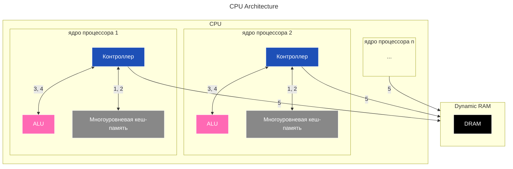
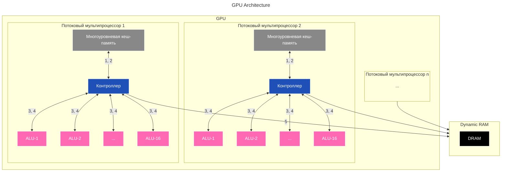

---
aliases:
  - ALU
  - Arithmetic Logic Unit
  - Central Processing Unit
  - Compute Unified Device Architecture
  - CPU
  - CUDA
  - CUDA cores
  - CUDA-ядра
  - Floating Point Unit
  - FPU
  - General-Purpose computing on Graphics Processing Units
  - GPGPU
  - GPU
  - Graphics Processing Unit
  - Heterogeneous computing
  - Latency
  - Load/Store Unit
  - nvcc
  - oneAPI
  - OpenCL
  - ROCm
  - SIMT
  - Single Instruction Multiple Thread
  - SM
  - Streaming Multiprocessor
  - Throughput
  - Warp
  - арифметико-логическое устройство
  - варп
  - гетерогенные вычисления
  - графический процессор
  - задержка
  - потоковый мультипроцессор
  - пропускная способность
  - центральный процессор
---

---

## Аппаратная архитектура CPU

CPU Architecture



## Аппаратная архитектура GPU

GPU Architecture



---

## Сравнение CPU и GPU: архитектура и принципы работы

### Схемы аппаратной архитектуры

**CPU (Central Processing Unit) — центральный процессор**

Состав ядра CPU:

- Control Unit — блок управления.
- ALU (Arithmetic Logic Unit) — арифметико-логическое устройство.
- L1/L2 Cache — кэш-память.
- FPU (Floating Point Unit) — устройство для операций с плавающей точкой.
- Load/Store Unit — блок загрузки/записи.

**Характеристики CPU:**

- 1–32 мощных ядра
- Большой кэш (L1, L2, L3)
- Сложная логика предсказания ветвлений
- Высокая тактовая частота (2–5 GHz)

**GPU (Graphics Processing Unit) — графический процессор**

GPU состоит из потоковых мультипроцессоров (Streaming Multiprocessor, SM); в каждом мультипроцессоре размещены CUDA-ядра (32–128 на SM).

**Характеристики GPU:**

- 1000–10000 простых ядер
- Маленький кэш
- Простая логика управления
- Низкая тактовая частота (1–2 GHz)

### Схемы работы и выполнения задач

**CPU — последовательная обработка**

Задачи выполняются по очереди: task A, task B, task C, task D. Каждое ядро последовательно обрабатывает свою цепочку задач.

**GPU — параллельная обработка**

Все задачи запускаются одновременно: каждое ядро обрабатывает одну подзадачу параллельно с остальными (task A на всех ядрах).

### Принцип Latency vs Throughput

**CPU — оптимизирован для latency**

```python
# Быстро выполняет одну сложную задачу
result = complex_calculation(data)
# Минимальное время ожидания
```

**GPU — оптимизирован для throughput**

```python
# Медленно выполняет одну задачу, но тысячи одновременно
results = [simple_calculation(x) for x in million_data_points]
# Максимальный объем работы за время
```

### Архитектурные различия в деталях

| Характеристика | CPU | GPU |
| --- | --- | --- |
| Управляющая логика | Complex Control: branch prediction, out-of-order, speculative | Simple Control: SIMD, lockstep execution |
| Исполняющие блоки | Few powerful ALUs/FPUs: сложные операции, высокая частота | Many simple ALUs: простые операции, массовый параллелизм |

### Практические примеры использования

**CPU — идеальные задачи**

```java
// Сложная логика с ветвлениями
if (user.isPremium() && order.isValid()) {
    applyDiscount(calculateComplexDiscount(user, order));
} else {
    processStandardPayment(order);
}

// Рекурсивные алгоритмы
int fibonacci(int n) {
    if (n <= 1) return n;
    return fibonacci(n-1) + fibonacci(n-2);
}
```

**GPU — идеальные задачи**

```python
# Матричные операции
matrix_a @ matrix_b  # Умножение матриц

# Обработка изображений
for pixel in image:   # Каждый пиксель независимо
    pixel = transform(pixel)

# Машинное обучение
neural_network.forward_pass(batch_of_1000_images)
```

### Современные гибридные подходы

**Heterogeneous computing** — приложение комбинирует CPU и GPU:

- CPU — сложная логика, контроль потока управления.
- GPU — массово-параллельные задачи.
- Данные передаются между CPU и GPU.

### Производительность в числах

| Параметр | CPU | GPU |
|----------|-----|-----|
| Ядер | 4-64 | 1000-10000+ |
| Тактовая частота | 2-5 GHz | 1-2 GHz |
| Потребление | 65-300W | 250-500W |
| Память | DDR4/5 (50GB/s) | GDDR6/X (500-1000GB/s) |
| FP32 производительность | ~1 TFLOPS | ~20-50 TFLOPS |

### Экономика и стоимость

**Особенности CPU:**

- ✅ Универсальность, низкая задержка
- ❌ Высокая стоимость на ядро, ограниченный параллелизм

**Особенности GPU:**

- ✅ Высокий параллелизм, стоимость/производительность
- ❌ Сложное программирование, высокое энергопотребление

**Вывод**

CPU — «спорткар» для быстрых сложных задач с ветвлениями. GPU — «грузовик» для перевозки огромного объёма простых вычислений.

Правильный выбор зависит от конкретной задачи: сложная логика → CPU, массовые параллельные вычисления → GPU.

---

## CUDA-ядра

### Что такое CUDA-ядра

CUDA расшифровывается как Compute Unified Device Architecture («унифицированная архитектура вычислительных устройств»):

- **Compute** — вычисления (архитектура предназначена не только для графики, но и для общих вычислительных задач).
- **Unified** — унифицированная (единый подход к программированию разных типов вычислительных блоков в GPU).
- **Device Architecture** — архитектура устройства (низкоуровневая организация аппаратных ресурсов GPU).

CUDA-ядра — это специализированные вычислительные блоки в графических процессорах (GPU) компании NVIDIA, предназначенные для параллельной обработки большого количества простых операций.

> **Важно:** это *не* аналоги CPU-ядер. CUDA-ядра проще по архитектуре и работают только в составе GPU, выполняя узкоспециализированные задачи.

### Ключевые особенности

- **Параллелизм**
  - Одно GPU содержит тысячи CUDA-ядер (например, RTX 4090 — 16 384 ядра).
  - Каждое ядро выполняет одну простую операцию над одним элементом данных.
  - Тысячи операций выполняются одновременно, а не последовательно.
- **Специализация**
  - Оптимизированы для операций с плавающей точкой (FP32, FP16).
  - Эффективны для матричных вычислений, векторных операций, преобразований.
  - Плохо подходят для сложных логических операций или ветвлений.
- **Иерархия выполнения**
  - Ядра работают группами — потоковыми мультипроцессорами (SM).
  - Каждый SM управляет сотнями/тысячами потоков.
  - Потоки группируются в «варпы» (warp) по 32 нити.

### Как это работает на практике

**Пример:** обработка изображения 1000×1000 пикселей:

- CPU: обрабатывает пиксели последовательно (1 → 2 → 3 → … → 1 000 000).
- GPU: 1 000 000 CUDA-ядер обрабатывают *все пиксели одновременно*.

CUDA даёт программистам доступ к параллельным вычислительным ресурсам GPU через:

- специальный компилятор (`nvcc`);
- API (Runtime API и Driver API);
- библиотеки (cuBLAS, cuFFT и др.);
- инструменты отладки и профилирования.

В результате задачи, требующие массовых параллельных вычислений, выполняются в разы быстрее, чем на CPU.

**Типичные задачи:**

- рендеринг графики;
- машинное обучение (обучение нейросетей);
- научные вычисления (физика, химия);
- криптография;
- обработка видео/аудио.

### Отличие от CPU

| Параметр | CPU | GPU (CUDA-ядра) |
|--------|-----|-----------------|
| Количество ядер | 4–32 | 1 000–20 000 |
| Тип операций | сложные, разнородные | простые, однотипные |
| Скорость одного ядра | высокая | умеренная |
| Параллелизм | низкий | экстремальный |
| Назначение | универсальные задачи | массовые параллельные вычисления |

### Технические детали

- **Архитектура:** CUDA (Compute Unified Device Architecture) — платформа NVIDIA для программирования GPU.
- **Язык программирования:** CUDA C/C++, Python (через библиотеки: PyTorch, TensorFlow, Numba).
- **Модель исполнения:** SIMT (Single Instruction, Multiple Thread) — одна инструкция выполняется на множестве потоков.
- **Память:** иерархическая (регистры, кэш L1/L2, глобальная память).

### GPGPU и экосистема

CUDA — проприетарная технология NVIDIA: работает только на видеокартах этой компании (начиная с серии GeForce 8). CUDA позволяет использовать GPU не только для графики, но и для научных расчётов, машинного обучения, обработки видео/аудио, криптографии; технология базируется на концепции GPGPU (General-Purpose computing on Graphics Processing Units).

Аналоги у других вендоров:

- AMD: ROCm, OpenCL;
- Intel: oneAPI.

CUDA остаётся стандартом для AI/HPC из-за экосистемы и оптимизаций.

### Где применяются CUDA-ядра

- **Машинное обучение:**
  - обучение LLM (ChatGPT, Llama);
  - компьютерное зрение (YOLO, Stable Diffusion);
  - рекомендательные системы.
- **Наука:**
  - моделирование климата;
  - молекулярная динамика;
  - астрофизика.
- **Индустрия:**
  - рендеринг в кино/играх;
  - автопилоты (LiDAR-обработка);
  - медицинская визуализация.

### Ограничения

- ❌ Требуют специальной оптимизации кода (не все алгоритмы ускоряются).
- ❌ Высокая стоимость профессиональных GPU.
- ❌ Потребление энергии (до 450 Вт на карту).
- ❌ Привязка к экосистеме NVIDIA.

**Итог:** CUDA-ядра — это «рабочие лошадки» GPU, превращающие его в суперкомпьютер для параллельных вычислений. Их сила — в массовом параллелизме, а не в мощности отдельного ядра.
