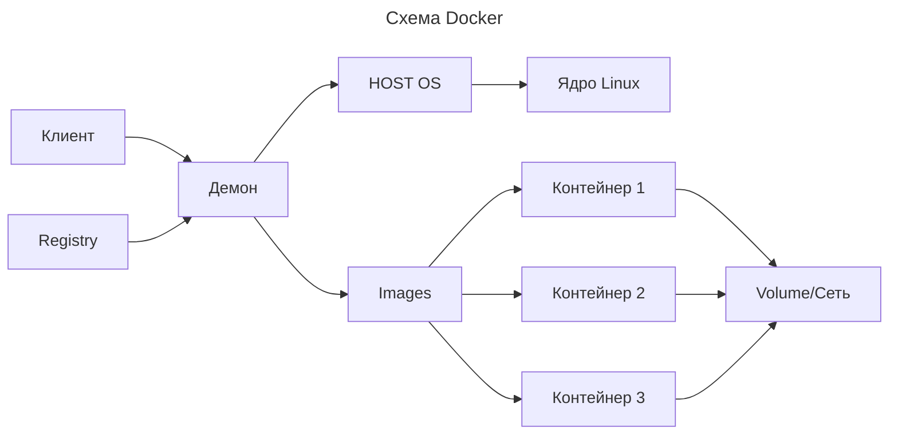
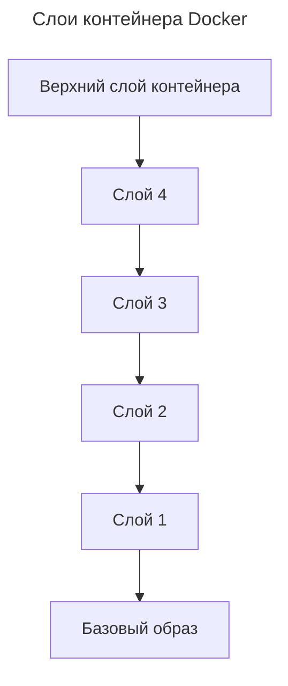

---
aliases:
  - docker
  - Docker
  - Docker Engine
  - Moby
  - OCI
  - Докер
  - Контейнеры
  - Оверлейная файловая система
---
## Docker

Docker — это платформа для разработки, доставки и запуска приложений в контейнерах. Изолирует приложения от инфраструктуры, позволяя быстро доставлять программное обеспечение.

### Докер — что это

**Виртуализация на уровне ОС:** Докер, в отличии от классической виртуализации, не виртуализирует железо, а изолирует процессы, файловую систему, сеть.

**Контейнеры** — как упакованные приложения и его зависимости, которые запускаются в изолированном окружении. Для этого ему нужен kernel host OS. Docker — контейнерное решение на уровне ядра.

### Архитектура Docker

**Основа — клиент-серверная архитектура:**

- **Docker daemon** — любой процесс типа `dockerd`, занимается сборкой, запуском и обслуживанием контейнеров.
- **Docker client** — вызывается командой `docker`, общается с daemon через сокет.

**Сервер** принимает команды от клиента (или со `docker run`, `docker build`), выполняет их и вернёт результат.

### Структура контейнера

Контейнер состоит из:

- **name**, **id**, **image** — описатели;
- **commands** — стадия RUN контейнера, запускает процесс;
- **port** — для связи с наружним миром;
- **status** — состояние контейнера;
- **env** — переменные окружения;
- **volumes, networks** — связанные ресурсы.

### Традиционный запуск процесса в Linux

**У каждого процесса в Linux один родитель.**

**Иерархия процессов: PID 0 → PID 1 → PID n.**

Без контейнера запущенный в Linux процесс бесконечно «живёт» — у него нет ограничений.

### Cgroups и Namespaces — «строительные блоки» контейнеров

ОС Linux поддерживает современные функции для создания контейнеров:

- **namespaces** — изоляция процессов (каждый процесс видит собственный мир);
- **cgroups** — ограничение ресурсов (CPU, память, диск, сеть).

Эти механизмы позволяют работать «виртуальной ОС» на базе ядра Linux.

**Cgroups** — control groups. Каждая группа ресурсов: CPU, memory, network, disk I/O. Контролируют доступ к ним.

**Namespaces** — пространства имён:

- изоляция процессов (дерево процессов);
- файловая система;
- сеть (сетевые интерфейсы);
- монтирование;
- межпроцессное взаимодействие (IPC).

Каждый контейнер — это процесс (или группа процессов), параметры которого указывают на другие пространства имён и группы ресурсов.

### Volume — где Docker хранит данные

**Volume** — это папка из хост-системы, куда контейнер пишет данные. Реально данные лежат на хосте.

**Проблема:** контейнер живёт столько, сколько существует процесс. Если контейнер удалить — данные внутри него удаляются вместе с ним.

**Решение:** смонтировать папку с хоста в контейнер. Данные после удаления контейнера останутся на хосте.

```bash
docker run -v /host/path:/container/path image-name
```

**Пример:** `-v /home/user/app:/usr/src/app`.

**Типы volume:**

- **bind mount** — привязка к конкретной папке на хосте;
- **volume** — специальный том Docker;
- **tmpfs mount** — временное хранилище в памяти.

### Dockerfile

**Dockerfile** — конфигурация образа.

- `FROM` — база образа;
- `RUN` — выполнение команд;
- `COPY` — копирование файлов;
- `CMD` — команда по умолчанию;
- `EXPOSE` — порт;
- `ENV` — переменные окружения;
- `WORKDIR` — рабочая директория.

При сборке Docker делает слои: каждая инструкция — новый слой.

### Сборка образа

```bash
docker build -t my_image .
```

**Слои переиспользуются:** если инструкция не менялась, Docker переиспользует готовый слой. Это ускоряет повторную сборку.

### Файлы .dockerignore

**Зачем:** не копировать лишние файлы (node_modules, .git) в контекст сборки.

```text
node_modules
.git
*.log
```

**Пример полного файла из проекта:**

```text
node_modules
.git
.gitignore
Dockerfile
.env
*.log
dist
```

### Изменение Dockerfile

При изменении Dockerfile изменённый слой и все последующие будут пересобраны. Для ускорения сборки важно располагать изменения в конце: сначала менять малоизменяемые инструкции (установка пакетов), потом приложение (копирование кода).

### Общий вид Dockerfile

```dockerfile
FROM node:20

WORKDIR /app

COPY package*.json ./
RUN npm install

COPY . .

EXPOSE 5173

CMD [ "npm", "run", "dev" ]
```

**Рабочий процесс:**

1. `FROM node:20` — базовый образ;
2. `WORKDIR /app` — создание рабочей директории;
3. `COPY package*.json ./` — копирование package-файлов;
4. `RUN npm install` — установка зависимостей (переиспользуется до изменения package-файлов);
5. `COPY . .` — копирование всего кода;
6. `EXPOSE 5173` — открытие порта;
7. `CMD [ "npm", "run", "dev" ]` — команда запуска.

### Инструкции Dockerfile

| Инструкция | Назначение |
| ---------- | ---------- |
| `FROM` | задаёт базовый образ |
| `RUN` | выполняет команды при сборке |
| `COPY` | копирует файлы в образ |
| `CMD` | команда, выполняемая при запуске контейнера |
| `EXPOSE` | открывает порт наружу |
| `ENV` | задаёт переменные окружения |
| `WORKDIR` | рабочая директория внутри контейнера |

### Простой запуск контейнера

```bash
docker run -it hello-world
```

**Шаги при запуске:**

1. Docker ищет образ локально, если нет — скачивает из registry;
2. создаёт контейнер из образа;
3. запускает контейнер (выполняет команду);
4. выводит вывод в терминал.

### Views команд, разбор docker run

`docker run [OPTIONS] IMAGE [COMMAND] [ARG...]`

- `-d` — запустить контейнер в фоне;
- `-p` — пробросить порт (`-p 8080:80`);
- `-v` — volume;
- `-e` — переменная окружения;
- `--name` — задать имя;
- `-it` — интерактивный режим.

### Основные команды Docker

**Управление контейнерами:**

```bash
docker ps
docker ps -a
docker start <name>
docker stop <name>
docker rm <name>
docker rm -f <name>
```

**Образы:**

```bash
docker images
docker pull <image>
docker rmi <image>
docker build -t <name> .
```

**Логи и выполнение команд:**

```bash
docker logs <name>
docker exec -it <name> bash
```

**Прочее:**

```bash
docker system prune
docker stats
docker network ls
com.docker.service --version
```

### Команды Docker (краткая шпаргалка)

```bash
docker run -p 3000:3000 <image>       # запуск с пробросом порта
docker run -d -p 8080:80 <image>      # запуск в фоне
docker exec -it <id> sh               # вход в контейнер
docker logs --tail 100 <name>         # последние 100 строк логов
docker build -t <name>:<tag> .        # сборка образа
docker push <user>/<image>:<tag>      # публикация
docker pull <image>                   # скачивание образа
docker ps -a                          # все контейнеры
docker rm -f $(docker ps -aq)         # удалить все контейнеры
```

### Остановка и перезапуск

```bash
docker stop <container_id>   # корректная остановка
docker kill <container_id>   # немедленная остановка
docker restart <container_id>
```

### Отрисовка Карты Docker



### Мой простой пример запуска MySQL

```bash
docker run \
  -d \
  -p 3306:3306 \
  -e MYSQL_ROOT_PASSWORD=root \
  --name mysql-test \
  mysql
```

### Запуск контейнера из Docker Compose

**docker-compose.yml (пример):**

```yaml
version: '3.8'

services:
  db:
    image: mysql
    environment:
      MYSQL_ROOT_PASSWORD: root
    ports:
      - "3306:3306"
    volumes:
      - db-data:/var/lib/mysql

volumes:
  db-data:
```

### OverlayFS: контейнер и файловая система

**OverlayFS** — оверлейная файловая система, на основе которой работают образы и контейнеры Docker.

**Принцип:** нижние слои (lower), верхний — слой контейнера (upper), при изменении файла Docker делает копию на верхний слой (copy-on-write).



### Образы — как создаются и где хранятся

Каждый образ состоит из слоёв.

- `dockerfile` → build → `image`;
- `image` → run → `container`;
- `container` → commit → `image`;
- `image` → pull/push → registry.

**Локальные образы хранятся в `/var/lib/docker`.**

### Слои образов Docker

**При сборке каждая инструкция Dockerfile создаёт слой.**

**Изменение слоя:** если слой не изменился — Docker переиспользует готовый слой (кэш сборки).

Пример слоёв:

```text
имя слоя  ID
d45lq1     node
gro6kj     npm install
pvh6kl     COPY . .
```

### Docker Registry

**Registry** — хранилище образов (GitHub для образов).

- **Docker Hub** — публичный registry по умолчанию (docker.io);
- `docker pull` / `docker push` — скачивание и публикация;
- `docker login` — аутентификация.

**Примеры:**

```bash
docker pull nginx:alpine
docker tag my_image myuser/my_image:1.0
docker push myuser/my_image:1.0
```

### Docker Compose

**Docker Compose** — инструмент для запуска нескольких контейнеров одним файлом.

**Файл docker-compose.yml:**

- `services` — список сервисов;
- `build` — сборка из Dockerfile;
- `image` — готовый образ;
- `ports` — проброс портов;
- `environment` — переменные окружения;
- `volumes` — тома.

**Команды Compose:**

```bash
docker compose up -d
docker compose down
docker compose logs -f
docker compose ps
```

### Docker vs виртуализация

| Характеристика | Docker | Виртуальная машина |
| -------------- | ------ | ------------------ |
| Изоляция | Процессы | ОС/железо |
| Ядро | Общее с хостом | Своё (гостевое) |
| Запуск | Уже на ядре хоста | Медленный (загрузка ОС) |
| Размер | МБ | ГБ |
| Ресурсы | Меньше | Больше |

**Виртуальная машина** — эмуляция компьютера: своё «железо», BIOS, устанавливается гостевая ОС.

**Docker** — контейнерный слой поверх ОС, не эмулирует железо, поэтому быстрее и легче.

### Работа с container

#### Первые команды Docker

```bash
docker run -it hello-world
docker ps -a
docker pull alpine
docker run -it alpine sh
```

#### Детальная команда docker run

```bash
docker run -d \
  --name nginx \
  -p 8080:80 \
  -v $(pwd):/usr/share/nginx/html \
  nginx
```

**Разбор:**

- `-d` — фоновый режим;
- `--name nginx` — имя контейнера;
- `-p 8080:80` — порт хоста 8080 → порт контейнера 80;
- `-v $(pwd):...` — монтирование текущей папки;
- `nginx` — образ.

#### Вход в контейнер

```bash
docker exec -it nginx bash
```

`exec` — выполнить команду в запущенном контейнере, `-it` — интерактивный режим.

#### Логи контейнера

```bash
docker logs nginx
docker logs -f nginx        # follow, следить за логами
```

#### Остановка и удаление

```bash
docker stop nginx
docker rm nginx
```

#### Удаление всех контейнеров

```bash
docker rm -f $(docker ps -aq)
```

### Базовые команды разбора

- `docker pull` — скачать образ;
- `docker images` — список образов;
- `docker run` — запустить контейнер;
- `docker ps` — список запущенных контейнеров;
- `docker logs` — логи;
- `docker exec` — выполнить команду;
- `docker stop/start/restart` — управление жизненным циклом;
- `docker rm` — удалить контейнер;
- `docker rmi` — удалить образ;
- `docker build` — собрать образ.

### Требования Docker

- **64-битный Linux** (ядра 3.8+), **macOS**, **Windows**;
- **Root-права** (или группировка пользователя в группу `docker`);
- **OverlayFS** для слоёв.

**Внимание:** команды `docker` требуют прав root, иначе нужно добавить пользователя в группу `docker`.

### Установка Docker на Linux

**Ubuntu/Debian:**

```bash
sudo apt update && sudo apt install docker.io docker-compose
sudo systemctl enable --now docker
```

**Arch:**

```bash
sudo pacman -S docker docker-compose
sudo systemctl enable --now docker
```

**Добавление пользователя в группу:**

```bash
sudo usermod -aG docker $USER
newgrp docker
```

### Окружение для разработки на Linux

**Для удобной разработки полезно добавить docker в group:**

```bash
sudo usermod -aG docker $USER
newgrp docker
```

### Docker на Windows (Docker Desktop)

**Docker Desktop** — GUI-инструмент, включает:

- Docker Engine;
- Compose;
- Kubernetes (опционально);
- работу с WSL2.

```powershell
wsl --install
```

В **WSL2** Docker работает нативно.

### Docker Desktop и WSL2

**WSL2** — подсистема Windows для Linux.

**Docker Desktop для WSL2:**

- `/etc/wsl.conf` — файл конфигурации WSL;
- `wsl --shutdown` — перезапуск.

### Структура рабочей папки проекта

**Типовая структура проекта с Docker:**

```text
project/
├── docker-compose.yml
├── .env
├── Dockerfile
├── app/
├── nginx/
└── data/
```

### Хранение данных: volumes vs bind mount

**Volumes:**

- управляются Docker (`docker volume create`);
- хранятся в `/var/lib/docker/volumes/`;
- рекомендуются для данных БД.

**Bind mounts:**

- любая папка хоста;
- удобно для разработки (живая синхронизация).

### Сеть в Docker

- **bridge** — сеть по умолчанию для контейнеров;
- **host** — контейнер использует сеть хоста;
- **none** — без сети.

**Сервисы в сети общаются по имени, порты пробрасываются с хоста.**

### Docker Hub

**Docker Hub** — публичный реестр образов по умолчанию.

- Официальные образы: `nginx`, `mysql`, `node`, `python`, `postgres`;
- тэги: `latest`, версии, дистрибутивы (`alpine`).

```bash
docker pull node:20-alpine
```

### Docker экосистема

- **Docker Engine** — основа (daemon + client);
- **Docker Compose** — оркестрация нескольких контейнеров;
- **Docker Swarm** — кластеризация (встроенная);
- **Kubernetes** — кластеризация (сторонняя);
- **Docker Registry** — хранение и раздача образов;
- **Docker Desktop** — GUI для Mac/Windows.

### Дистрибутивы Docker: Moby

**Moby** — открытая платформа для сборки контейнерных систем, из которой собирается Docker CE. Moby — самодостаточная библиотека; Docker построен на Moby, но не равен ей.

### Docker OCI

**OCI (Open Container Initiative)** — набор стандартов для контейнеров, определяет:

- спецификацию **runtime**;
- формат **image**;
- **distribution** спецификацию (registry).

**Цель:** единый формат между runtime (containerd, runc, CRI-O).

### Команды Docker для портов и логирования

**Порт контейнера:**

```bash
docker port nginx
```

**Мониторинг.**

**Установить ресурсы:**

```bash
docker run -d --memory 128m --cpus 0.5 nginx
```

`--memory` — лимит памяти, `--cpus` — лимит CPU.

**Логи:**

```bash
docker logs -t nginx
```

`-t` — метки времени.

### Команды Docker (полная шпаргалка)

**Контейнеры:**

```bash
docker ps                    # запущенные
docker ps -a                 # все
docker ps --filter status=exited
docker start/stop/restart <name>
docker rm -f <name>
docker rm -f $(docker ps -aq)
```

**Образы:**

```bash
docker images
docker rmi <image>
docker build -t <name> .
```

**Logs/exec:**

```bash
docker logs --tail 50 -f <name>
docker exec -it <name> sh
```

**Система:**

```bash
docker system df
docker system prune -a
docker stats
```

**Сеть/тома:**

```bash
docker network ls
docker volume ls
```

### Итог

Docker — удобный инструмент для запуска приложений в изолированных контейнерах. Основной workflow:

- `Dockerfile` — образ;
- `docker build` — сборка;
- `docker run` — запуск;
- `docker compose` — несколько сервисов;
- регистры — обмен образами.

**Главная мысль:** контейнеризация = namespaces + cgroups, а слои — OverlayFS + copy-on-write.

**Резюме команд:**

| Действие | Команда |
| -------- | ------- |
| Сборка | `docker build -t имя .` |
| Запуск | `docker run ...` |
| Список | `docker ps -a` |
| Вход | `docker exec -it ... sh` |
| Логи | `docker logs -f ...` |
| Удалить контейнеры | `docker rm -f $(docker ps -aq)` |
