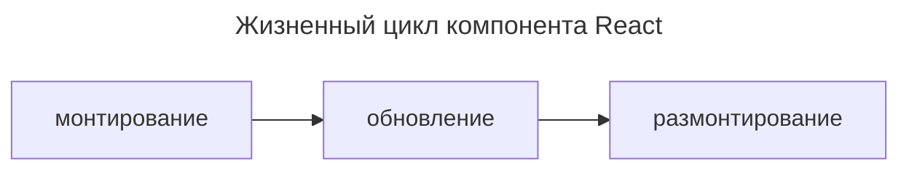
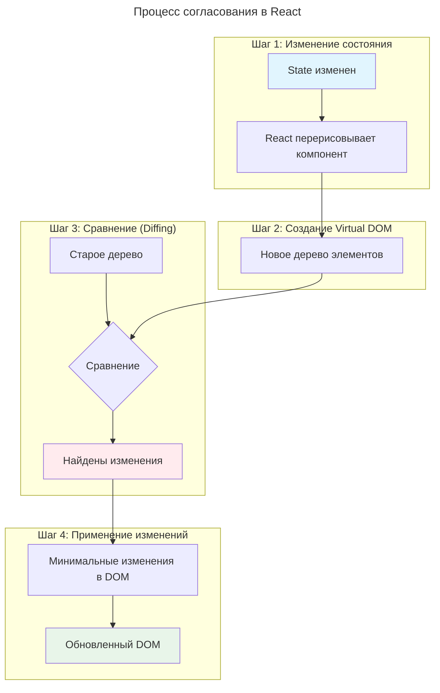

---
aliases:
  - App.js
  - Array.prototype.map
  - bundle
  - componentDidMount
  - componentDidUpdate
  - componentWillUnmount
  - conditional rendering
  - create-react-app
  - custom hooks
  - depcheck
  - Document Object Model
  - DOM
  - DOM-модель
  - functional components
  - Functional Components
  - hooks
  - index.html
  - index.js
  - JavaScript Syntax eXtension
  - JavaScript-объекты
  - JSX
  - JSX-высказывания
  - memoization
  - node.js
  - Node.js
  - nodejs
  - npm
  - NPM
  - npx
  - NPX
  - nvm
  - package.json
  - props
  - props.children
  - React
  - React components
  - React core
  - React CORE
  - React DOM
  - React elements
  - React js
  - React JS
  - React Native
  - react-scripts
  - React-элементы
  - React.Component
  - React.js
  - ReactDOM
  - ReactJS
  - Single-page application
  - Single-page-application
  - style.css
  - useCallback
  - useContext
  - useEffect
  - useMemo
  - useRef
  - useState
  - Virtual DOM
  - webpack
  - Webpack
  - Библиотека React
  - виртуальный DOM
  - компоненты React
  - мемоизация
  - пользовательские хуки
  - пропсы
  - Реакт
  - условный рендеринг
  - хуки
---
## React — JavaScript-библиотека для построения пользовательских интерфейсов

React — A JavaScript library for building user interfaces.

- `React CORE` служит для построения логики приложения, а за визуализацию отвечают `React DOM` или `React Native`.
  - `React DOM` использует виртуальную DOM, которую сравнивает с DOM, после чего обновляет лишь требуемую часть DOM.
  - `React Native` позволяет создавать приложения для iOS, Android, Windows.
- React DOM uses `camelCase` property naming convention instead of HTML attribute names. For example, ~~`class`~~ becomes `className` in JSX.
- При разработке рекомендуется использовать принцип `Separation of concerns` (**разделение интересов**). Это упрощает разработку и позволяет разделить задачи.
- React служит реализации концепции `Single-page-application`.

### Настройка окружения

#### Установка react-scripts

Установка react-scripts:

```bash
npm install react-scripts --save
```

#### Деплой и публикация через Static Server

Стандартный способ — задеплоить и опубликовать директорию `react-project\build` при помощи `Static Server`.

> [!info] Deployment | Create React App
> `npm run build` creates a build directory with a production build of your app.

Деплой:

```powershell
cd ...react-project-folder
npm install -g serve
serve -s build -l :80
```

#### SSL для HTTPS

Настройка SSL:

```powershell
# for developments when call npm start
"start": "set HTTPS=true&&react-scripts start",
# for serve in production
serve -s build --listen 8580 --ssl-cert "/etc/ssl/certs/mycert.crt" --ssl-key "/etc/ssl/private/mykey.key"
serve -s -l 80 --HTTPS=true --ssl-cert "/var/www/thbwa-ra/cert/certificate.crt" --ssl-key "/var/www/thbwa-ra/cert/private.key"
```

### Принципы

#### Declarative

Достаточно описать, как части интерфейса приложения выглядят в разных состояниях. React будет своевременно их обновлять, когда данные изменяются.

#### Component-Based

Инкапсулированные компоненты с собственным состоянием, которые можно хранить вне DOM-модели.

#### Learn Once, Write Anywhere

Можно использовать на разных платформах, включая десктопы и мобильные.

**Сборка проекта**

React использует сборщик пакетов `webpack`. Набор пакетов называется `bundle`.

### Подключение React к HTML

Добавить в `<html>`:

```html
<head>
...
  <script src="https://unpkg.com/react@16/umd/react.development.js" crossorigin></script>
  <script src="https://unpkg.com/react-dom@16/umd/react-dom.development.js" crossorigin></script>
  <script src="https://unpkg.com/babel-standalone@6/babel.min.js"></script>
...
<body>
...
  <div id="root"></div>
  <script type="text/babel">
    ReactDOM.render(
      <h6>Hello, React!</h6>,
      document.getElementById('root')
    )
  </script>
...
```

### Создание и развёртывание приложения

1. Установить в системе node.js.
2. Создать react-приложение:

   ```powershell
   npx create-react-app my-app
   cd my-app
   npm start

   # установить пакет # i ~ install
   # npm i react-router-dom
   # npm install axios

   # сборка билда
   # npm run build
   # публикация и тестирование билда
   # serve -s build
   ```

3. Разрабатываем, тестируем на localhost:3000.
4. Билдим:
   1. `npm run build`
   2. забрать билд в `..\my-app\build\`

### Работа с зависимостями проекта

Проверка зависимостей:

```powershell
# перейти в директорию проекта и установить depcheck
npm install -g depcheck
depcheck
# Unused dependencies
# * ...
# * react-bootstrap
# * ...
# Missing dependencies
# * ...
npm uninstall <unused_package_name>
npm uninstall react-bootstrap
npm install <missing_package_name>
```

## Основы React

### Типовые паттерны

#### Отрисовка по условию

При помощи тернарного оператора:

```javascript
{props.home && props.home.rooms && props.home.rooms.length>0
  ?
  <div>
    <ul>
      {props.home.rooms && props.home.rooms.map(room =>
        <li key={"li"+room.room_id}>{room.name}
        </li>
      )}
    </ul>
  </div>
  :
  <div>no data</div>
}
```

**Условный (тернарный) оператор** — оператор в JavaScript, принимающий три операнда: условие, за которым следует знак вопроса `?`, затем выражение, которое выполняется, если условие истинно, сопровождается двоеточием `:`, и выражение, которое выполняется, если условие ложно. Он часто используется в качестве сокращённого варианта условного оператора `if`: `условие ? выражение1 : выражение2`.

#### Генерация JSX-объектов из данных

При помощи маппинга:

```javascript
{homes.map(home =>
    <li key={"option"+home.home_id} value={home.home_id}>{home.name}</li>
)}
// можно отслеживать индекс текущего элемента маппинга
{homes.map((home, index) =>
    <li key={"option"+home.home_id} value={home.home_id}>{index+1}) {home.name}</li>
)}
```

`Array.prototype.map(func())` — возвращает новый массив элементов, которые были обработаны при помощи функции.

Пример использования `map`:

```javascript
const array1 = [1, 4, 9, 16];
// pass a function to map
const map1 = array1.map(x => x * 2);
console.log(map1);
// expected output: Array [2, 8, 18, 32]
```

### JavaScript Syntax eXtension (JSX)

JSX — расширение React для синтаксиса языка JavaScript, которое обеспечивает способ структурирования визуализации компонентов с использованием синтаксиса, знакомого многим разработчикам. По внешнему виду он похож на HTML. Компоненты React обычно пишутся с использованием JSX, хотя это и не обязательно, поскольку компоненты также могут быть написаны на чистом JavaScript.

- `JSX-высказывания` компилируются в `JavaScript-объекты`. Эти JavaScript-объекты являются `React-элементами`, которые размещаются в `ReactDOM`.

#### Выражения (expressions)

Пример выражения в JSX:

```javascript
const name = "David";
const el = <p>Hello, {name}</p>;
ReactDOM.render(
  el,
  document.getElementById('root')
);
```

### Функциональные компоненты (functional components)

`Functional Components`.

- Название компонента всегда с большой буквы.

Пример функционального компонента:

```javascript
// объявление функционального компонента
function Hello() {
  return <h1>Hello world.</h1>;
}
// генерация JSX-компонента
const el = <Hello />;
// вывод компонента в DOM
ReactDOM.render(
  el,
  document.getElementById('root')
);
```

### Компоненты класса (class components)

> [!important] DEPRECATED
> Классовые компоненты считаются устаревшими. Вместо них стоит использовать функциональные компоненты с хуками и пропсами.

`Class Components` применяются для сущностей, в которых важно хранить состояние.

- При декларации все компоненты класса наследуются от `React.Component`.
- `render()` — обязательный метод компонента класса, который определяет, что вывести.

Пример классового компонента:

```javascript
class Hello extends React.Component {
  render() {
    return <h1>Hello world.</h1>;
  }
}
// обращение к пропсам внутри класса через указатель this.
class Hello extends React.Component {
  render() {
    return <p>Hello, {this.props.name}!</p>;
  }
}
```

### Пропсы (props)

`props` (пропсы, англ. — реквизит) — это входные данные React-компонентов, передаваемые от родительского компонента дочернему компоненту.

В любом компоненте доступны `props.children` — контент между открывающим и закрывающим тегом компонента. Обращение к пропсам внутри класса через указатель `this.props`. Можно передавать функции в качестве значения пропса.

Пример передачи пропсов:

```javascript
// объявление функционального компонента
function Hello(props) {
  return <p>Hello, {props.name}!</p>;
}
// генерация JSX-компонента
const el = <Hello name="David" />;
ReactDOM.render(
  el,
  document.getElementById('root')
);
```

Дополнительные компоненты:

```javascript
function Item(props) {
  return <div className="item">
  <b>Name:</b> {props.name} <br />
  <b>Price:</b> {props.price}
  </div>;
}
function App() {
  return <div>
    <Item name="Cheese" price="4.99" />
    <Item name="Bread" price="1.5" />
    <Item name="Ice cream" price="24" />
  </div>;
}
```

`props.children` — специальный пропс, который содержит вложенные элементы по DOM-дереву.

### Состояние (state)

**Разница между `state` и `props`**

| Критерий | `props` | `state` |
| --- | --- | --- |
| Источник данных | передаются от родителя потомку | управляется самим компонентом |
| Изменение | компонент не может изменять | компонент может изменять |

`this.setState({name: "James"})` — метод, который при обновлении состояния вызывает перерисовку всего компонента.

Компоненты, которые имеют state, называются **stateful**, а компоненты, которые не используют state, — **stateless**.

Пример управления состоянием:

```javascript
// по клику на кнопку инкрементируем значение
class Counter extends React.Component {
  state = {
    counter: 0
  }
  increment = () => {
    this.setState({counter: this.state.counter+1});
  }
  render() {
    return <div>
    <p>{this.state.counter}</p>
    <button onClick={this.increment}>Increment</button>
    </div>;
  }
}
const el = <Counter />;
ReactDOM.render(
  el,
  document.getElementById('root')
);
```

### Хуки (hooks)

Хуки можно использовать только на верхнем уровне вложенности.

#### Стандартные хуки

- `[state, setStateFunc] = useState(initial_value)` — возвращает текущее состояние и функцию, которая позволяет менять состояние; принимает начальное значение.
- `useEffect(callback, deps)` — позволяет реализовывать логику на стадиях жизни компонента.
- `ref = useRef(callback, deps)` — формирует ссылку для обращения к объектам ReactDOM и взаимодействия с ними.
- `useMemo()` — мемоизация. Хук кладёт некоторые данные в кэш и позволяет избежать полного цикла построения данных при каждой модификации.
- `useCallback()`
- `useContext()`

Пример useState:

```javascript
import React, { useState } from 'react';
function Hello() {
  const [name, setName] = useState("David");
  return <h1>Hello {name}.</h1>;
}
const el = <Hello />;
ReactDOM.render(
  el, document.getElementById('root')
);
```

#### Пользовательские хуки

Названия всех хуков должны начинаться с `use*`. Это соглашение. Кастомные хуки — это хуки, которые в себе используют стандартные хуки.

### Жизненный цикл компонента

Фазы жизненного цикла:



применение

```javascript
  useEffect(() => {
    fetchPosts();
  }, []); // [] -- отрработает ровно 1 раз в момент монтирования
```

#### Методы жизненного цикла (Lifecycle Methods)

- `Mounting` — процесс, когда компонент отрисовывается на странице. `Unmounting` — процесс, когда компонент удаляется со страницы.
- `componentDidMount()` — вызывается, когда компонент отрисован на странице.
- `componentWillUnmount()` — вызывается непосредственно перед удалением компонента из DOM. Может использоваться для освобождения ресурсов, занятых компонентом.
- `componentDidUpdate()` — вызывается только при обновлении компонента.

Пример методов жизненного цикла:

```javascript
componentDidMount() {
  this.setState({counter: 42});
}
componentDidUpdate() {
  alert("Number of clicks: " + this.state.counter);
}
```

Для того, чтобы применить методы жизненного цикла для функционального компонента, необходимо использовать хук `useEffect`:

```javascript
import React, { useState, useEffect } from 'react';
function Counter() {
  const [counter, setCounter] = useState(0);
  useEffect(() => {
    alert("Number of clicks: " + counter);
  });
  function increment() {
    setCounter(counter+1);
  }
  return <div>
  <p>{counter}</p>
  <button onClick={increment}>Increment</button>
  </div>;
}
```

### События (Event)

Названия событий сходятся с событиями JS. В обработчик события передаётся аргумент `e`, который содержит событие. Можно использовать `e.preventDefault();`, чтобы предотвратить стандартный обработчик, например для события `onSubmit`.

Примеры обработчиков событий:

```javascript
// onClick Sample
function Counter() {
  const [counter, setCounter] = useState(0);
  function increment() {
    setCounter(counter+1);
  }
  return <div>
    <p>{counter}</p>
    <button onClick={increment}>Increment</button>
  </div>;
}
// onChange Sample
function Converter() {
  const [km, setKm] = useState(0);
  function handleChange(e) {
    setKm(e.target.value);
  }
  function convert(km) {
    return (km/1.609).toFixed(2);
  }
  return <div>
  <input type="text" value={km} onChange={handleChange} />
  <p> {km} km is {convert(km)} miles </p>
  </div>;
}
```

### Списки (lists)

`arr.map(func)` — метод JavaScript, который вызывает функцию для каждого элемента массива и возвращает массив результатов выполнения этой функции.

Пример отображения списка:

```javascript
function MyList(props) {
  const arr = props.data;
  const listItems = arr.map((val, index) =>
    <li key={index}>{val}</li>
  );
  return <ul>{listItems}</ul>;
}
const arr = ["A", "B", "C"];
const el = <MyList data={arr} />;
ReactDOM.render(
  el,
  document.getElementById('root')
);
/* RESULT
 * A
 * B
 * C
 */
```

### Структура приложения

## Структура React-приложения

### Типичное дерево файлов

```
my-react-app/
├── public/
│   ├── index.html          # HTML-шаблон
│   ├── favicon.ico         # Иконка сайта
│   ── manifest.json       # Метаданные PWA
│
├── src/
│   ├── components/         # Переиспользуемые компоненты
│   │   ├── Header.js
│   │   ├── Footer.js
│   │   └── Button.js
│   │
│   ├── pages/              # Страницы приложения
│   │   ├── Home.js
│   │   └── About.js
│   │
│   ├── hooks/              # Кастомные хуки
│   │   ── useAuth.js
│   │
│   ├── utils/              # Вспомогательные функции
│   │   └── api.js
│   │
│   ├── styles/             # Глобальные стили
│   │   └── App.css
│   │
│   ├── App.js              # Главный компонент
│   ├── App.css             # Стили App
│   ├── index.js            # Точка входа
│   └── index.css           # Глобальные стили
│
├── .gitignore              # Игнорируемые файлы для Git
├── package.json            # Зависимости и скрипты
├── package-lock.json       # Точные версии зависимостей
└── README.md               # Документация проекта
```

### Ключевые файлы

| Файл | Назначение |
|------|-----------|
| `package.json` | Список зависимостей, скрипты запуска |
| `src/index.js` | Точка входа, рендерит App в DOM |
| `src/App.js` | Корневой компонент приложения |
| `public/index.html` | HTML-шаблон, куда монтируется React |

### Минимальная структура

Для простого приложения достаточно:

```
src/
├── App.js
├── App.css
├── index.js
└── index.css
```

Все остальные папки (`components`, `pages`, `hooks`) добавляются по мере роста проекта.

#### Глоссарий

##### Application Programming Interface

API (Application Programming Interface) — описание способов взаимодействия одной компьютерной программы с другими.

##### Webpack

Сборщик модулей JavaScript с открытым исходным кодом. Он создан в первую очередь для JavaScript, но может преобразовывать внешние ресурсы, такие как HTML, CSS и изображения, если включены соответствующие загрузчики. Webpack принимает модули с зависимостями и генерирует статические ресурсы, представляющие эти модули. Платформа Node.js.

##### Node.js

**node.js** — программная платформа, основанная на движке V8, превращающая JavaScript из узкоспециализированного языка в язык общего назначения. Node.js добавляет возможность JavaScript взаимодействовать с устройствами ввода-вывода через свой API, написанный на C++, подключать другие внешние библиотеки, написанные на разных языках, обеспечивая вызовы к ним из JavaScript-кода. Node.js применяется преимущественно на сервере, выполняя роль веб-сервера, но есть возможность разрабатывать на Node.js и десктопные оконные приложения и даже программировать микроконтроллеры. В основе Node.js лежит событийно-ориентированное и асинхронное программирование с неблокирующим вводом/выводом.

**Node.js** — среда выполнения JavaScript, которая предоставляет возможность использовать язык программирования для создания серверных приложений, то есть backend-разработки.

Установка Node.js:

```powershell
choco install nodejs
```

##### nvm

nvm is a version manager for node.js.

##### npm — менеджер пакетов Node.js

Менеджер пакетов, входящий в состав Node.js. Установка пакета производится при помощи команды `npm install`. Все доступные для установки пакеты и их краткое описание можно найти через `npm search`. Этой же командой можно производить выборочный поиск пакетов.

##### npx

`npx` — an `npm` package runner. NPM manages packages but doesn't make life easy executing any. NPX comes bundled with NPM version 5.2+.

##### DOM-модель

DOM stands for Document Object Model and is a tree-like representation of the HTML page.

### FAQ

## React: Рендеринг и Согласование (Reconciliation)

### Описание схемы

Схема иллюстрирует процесс работы **Virtual DOM** в React:

#### Левая часть: Отрисовка (Render)
- **DOM-дерево** — реальная структура документа
- Красным выделены узлы, которые изменились и требуют обновления

#### Правая часть: Согласование (Reconciliation)
- **Дерево элементов** — виртуальное представление DOM
- React сравнивает старое и новое дерево элементов
- Красным выделены узлы с изменениями (diff)

### Процесс Reconciliation



### Ключевые концепции

| Термин | Описание |
|--------|----------|
| **Virtual DOM** | Легковесное JavaScript-представление реального DOM |
| **Reconciliation** | Алгоритм сравнения двух деревьев элементов |
| **Diffing** | Процесс поиска различий между старым и новым деревом |
| **Patch** | Применение минимальных изменений к реальному DOM |

### Как это работает

1. **При изменении состояния** React создает новое дерево виртуальных элементов
2. **Алгоритм сравнения** (O(n) сложность благодаря эвристикам) находит различия между старым и новым деревом
3. **Вычисляются минимальные изменения** (только то, что действительно изменилось)
4. **Применяются точечные обновления** к реальному DOM

### Преимущества подхода

✅ **Производительность** — минимизация дорогих операций с DOM

✅ **Эффективность** — обновление только измененных узлов

✅ **Предсказуемость** — декларативный подход к UI

✅ **Кроссплатформенность** — Virtual DOM работает не только в браузере (React Native)

Красные узлы на схеме показывают, что React не перерисовывает всё дерево целиком, а точечно обновляет только те элементы, где произошли изменения.
