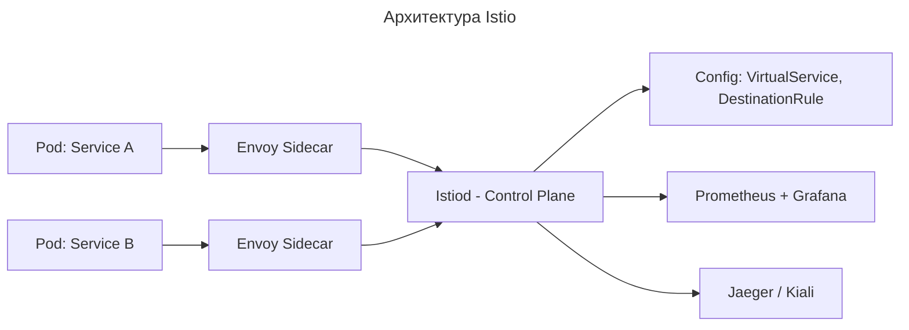
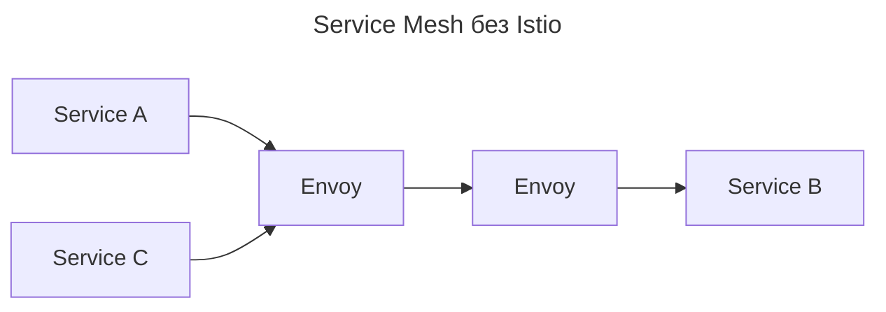
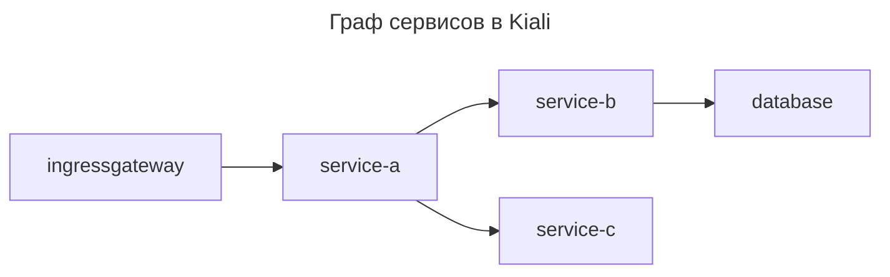

---
aliases:
  - Canary Release
  - Citadel
  - Consul
  - DestinationRule
  - Envoy
  - Galley
  - Istio
  - Istiod
  - Jaeger
  - Kiali
  - Linkerd
  - mTLS
  - mutual TLS
  - Pilot
  - Service Mesh
  - sidecar
  - VirtualService
  - Взаимная TLS
  - Канареечный релиз
  - Сайдкар
  - Сервисная сетка
---

## Что такое Istio

Istio — открытая платформа для подключения, управления и защиты микросервисов. Она обеспечивает маршрутизацию трафика, балансировку нагрузки, аутентификацию и авторизацию, мониторинг и трассировку запросов.

У Istio два ключевых компонента:

- **Envoy Proxy** — прокси-сервер на основе паттерна [[sidecar|sidecar]], размещается рядом с каждым микросервисом. Отвечает за маршрутизацию трафика, балансировку нагрузки, мониторинг и безопасность. Функции:
  - управление сетевым трафиком между сервисами;
  - отслеживание запросов и ответов;
  - установка политик безопасности и шифрование трафика.
- **Istiod** — основной сервис управления в архитектуре Istio. Появился в версии Istio 1.5 и заменил отдельные сервисы Pilot, Citadel и Galley. Упрощает установку, управление и эксплуатацию Istio. Функции:
  - **Управление трафиком** — конфигурирует и управляет прокси-серверами Envoy, обеспечивая маршрутизацию, балансировку нагрузки и отказоустойчивость для сетевого трафика между микросервисами;
  - **Безопасность** — управляет безопасностью сетевого взаимодействия, включая выдачу и ротацию сертификатов X.509, обеспечивая шифрование трафика с использованием mTLS (mutual TLS);
  - **Валидация конфигураций** — проверяет и валидирует конфигурации Istio, гарантируя их корректность и соответствие политикам безопасности и маршрутизации;
  - **Мониторинг и телеметрия** — обеспечивает сбор метрик и логов для мониторинга состояния системы.

---

## Service Mesh vs Istio

Service Mesh и Istio находятся на разных уровнях абстракции:

| Термин | Что это |
| --- | --- |
| [[service-mesh\|Service Mesh]] | Архитектурный паттерн — способ управления микросервисной коммуникацией через сторонний слой (прокси) |
| [[istio\|Istio]] | Конкретная реализация [[service-mesh\|Service Mesh]] для [[kubernetes\|Kubernetes]] |

> Service Mesh — это концепция. Istio — один из самых популярных инструментов для её реализации. Как HTTP — это протокол, а [[nginx|Nginx]] — его реализация. Или: [[publish-subscribe|Pub/Sub]] — это паттерн, а [[kafka|Kafka]] — его реализация.

**Определение**

Istio — открытая платформа Service Mesh, разработанная Google, IBM и Lyft, специально для Kubernetes. Она реализует паттерн Service Mesh с помощью Envoy (data plane) и собственного control plane.

**Архитектура Istio**



**Основные компоненты Istio**

| Компонент | Роль |
| --- | --- |
| Envoy | [[sidecar\|sidecar]]-прокси (data plane). Отвечает за HTTP/gRPC-проксирование, mTLS, логирование, retry, timeout, circuit breaker |
| Istiod | Control Plane. Состоит из: `Pilot` — генерирует конфигурацию для Envoy; `Citadel` — управление mTLS и сертификатами; `Galley` — валидация конфигураций; `Policy` — политики доступа |
| Kiali | UI для визуализации трафика между сервисами (граф зависимостей) |
| Prometheus + Grafana | Метрики (latency, error rate, requests/sec) |
| Jaeger | Distributed tracing (трассировка запросов) |

**Пример: канареечный релиз с Istio**

Поэтапный запуск новой версии сервиса (`v2`) для 5% пользователей.

Без Istio нужно писать сложную логику в ingress-шлюзе, менять вес реплик, отслеживать метрики — много ручной работы.

С Istio создаётся YAML-файл:

```yaml
# VirtualService
apiVersion: networking.istio.io/v1alpha3
kind: VirtualService
metadata:
  name: reviews
spec:
  hosts:
  - reviews
  http:
  - route:
    - destination:
        host: reviews
        subset: v1
      weight: 95
    - destination:
        host: reviews
        subset: v2
      weight: 5  # Только 5% трафика на v2
---
# DestinationRule
apiVersion: networking.istio.io/v1alpha3
kind: DestinationRule
metadata:
  name: reviews
spec:
  host: reviews
  subsets:
  - name: v1
    labels:
      version: v1
  - name: v2
    labels:
      version: v2
```

Istio автоматически:

- перенаправляет 5% трафика на `reviews:v2`;
- мониторит ошибки;
- если ошибка > 1% — можно откатить одним `kubectl apply`.

---

## Сравнение Service Mesh и Istio

| Критерий | Service Mesh | Istio |
| --- | --- | --- |
| Тип | Архитектурный паттерн | Конкретная реализация |
| Цель | Управлять микросервисной коммуникацией | Реализовать Service Mesh в Kubernetes |
| Реализация | Может быть любой: Istio, Linkerd, Consul, SMR | Одна из реализаций |
| Прокси | Может использовать Envoy, HAProxy, Nginx | Использует Envoy по умолчанию |
| Поддержка | Теоретическая концепция | Полноценная OSS-платформа с документацией, сообществом, поддержкой |
| Зависимость | Не требует Kubernetes | Оптимизирована для Kubernetes (может работать и на VM) |
| Функциональность | Общие принципы: наблюдаемость, безопасность, трафик | Конкретные инструменты: VirtualService, Gateway, PeerAuthentication |
| Легкость установки | Нет — это идея | Есть Helm-чарты, `istioctl install` |
| Использование вне Kubernetes | Возможно | Можно, но не рекомендуется — лучше Consul или Linkerd |
| Сложность | Нет — это концепция | Высокая — много CRD, сложная диагностика |

> Istio — это не Service Mesh. Istio — это инструмент, который делает систему Service Mesh.

### Другие реализации Service Mesh

| Сервис | Преимущества | Минусы | Подходит для |
| --- | --- | --- | --- |
| Istio | Мощный, богатая функциональность, отличная интеграция с Kubernetes, огромное сообщество | Сложен в освоении, высокий расход ресурсов, много CRD | Enterprise, большие команды, сложные системы |
| Linkerd | Очень легковесный, прост в установке, низкие накладные расходы, хороший UX | Меньше возможностей, нет встроенной интеграции с SaaS | Небольшие команды, стремящиеся к простоте |
| Consul Connect | Интегрируется с HashiCorp Stack (Vault, Nomad), работает на VM и Kubernetes | Менее мощный, чем Istio, меньше инструментов для трафика | Гибридные среды (VM + K8s) |
| AWS App Mesh | Полностью управляемый, интеграция с AWS, нет необходимости управлять control plane | Ограниченная функциональность, только для AWS | Команды, полностью в AWS |

---

## Service Mesh без Istio

Service Mesh возможен и без Istio. Все прокси при этом настраиваются ручными конфигами (JSON/YAML), управление ведётся через [[ansible|Ansible]] или Custom Controller, метрики собираются через [[prometheus|Prometheus]] + [[grafana|Grafana]], mTLS — через Cert-Manager + CA.



Дальнейшая поддержка 100+ Envoy-конфигов, canary-развёртывание и граф зависимостей — ручная работа. Именно здесь Istio берёт на себя всю эту сложность.

---

## Когда использовать Service Mesh

| Сценарий | Рекомендация |
| --- | --- |
| Больше 10–20 микросервисов | Да, нужен Service Mesh |
| Нужны canary-развёртывания, A/B-тесты | Istio — лучший выбор |
| Важно безопасное взаимодействие сервисов (mTLS) | Istio или Linkerd |
| Используется Kubernetes | Istio или Linkerd |
| Нужна наблюдаемость без изменения кода | Service Mesh — идеально |
| Маленькая MVP (менее 5 сервисов) | Не нужен — усложнение |
| Работа в облаке AWS | Рассмотрите AWS App Mesh |
| Нужна максимальная простота | Linkerd вместо Istio |

---

## Как проверить, что Istio работает

```bash
# Проверьте компоненты
kubectl get pods -n istio-system

# Проверьте sidecar-прокси в вашем поде
kubectl get pods
kubectl describe pod <your-pod> -n <namespace> | grep -A 5 "Containers"

# Посмотрите граф трафика
kubectl port-forward -n istio-system svc/kiali 20001:20001
```

В Kiali отображается граф сервисов:



Это реальная карта сервисов с метриками, ошибками и задержками — без единой строки кода.

---

## Финальный вывод

| Вопрос | Ответ |
| --- | --- |
| Что такое Service Mesh? | Архитектурный стиль, где все сетевые функции вынесены в отдельный слой (sidecar-прокси) |
| Что такое Istio? | Одна из реализаций Service Mesh — самый популярный open-source инструмент для Kubernetes |
| Можно ли иметь Service Mesh без Istio? | Да — через Linkerd, Consul, Envoy вручную, AWS App Mesh |
| Можно ли иметь Istio без Service Mesh? | Нет — Istio является Service Mesh |
| Нужен ли Istio? | В Kubernetes с более чем 10 сервисами, при необходимости управления трафиком, безопасностью и наблюдаемостью без кода — да |

**Запомните правило**

> Service Mesh — это то, что вы хотите. Istio — это то, как вы это получаете.

В микросервисной системе на Kubernetes Service Mesh (особенно Istio) — это стандарт, а не опция.

- [Istio Official Docs](https://istio.io/latest/docs/)
- [Service Mesh Patterns — CNCF](https://github.com/cncf/servicemesh)
- Книга #📘 «The Istio Service Mesh» (Andrew Block)
- Видео «Istio Explained in 10 Minutes» (TechWorld with Nana)
- [Istio Hands-on Lab on Katacoda](https://www.katacoda.com/courses/istio)

**Суть**

Service Mesh — это когда сервисы больше не «знают», как общаться: они только отправляют запрос, а прокси решает, как его доставить. Istio — это прокси, который реализует это.

[[service-discovery|Service Discovery]]
