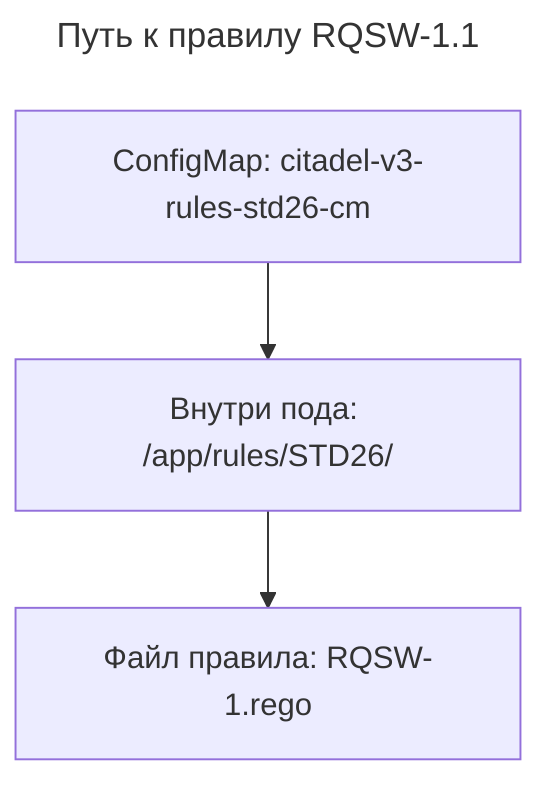
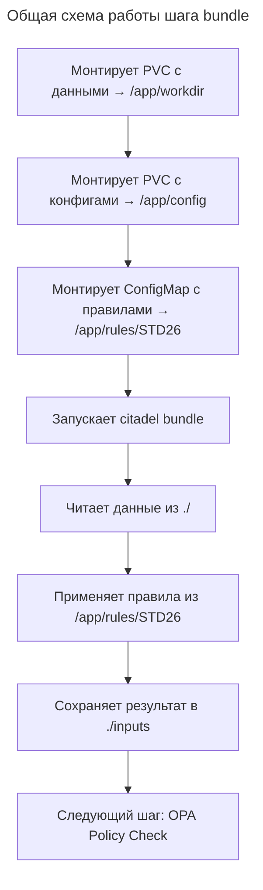

---
aliases:
  - Argo
  - Argo CD
  - Argo Events
  - Argo Rollouts
  - Argo Workflows
  - CEL
  - DAG
  - Double dash
  - GitOps
  - OPA
  - Parallel group
  - Rego
  - Regular expression
  - Workflow
  - Workflow template
  - Двойное тире
  - Параллельная группа задач
  - Регулярное выражение
---

## Argo

**Суть**
«Argo» в контексте [[kubernetes|Kubernetes]] — это не один инструмент, а семейство [[CNCF|Cloud Native Computing Foundation]]-проектов для декларативного управления рабочими процессами (workflows), CI/CD, GitOps и запуска задач в кластере. Это стек, который помогает превращать код в работающий сервис с контролем и повторяемостью.

## Основные компоненты Argo

### Argo Workflows

Движок для описания сложных пайплайнов прямо в Kubernetes с помощью YAML. Подходит для ML-пайплайнов, ETL, пакетной обработки и любых многошаговых задач.

**Возможности**
- [[DAG|DAG]]-ориентированные графы задач: можно явно задать зависимости между шагами (step A → B и C параллельно → D).
- Шаги как контейнеры: каждый шаг — это обычный pod с образом; можно смешивать языки и инструменты.
- Артефакты и переменные между шагами: передача данных между этапами.
- Повторы, таймауты, условия: встроенная логика обработки ошибок.

**Пример минимального манифеста**

```yaml
apiVersion: argoproj.io/v1alpha1
kind: Workflow
metadata:
  name: hello-world
spec:
  entrypoint: main
  templates:
    - name: main
      dag:
        tasks:
          - name: print-hello
            template: echo-step
            arguments:
              parameters:
                - name: message
                  value: "Hello"
          - name: print-world
            template: echo-step
            dependencies: [print-hello]
            arguments:
              parameters:
                - name: message
                  value: "World"
    - name: echo-step
      inputs:
        parameters:
          - name: message
      container:
        image: busybox
        command: [sh, -c]
        args: ["echo {{inputs.parameters.message}}"]
```

### Argo CD

Совершенный GitOps-контроллер для декларативного деплоя приложений в [[kubernetes|Kubernetes]]. Состояние кластера должно совпадать с тем, что описано в Git.

**Ключевые возможности**
- Синхронизация из Git: манифесты (Deployments, Services и т. п.) хранятся в репозитории; Argo CD применяет их в кластер.
- Visualisation и статус: в UI видно, соответствует ли кластер Git (synced/out of sync).
- Автоматическое восстановление: если кто‑то вручную изменил ресурс в кластере, Argo CD вернёт его к состоянию из Git.
- Поддержка [[helm|Helm]], Kustomize, Jsonnet: можно деплоить не только чистые YAML, но и через эти инструменты.

Это особенно ценно в контексте комплаенса: все изменения проходят через Git-review, есть полный аудит и воспроизводимость.

### Argo Rollouts

Расширяет возможности Kubernetes по управлению релизами: канареечные выкаты (canary), сине‑зелёные (blue‑green), постепенное наращивание трафика, автоматические откаты по метрикам.

В отличие от стандартного `Deployment`, где изменение образа даёт обновление «всё сразу», Argo Rollouts даёт контроль над тем, как новая версия попадает к пользователям, и возможность быстро откатиться при проблемах.

### Argo Events

Движок событий и триггеров для Kubernetes: он слушает события (GitHub push, S3 upload, таймер, Webhook) и запускает Workflows, Jobs и другие ресурсы.

Пример: при пуше в ветку `main` в GitHub Argo Events создаёт и запускает Argo Workflow для сборки и тестирования, а затем (при успехе) триггерит синхронизацию в Argo CD.

## Сквозной пайплайн

Типичный полный цикл [[CI-CD|CI/CD]] в [[kubernetes|Kubernetes]]:

1. Разработчик делает commit в Git (код + манифесты).
2. Argo Events ловит событие и запускает Argo Workflow (билд, тесты, сканирование уязвимостей).
3. При успехе Argo CD видит изменения в Git и синхронизирует кластер (или Argo Rollouts делает canary-выкат).
4. Метрики и логи помогают Argo Rollouts решить, продолжать ли выкат или откатить.

**Ценность**
- Комплаенс и аудит: весь деплой через Git (Argo CD) + воспроизводимые пайплайны (Argo Workflows) = понятный trail изменений, что критично для политик и проверок.
- Безопасность и контроль: можно внедрить шаги сканирования и проверки Rego-политик (OPA) прямо в workflow перед деплоем.
- Гибкость и масштабирование: подходит и для простых проектов, и для сложных ML/ETL-задач, и для высоконагруженных релизов.

## Практические нюансы

- Установка: обычно через [[helm|Helm-чарты]] (`argo-workflows`, `argo-cd`, `argo-rollouts`, `argo-events`).
- UI и CLI: у каждого компонента есть свой UI и CLI для управления и отладки.
- Интеграции: GitHub, GitLab, Bitbucket, S3, Webhooks, [[prometheus|Prometheus]] (для rollouts) и т. д.

## Синтаксис `steps`: двойное тире

Секция `steps` определяет структуру параллелизма. Двойное тире `- -` — это не опечатка, а строгий синтаксис YAML для определения параллельных групп.

Секция `steps` представляет собой список списков:

- Внешний список (`-`) определяет последовательные этапы (Stage 1, затем Stage 2...).
- Внутренний список (`-`) определяет параллельные задачи внутри одного этапа.

**Разбор примера**

```yaml
steps:
  - - name: prepare       # <--- Этап 1 (Группа 1)
      template: prepare
  - - name: extract-files # <--- Этап 2 (Группа 2)
      template: extract
  - - name: transform-json # <--- Этап 3 (Группа 3)
      template: transform
```

Здесь каждый внутренний список содержит только один элемент, поэтому задачи выполняются строго последовательно:
1. Ждем завершения `prepare`.
2. Запускаем `extract-files`.
3. Ждем завершения `extract-files`.
4. Запускаем `transform-json`.

**Параллельное выполнение**

Параллельный запуск `extract` и `transform` после `prepare` — запись с учётом отступов и тире:

```yaml
steps:
  - - name: prepare       # Этап 1: Одна задача
      template: prepare
  - - name: extract-files # Этап 2: Две задачи ПАРАЛЛЕЛЬНО
      template: extract
    - name: transform-json # <--- То же тире, тот же уровень вложенности!
      template: transform
```

**Правило**
- Новое внешнее тире (`-`) = «Жди, пока предыдущая группа закончится».
- Новое внутреннее тире (`-`) на том же уровне = «Запусти это параллельно с соседом».

## Оператор `=~` в `when`

Символ `=~` — это оператор сравнения из языка выражений Argo (базируется на Google CEL или похожем движке). Он означает «соответствует регулярному выражению» (matches regex).

**Как это работает**
Оператор проверяет, совпадает ли строка слева с шаблоном регулярного выражения справа.

**Разбор примера**

```yaml
when: "'{{workflow.parameters.stand-repo}}' =~ '.*https://dzo.sw.sbc.space.*'"
```

Посимочный разбор:
1. `'{{workflow.parameters.stand-repo}}'` — значение переменной (URL репозитория), обернутое в одинарные кавычки, чтобы оно считалось строкой.
2. `=~` — оператор «совпадает с регексом».
3. `'.*https://dzo.sw.sbc.space.*'` — само регулярное выражение, тоже в кавычках.

**Что значит `.*`**
- `.` (точка) — любой символ.
- `*` (звездочка) — ноль или более повторений предыдущего символа.
- `.*` вместе — «любое количество любых символов» (аналог `*` в глобах файлов или `%` в SQL LIKE).

**Логика условия**
Условие вернет `true`, если URL содержит подстроку `https://dzo.sw.sbc.space` в любом месте:
- ✅ `https://dzo.sw.sbc.space/my-repo` (совпадение в начале)
- ✅ `git clone https://dzo.sw.sbc.space/my-repo` (совпадение в середине)
- ❌ `https://github.com/dzo.sw.sbc.space` (не совпадет, если точка не экранирована правильно; в данном контексте обычно ищут точное доменное имя)

**Почему `=~` вместо `==`**
- `==` требует полного совпадения строки.
- `=~` позволяет искать часть строки (подстроку). Это удобно, когда URL может содержать дополнительные пути, параметры или префиксы, которые не важны.

**Альтернатива: `contains`**

В новых версиях Argo часто можно использовать более читаемую функцию `contains`:

```yaml
when: "{{workflow.parameters.stand-repo}}.contains('https://dzo.sw.sbc.space')"
```

Но `=~` мощнее, так как позволяет использовать сложные паттерны (например, проверять конец строки `$` или начало `^`).

## Сводная таблица: `- -` и `=~`

| Синтаксис | Где используется | Значение | Аналог в программировании |
|-----------|------------------|----------|---------------------------|
| `- -` | `spec.templates[].steps` | Параллельная группа задач. Каждое новое тире на этом уровне — новая задача, запускаемая одновременно с другими в этой группе | `Promise.all([task1, task2])` или потоки |
| `=~` | `spec.templates[].dag.tasks[].when` | Проверка на соответствие регулярному выражению. Возвращает `true`, если строка подходит под шаблон | `string.matches(regex)` или `preg_match()` |

`- -` управляет временем (когда запускать), а `=~` управляет логикой (запускать ли вообще).

## Шаблон `bundle`

Шаблон описывает шаг, который подготавливает и агрегирует данные для последующей валидации правилами (например, STD26 RQSW-1.1).

```yaml
- name: bundle
  inputs: {}
  outputs: {}
  nodeSelector:
    kubernetes.io/hostname: "{{workflow.outputs.parameters.node-name}}"
  metadata:
    labels:
      a93: avpo
      workflow-template: citadel-wf-template4
  container:
    name: ""
    image: portal.works.prod.sbt:8999/sbt_docker/ci90000104_citadel/ctdl.tools.go-utils:develop-2026-08-05-16-03-cli
    command:
      - /app/utils/citadel
      - bundle
    env:
      - name: CTDL_LOG_TRACE
        value: "{{workflow.name}}"
      - name: CTDL_LOG_FORMAT
        value: console
      - name: CTDL_PROFILE_MEM
        value: "{{workflow.parameters.backup}}"
    resources:
      limits:
        cpu: "6"
        memory: 18Gi
      requests:
        cpu: "4"
        memory: 12Gi
    volumeMounts:
      - name: workdir
        mountPath: /app/workdir
      - name: rules
        readOnly: true
        mountPath: /app/config
      - name: rules-std26
        mountPath: /app/rules/STD26
  volumes:
    - name: workdir
      persistentVolumeClaim:
        claimName: "{{workflow.outputs.parameters.pvc-name}}"
    - name: rules
      persistentVolumeClaim:
        claimName: citadel-v3-standards-full-rwm
    - name: rules-std26
      configMap:
        name: citadel-v3-rules-std26-cm
  activeDeadlineSeconds: 21600
  retryStrategy:
    limit: "2"
```

### `name` — имя шаблона

```yaml
name: bundle
```

| Поле | Значение |
|------|----------|
| **Назначение** | Уникальный идентификатор шаблона в workflow |
| **Использование** | Вызывается из других шагов через `template: bundle` |

### `inputs` — входные данные

```yaml
inputs: {}
```

| Поле | Значение |
|------|----------|
| **Назначение** | Параметры и артефакты, передаваемые в шаг |
| **Содержимое** | Пусто — шаг не требует внешних данных |
| **Почему** | Все данные берутся из PVC и ConfigMap |

### `outputs` — выходные данные

```yaml
outputs: {}
```

| Поле | Значение |
|------|----------|
| **Назначение** | Параметры и артефакты, передаваемые следующим шагам |
| **Содержимое** | Пусто — результат сохраняется в PVC |
| **Почему** | Следующие шаги читают данные из `/app/workdir/inputs` |

### `nodeSelector` — выбор узла

```yaml
nodeSelector:
  kubernetes.io/hostname: "{{workflow.outputs.parameters.node-name}}"
```

| Поле | Значение |
|------|----------|
| **Назначение** | Принудительный запуск пода на конкретном узле кластера |
| **Значение** | Берётся из параметра workflow `node-name` |
| **Зачем** | Обеспечение доступа к локальным ресурсам или PVC |

### `metadata` — метаданные

```yaml
metadata:
  labels:
    a93: avpo
    workflow-template: citadel-wf-template4
```

| Label | Значение | Назначение |
|-------|----------|------------|
| `a93` | `avpo` | Внутренняя маркировка (мониторинг/отчётность) |
| `workflow-template` | `citadel-wf-template4` | Имя родительского шаблона |

### `container` — контейнер

```yaml
container:
  name: ""
  image: portal.works.prod.sbt:8999/sbt_docker/ci90000104_citadel/ctdl.tools.go-utils:develop-2026-08-05-16-03-cli
  command:
    - /app/utils/citadel
    - bundle
```

| Поле | Значение |
|------|----------|
| **image** | Go-утилита Citadel CLI |
| **command** | Запуск `/app/utils/citadel` с аргументом `bundle` |
| **name** | Пусто (Kubernetes автогенерирует имя) |

### `env` — переменные окружения

**Логирование**

| Переменная | Значение | Назначение |
|------------|----------|------------|
| `CTDL_LOG_TRACE` | `{{workflow.name}}` | Имя workflow в логах |
| `CTDL_LOG_FORMAT` | `console` | Формат логов |
| `CTDL_LOG_VERBOSE` | (пусто) | Подробный режим |
| `CTDL_DISABLE_LOGGER` | `1` | Отключение логгера |

**Основные настройки bundle**

| Переменная | Значение | Назначение |
|------------|----------|------------|
| `CTDL_BUNDLE_CONFIG` | `/app/config/standards.yaml` | Конфигурация стандартов |
| `CTDL_BUNDLE_INPUTS` | `./` | Входная директория |
| `CTDL_BUNDLE_OUTPUTS` | `./inputs` | Выходная директория |
| `CTDL_BUNDLE_RULES` | `{{workflow.parameters.standart}}` | Имя стандарта (STD26) |
| `CTDL_BUNDLE_EXCLUSIONS_FILENAME` | `/app/workdir/extract/archexclusions/exclusions.json` | Файл исключений |
| `CTDL_BUNDLE_META_DISTR_VERSION` | `{{workflow.parameters.version}}` | Версия дистрибутива |

**Профилирование**

| Переменная | Значение | Назначение |
|------------|----------|------------|
| `CTDL_PROFILE` | `{{workflow.parameters.backup}}` | Включить профилирование |
| `CTDL_PROFILE_DIR` | `/app/workdir/pprof/bundle` | Директория для профайлов |
| `CTDL_PROFILE_CPU` | `{{workflow.parameters.backup}}` | Профиль CPU |
| `CTDL_PROFILE_MEM` | `{{workflow.parameters.backup}}` | Профиль памяти |

### `resources` — ресурсы

```yaml
resources:
  limits:
    cpu: "6"
    memory: 18Gi
  requests:
    cpu: "4"
    memory: 12Gi
```

| Ресурс | Request (гарантировано) | Limit (максимум) |
|--------|------------------------|------------------|
| **CPU** | 4 ядра | 6 ядер |
| **Memory** | 12 GiB | 18 GiB |

Высокие требования — обработка больших объёмов данных и правил.

### `volumeMounts` — точки монтирования

```yaml
volumeMounts:
  - name: workdir
    mountPath: /app/workdir
  - name: rules
    readOnly: true
    mountPath: /app/config
  - name: rules-std26
    mountPath: /app/rules/STD26
```

| Volume | Mount Path | Режим | Назначение |
|--------|------------|-------|------------|
| `workdir` | `/app/workdir` | RW | Рабочая директория (PVC) |
| `rules` | `/app/config` | RO | Конфигурация стандартов (PVC) |
| `rules-std26` | `/app/rules/STD26` | RW | Правила STD26 (ConfigMap) |

### `volumes` — определение томов

```yaml
volumes:
  - name: workdir
    persistentVolumeClaim:
      claimName: "{{workflow.outputs.parameters.pvc-name}}"
  - name: rules
    persistentVolumeClaim:
      claimName: citadel-v3-standards-full-rwm
  - name: rules-std26
    configMap:
      name: citadel-v3-rules-std26-cm
```

| Volume | Тип | Источник | Назначение |
|--------|-----|----------|------------|
| `workdir` | PVC | Динамический (параметр) | Временные данные workflow |
| `rules` | PVC | Статический `citadel-v3-standards-full-rwm` | Конфигурация стандартов |
| `rules-std26` | **ConfigMap** | `citadel-v3-rules-std26-cm` | Правила Rego (RQSW-1.1) |

**Путь к правилу RQSW-1.1**



### `activeDeadlineSeconds` — таймаут

```yaml
activeDeadlineSeconds: 21600
```

| Поле | Значение |
|------|----------|
| **Таймаут** | 21600 секунд = 6 часов |
| **Причина** | Обработка больших объёмов данных |
| **При превышении** | Под принудительно завершается |

### `retryStrategy` — стратегия повторных попыток

```yaml
retryStrategy:
  limit: "2"
```

| Поле | Значение |
|------|----------|
| **Максимум попыток** | 2 повторные + 1 основная = 3 всего |
| **Причины retry** | Временные ошибки сети, блокировки PVC, таймауты API |

### Общая схема работы



### Сводная таблица разделов

| Раздел | Назначение | Критично |
|--------|------------|----------|
| `name` | Идентификация шаблона | ✅ Да |
| `inputs/outputs` | Передача данных между шагами | ⚠️ Нет (данные в PVC) |
| `nodeSelector` | Привязка к узлу | ⚠️ Зависит от инфраструктуры |
| `metadata` | Метки для мониторинга | ⚠️ Нет |
| `container` | Образ и команда | ✅ Да |
| `env` | Настройки утилиты | ✅ Да |
| `resources` | Лимиты CPU/Memory | ✅ Да |
| `volumeMounts/volumes` | Доступ к данным и правилам | ✅ Критично |
| `activeDeadlineSeconds` | Таймаут выполнения | ⚠️ Да |
| `retryStrategy` | Обработка ошибок | ⚠️ Да |

**Итог**

| Вопрос | Ответ |
|--------|-------|
| **Что делает шаг?** | Агрегирует данные и монтирует правила для валидации |
| **Где правила RQSW-1.1?** | ConfigMap `citadel-v3-rules-std26-cm` → `/app/rules/STD26/` |
| **Выполняет ли проверку?** | ❌ Нет — только подготовка данных |
| **Куда сохраняет результат?** | `./inputs` (внутри PVC `/app/workdir`) |
| **Таймаут?** | 6 часов (21600 секунд) |
| **Попытки при ошибке?** | 2 повторные (всего 3) |
| **Ресурсы?** | 4-6 CPU, 12-18 GiB RAM |

Следующий шаг в workflow должен вызывать OPA API для проверки подготовленных данных из `./inputs` против правила `RQSW-1.rego`.
