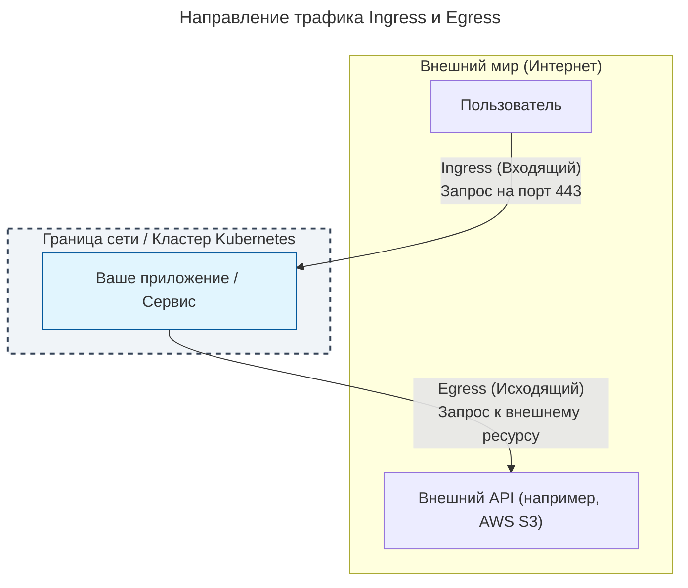
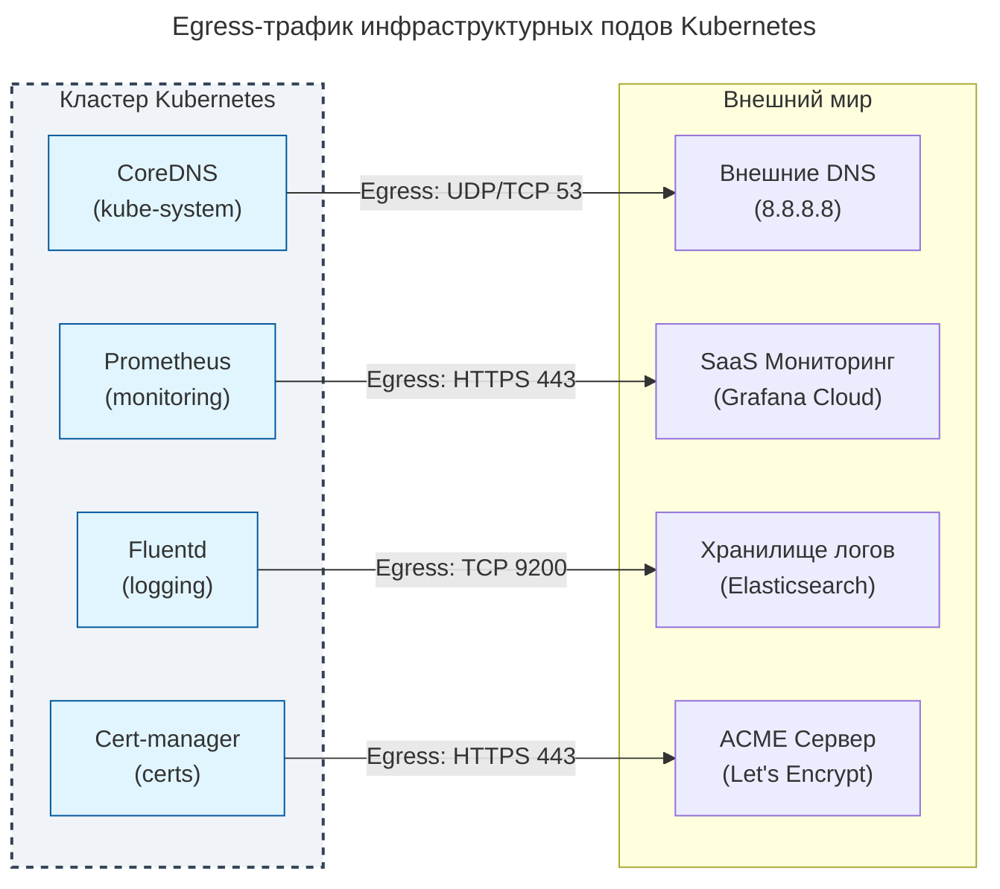
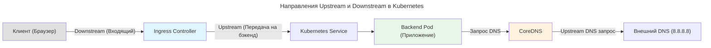

---
aliases:
  - downstream
  - Egress
  - Event Stream
  - Ingress
  - upstream
---
## Ingress vs Egress: Разбор терминологии

> Слово **Egress** содержит в себе приставку латинского происхождения *ex-* (из, вне) и корень *gressus* (шаг). То есть **Egress = Outgoing**.

---

### Определения

| Термин      | Перевод           | Направление трафика                     | Простой пример                                                                          |
| :---------- | :---------------- | :-------------------------------------- | :-------------------------------------------------------------------------------------- |
| **Ingress** | Вход / Входящий   | Извне → Внутрь вашей сети/кластера      | Пользователь открывает ваш сайт в браузере.                                             |
| **Egress**  | Выход / Исходящий | Из вашей сети/кластера → Во внешний мир | Ваше приложение делает запрос к внешнему API (например, к Stripe или Telegram Bot API). |

---

### Визуализация потоков трафика



---

### Контекст использования в ИТ

#### 1. Kubernetes
* **Ingress:** Это конкретный объект API Kubernetes (`Ingress`), который управляет внешним доступом к сервисам внутри кластера, обычно по HTTP/HTTPS. Он работает в паре с *Ingress Controller* (например, Nginx Ingress или Traefik), который выступает в роли точки входа (Reverse Proxy).
* **Egress:** Обозначает любой исходящий трафик из подов. Для его контроля используются `NetworkPolicy` (чтобы запретить подам ходить куда попало) или `Egress Gateway` (в сервис-мешах типа Istio, чтобы централизованно управлять исходящими запросами и применять к ним mTLS).

#### 2. Облачные провайдеры (AWS, GCP, Azure)
* **Ingress (Входящий трафик):** У большинства облачных провайдеров входящий трафик **бесплатен**. Провайдеры заинтересованы в том, чтобы данные заходили в их облако.
* **Egress (Исходящий трафик):** Исходящий трафик из облака в публичный интернет **тарифицируется**. Это одна из основных статей расходов в облачных счетах (Data Transfer Out).

#### 3. Сетевая безопасность (Firewalls / Security Groups)
* **Ingress Rules (Правила входа):** Определяют, кто может подключиться к вашим ресурсам. *Пример: Разрешить входящий трафик на порт 443 только с IP-адресов офисного VPN.*
* **Egress Rules (Правила выхода):** Определяют, куда ваши серверы могут обращаться. *Пример: Запретить весь исходящий трафик по умолчанию, кроме порта 443 к конкретным доверенным внешним сервисам (принцип Zero Trust).*

---

### Резюме для запоминания

* Думайте о своей инфраструктуре как о **замке**.
* **Ingress** — это стража у ворот, которая решает, кого **впустить** внутрь.
* **Egress** — это гонцы, которых вы **отправляете** наружу, и правила, куда им разрешено ходить.
* Слово **Outgress** забудьте — используйте **Egress**.

## Egress в инфраструктурных подах Kubernetes

Да, понятие Egress (исходящий сетевой трафик) в полной мере относится к инфраструктурным подам.

Инфраструктурные поды (компоненты, обеспечивающие работу самого кластера или его эксплуатацию, такие как DNS, мониторинг, логирование) — это такие же поды с сетевыми интерфейсами. Для выполнения своих функций им часто необходимо отправлять запросы во внешний мир или в другие сети.

### Примеры Egress-трафика инфраструктурных подов

Вот как различные системные компоненты используют исходящий трафик:

#### CoreDNS
Поды CoreDNS (обычно в пространстве имен `kube-system`) принимают DNS-запросы от рабочих подов. Если запрошенный домен не находится внутри кластера, CoreDNS генерирует Egress-трафик к внешним (upstream) DNS-серверам (например, 8.8.8.8 или корпоративным DNS).

#### Агенты мониторинга и логирования
Агенты, собирающие метрики и логи (Prometheus, Fluentd, Filebeat, Datadog Agent), постоянно генерируют Egress-трафик. Они отправляют собранные данные во внешние системы хранения или SaaS-платформы (Grafana Cloud, Elasticsearch, Splunk).

#### Cert-manager
Компонент для управления SSL-сертификатами должен иметь доступ к интернету, чтобы связываться с центрами сертификации (например, серверами Let's Encrypt ACME) для проверки домена и получения сертификатов.

#### Ingress Controller
Хотя Ingress Controller в основном обрабатывает Ingress (входящий) трафик, ему также может требоваться Egress. Например, если настроена внешняя аутентификация (OIDC/OAuth2 proxy), контроллер будет отправлять исходящие запросы к провайдеру идентификации (Keycloak, Google Auth).

### Визуализация потоков Egress



### Управление Egress через NetworkPolicy

Поскольку инфраструктурные поды имеют доступ к сети, их Egress-трафик необходимо контролировать в рамках модели Zero Trust. Если под скомпрометирован, жесткие правила Egress не позволят злоумышленнику использовать его для атак на внешние ресурсы или эксфильтрации данных.

Пример ограничения Egress только для CoreDNS:

```yaml
apiVersion: networking.k8s.io/v1
kind: NetworkPolicy
metadata:
  name: allow-coredns-egress
  namespace: kube-system
spec:
  podSelector:
    matchLabels:
      k8s-app: kube-dns
  policyTypes:
    - Egress
  egress:
    # Разрешаем DNS-запросы только к конкретным внешним серверам
    - to:
        - ipBlock:
            cidr: 8.8.8.8/32
        - ipBlock:
            cidr: 8.8.4.4/32
      ports:
        - protocol: UDP
          port: 53
        - protocol: TCP
          port: 53
    # Разрешаем служебный трафик внутри кластера (например, healthchecks)
    - to:
        - podSelector: {}
```

### Важное уточнение про внутрикластерный трафик

С технической точки зрения, любой исходящий пакет из пода — это Egress. Однако в терминологии Kubernetes и сетевых инженеров принято разделять:
1. **Intra-cluster traffic (Внутрикластерный трафик):** Общение между подами внутри одного кластера (например, от Ingress Controller к бэкенд-поду).
2. **External Egress (Внешний исходящий трафик):** Трафик, покидающий пределы кластерной сети (CIDR пода/сервиса) и уходящий в интернет или другую VPC.

Когда говорят об ограничениях Egress и затратах на него, почти всегда имеют в виду именно **внешний Egress**. Инфраструктурные поды генерируют оба типа, и оба должны быть учтены при проектировании сетевой безопасности кластера.

## Понятие Upstream в сетевой архитектуре и Kubernetes

Термин **upstream** (апстрим) в контексте сетей и Kubernetes обозначает направление трафика от прокси-сервера или шлюза к конечному серверу, который фактически обрабатывает запрос. Простыми словами, upstream — это бэкенд или источник данных, к которому обращается посредник.

В Kubernetes этот термин чаще всего встречается в двух сценариях:

1. **Ingress Controller и Services:** Когда Ingress Controller (например, Nginx) принимает запрос от пользователя, он перенаправляет его upstream — на поды, которые обслуживаются соответствующим Service.
2. **CoreDNS:** Если под запрашивает внешний домен, CoreDNS принимает запрос и отправляет его upstream — на внешние DNS-серверы (например, 8.8.8.8 или корпоративный DNS), чтобы разрешить имя.

### Визуализация направлений трафика



### Другие типы потоков в контексте Kubernetes

Помимо сетевых направлений upstream/downstream, в экосистеме Kubernetes термин "stream" (поток) используется для описания различных механизмов передачи данных и событий.

#### Downstream
Это направление, противоположное upstream. Оно обозначает трафик, движущийся от бэкенда к клиенту, или сервисы, которые потребляют данные от другого сервиса. В контексте Service Mesh (например, Istio), сервис, который инициирует запрос, является downstream для сервиса, который этот запрос обрабатывает.

#### Event Stream
Kubernetes API Server предоставляет механизм `Watch`, который представляет собой непрерывный поток событий (Event Stream). Когда вы выполняете команду `kubectl get pods --watch`, вы подписываетесь на этот поток. API сервер отправляет клиенту JSON-события в реальном времени при любом изменении состояния ресурсов в кластере. Это основа работы всех контроллеров и операторов Kubernetes.

Пример события из Event Stream API:

```json
{
  "type": "MODIFIED",
  "object": {
    "metadata": {
      "name": "my-app-pod",
      "namespace": "default"
    },
    "status": {
      "phase": "Running"
    }
  }
}
```

#### Log Stream
Каждый контейнер в поде имеет стандартные потоки вывода: `stdout` (стандартный вывод) и `stderr` (стандартный вывод ошибок). Агенты сбора логов (такие как Fluentd, Filebeat или Promtail) читают эти log streams напрямую из файлов на ноде (обычно по пути `/var/log/containers/`) и пересылают их в централизованные системы хранения.

#### gRPC Streams
Архитектура Kubernetes активно использует gRPC для взаимодействия с плагинами. В отличие от обычного REST, gRPC поддерживает полноценные потоки (streams):
* **CNI (Container Network Interface):** Плагин сети использует gRPC stream для настройки сетевых интерфейсов пода.
* **CSI (Container Storage Interface):** Драйверы хранилищ используют потоки для создания, подключения и мониторинга томов.
* **Device Plugins:** Для проброса GPU или других устройств в поды.

### Резюме терминологии

| Термин | Суть в контексте Kubernetes |
| :--- | :--- |
| **Upstream** | Направление к бэкенду (подам) или внешнему источнику (DNS). |
| **Downstream** | Направление к клиенту или потребителю данных. |
| **Event Stream** | Непрерывный поток изменений ресурсов от API Server (механизм Watch). |
| **Log Stream** | Потоки stdout/stderr контейнеров, собираемые агентами. |
| **gRPC Stream** | Двусторонние каналы связи для плагинов (CNI, CSI, DRA). |
