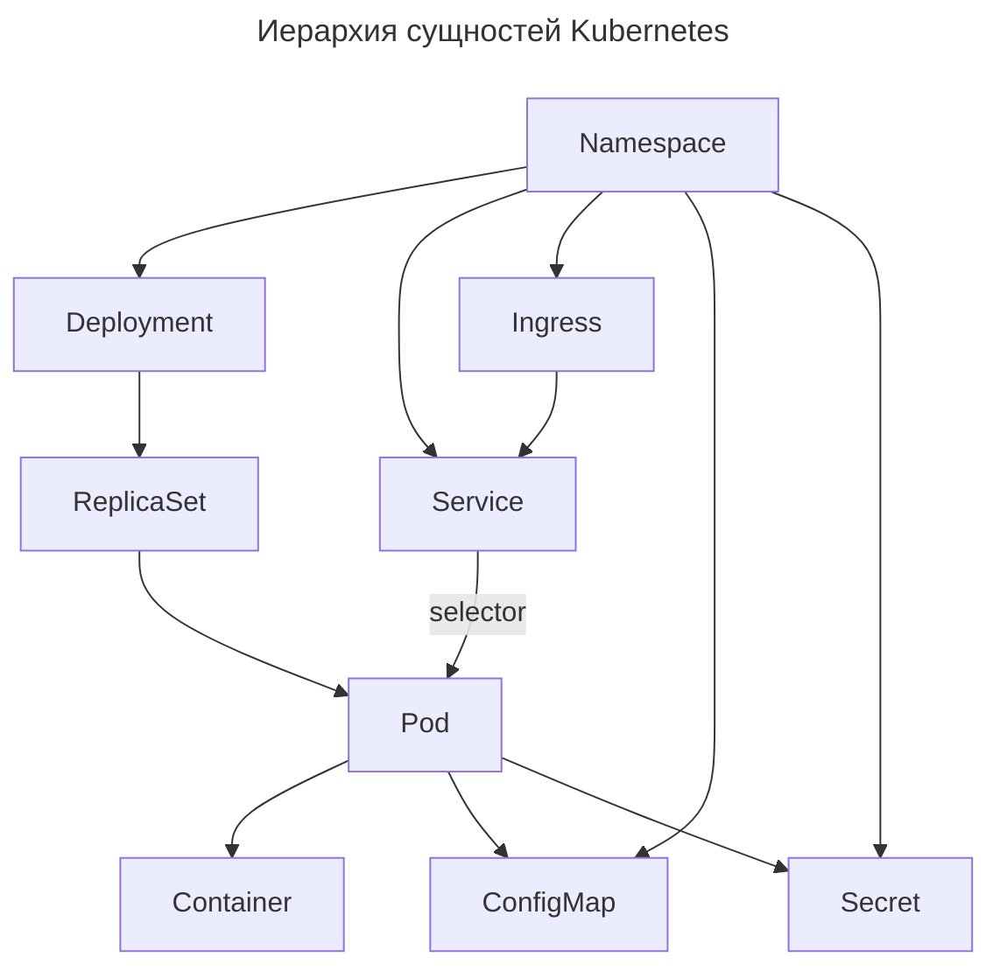
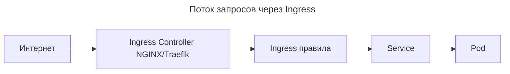
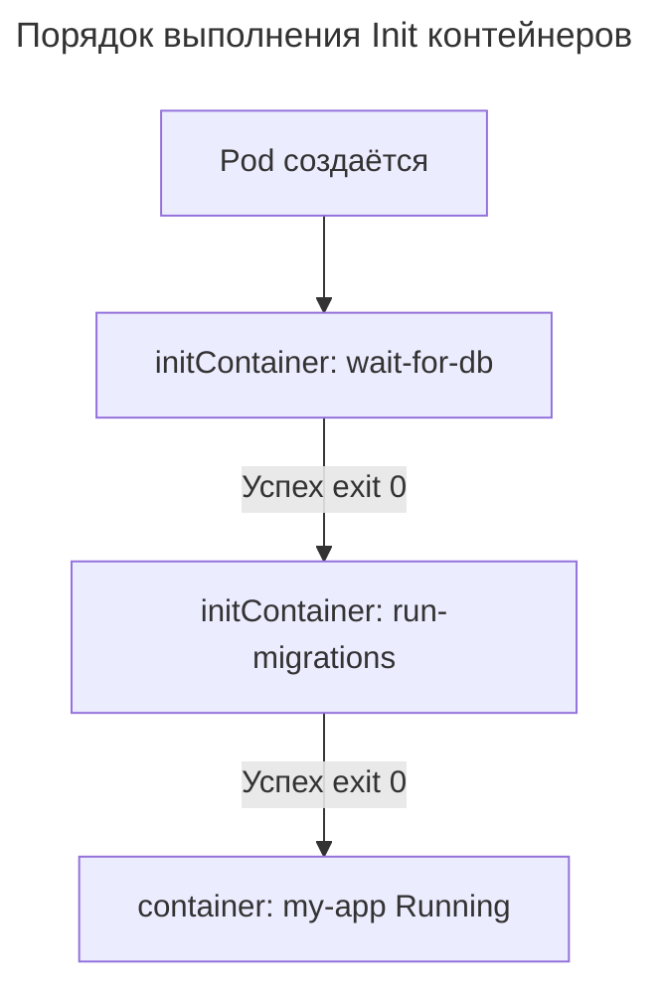

---
aliases:
  - Cluster
  - ConfigMap
  - Container
  - CronJob
  - Deployment
  - Ephemeral Containers
  - HorizontalPodAutoscaler
  - HPA
  - Ingress
  - Ingress Controller
  - Init Container
  - Init Containers
  - Job
  - k8s
  - kubernetes
  - Namespace
  - PersistentVolume
  - PersistentVolumeClaim
  - Pod
  - PV
  - PVC
  - RBAC
  - ReplicaSet
  - RS
  - Secret
  - Service
  - StatefulSet
  - Иерархия Kubernetes
  - Инициализационные контейнеры
  - Пространство имен
  - Эфемерные контейнеры
---

## Иерархия сущностей Kubernetes

Иерархия сущностей Kubernetes показывает, как объекты кластера связаны между собой: кластер состоит из узлов, на узлах запускаются поды, подами управляют Deployment, доступ к подам предоставляет Service.

**Схема связей**

| Связь | Значение |
|----------------------|-------------------------------------------------------------------|
| `Cluster → Node` | Кластер состоит из узлов |
| `Node → Pod` | На каждом узле запускаются поды |
| `Pod → Deployment` | Deployment управляет подами |
| `Deployment → Service` | Service предоставляет доступ к подам, управляемым Deployment |
| `Deployment → HPA` | HPA масштабирует Deployment по метрикам |
| `Namespace → все` | Namespace изолирует ресурсы: Nodes, Pods, Deployments, Services, HPA |

### Полная иерархия



> Ключевое правило:
> - Подами не управляют напрямую — ими управляет Deployment.
> - К подам не обращаются напрямую — обращаются к Service.
> - Контейнеры не запускаются вручную в K8s — они живут внутри Pod'ов.

### Container в иерархии

Container — самая маленькая исполняемая единица. Он находится внутри спецификации Pod'а.

В YAML-файле это выглядит так:

```yaml
apiVersion: v1
kind: Pod
metadata:
  name: my-pod
spec:
  containers:
  - name: my-app
    image: nginx
    ports:
    - containerPort: 80
```

**Связь Pod и Container**

- Pod предоставляет среду: IP-адрес, общие тома (Volumes), переменные окружения.
- Container выполняет код приложения (Java, Node.js, Python).
- В одном Pod может быть несколько контейнеров (например, основное приложение + sidecar для логирования); они видят друг друга как `localhost`.

**Аналогия**

Pod — это квартира (имеет адрес, электричество, воду). Container — жилец в этой квартире, который делает полезную работу.

### Namespace

Namespace — логический изолированный контейнер для ресурсов: виртуальный кластер внутри реального, изолирующий проекты, окружения (dev/stage/prod) и команды.

```yaml
apiVersion: v1
kind: Namespace
metadata:
  name: my-namespace
```

**Использование**

```bash
kubectl -n my-namespace get pods
```

- Ресурсы из разных Namespace не видят друг друга по умолчанию.
- Аналогия: «разные комнаты в одном доме».

### Deployment

Deployment — управляющий контроллер для Pod'ов. Объект гарантирует, что нужное количество идентичных Pod'ов запущено и работает. Он управляет ReplicaSet'ами и обеспечивает обновления, откаты и восстановление при сбое.

```yaml
apiVersion: apps/v1
kind: Deployment
metadata:
  name: my-app
spec:
  replicas: 1
  selector:
    matchLabels:
      app: my-app
  template:
    metadata:
      labels:
        app: my-app
    spec:
      containers:
      - name: my-app
        image: example/my-app:v1.0.0
```

**Что делает Deployment**

- Создаёт ReplicaSet с именем вида `my-app-6cbbdd56fd` (хеш шаблона).
- Этот ReplicaSet создаёт Pod вида `my-app-6cbbdd56fd-l8s4s`.
- Если Pod упал — Deployment создаст новый.

> ReplicaSet не виден напрямую, но всегда существует.

**Проверка**

```bash
kubectl -n my-namespace get deploy,rs,pod -l app=my-app
```

Пример вывода:

```text
NAME                             READY   UP-TO-DATE   AVAILABLE   AGE
deployment.apps/my-app           1/1     1            1           1h

NAME                                        DESIRED   CURRENT   READY   AGE
replicaset.apps/my-app-6cbbdd56fd           1         1         1       1h

NAME                                   READY   STATUS    RESTARTS   AGE
pod/my-app-6cbbdd56fd-l8s4s            1/1     Running   0          1h
```

### ReplicaSet

ReplicaSet (RS) — физический механизм создания Pod'ов: реализация Deployment'а и группа одинаковых Pod'ов (по шаблону). Deployment управляет ReplicaSet'ами, а ReplicaSet создаёт и удаляет Pod'ы.

**Почему ReplicaSet'ов несколько**

При обновлении Deployment (например, при смене образа) Kubernetes создаёт новый ReplicaSet и постепенно заменяет старые Pod'ы. Это называется rolling update. В такой момент одновременно существуют старый (неактивный) и новый ReplicaSet — это нормальное поведение, а не ошибка.

**Проверка**

```bash
kubectl -n my-namespace get replicaset
```

ReplicaSet не создаётся вручную — только Deployment.

### Pod

Pod — самая маленькая единица развертывания: группа из одного или нескольких контейнеров, которые работают на одном узле, делят сеть, storage, IPC и имеют один IP-адрес в кластере.

**Аналогия**

- Pod — «лампочка».
- Deployment — «выключатель», который включает несколько лампочек.
- Service — «табличка на двери», которая ведёт к лампочкам.

Pod'ы не создаются вручную — только через Deployment/StatefulSet.

**Проверка**

```bash
kubectl -n my-namespace get pods -o wide
```

**Pod и контейнеры**

Pod не может существовать без хотя бы одного контейнера:

1. **Определение Pod'а.** Pod — логическая оболочка для одного или нескольких контейнеров. Если убрать все контейнеры, «оболочке» нечего будет запускать.
2. **Валидация API.** При попытке создать YAML с пустым списком `containers: []` API-сервер Kubernetes отвергнет запрос с ошибкой валидации: `spec.containers: Required value`.

В Pod могут быть два типа контейнеров:

- **Init Containers** (`initContainers`) — запускаются первыми для подготовки среды.
- **Main Containers** (`containers`) — основные рабочие контейнеры.

Если есть только `initContainers`, но нет основных `containers`, Pod перейдёт в статус `Completed` (завершен) сразу после выполнения инициализации, так как ему нечего поддерживать в рабочем состоянии.

**Исключение: Ephemeral Containers (эфемерные контейнеры)**

Концепция добавлена в K8s v1.22+. Эфемерные контейнеры используются только для отладки уже запущенных Pod'ов (например, чтобы добавить `curl` или `tcpdump` в образ, где их нет):

- Добавляются к уже существующему Pod'у, в котором уже есть обычные контейнеры.
- Не могут быть определены при создании Pod'а.
- Не считаются частью основной спецификации приложения.

**Вывод**

Pod = контейнер(ы) + общие ресурсы (сеть, диск). Без контейнера Pod — пустая мета-информация, которая не имеет смысла в архитектуре Kubernetes.

### Service

Service — сетевой доступ к группе Pod'ов: стабильный IP и DNS-имя, которое всегда ведёт к группе Pod'ов, даже если они пересоздаются.

```yaml
apiVersion: v1
kind: Service
metadata:
  name: my-service
spec:
  selector:
    app: my-service
  ports:
    - port: 8081
      targetPort: 8081
  type: ClusterIP
```

**Как работает**

- Service смотрит на Pod'ы с меткой `app: my-service`.
- Любой запрос к `my-service.my-namespace.svc.cluster.local:8081` балансируется между всеми Pod'ами.
- Если Pod упал — Service автоматически перестаёт его учитывать.

**Почему нельзя обращаться к Pod'у напрямую**

Pod'ы имеют динамические IP — они меняются при перезапуске. Service имеет постоянный IP и DNS.

**Проверка доступа к Service**

```bash
kubectl -n my-namespace run debug --rm -i --image=curlimages/curl -- sh -c "curl http://my-service:8081/api"
```

**Типы Service**

| Тип | Где доступен |
| -------------- | --------------------------------- |
| `ClusterIP` | Только внутри кластера |
| `NodePort` | На каждом узле (порт 30000–32767) |
| `LoadBalancer` | Внешний балансировщик (в облаке) |
| `Ingress` | HTTP/HTTPS через прокси |

### Другие сущности Kubernetes

| Понятие | Что это? |
|--------|----------|
| Ingress | HTTP-маршрутизатор — внешний вход в кластер; направляет запросы вида `example.com/api/events` → Service |
| Ingress Controller | Реальный прокси-сервер (NGINX, Traefik), который реализует Ingress |
| Secret | Хранение чувствительных данных (пароли, токены); `dockerconfigjson` — для доступа к container registry |
| ConfigMap | Хранение конфигураций (не секреты) |
| StatefulSet | Управление состоянием (базы данных, Kafka): стабильные имена, сеть и storage |
| PersistentVolume (PV) / PersistentVolumeClaim (PVC) | Постоянное хранилище для данных; данные сохраняются, даже если Pod упал |
| HorizontalPodAutoscaler (HPA) | Автоматическое масштабирование по CPU/Memory: `kubectl autoscale deployment/my-app --cpu-percent=70 --min=2 --max=10` |
| Job / CronJob | Запуск задачи один раз или по расписанию (например, миграции БД) |
| Role / RoleBinding / ClusterRole / ClusterRoleBinding | RBAC — права доступа |

### Проверка сущностей

| Вопрос | Как узнать |
|------------------------|-------------|
| Какой Pod запущен? | `kubectl -n my-namespace get pods` |
| Какой Deployment управляет этим Pod'ом? | `kubectl -n my-namespace get deploy -o wide` — посмотреть имя |
| Какой Service обращается к этому Pod'у? | `kubectl -n my-namespace get svc -o wide` — сравнить `SELECTOR` с метками Pod'а |
| Какой Secret используется? | `kubectl -n my-namespace get deployment <name> -o yaml \| grep imagePullSecrets` |
| Какой Ingress направляет трафик? | `kubectl -n my-namespace get ingress` — смотреть `HOSTS` и `PATHS` |
| Какой порт слушает Pod? | `kubectl -n my-namespace exec <pod> -- netstat -tlnp` |

### Резюме

| Уровень | Роль | Кто управляет кем? |
|--------|------|-------------------|
| Namespace | Изоляция | Содержит все остальные |
| Deployment / StatefulSet | Управление жизненным циклом | Создаёт ReplicaSet |
| ReplicaSet | Физическое создание | Создаёт Pod'ы |
| Service | Сетевой доступ | Направляет трафик к Pod'ам через метки |
| Ingress | Внешний вход | Направляет HTTP-запросы к Service |

Администратор управляет Deployment'ами и Service'ами; Kubernetes создаёт ReplicaSet'ы и Pod'ы автоматически.

**Как запомнить**

- Deployment → ReplicaSet → Pod — «создаём».
- Service → Pod — «доступ».
- Ingress → Service — «внешний вход».
- Secret / ConfigMap — «настройки и пароли».
- StatefulSet + PVC — «базы данных и состояние».

### Ingress

Поток трафика при использовании Ingress:



### Init Containers

Init Containers (инициализационные контейнеры) — специальные контейнеры, которые запускаются до основных (`containers`) и выполняются строго последовательно. Их главная задача — подготовить среду для основного приложения. Если любой Init-контейнер падает, Pod не перейдёт в статус `Running`, а будет перезапускать этот Init-контейнер до успеха.

**Отличия от обычных контейнеров**

| Характеристика | Init Containers | Обычные Containers |
| :-------------------------- | :------------------------------------------------- | :--------------------------------- |
| Запуск | Последовательно (один за другим) | Параллельно (все сразу после init) |
| Жизненный цикл | Запускается → Выполняет задачу → Завершается | Запускается → Работает постоянно |
| Условие старта основных | Все Init-контейнеры должны завершиться с кодом `0` | - |
| Пробы (Probes) | ❌ Не поддерживают Liveness/Readiness | ✅ Поддерживают |
| Ресурсы | Используются только во время инициализации | Используются всё время жизни Pod'а |

**Типичные сценарии использования**

1. **Ожидание зависимостей.** Ждать, пока PostgreSQL/Kafka/Redis станут доступными, прежде чем запускать приложение.
2. **Генерация конфигов.** Скачать секреты из Vault, сгенерировать `nginx.conf` или сертификаты.
3. **Миграции БД.** Выполнить Flyway/Liquibase миграции до старта приложения.
4. **Настройка прав доступа.** Изменить владельца файлов на Persistent Volume (`chown`).
5. **Регистрация в Service Discovery.** Зарегистрировать сервис в Consul/Eureka перед стартом.

**Пример YAML**

```yaml
apiVersion: v1
kind: Pod
metadata:
  name: my-app-pod
spec:
  # Init-контейнеры выполняются ПОСЛЕДОВАТЕЛЬНО
  initContainers:
    - name: wait-for-db
      image: busybox:1.36
      command: ['sh', '-c', 'until nc -z postgres 5432; do echo waiting for db; sleep 2; done']

    - name: run-migrations
      image: my-app:migrate-v2
      command: ['./migrate', '--path=/migrations', 'up']
      envFrom:
        - secretRef:
            name: db-credentials

  # Основные контейнеры запускаются ТОЛЬКО после успешного завершения ВСЕХ init-контейнеров
  containers:
    - name: my-app
      image: my-app:v2
      ports:
        - containerPort: 8080
```

**Порядок выполнения**



> ⚠️ Если `run-migrations` упадёт, Pod останется в статусе `Init:Error` или `Init:CrashLoopBackOff`. Основной контейнер `my-app` не запустится, пока миграции не пройдут успешно.

**Best Practices**

1. Используйте минимальные образы: `busybox`, `alpine`, `curlimages/curl` — не тащите тяжёлый образ приложения только ради `nc` или `wget`.
2. Не делайте бесконечных циклов без таймаута: всегда добавляйте максимальное время ожидания, иначе Pod может зависнуть навсегда.
3. Идемпотентность: Init-контейнер может быть перезапущен при сбое. Убедитесь, что повторный запуск не ломает систему (например, миграции должны быть идемпотентными).
4. Логируйте прогресс: Init-контейнеры блокируют старт приложения, поэтому хорошие логи помогают понять, что именно ждёт Pod.
5. Ресурсы: задавайте `resources.limits` даже для Init-контейнеров, чтобы они не съели все ресурсы ноды во время инициализации.

**Init Container vs Startup Probe**

| Сценарий | Используйте |
|----------|-------------|
| Нужно выполнить одноразовую подготовку (миграции, генерация конфигов) | ✅ Init Container |
| Приложение медленно стартует (Java/Spring Boot грузится 60 сек) | ✅ Startup Probe |
| Нужно ждать внешнюю зависимость перед каждым перезапуском | ✅ Init Container |
| Нужно проверять готовность приложения постоянно | ✅ Readiness Probe |

> 💡 Часто используют оба подхода вместе: Init Container ждёт базу данных, а Startup Probe даёт приложению время на прогрев кэша после запуска.
