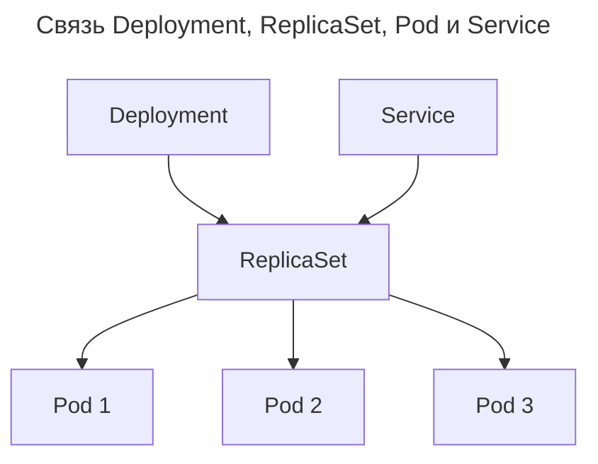

---
aliases:
  - Deployment
  - k8s
  - kubectl
  - Kubernetes
  - Pod
  - ReplicaSet
  - ReplicationController
  - RollingUpdate
  - Контроллер реплик
  - Под
  - Развёртывание
---

## Что такое ReplicaSet

**Определение**

ReplicaSet — ключевой компонент Kubernetes, отвечающий за поддержание нужного количества запущенных подов (pods). Он обеспечивает стабильность, отказоустойчивость и масштабируемость приложений.

ReplicaSet — объект в Kubernetes, который гарантирует, что заданное количество экземпляров Pod'ов работает в кластере в любой момент времени:
- под падает → ReplicaSet создаст новый;
- кто-то удалил под → ReplicaSet восстановит его;
- нагрузка растёт → можно увеличить `replicas` → появятся новые поды.

Это основа надёжности в Kubernetes.

---

## Пример: зачем нужен ReplicaSet

```yaml
apiVersion: apps/v1
kind: ReplicaSet
metadata:
  name: frontend-rs
spec:
  replicas: 3
  selector:
    matchLabels:
      app: frontend
  template:
    metadata:
      labels:
        app: frontend
    spec:
      containers:
      - name: nginx
        image: nginx:latest
```

Что делает этот ReplicaSet:
- создаёт и поддерживает 3 пода с Nginx;
- если один под падает — автоматически создаёт новый;
- все поды помечены как `app: frontend`;
- может использоваться с Service для балансировки.

---

## Основные функции ReplicaSet

| Функция | Объяснение |
| --- | --- |
| Гарантия числа реплик | Всегда будет `replicas: 3`, даже если удалить один под |
| Самовосстановление | Если node упал → контроллер создаёт поды на других нодах |
| Базовая масштабируемость | Меняете `replicas: 3` → `5` → Kubernetes сам добавит два пода |
| Работа с Deployment | Чаще используется через Deployment, а не напрямую |

---

## ReplicaSet vs ReplicationController (устаревший)

| Характеристика | ReplicationController | ReplicaSet |
| --- | --- | --- |
| Поддержка label selectors | Только простые (`key=value`) | Да — `matchLabels`, `matchExpressions` |
| Обновления | Сложные | Лучше — совместим с Deployment |
| Использование | Устарел | Рекомендуется |
| API | `v1` | `apps/v1` |

> ReplicationController — из ранних версий K8s — не используется. Всегда используйте ReplicaSet или Deployment.

---

## Как связан с другими объектами



**Deployment** — управляет ReplicaSet'ом:
- делает обновления без простоя;
- позволяет откатиться;
- использует ReplicaSet под капотом.

**Service** — направляет трафик к подам через ReplicaSet:

```yaml
selector:
  app: frontend
```

Селектор тот же, что у ReplicaSet → трафик распределяется между всеми 3 подами.

---

## Когда использовать ReplicaSet напрямую

Почти никогда. ReplicaSet напрямую не рекомендуется, потому что:
- нет стратегии обновления (`RollingUpdate`);
- нет возможности отката;
- нет контроля за процессом деплоя.

Вместо этого используется Deployment:

```yaml
apiVersion: apps/v1
kind: Deployment
metadata:
  name: frontend
spec:
  replicas: 3
  strategy:
    type: RollingUpdate
    rollingUpdate:
      maxSurge: 1
      maxUnavailable: 0
  selector:
    matchLabels:
      app: frontend
  template:
    metadata:
      labels:
        app: frontend
    spec:
      containers:
      - name: nginx
        image: nginx:latest
```

> Deployment использует ReplicaSet под капотом, но добавляет безопасные обновления, откаты, паузы и проверки.

---

## Зачем знать про ReplicaSet

| Причина | Объяснение |
| --- | --- |
| Понимание работы Deployment | Deployment создаёт ReplicaSet при каждом обновлении |
| Диагностика | `kubectl get rs` — покажет все replica set'ы |
| Ручное использование | Иногда нужно напрямую, например для временной нагрузки и тестирования |

---

## Команды для работы с ReplicaSet

```bash
# Посмотреть все ReplicaSet'ы
kubectl get rs

# Описать конкретный
kubectl describe rs/frontend-rs

# Удалить (осторожно!)
kubectl delete rs/frontend-rs

# Масштабировать
kubectl scale rs/frontend-rs --replicas=5
```

---

## Что видно после деплоя

```bash
$ kubectl get deployments
NAME       READY   UP-TO-DATE   AVAILABLE
frontend   3/3     3           3

$ kubectl get rs
NAME                  DESIRED   CURRENT   READY
frontend-7c649d69f8   3         3         3

$ kubectl get pods
NAME                        READY
frontend-7c649d69f8-abc12   1/1
frontend-7c649d69f8-def34   1/1
frontend-7c649d69f8-ghi56   1/1
```

Deployment → создаёт ReplicaSet → тот создаёт Pods.

---

## Преимущества ReplicaSet

| Плюс | Объяснение |
| --- | --- |
| ✅ Автоматическое восстановление | Если под упал — сразу пересоздаётся |
| ✅ Масштабирование | Простое изменение числа реплик |
| ✅ Стабильность | Гарантирует, что приложение «живо» |
| ✅ Часть стандартной цепочки | Deployment → ReplicaSet → Pods |

## Недостатки

- Единственный «минус» — не используется напрямую, лучше Deployment.
- Сам по себе не умеет обновляться безопасно.

---

## Финальный вывод

| ReplicaSet — это... | Это не... |
| --- | --- |
| Контроллер, поддерживающий нужное число подов | Независимый объект |
| Основа для масштабирования и отказоустойчивости | Главный способ деплоя |
| Технический слой под Deployment'ом | То, что пишется вручную каждый раз |

> `kubectl apply -f deployment.yaml` → Kubernetes создаёт ReplicaSet → ReplicaSet создаёт поды.

**Цитата**

> _«A ReplicaSet is to a Pod as a Deployment is to a ReplicaSet.»_ — Kubernetes Documentation

---

## Итог

| Нужно понимать | Использовать |
| --- | --- |
| Как ReplicaSet поддерживает стабильность | Deployment — он использует ReplicaSet |
| Что такое `rs` в `kubectl get rs` | Развёртывание через Deployment |
| Как масштабируется приложение | Настройкой `replicas` в Deployment |

- [Официальная документация Kubernetes](https://kubernetes.io/docs/concepts/workloads/controllers/replicaset/)
- Видео «Kubernetes ReplicaSet Explained» (TechWorld with Nana)
- Книга #📘 «Kubernetes in Action» (Marko Luksa)

ReplicaSet — невидимый герой Kubernetes: взаимодействие с ним напрямую редкое, но без него приложение упадёт при первом сбое. Знать о нём и использовать через Deployment — обязательное условие.
