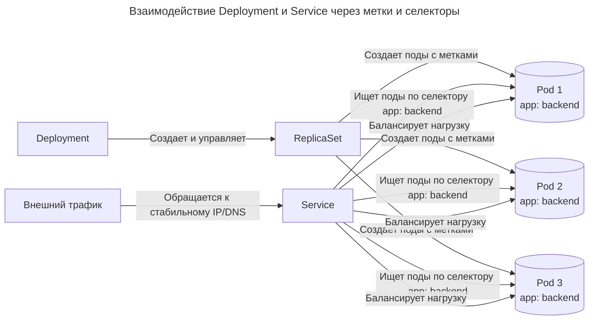

---
aliases:
  - deployment
  - k8s
  - kubernetes
  - kubernetes-deployment
  - ReplicaSet
  - ReplicaSets
---
## Различия и взаимодействие Deployment и Service в Kubernetes

### Архитектура и назначение Deployment

Deployment — это ресурс Kubernetes, обеспечивающий декларативное управление подами и наборами реплик (ReplicaSets). Его основная задача заключается в управлении жизненным циклом вычислительных ресурсов и состоянием приложения.

Deployment гарантирует, что указанное количество идентичных подов всегда запущено и работает. Он также отвечает за стратегии обновления приложения, такие как плавные обновления (rolling updates) и откаты (rollbacks) к предыдущим версиям, обеспечивая непрерывность работы сервиса при изменении образов контейнеров.

Определение манифеста Deployment для управления подами

```yaml
apiVersion: apps/v1
kind: Deployment
metadata:
  name: backend-app
spec:
  replicas: 3
  selector:
    matchLabels:
      app: backend
  template:
    metadata:
      labels:
        app: backend
    spec:
      containers:
      - name: app-container
        image: my-app:1.0
        ports:
        - containerPort: 8080
```

### Архитектура и назначение Service

Service — это абстрактный сетевой ресурс, который предоставляет стабильную точку входа (виртуальный IP-адрес и DNS-имя) для набора подов. Поскольку поды в Kubernetes эфемерны, их IP-адреса постоянно меняются при перезапуске, масштабировании или обновлении.

Service решает проблему сетевого обнаружения и балансировки нагрузки. Он маршрутизирует входящий сетевой трафик к нужным подам, скрывая их динамическую природу от других компонентов кластера или внешних клиентов.

Определение манифеста Service для сетевого доступа

```yaml
apiVersion: v1
kind: Service
metadata:
  name: backend-service
spec:
  selector:
    app: backend
  ports:
  - protocol: TCP
    port: 80
    targetPort: 8080
  type: ClusterIP
```

### Сравнение функциональных областей

Deployment и Service решают принципиально разные задачи в архитектуре кластера и не являются взаимозаменяемыми.

Основные различия между ресурсами:
- Область ответственности: Deployment управляет вычислениями (запуск, остановка, обновление контейнеров), а Service управляет сетью (маршрутизация трафика, DNS, балансировка).
- Эфемерность: Поды, создаваемые Deployment, имеют динамические IP-адреса. Service предоставляет статический IP и DNS-имя, которые не меняются на протяжении всего жизненного цикла самого Service.
- Зависимости: Deployment может существовать и работать без Service (например, для фоновых задач или batch-обработки). Service без Deployment существовать может, но ему некуда будет маршрутизировать трафик, если поды не созданы.

### Механизм связывания через селекторы и метки

Deployment и Service не связаны между собой напрямую в манифестах. Их взаимодействие осуществляется косвенно через механизм меток (labels) и селекторов (selectors).

Deployment назначает метки создаваемым им подам. В свою очередь, Service использует селекторы для поиска подов, обладающих соответствующими метками, и начинает направлять на них сетевой трафик.

Взаимодействие Deployment и Service через метки и селекторы


