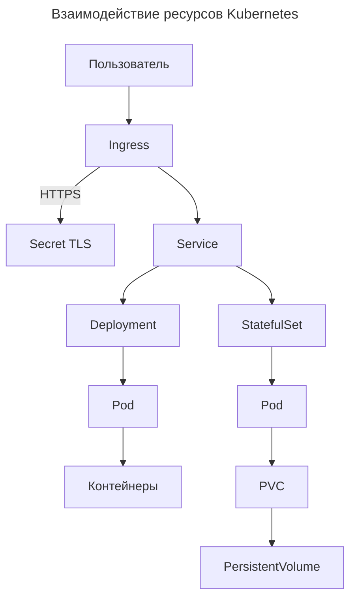

---
aliases:
  - ConfigMap
  - Deployment
  - HorizontalPodAutoscaler
  - HPA
  - Ingress
  - kubectl
  - kubernetes
  - Kubernetes manifest
  - Manifest
  - Metadata
  - PersistentVolumeClaim
  - Pod
  - PVC
  - Role
  - RoleBinding
  - Secret
  - Security Context
  - Selector
  - Service
  - ServiceAccount
  - StatefulSet
  - Конфигурационная карта
  - Манифест
  - Манифесты Kubernetes
  - Метаданные
  - Секрет
  - Селектор
  - Сервис
---

## Kubernetes Manifest

### Базовая структура

```yaml
apiVersion: v1          # Версия API
kind: Pod               # Тип ресурса
metadata:
  name: my-pod          # Уникальное имя
  namespace: default
  labels:
    app: myapp
spec:                   # Спецификация ресурса
  # Конфигурация
```

### Основные ресурсы

| Ресурс | Назначение | Когда использовать |
|--------|-----------|-------------------|
| **Pod** | Минимальная единица (контейнеры + ресурсы) | Отладка, одноразовые задачи |
| **Deployment** | Управление stateless Pod'ами | Веб-приложения, микросервисы |
| **StatefulSet** | Stateful приложения с хранилищем | Базы данных, очереди |
| **Service** | Стабильный доступ к Pod'ам | Всегда, когда Pod > 1 |
| **Ingress** | Роутинг HTTP-трафика | Доменные имена, SSL |
| **ConfigMap** | Неконфиденциальная конфигурация | Переменные, файлы конфигов |
| **Secret** | Конфиденциальные данные (base64) | Пароли, токены, сертификаты |
| **PVC** | Запрос хранилища | Постоянное хранение данных |
| **HPA** | Автоматическое масштабирование | Динамическая нагрузка |
| **ServiceAccount** | Учётная запись для Pod'ов | RBAC, доступ к API |
| **Role / ClusterRole** | Набор разрешений | Доступ к ресурсам |
| **RoleBinding / ClusterRoleBinding** | Привязка роли к субъекту | Назначение прав |

### Deployment

```yaml
apiVersion: apps/v1
kind: Deployment
metadata:
  name: nginx-deployment
spec:
  replicas: 3
  strategy:
    type: RollingUpdate
    rollingUpdate:
      maxSurge: 1
      maxUnavailable: 0
  selector:
    matchLabels:
      app: nginx
  template:
    metadata:
      labels:
        app: nginx
    spec:
      containers:
      - name: nginx
        image: nginx:1.21
        ports:
        - containerPort: 80
        livenessProbe:
          httpGet: { path: /, port: 80 }
          initialDelaySeconds: 5
          periodSeconds: 10
        readinessProbe:
          httpGet: { path: /health, port: 80 }
          initialDelaySeconds: 15
          periodSeconds: 5
```

### Service

```yaml
apiVersion: v1
kind: Service
metadata:
  name: nginx-service
spec:
  selector:
    app: nginx
  type: ClusterIP
  ports:
  - name: http
    port: 80
    targetPort: 80
```

### ConfigMap

```yaml
apiVersion: v1
kind: ConfigMap
metadata:
  name: app-config
data:
  database.host: "mysql.default.svc.cluster.local"
  nginx.conf: |
    server {
        listen 80;
        server_name localhost;
    }
```

### Secret

```yaml
apiVersion: v1
kind: Secret
metadata:
  name: app-secrets
type: Opaque
stringData:  # Альтернатива data — не требует base64
  api-token: "abc123"
```

### StatefulSet

```yaml
apiVersion: apps/v1
kind: StatefulSet
metadata:
  name: postgres
spec:
  serviceName: postgres
  replicas: 1
  selector:
    matchLabels:
      app: postgres
  template:
    spec:
      containers:
      - name: postgres
        image: postgres:14
        volumeMounts:
        - name: data
          mountPath: /var/lib/postgresql/data
  volumeClaimTemplates:
  - metadata:
      name: data
    spec:
      accessModes: ["ReadWriteOnce"]
      resources:
        requests:
          storage: 10Gi
```

### PVC

```yaml
apiVersion: v1
kind: PersistentVolumeClaim
metadata:
  name: postgres-pvc
spec:
  accessModes: ["ReadWriteOnce"]
  resources:
    requests:
      storage: 10Gi
```

### HPA

```yaml
apiVersion: autoscaling/v2
kind: HorizontalPodAutoscaler
metadata:
  name: nginx-hpa
spec:
  scaleTargetRef:
    apiVersion: apps/v1
    kind: Deployment
    name: nginx-deployment
  minReplicas: 2
  maxReplicas: 10
  metrics:
  - type: Resource
    resource:
      name: cpu
      target:
        type: Utilization
        averageUtilization: 50
```

### Ingress

```yaml
apiVersion: networking.k8s.io/v1
kind: Ingress
metadata:
  name: app-ingress
spec:
  ingressClassName: nginx
  tls:
  - hosts: [app.example.com]
    secretName: app-tls
  rules:
  - host: app.example.com
    http:
      paths:
      - path: /
        pathType: Prefix
        backend:
          service:
            name: frontend-service
            port: { number: 80 }
      - path: /api
        pathType: Prefix
        backend:
          service:
            name: backend-service
            port: { number: 8080 }
```

### ServiceAccount, Role, RoleBinding

```yaml
# ServiceAccount
apiVersion: v1
kind: ServiceAccount
metadata:
  name: my-sa
---
# Role
apiVersion: rbac.authorization.k8s.io/v1
kind: Role
metadata:
  namespace: default
  name: pod-reader
rules:
- apiGroups: [""]
  resources: ["pods"]
  verbs: ["get", "list", "watch"]
---
# RoleBinding
apiVersion: rbac.authorization.k8s.io/v1
kind: RoleBinding
metadata:
  namespace: default
  name: read-pods
subjects:
- kind: ServiceAccount
  name: my-sa
roleRef:
  kind: Role
  name: pod-reader
  apiGroup: rbac.authorization.k8s.io
```

### Метаданные (metadata)

| Поле | Описание |
|------|----------|
| `name` | Уникальное имя ресурса |
| `namespace` | Пространство имён (по умолчанию `default`) |
| `labels` | Метки для Selector'ов и группировки |
| `annotations` | Произвольные данные (не для Selector'ов) |
| `ownerReferences` | Ссылка на владельца (для сборщика мусора) |
| `generation` | Увеличивается при каждом изменении `spec` |

### Селекторы

```yaml
selector:
  matchLabels:        # Точное совпадение
    app: nginx
  matchExpressions:   # Сложные условия
  - key: environment
    operator: In
    values: [production, staging]
```

### Security Context

```yaml
securityContext:  # Уровень Pod
  runAsUser: 1000
  runAsNonRoot: true
containers:
- securityContext:  # Уровень контейнера
    privileged: false
    readOnlyRootFilesystem: true
```

### Мульти-ресурсные манифесты

```yaml
apiVersion: v1
kind: ConfigMap
metadata:
  name: app-config
data:
  log_level: "INFO"
---
apiVersion: apps/v1
kind: Deployment
metadata:
  name: app
spec:
  replicas: 2
  template:
    spec:
      containers:
      - name: app
        image: myapp:latest
        env:
        - name: LOG_LEVEL
          valueFrom:
            configMapKeyRef:
              name: app-config
              key: log_level
---
apiVersion: v1
kind: Service
metadata:
  name: app-service
spec:
  selector:
    app: app
  ports: [{ port: 80, targetPort: 8080 }]
```

### Валидация манифестов

```bash
kubectl apply --dry-run=client -f manifest.yaml
kubectl diff -f manifest.yaml
```

### Взаимодействие ресурсов


