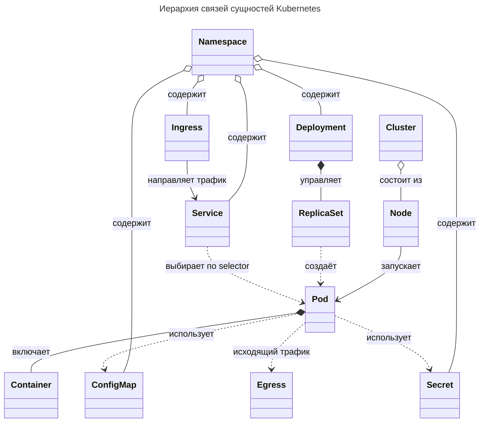
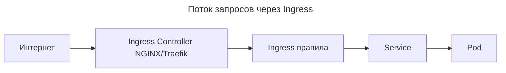

---
aliases:
  - BestEffort
  - Burstable
  - Cluster
  - ClusterRole
  - ClusterRoleBinding
  - CNI
  - ConfigMap
  - Container
  - Container Runtime Interface
  - containerd
  - Control Plane
  - Controller Manager
  - coreDNS
  - CRI
  - CRI-O
  - CronJob
  - CSI
  - DaemonSet
  - Deployment
  - Docker Desktop
  - Egress
  - EKS
  - Etcd
  - Eviction
  - GKE
  - Guaranteed
  - HorizontalPodAutoscaler
  - HPA
  - Ingress
  - Ingress Controller
  - Init Container
  - Init Containers
  - Job
  - k3d
  - kind
  - kube-apiserver
  - kube-proxy
  - kube-scheduler
  - kubeadm
  - kubectl
  - kubernetes
  - Label
  - Labels
  - Limits
  - Liveness Probe
  - LoadBalancer
  - Managed Kubernetes
  - Manifest
  - minikube
  - Namespace
  - Nginx Ingress
  - Node
  - Node Problem Detector
  - NodePort
  - OOMKill
  - OpenTelemetry
  - Operator
  - PersistentVolume
  - PersistentVolumeClaim
  - Pod
  - Probe
  - PV
  - PVC
  - QoS
  - Quality of Service
  - RBAC
  - Readiness Probe
  - ReplicaSet
  - ReplicationController
  - Requests
  - Role
  - RoleBinding
  - RollingUpdate
  - Scaling
  - Scheduler
  - Secret
  - Selector
  - Service
  - ServiceAccount
  - Startup Probe
  - StatefulSet
  - Taint
  - Toleration
  - Volume
  - Worker Node
  - Запросы
  - Зондирование
  - Инициализационный контейнер
  - Кластер
  - Контейнер
  - Контроллер
  - Конфигурационная карта
  - Кубернетес
  - Лимиты
  - Манифест
  - Манифесты Kubernetes
  - Масштабирование
  - Метка
  - Неймспейс
  - Нода
  - Оператор
  - Планировщик
  - Под
  - Проба
  - Пространство имен
  - Раздел
  - Секрет
  - Селектор
  - Сервис
  - Узел
---
## Kubernetes

**Kubernetes** (K8s) — программная платформа для автоматического управления контейнеризированными приложениями. Управляет контейнерами на большом количестве хостов, обеспечивая совместное размещение и репликацию. Проект был начат Google, сейчас поддерживается Microsoft, Red Hat, IBM, Docker.

Управление строится на двух подходах:

- **Декларативный** — разработчик задаёт цели, система выбирает пути достижения.
- **Императивный** — ресурсы создаются/изменяются/удаляются командами.

Для запуска контейнеров используется среда выполнения: `Docker`, `containerd`, `runc`.

---

## Основные понятия

| Понятие | Описание |
|--------|----------|
| **Cluster** | Набор машин (нод), объединённых для совместной работы. Минимум одна нода. |
| **Node (нода)** | Физическая или виртуальная машина, на которой запускаются Pod'ы. |
| **Pod** | Наименьшая единица развертывания: один или несколько контейнеров с общей сетью, IPC и storage. |
| **Service** | Постоянный сетевой доступ (IP + DNS) к набору Pod'ов. |
| **ConfigMap** | Хранение неконфиденциальных конфигураций. |
| **Secret** | Хранение чувствительных данных (пароли, токены, сертификаты). |
| **Deployment** | Контроллер, управляющий ReplicaSet'ами Pod'ов: обновления, откаты, восстановление. |
| **StatefulSet** | Deployment для stateful приложений (базы данных): стабильные имена, storage. |
| **Volume** | Директория, доступная контейнеру(-ам), возможно с данными. |
| **Labels** | Пары «ключ/значение», прикрепляемые к объектам для группировки. |
| **Selector** | Механизм выбора набора объектов по Labels. |

Набор подов, объединённых сервисом, соответствует **микросервису** в архитектуре. Микросервис определяется Labels и Selectors: frontend не заботит, на какой именно backend-под попадёт запрос — это работа Service.

**Operators** — программное обеспечение для запуска в кластере сервисов, сохраняющих состояние между выполнениями (например, СУБД).

---

## Архитектура кластера Kubernetes

**Control Plane** (Master Node):

| Компонент | Роль |
|-----------|------|
| **kube-apiserver** | Ядро кластера: обрабатывает REST-операции, предоставляет API для взаимодействия компонентов, обрабатывает запросы на чтение/изменение состояния кластера. |
| **Etcd** | Распределённое KV-хранилище всего состояния кластера. Гарантирует отказоустойчивость и консистентность данных. |
| **kube-scheduler** | Планировщик: определяет, на каких узлах запускать Pod'ы, учитывая ресурсы, ограничения, Affinity, Taints. |
| **kube-controller-manager** | Запуск и управление контроллерами (Deployment, ReplicaSet, Service и др.). |

**Worker Node**:

| Компонент | Роль |
|-----------|------|
| **Kubelet** | Агент на каждой ноде: получает PodSpec от API-сервера, запускает контейнеры через CRI, следит за здоровьем (Liveness/Readiness), докладывает обратно через Heartbeat. |
| **kube-proxy** | Управление правилами балансировки нагрузки и маршрутизации трафика (IPVS/iptables). |
| **Container Runtime** | Запуск контейнеров через **CRI** (Container Runtime Interface): `containerd`, `CRI-O`. Связь локальная через Unix-сокет (gRPC). |

### CRI, CNI, CSI

| Интерфейс | Назначение |
|-----------|-----------|
| **CRI** (Container Runtime Interface) | Связь Kubelet'а с контейнерным рантаймом (`containerd`, `cri-o`). Команды: `CreateContainer`, `StartContainer`, `StopContainer`. |
| **CNI** (Container Network Interface) | Настройка сети Pod'а: выделение IP, настройка маршрутов (Calico, Flannel, Cilium). |
| **CSI** (Container Storage Interface) | Монтирование томов (PV/PVC) к Pod'ам (AWS EBS, NFS, Local Path). |

### Реализации кластера

- **Minikube** — локальный кластер на одном компьютере.
- **Docker Desktop** — встроенный кластер.
- **kind** / **k3d** — легковесные кластеры в Docker-контейнерах.
- **kubeadm** — ручная настройка кластера.
- **Cloud** (EKS, GKE, AKS) — Managed Kubernetes (автоматическое масштабирование, управление control plane).

---

## Иерархия сущностей Kubernetes




| Связь                           | Значение                                              |
| ------------------------------- | ----------------------------------------------------- |
| `Cluster → Node`                | Кластер состоит из узлов                              |
| `Node → Pod`                    | На каждом узле запускаются поды                       |
| `Deployment → ReplicaSet → Pod` | Deployment управляет ReplicaSet'ами, те создают Pod'ы |
| `Service → Pod`                 | Service направляет трафик к Pod'ам через Selector     |
| `Ingress → Service`             | Ingress направляет HTTP-запросы к Service             |
| `Egress → External`             | Egress направляет исходящий трафик во внешние сервисы |
| `Namespace → все`               | Namespace изолирует ресурсы                           |

> Подами не управляют напрямую — ими управляет Deployment. К подам не обращаются напрямую — обращаются к Service.

---

## Node, Pod, Container

Иерархия размещения: **Node** — физическая/виртуальная машина в кластере, **Pod** — единица развертывания на одной ноде, **Container** — процесс внутри пода.

**Связь:** Node запускает множество Pod'ов → каждый Pod содержит один или несколько контейнеров → контейнеры делят сеть, IPC и storage пода. Pod привязан к одной Node (не может быть распределён между нодами), а контейнер никогда не покидает свой Pod.

| Понятие | Описание |
|---------|----------|
| **Node (нода)** | Физическая/виртуальная машина кластера; запускает множество Pod'ов. Имеет CPU/RAM, метки, тайнты |
| **Pod** | Минимальная единица развертывания: контейнер(ы) + общие ресурсы (сеть, диск). Получает IP в кластере |
| **Container** | Уже работающий процесс (образ + окружение) внутри Pod'а |

**Различия:**

| Аспект | Node | Pod | Container |
|--------|------|-----|-----------|
| Уровень | Физический/VM | Логическая оболочка | Процесс |
| Создаётся через | kubeadm / облако / НЕ Deployment'ом | Deployment / ReplicaSet / StatefulSet | Образа из registry |
| Может пережить перезапуск | Да | Да (реплики) | Нет — пересоздаётся вместе с Pod |
| Масштабируется | Горизонтально (добавить ноду) | Горизонтально (`replicas`) | Вертикально (`resources`) |

### Выбор ноды для Pod

Kubernetes использует **Scheduler**, учитывая:

| Фактор | Описание |
|--------|----------|
| **Ресурсы** | Хватает ли CPU/RAM на ноде |
| **Tolerations** | Pod может запуститься только на «терпящих» его тайнах нодах |
| **Node Selector** | Метка ноды (например, `disktype: ssd`) |
| **Affinity / Anti-Affinity** | Запустить рядом с другим Pod'ом или подальше |
| **Requests** | Если Pod запрашивает больше, чем есть — остаётся в Pending |

### Node Selector

Pod запустится только на нодах с нужной меткой:

```yaml
# Node с меткой
# kubectl label node node-name disktype=ssd
spec:
  nodeSelector:
    disktype: ssd
```

### Affinity / Anti-Affinity

```yaml
# Anti-Affinity: каждый postgres на отдельной ноде
affinity:
  podAntiAffinity:
    requiredDuringSchedulingIgnoredDuringExecution:
    - labelSelector:
        matchExpressions:
        - key: app
          operator: In
          values:
          - postgres
      topologyKey: kubernetes.io/hostname

# Affinity: events-service рядом с kafka
affinity:
  podAffinity:
    requiredDuringSchedulingIgnoredDuringExecution:
    - labelSelector:
        matchExpressions:
        - key: app
          operator: In
          values:
          - kafka
      topologyKey: kubernetes.io/hostname
```

### Taints и Tolerations

«Запрет» запускать Pod'ы на ноде без toleration:

```bash
kubectl taint nodes node-name dedicated=database:NoSchedule
```

Pod для этой ноды:

```yaml
tolerations:
- key: "dedicated"
  operator: "Equal"
  value: "database"
  effect: "NoSchedule"
```

| Термин | Что означает |
|--------|--------------|
| **Node Selector** | Простое требование: «запусти на ноде с этой меткой» |
| **Affinity** | «Постарайся запустить рядом с этим Pod'ом» |
| **Anti-Affinity** | «Не запускай на той же ноде» |
| **Taint** | «Эта нода — не для всех» |
| **Toleration** | «Я терпит этот тайнт» |

### Диагностика: почему Pod не запускается

```bash
kubectl describe pod <pod-name>
```

Ищите `Events`:

```text
Warning  FailedScheduling  0/1 nodes are available: 1 Insufficient cpu.
```

Решение: уменьшить `requests`, увеличить ноды или добавить ноды.

### Самовосстановление при отказе ноды

1. Control Plane замечает `NotReady` (~5 мин).
2. Pod'ы с неподходящей ноды удаляются.
3. Deployment (или StatefulSet) пересоздаёт Pod'ы на доступных нодах.

---

## ReplicaSet

ReplicaSet — объект, гарантирующий, что заданное число Pod'ов работает в кластере. Под падает → ReplicaSet создаёт новый. Нагрузка растёт → увеличивается `replicas`.

```yaml
apiVersion: apps/v1
kind: ReplicaSet
metadata:
  name: frontend-rs
spec:
  replicas: 3
  selector:
    matchLabels:
      app: frontend
  template:
    metadata:
      labels:
        app: frontend
    spec:
      containers:
      - name: nginx
        image: nginx:latest
```

**ReplicaSet vs ReplicationController** (устаревший):

| Характеристика | ReplicationController | ReplicaSet |
|---|---|---|
| Label selectors | Только `key=value` | `matchLabels`, `matchExpressions` |
| Совместимость с Deployment | Сложная | Полная |
| API | `v1` | `apps/v1` |

| Команда | Действие |
|---------|----------|
| `kubectl get rs` | Список ReplicaSet'ов |
| `kubectl describe rs/frontend-rs` | Описание конкретного |
| `kubectl scale rs/frontend-rs --replicas=5` | Масштабирование |

ReplicaSet создаётся автоматически Deployment'ом, а не вручную.

---

## Deployment

Deployment — основной контроллер для stateless приложений: управляет ReplicaSet'ами, обеспечивает обновления без простоя (Rolling Update), откаты и автоматическое восстановление при сбое.

```yaml
apiVersion: apps/v1
kind: Deployment
metadata:
  name: my-app
spec:
  replicas: 3
  strategy:
    type: RollingUpdate
    rollingUpdate:
      maxSurge: 1
      maxUnavailable: 0
  selector:
    matchLabels:
      app: my-app
  template:
    metadata:
      labels:
        app: my-app
    spec:
      containers:
      - name: my-app
        image: example/my-app:v1.0.0
```

> Deployment → создаёт ReplicaSet → ReplicaSet создаёт Pod'ы.

| Команда | Действие |
|---------|----------|
| `kubectl get deploy` | Список Deployment'ов |
| `kubectl rollout restart deployment/<name>` | Перезапуск Pod'ов |
| `kubectl delete deployment <name>` | Удаление Deployment'а |

**Когда использовать Deployment:** stateless приложения (90% случаев).

| Тип | Когда использовать |
|-----|-------------------|
| **Deployment** | Stateless (веб-приложения, микросервисы) |
| **StatefulSet** | Stateful (MySQL, PostgreSQL, Kafka): стабильные имена, Persistent Volumes |
| **DaemonSet** | По одному Pod'у на каждой ноде (мониторинг, логирование) |
| **Job / CronJob** | Одноразовая задача или по расписанию |

---

## Service

Service — абстракция, дающая стабильный IP и DNS-имя к группе Pod'ов. Pod'ы имеют динамические IP, Service имеет постоянный.

```yaml
apiVersion: v1
kind: Service
metadata:
  name: my-service
spec:
  selector:
    app: my-service
  ports:
    - port: 8081
      targetPort: 8081
  type: ClusterIP
```

| Тип | Где доступен |
|-----|-------------|
| `ClusterIP` | Только внутри кластера |
| `NodePort` | На каждом узле (порт 30000–32767) |
| `LoadBalancer` | Внешний балансировщик (в облаке) |
| `Ingress` | HTTP/HTTPS через прокси |

### Ingress

HTTP-маршрутизатор — внешний вход в кластер:



Команда проверки:

```bash
kubectl -n <ns> run debug --rm -i --image=curlimages/curl -- sh -c "curl http://my-service:8081/api"
```

Pod'ы не создаются вручную — только через Deployment/StatefulSet. К Service обращаются по Selector (метки совпадают с Labels в Pod).

### Egress

**Egress** — управление **исходящим** трафиком из кластера (в отличие от Ingress, который обрабатывает входящий). Определяет, какие Pod'ы и Сервисы могут обращаться во внешний мир — за пределы кластера.

| Аспект | Ingress | Egress |
|--------|---------|--------|
| Направление трафика | Входящий (внутрь кластера) | Исходящий (из кластера) |
| Что ограничивает | Какие запросы маршрутизируются к Service | Какие запросы разрешены наружу |
| Типовая реализация | Ingress Controller (NGINX, Traefik) | NetworkPolicy, egress gateway / прокси (CNI-плагины: Cilium, Calico) |

Правила **Egress** обычно задаются через **NetworkPolicy**: указывается, из каких Pod'ов разрешён доступ к определённым внешним IP/портам. Если egress не задан явно — по умолчанию разрешён весь исходящий трафик.

```yaml
apiVersion: networking.k8s.io/v1
kind: NetworkPolicy
metadata:
  name: allow-egress-dns
spec:
  podSelector:
    matchLabels:
      app: api
  egress:
  - to:
    - namespaceSelector: {}
    ports:
    - protocol: UDP
      port: 53
```

---

## Requests и Limits

**Requests и Limits** — управление ресурсами (CPU, память) контейнеров в Pod'ах.

| Характеристика | Requests (Запросы) | Limits (Лимиты) |
| :--- | :--- | :--- |
| Суть | Гарантированный минимум | Максимальный потолок |
| Scheduler | Критично (выбирает Node по requests) | Игнорируется |
| Превышение | Безопасно (ресурс гарантирован) | CPU: throttling; память: **OOMKill** |

### Request vs Query

| Термин | Где используется | Что означает |
|--------|-----------------|--------------|
| `request` | Манифест Pod | Сколько ресурсов Pod хочет получить |
| `query` | Команда (`kubectl`, `curl`) | Что пользователь хочет узнать у кластера |

### QoS (Quality of Service)

QoS определяет приоритет вытеснения (eviction) подов при нехватке ресурсов на ноде: какой под будет вытеснен (удалён) первым, когда ноде не хватает памяти или дискового пространства.

| Класс | Условия | Приоритет | Когда вытесняется |
|-------|---------|-----------|-------------------|
| **Guaranteed** | `requests == limits` для каждого контейнера | Самый высокий | Только при острой нехватке |
| **Burstable** | Хотя бы один контейнер: `requests < limits` | Средний | После Guaranteed |
| **BestEffort** | Нет ни `requests`, ни `limits` | Низший | **Вытесняется первым** |

**Примеры:**

```yaml
# Guaranteed
resources:
  requests: { cpu: "100m", memory: "256Mi" }
  limits:   { cpu: "100m", memory: "256Mi" }

# Burstable
resources:
  requests: { cpu: "50m", memory: "128Mi" }
  limits:   { cpu: "100m", memory: "256Mi" }

# BestEffort — resources не указаны
```

> При Node Pressure kubelet вытесняет: BestEffort → Burstable → Guaranteed.

---

## Init-контейнеры

**Init-контейнер** — контейнер, запускаемый **до основного** контейнера в Pod и выполняющий подготовительные задачи: загрузка конфигов, ожидание базы данных, проверка зависимостей.

**Особенности:**

- Запускаются **последовательно** (один за другим).
- Должны **успешно завершиться**, иначе основной контейнер не запустится.
- Имеют доступ к тем же volumes, что и основной контейнер.
- После завершения **останавливаются** — не работают параллельно.

```yaml
apiVersion: v1
kind: Pod
metadata:
  name: my-app
spec:
  initContainers:
    - name: wait-for-db
      image: busybox:1.35
      command: ['sh', '-c', 'until nc -z db-service 5432; do echo "waiting"; sleep 2; done;']
  containers:
    - name: app
      image: my-web-app
      ports:
        - containerPort: 8080
```

**Init Container vs Startup Probe:**

| Сценарий | Используйте |
|----------|------------|
| Одноразовая подготовка (миграции, генерация конфигов) | Init Container |
| Приложение медленно стартует (Java/Spring Boot ~60 сек) | Startup Probe |
| Ожидание зависимости перед каждым перезапуском | Init Container |
| Проверка готовности приложения | Readiness Probe |

> Часто используют оба: Init Container ждёт базу данных, а Startup Probe даёт время на прогрев кэша.

---

## Манифесты Kubernetes

Декларативные YAML-файлы (манифесты) описывают желаемое состояние ресурсов Kubernetes. Структура манифеста, примеры всех типов ресурсов (Deployment, Service, ConfigMap, Secret, StatefulSet, PVC, HPA, Ingress, RBAC) и способ их взаимодействия — в [[kubernetes-manifest|Kubernetes manifest]].

> Практические команды для применения и валидации манифестов (`kubectl apply`, `--dry-run`, `kubectl diff`) — в [[kubectl|kubectl]].

---

## RBAC

**RBAC** (Role-Based Access Control) — система управления доступом в Kubernetes: кто и что может делать.

| Компонент | Описание |
|-----------|---------|
| **User / Group / ServiceAccount** | Кто запрашивает доступ |
| **Role / ClusterRole** | Что разрешено (правила) |
| **RoleBinding / ClusterRoleBinding** | Связывает субъект с ролью |
| **API Server** | Проверяет каждый запрос через RBAC |

### Субъекты

| Тип | Пример |
|-----|--------|
| **User** | `alice@company.com` |
| **Group** | `developers`, `system:masters` |
| **ServiceAccount** | `default`, `my-app-sa` (для Pod'ов) |

### Role и ClusterRole

```yaml
# Role — для одного namespace
apiVersion: rbac.authorization.k8s.io/v1
kind: Role
metadata:
  namespace: dev
  name: pod-reader
rules:
- apiGroups: [""]
  resources: ["pods"]
  verbs: ["get", "list", "watch"]
---
# ClusterRole — для всего кластера
apiVersion: rbac.authorization.k8s.io/v1
kind: ClusterRole
metadata:
  name: node-admin
rules:
- apiGroups: [""]
  resources: ["nodes"]
  verbs: ["*"]
```

### RoleBinding и ClusterRoleBinding

```yaml
# RoleBinding
apiVersion: rbac.authorization.k8s.io/v1
kind: RoleBinding
metadata:
  namespace: dev
  name: read-pods
subjects:
- kind: User
  name: alice@company.com
  apiGroup: rbac.authorization.k8s.io
roleRef:
  kind: Role
  name: pod-reader
  apiGroup: rbac.authorization.k8s.io
---
# ClusterRoleBinding
apiVersion: rbac.authorization.k8s.io/v1
kind: ClusterRoleBinding
metadata:
  name: cluster-read-all
subjects:
- kind: Group
  name: developers
  apiGroup: rbac.authorization.k8s.io
roleRef:
  kind: ClusterRole
  name: view
  apiGroup: rbac.authorization.k8s.io
```

### Глаголы (Verbs)

| Глагол | Действие |
|--------|---------|
| `get` | Получить объект |
| `list` | Перечислить все |
| `watch` | Отслеживать изменения |
| `create` | Создать |
| `update` | Обновить |
| `patch` | Частичное обновление |
| `delete` | Удалить |
| `*` | Все глаголы |

### Проверка прав

```bash
kubectl auth can-i get pods --as alice@company.com -n dev
```

| Правило | Пояснение |
|---------|----------|
| Минимальные права | Начинайте с `view`, а не `admin` |
| ServiceAccount для Pod'ов | Не User |
| Не давайте доступ к Secret без причины | Опасно |
| Namespace-изоляция | `dev`, `prod` |
| Регулярный аудит | `kubectl get roles,rolebindings --all-namespaces` |

---

## Пробы

В Kubernetes есть три типа проб:

| Тип | Назначение | Результат провала |
|-----|-----------|-------------------|
| **Liveness Probe** | Проверяет «жив» ли контейнер | Перезапуск контейнера |
| **Readiness Probe** | Проверяет готовность принимать трафик | Исключение из Service |
| **Startup Probe** | Проверяет успешный старт долгозапускающихся приложений | Откладывание остальных проб |

Подробнее см. [[kubernetes-probes|Kubernetes probes]].

---

## Kubectl

[[kubectl|kubectl]] — CLI-утилита для управления Kubernetes. Основные команды см. в отдельном разделе [[kubectl|kubectl]].

---

## Структура проекта и применение

Типовая структура файлов манифестов, порядок их применения, шаблон нового сервиса и команды проверки развёртывания — в [[kubernetes-practice|Структура проекта и применение]].

---

## Инфраструктурные поды

Инфраструктурные поды (CoreDNS, kube-proxy, NGINX Ingress Controller, CSI-драйверы, logging/monitoring и др.) обеспечивают жизненно важные функции кластера — полный список и описание в [[kubernetes-cluster-infrastructure|Инфраструктурные поды]].

---

## Ссылки

- [[helm|Helm]] — пакетный менеджер для Kubernetes
- [[kubectl|kubectl]] — CLI-утилита
- [[kubeconfig|Kubeconfig]] — файл конфигурации доступа к кластеру
- [[kubernetes-manifest|Kubernetes manifest]] — структура и примеры манифестов
- [[kubernetes-practice|Структура проекта и применение]] — порядок применения файлов, шаблоны сервисов
- [[kubernetes-cluster-infrastructure|Инфраструктурные поды]] — полный список и описание
- [[kubernetes-scaling|Масштабирование]] (HPA / VPA / CA)
- [[kubernetes-probes|Kubernetes probes]] — Liveness, Readiness, Startup
- [[gateway-api|Gateway API]] / Ingress — маршрутизация трафика
- [[argo-workflows|Argo]] — CI/CD, GitOps, Workflows
- [[openshift|OpenShift]] — enterprise-платформа на базе Kubernetes
