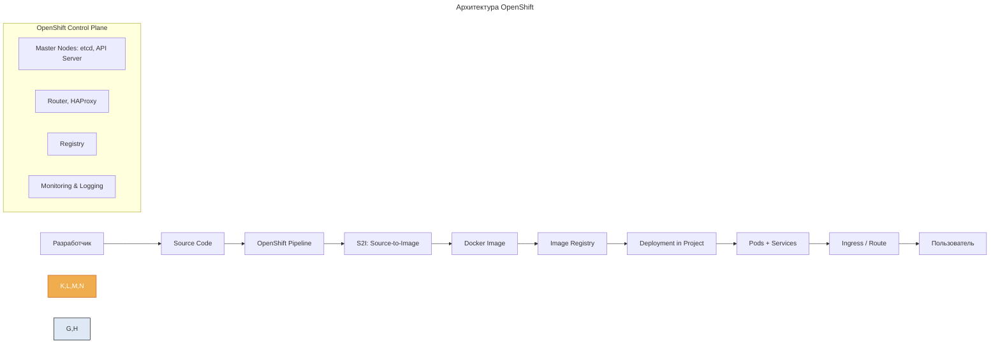
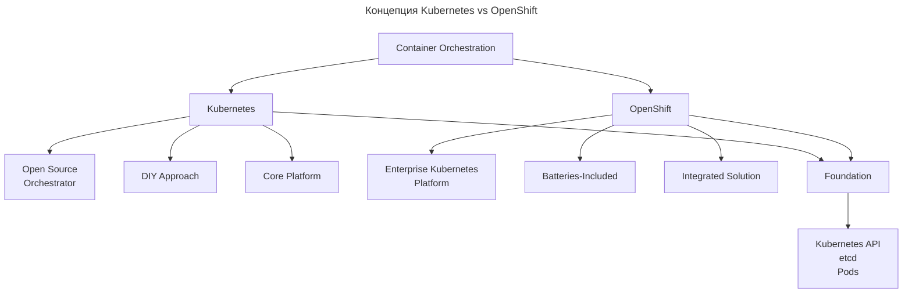

---
aliases:
  - Argo CD
  - BuildConfig
  - Deployment Config
  - EFK stack
  - Grafana
  - ImageStream
  - Istio
  - k8s
  - kubectl
  - Kubernetes
  - Maistra
  - oc
  - oc CLI
  - OCP
  - OKD
  - OpenShift
  - OpenShift Client
  - OpenShift Container Platform
  - OpenShift Dedicated
  - OpenShift Pipeline
  - OpenShift Service Mesh
  - OSD
  - PaaS
  - Prometheus
  - Red Hat
  - Route
  - S2I
  - Source-to-Image
  - Tekton
  - Кубернетес
  - Платформа как сервис
  - Платформа как услуга
---

## OpenShift

**OpenShift** — это мощная платформа для разработки, тестирования, развертывания и управления контейнеризированными приложениями, построенная на базе Kubernetes.

## Что такое OpenShift

OpenShift — это платформа как услуга (PaaS) от Red Hat, которая расширяет Kubernetes, добавляя:

- Встроенные инструменты CI/CD.
- Безопасность и управление доступом.
- Удобные UI и CLI.
- Поддержку DevOps и GitOps.
- Интеграцию с enterprise-системами.

Это не просто Kubernetes, а Kubernetes + платформа для бизнеса.

---

## Версии OpenShift

| Версия                                 | Описание                                                         |
| -------------------------------------- | ---------------------------------------------------------------- |
| **OpenShift Container Platform (OCP)** | Самая популярная — on-premise или в облаке (AWS, Azure, GCP)     |
| **OpenShift Dedicated (OSD)**          | Managed-сервис Red Hat на AWS/GCP — упрощённое администрирование |
| **Red Hat OpenShift Online**           | Облачная PaaS-версия (устарела, заменена OSD)                    |
| **OKD**                                | Открытый исходный код (Community Edition) — предшественник OCP   |

Сегодня под OpenShift обычно понимают OpenShift Container Platform (OCP).

---

## Ключевые особенности OpenShift

| Особенность                                        | Описание                                                                   |
| -------------------------------------------------- | -------------------------------------------------------------------------- |
| **На базе Kubernetes**                             | Полная совместимость с K8s API, манифестами, `kubectl`                     |
| **Built-in CI/CD (Tekton, Jenkins)**               | `Pipeline`, `BuildConfig`, `ImageStream` — без внешних систем              |
| **Web Console (UI)**                               | Графический интерфейс: деплой, логи, мониторинг, безопасность              |
| **Security & Compliance**                          | Встроенная RBAC, mTLS, Network Policies, сканеры образов                   |
| **Source-to-Image (S2I)**                          | Автоматическое создание Docker-образа из исходного кода (без Dockerfile)   |
| **Developer Catalog**                              | Шаблоны приложений: один клик запускает Spring Boot, Node.js, Python       |
| **Service Mesh (Maistra / Istio)**                 | Интегрировано через OpenShift Service Mesh                                 |
| **Monitoring (Prometheus, Grafana, Alertmanager)** | Готовые дашборды, метрики, тревоги                                         |
| **Logging (EFK Stack)**                            | Elastic + Fluentd + Kibana — централизованное логирование                  |
| **GitOps (Argo CD, Tekton)**                       | Поддержка автоматических релизов через Git                                 |

---

## Архитектура OpenShift



---

## Пример: запуск приложения за 3 команды

```bash
# 1. Создать проект (namespace)
oc new-project my-app

# 2. Развернуть из Git (S2I)
oc new-app https://github.com/mycompany/spring-boot-hello --name=hello

# 3. Создать маршрут (веб-доступ)
oc expose svc/hello
```

Готово: приложение доступно по адресу `hello-my-app.apps.cluster.example.com`.

Не требуется:

- Писать Dockerfile.
- Собирать образ.
- Писать Deployment.yaml.
- Делать Ingress.

---

## Для чего нужен OpenShift

| Сценарий                                                       | Почему OpenShift?                                             |
| -------------------------------------------------------------- | ------------------------------------------------------------- |
| Корпорация переходит на контейнеры                             | Единая платформа вместо «самосборного» Kubernetes             |
| Есть требования к безопасности                                 | Встроенные политики, сертификаты, RBAC                        |
| Много команд, DevOps, CI/CD                                    | Встроенный Pipelines, Developer Portal                        |
| Нужна поддержка                                                | Red Hat — SLA, техподдержка, аудит                            |
| Банк, медицина, госструктура                                   | Соответствие стандартам                                       |
| Быстрый выпуск продуктов                                       | S2I, шаблоны, GitOps                                          |

---

## Когда использовать

| Ваша компания                            | Рекомендация                                              |
| ---------------------------------------- | --------------------------------------------------------- |
| Enterprise (1000+ сотрудников)           | OpenShift — отличный выбор                                |
| Банк, госструктура, медицина             | Обязательно — из-за compliance                            |
| Нет своей DevOps-команды                 | OpenShift упрощает жизнь                                  |
| Нужны GitOps + CI/CD out-of-the-box      | Да                                                        |
| Стартап, MVP, маленькая команда          | Используйте Minikube, K3s, k8s в облаке                   |
| Нужен полный контроль                    | OpenShift сложнее настраивать, чем vanilla K8s            |

---

## CLI: oc (OpenShift Client)

Замена `kubectl`:

| Команда                                | Что делает                                     |
| -------------------------------------- | ---------------------------------------------- |
| `oc login`                             | Логин в OpenShift                              |
| `oc new-project demo`                  | Создать namespace                              |
| `oc new-app git@url`                   | Собрать и развернуть приложение                |
| `oc get pods`                          | Как `kubectl get pods`                         |
| `oc logs pod-name`                     | Просмотр логов                                 |
| `oc status`                            | Общее состояние проекта                        |
| `oc set env dc/app KEY=VALUE`          | Изменить переменные окружения                  |
| `oc rollout latest app`                | Перезапустить деплой                           |

---

## Web Console

- Адрес веб-консоли: console.openshift.com.
- Все действия: деплой, логи, мониторинг, сетевые политики, маршруты.
- Подходит для нетехнических пользователей (например, QA, менеджеров).

---

## Интеграции

| Интеграция                | Поддержка                     |
| ------------------------- | ----------------------------- |
| **LDAP / Active Directory** | Да                           |
| **Jenkins / Tekton**      | Built-in                      |
| **Helm**                  | Да                            |
| **Argo CD**               | Через Operator                |
| **Vault, GitLab, Nexus**  | Да                            |
| **Istio / Service Mesh**  | OpenShift Service Mesh        |

---

## Преимущества OpenShift

| Плюс                                  | Объяснение                                        |
| ------------------------------------- | ------------------------------------------------- |
| **Enterprise-ready**                  | Готов к работе в регулируемых отраслях            |
| **Безопасность «из коробки»**         | Политики, роли, сканирование образов              |
| **S2I — не пишите Dockerfile**        | Автоматически собирает Java, Node.js, Python      |
| **Встроенный CI/CD**                  | Не нужно подключать внешние системы               |
| **Поддержка Red Hat**                 | SLA, документация, обучение                       |
| **Масштабируемость**                  | До 1000+ node                                    |
| **Multi-cloud**                       | Может работать в AWS, Azure, GCP, on-premise      |

---

## Недостатки

| Минус                    | Объяснение                                   |
| ------------------------ | -------------------------------------------- |
| **Сложность**            | Больше абстракций, чем в vanilla Kubernetes   |
| **Затраты**              | Подписка Red Hat — дорого                    |
| **Меньше гибкости**      | Некоторые вещи сложно настроить              |
| **Vendor Lock-in**       | Привязка к Red Hat                           |

---

## OpenShift vs Kubernetes

Подробное сравнение различий между OpenShift и Kubernetes.

### Основная концепция



### Сравнительная таблица

| Аспект                | **Kubernetes**                                | **OpenShift**                                 |
| --------------------- | --------------------------------------------- | --------------------------------------------- |
| **Тип продукта**      | Open-source orchestrator                      | Enterprise platform на базе Kubernetes        |
| **Разработчик**       | Cloud Native Computing Foundation (CNCF)      | Red Hat (IBM)                                 |
| **Лицензия**          | Apache 2.0                                    | OpenSource (OKD) / Enterprise (коммерческая)  |
| **Установка**         | Сложная, требует экспертизы                   | Интегрированная, автоматизированная           |
| **Безопасность**      | Базовые возможности                           | Enhanced security (SELinux, SCC)              |
| **CI/CD**             | Требует настройки инструментов                | Встроенный (Jenkins, Tekton)                  |
| **Registry**          | Внешний (Docker Hub, Harbor)                  | Встроенный container registry                 |
| **Мониторинг**        | Prometheus + Grafana (настраивается)          | Встроенный мониторинг (Prometheus)            |
| **Логирование**       | EFK stack (настраивается)                     | Встроенное логирование (EFK)                  |
| **Стоимость**         | Бесплатный                                    | Платная подписка (с поддержкой)               |

### Детальное сравнение

#### Архитектура и компоненты

**Kubernetes (Vanilla)**

- Kubernetes Cluster
  - Control Plane
    - `kube-apiserver`
    - `etcd`
    - `kube-scheduler`
    - `kube-controller-manager`
    - `cloud-controller-manager`
  - Worker Nodes
    - `kubelet`
    - `kube-proxy`
    - Container Runtime
  - Addons (optional)
    - DNS
    - Dashboard
    - Ingress Controller
    - Network Plugin

**OpenShift Container Platform**

- OpenShift Cluster
  - Kubernetes Core
    - Все компоненты Kubernetes
    - Enhanced security
  - OpenShift Specific
    - Web Console (GUI)
    - Built-in Registry
    - Build Configs
    - Image Streams
    - Deployment Configs
    - Routes
  - Developer Tools
    - Source-to-Image (S2I)
    - Pipelines (Tekton)
    - Developer Catalog
    - CodeReady Workspaces
  - Operations
    - Monitoring Stack
    - Logging Stack
    - Service Mesh
    - Operators

#### Установка и управление

**Kubernetes установка**

```bash
# Различные опции установки
kubeadm init                          # On-premises
eksctl create cluster                 # AWS EKS
az aks create                         # Azure AKS
gcloud container clusters create      # Google GKE
```

Требует отдельной настройки:

- Network plugin (Calico, Flannel).
- Ingress controller (nginx, traefik).
- Storage provisioner.
- DNS.
- Dashboard.
- Monitoring.

**OpenShift установка**

```bash
# Integrated installation
openshift-install create cluster      # Automated installation
```

Включает сразу:

- Integrated registry.
- Web console.
- Monitoring stack.
- Logging stack.
- Network policy.
- Build automation.

#### Безопасность

**Kubernetes Security**

```yaml
# RBAC базовая конфигурация
apiVersion: rbac.authorization.k8s.io/v1
kind: Role
metadata:
  namespace: default
  name: pod-reader
rules:
- apiGroups: [""]
  resources: ["pods"]
  verbs: ["get", "watch", "list"]
```

**OpenShift Security**

```yaml
# Security Context Constraints (SCC)
apiVersion: security.openshift.io/v1
kind: SecurityContextConstraints
metadata:
  name: custom-scc
runAsUser:
  type: MustRunAsRange
seLinuxContext:
  type: MustRunAs
```

Дополнительные функции OpenShift:

- SELinux integration.
- Pod security admission.
- Image signing and verification.
- Network segmentation.

#### Разработка приложений

**Kubernetes — ручная настройка**

```yaml
# Deployment + Service + Ingress
apiVersion: apps/v1
kind: Deployment
metadata:
  name: myapp
spec:
  replicas: 3
  template:
    spec:
      containers:
      - name: myapp
        image: nginx:latest
---
apiVersion: v1
kind: Service
metadata:
  name: myapp-service
spec:
  selector:
    app: myapp
  ports:
  - port: 80
---
apiVersion: networking.k8s.io/v1
kind: Ingress
metadata:
  name: myapp-ingress
spec:
  rules:
  - host: myapp.example.com
    http:
      paths:
      - path: /
        pathType: Prefix
        backend:
          service:
            name: myapp-service
            port:
              number: 80
```

**OpenShift — упрощённый подход**

```yaml
# Route (автоматический TLS + DNS)
apiVersion: route.openshift.io/v1
kind: Route
metadata:
  name: myapp-route
spec:
  host: myapp.apps.cluster.example.com
  to:
    kind: Service
    name: myapp-service
  port:
    targetPort: 8080
  tls:
    termination: edge
# Source-to-Image автоматическая сборка
apiVersion: build.openshift.io/v1
kind: BuildConfig
metadata:
  name: myapp-build
spec:
  source:
    git:
      uri: https://github.com/myorg/myapp.git
  strategy:
    sourceStrategy:
      from:
        kind: ImageStreamTag
        name: nodejs:16
```

#### CI/CD и DevOps

**Kubernetes CI/CD**

```groovy
# Требует настройки внешних инструментов
// Jenkinsfile example
pipeline {
    agent any
    stages {
        stage('Build') {
            steps {
                sh 'docker build -t myapp .'
            }
        }
        stage('Deploy') {
            steps {
                sh 'kubectl apply -f k8s/'
            }
        }
    }
}
```

**OpenShift CI/CD**

```yaml
# Встроенные Pipelines (Tekton)
apiVersion: tekton.dev/v1beta1
kind: Pipeline
metadata:
  name: myapp-pipeline
spec:
  tasks:
  - name: build
    taskRef:
      name: s2i-nodejs
  - name: deploy
    taskRef:
      name: openshift-client
    params:
    - name: ARGS
      value: ["rollout", "latest", "myapp"]
```

#### Мониторинг и логирование

**Kubernetes**

```bash
# Ручная установка мониторинга
helm install prometheus prometheus-community/prometheus
helm install grafana grafana/grafana
kubectl apply -f efk-stack/  # Elasticsearch, Fluentd, Kibana
```

**OpenShift**

```bash
# Встроенное мониторинг и логирование
oc get prometheus -n openshift-monitoring
oc get kibana -n openshift-logging
# Автоматически собирает метрики и логи
```

### Практические примеры

#### Развертывание приложения в Kubernetes

```bash
# 1. Сборка образа
docker build -t myregistry.com/myapp:v1.0 .

# 2. Push в registry
docker push myregistry.com/myapp:v1.0

# 3. Создание манифестов
kubectl apply -f deployment.yaml
kubectl apply -f service.yaml
kubectl apply -f ingress.yaml

# 4. Настройка DNS и TLS
```

#### Развертывание приложения в OpenShift

```bash
# 1. Source-to-Image автоматическая сборка
oc new-app nodejs:16~https://github.com/myorg/myapp.git

# 2. Автоматическое создание Route
oc expose service myapp --hostname=myapp.apps.example.com

# 3. Мониторинг автоматически настроен
oc get routes,svc,deployment,pods
```

### Когда что выбирать

**Выбирайте Kubernetes, если:**

- Нужен полный контроль над инфраструктурой.
- Команда имеет экспертизу в Kubernetes.
- Требуется кастомизация каждого компонента.
- Бюджет ограничен (только инфраструктурные затраты).
- Используется в cloud-native окружениях (EKS, AKS, GKE).

**Выбирайте OpenShift, если:**

- Нужен enterprise-grade solution «из коробки».
- Требуется встроенная безопасность и compliance.
- Нужны интегрированные developer tools.
- Предприятие использует Red Hat ecosystem.
- Важна техническая поддержка и SLAs.
- Требуется гибридное/мульти-клауд решение.

**Гибридный подход**

- On-Premise: OpenShift для критичных workloads.
- Cloud: Managed Kubernetes (EKS/AKS/GKE) для dev/test.

### Стоимость владения

**Kubernetes TCO**

- Инфраструктура: $$$.
- Команда экспертов: $$$$.
- Время на настройку и поддержку: $$$$.
- Инструменты мониторинга и логирования: $$.

**OpenShift TCO**

- Подписка Red Hat: $$$$$.
- Инфраструктура: $$$.
- Меньше требований к экспертизе: $$.
- Интегрированные инструменты: включены.

### Тренды и будущее

**Kubernetes**

- Стандарт де-факто для container orchestration.
- Активное развитие через CNCF.
- Улучшение usability и безопасности.

**OpenShift**

- Фокус на developer experience.
- Serverless (OpenShift Serverless).
- Service mesh (OpenShift Service Mesh).
- GitOps и DevOps инструменты.

**Итог**

- **Kubernetes** — ядро, основа.
- **OpenShift** — enterprise-платформа на базе Kubernetes.
- **OpenShift** = Kubernetes + Developer Tools + Security + Operations.

Выбор зависит от требований предприятия, уровня экспертизы команды и бюджетных ограничений. Для многих enterprise OpenShift предоставляет лучшую общую стоимость владения благодаря интегрированному подходу.

---

## Финальный вывод

| OpenShift — это...                    | Это не...                    |
| ------------------------------------- | ---------------------------- |
| **Kubernetes + enterprise-возможности** | Простой K8s                |
| **Платформа для больших компаний**    | Инструмент для стартапов     |
| **Безопасность, поддержка, compliance** | Дешёвое решение            |
