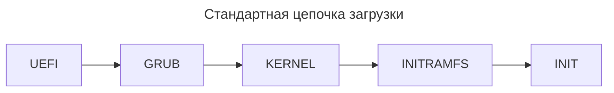
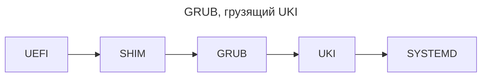

---
aliases:
  - Boot Chain
  - Boot Manager
  - bootctl
  - Chain loading
  - EFI Shell
  - EFI Stub
  - GNU GRUB
  - GRUB
  - initramfs
  - rEFInd
  - Secure Boot
  - shim
  - systemd-boot
  - uki
  - Unified Kernel Image
  - Цепочка загрузки
---

## Цепочка загрузки

**Цепочка загрузки (Boot Chain)** — это последовательность шагов от включения питания до запуска операционной системы. Каждый шаг передаёт управление следующему, и если какой-то компонент отсутствует или неправильно настроен — система не загрузится.

## Что такое цепочка загрузки

- [[bios-uefi|BIOS и UEFI]] **инициализируют оборудование** и выбирают загрузчик.
- Загрузчик грузит **ядро** и **initramfs**.
- Ядро **монтирует корневую файловую систему** и запускает **PID 1** (**systemd** и т.д.).
- Дальше — [[linux-load-phases|процесс инициализации]].

Каждый элемент отвечает только за свой шаг — своего рода «эстафета», где передаётся управление.

## Уровни интерфейса

Чем глубже уровень, тем ближе к железу:

- **Библиотеки** — API для приложений.
- **Ядро** — управляет процессами, памятью, драйверами.
- **Firmware** — прошивка материнской платы (UEFI).

## Процесс загрузки UEFI

1. Включение питания → **firmware** (UEFI) читает настройки из NVRAM.
2. UEFI находит нужный **загрузчик** по записи Boot Order (например, `\EFI\GRUB\grubx64.efi`).
3. Загрузчик (GRUB) загружает **конфигурацию** и предлагает меню.
4. GRUB загружает **ядро** и **initramfs** в память.
5. Ядро **распаковывается**, инициализирует оборудование и передаёт управление `init` (systemd).
6. **systemd** запускает службы → появляется графический интерфейс.

## Поколения цепочек загрузки

| Цепочка | Краткое описание |
|---------|------------------|
| **Legacy BIOS → Kernel** | Классика 90-х |
| **UEFI → GRUB → Kernel** | Стандарт для Linux |
| **UEFI → GRUB → UKI** | Современный стиль |
| **UEFI → rEFInd → Kernel** | Для нескольких ОС |
| **UEFI → systemd-boot → UKI** | Быстро и просто |

## Стандартный путь: UEFI → GRUB → Kernel



**Шаги в деталях:**

1. **UEFI** запускает `grubx64.efi` (GRUB).
2. **GRUB** загружает модули и конфигурацию, показывает меню.
3. **GRUB** загружает ядро и `initramfs` (иногда через UKI).
4. **Ядро** монтирует корневую ФС (через initramfs).
5. **systemd** становится PID 1 и запускает систему.

## Компоненты цепочки загрузки

| Компонент | Значение |
|-----------|----------|
| **NVRAM** | Энергонезависимая память UEFI, хранит загрузочные записи |
| **ESP** | Скрытый раздел `EFI System Partitio`, файлы `*.efi` |
| **shim** | Прослойка для Secure Boot (подпись GRUB) |
| **GRUB** | Мультизагрузчик: умеет грузить ядро Linux, Windows, другие ОС |
| **Kernel** | Ядро Linux: управляет процессами, памятью, драйверами |
| **initramfs** | Минимальный rootfs для начального монтирования основной ФС |
| **init** | PID 1 (systemd) — главный процесс, порождает все службы |

## Сравнение вариантов

| Вариант | Что ожидает пользователь |
|---------|--------------------------|
| **GRUB (UEFI → GRUB → Kernel)** | Стабильный, знакомый, больше настроек |
| **systemd-boot (UEFI → systemd-boot → UKI)** | Быстрый, минималистичный, меньше настроек |
| **rEFInd (UEFI → rEFInd → Kernel)** | Графические иконки, удобство при нескольких ОС |
| **UEFI → Kernel напрямую (EFI Stub)** | Самая быстрая цепочка, минимум компонентов |

## Уточнение роли firmware

- UEFI не «знает», что такое GRUB — он просто запускает `*.efi`-файлы.
- Список загрузочных записей хранится **в NVRAM** (например, `Boot0000`).
- Есть **fallback-путь** `\EFI\BOOT\BOOTX64.EFI`, используемый, когда NVRAM пуст.

## Ситуация двух систем

Windows устанавливается в UEFI, GRUB — в ESP. GRUB может цепочкой (chainload) запускать `bootmgfw.efi` — загрузчик Windows.

## Рекомендации по выбору

| Ситуация | Рекомендация |
|----------|--------------|
| Одна ОС, нужен минимум настроек | UEFI → systemd-boot → UKI |
| Несколько ОС (Linux + Windows) | UEFI → GRUB (или rEFInd) |
| Минимализм и скорость | UEFI → EFI Stub (без загрузчика) |
| Secure Boot | UEFI → shim → GRUB |

## Продвинутые цепочки: GRUB → UKI

Вместо «GRUB грузит kernel + initramfs» загружается **один файл** — UKI (Unified Kernel Image), объединяющий их. Собранный UKI:

```text
UKI = kernel + initramfs + cmdline
```



- **Плюс:** меньше зависимостей, проще верификация (Secure Boot), удобно для обновлений.
- **Минус:** нужно пересобрать `uki`-файл при любом изменении конфигурации.

## Аппаратная зависимость

- **TPM / Secure Boot:** могут требовать подписанные компоненты (shim).
- **Windows + Linux:** разный порядок записей NVRAM — нужно обновлять Boot Order.
- **Apple Silicon:** полностью своя схема (EFI заменён, нет BIOS-эмуляции).

## Вывод

| Критерий | GRUB | systemd-boot | rEFInd |
|----------|------|--------------|--------|
| Простота настройки | Сложнее | Простая | Простая |
| Скорость загрузки | Средняя | Высокая | Средняя |
| Поддержка Secure Boot | Да (через shim) | Да | Да |
| Мультизагрузка | Да | Да | Да |
| Красивый интерфейс | Средний | Минимальный | Полноценные иконки |

Выбор зависит от конкретной ситуации, но понимание цепочки едино: **firmware → загрузчик → ядро → initramfs → systemd**.
