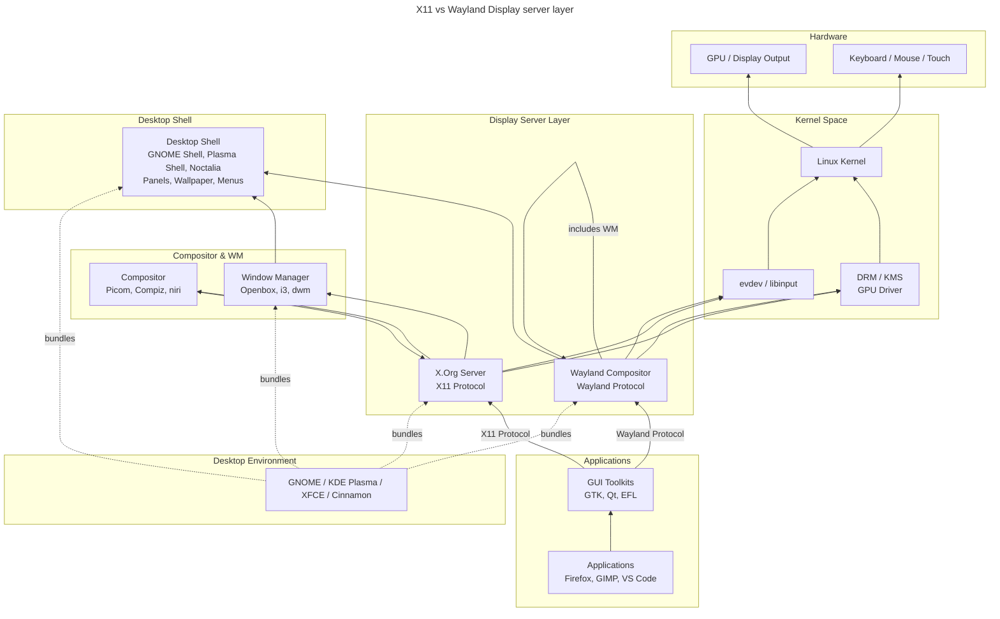

---
aliases:
  - DE
  - Desktop Environment
  - Desktop Shell
  - Display Server
  - Window Manager
  - WM
---
## Графический стек GNU/Linux: от ядра до рабочего стола

layered schema


X11 vs Wayland Display server



---

### Слои снизу вверх

#### 1. **Linux Kernel** (ядро)

Самый нижний уровень. Управляет аппаратурой напрямую.

**Что делает для графики:**

- **DRM (Direct Rendering Manager)** — подсистема ядра, которая берёт на себя управление видеовыходами и буферами.
- **KMS (Kernel Mode Setting)** — часть DRM; ядро само переключает разрешения экрана, частоту обновления, глубину цвета (раньше это делал X-сервер).
- **GPU-драйверы** — `i915` (Intel), `amdgpu` (AMD), `nouveau` (NVIDIA open-source), `nvidia` (проприетарный модуль).
- **evdev** — интерфейс событий ввода (клавиатура, мышь, тачпад).

**Без ядра** ни один графический компонент не увидит ни экран, ни клавиатуру.

---

#### 2. **Display Server** (сервер отображения)

Посредник между ядром и приложениями. Бывает двух видов:

| | **X.Org (X11)** | **Wayland** |
|---|---|---|
| Возраст | 1984+ | 2008+ |
| Архитектура | Клиент-сервер, всё через один сокет | Протокол, каждый клиент — напрямую композитору |
| Композитинг | Надстройка (Compiz, Picom) | Встроен в compositor |
| Безопасность | Все окна видят всё | Изоляция клиентов |
| Примеры | `Xorg` | `weston`, `sway`, `mutter`, `kwin_wayland` |

**Роль:** получает события ввода от ядра, распределяет их окнам; принимает запросы на отрисовку и передаёт буферы композитору.

> ⚠️ В современном стеке **Wayland-композитор = Display Server + Compositor** в одном процессе.

---

#### 3. **Графический композитор (Compositor)**

Собирает финальную картинку из всех окон.

**Что делает:**

- Берёт буферы каждого окна (off-screen).
- Применяет трансформации: прозрачность, тени, размытие, анимации, масштабирование.
- Отрисовывает итоговый кадр в **front buffer**, который DRM выводит на экран.

**Примеры:**

- **Встроенные в WM:** Mutter (GNOME), KWin (KDE), sway (wlroots).
- **Отдельные (для X11):** Picom, Compton.

Без композитора окна перерисовывают друг друга напрямую — отсюда «tearing» и невозможность сделать прозрачность.

---

#### 4. **Window Manager (WM)**

Управляет **расположением и поведением окон**.

**Роль:**

- Раскладка окон (tiling / floating).
- Рамки окон, кнопки свернуть/закрыть (в X11 — через *decorations*).
- Фокус, переключение (Alt-Tab), виртуальные рабочие столы.

**Примеры:**

| Тип             | Примеры                 |
| --------------- | ----------------------- |
| Tiling          | i3, sway, Hyprland, dwm |
| Floating (X11)  | Openbox, Fluxbox, XFWM  |
| Встроенные в DE | Mutter, KWin, XFWM      |

> В Wayland WM и Compositor всегда сливаются в один процесс — **Wayland-композитор**.

---

#### 5. **Desktop Shell**

«Обёртка» вокруг WM/композитора, дающая привычные элементы UI.

**Что добавляет:**

- Панель задач / док.
- Меню приложений, overview (обзор окон).
- Системный трей, уведомления, экран блокировки.
- Обои, виджеты.

**Примеры:**

- **GNOME Shell** (JS + Mutter)
- **Plasma Shell** (QML + KWin)
- **COSMIC** (Rust, новый от System76)
- **swaybar + wofi** — минимальный shell на базе sway

---

#### 6. **Desktop Environment (DE)**

Самый верхний уровень — **полный комплект** для пользователя.

**Включает в себя:**

- Shell + WM/Compositor.
- Файловый менеджер (Nautilus, Dolphin, Thunar).
- Системные приложения (настройки, терминал, просмотрщик картинок).
- Темы, иконки, звуки.
- **D-Bus-сервисы** — единая шина IPC (уведомления, поиск, MPRIS для медиа).
- **XDG Desktop Portal** — безопасный доступ приложений к диалогам выбора файлов, скринкасту и т.п.
- **Display Manager** — экран входа (GDM, SDDM, LightDM).
- **Toolkit** — GTK (GNOME) или Qt (KDE).

**Примеры:**

| DE | Shell | WM/Comp | Toolkit | DM |
|---|---|---|---|---|
| GNOME | GNOME Shell | Mutter | GTK4 | GDM |
| KDE Plasma | Plasma Shell | KWin | Qt6 | SDDM |
| XFCE | xfce4-panel | XFWM | GTK3 | LightDM |
| Cinnamon | cinnamon | Muffin | GTK3 | LightDM |

---

### Что я добавил сверх вашего списка

1. **DRM/KMS и GPU-драйверы** — без них ядро не выведет ни пикселя.
2. **libinput / evdev** — обработка ввода.
3. **Display Manager** — экран входа, первый графический процесс.
4. **D-Bus** — «нервная система» DE, связывает все компоненты.
5. **XDG Desktop Portal** — мост между приложениями (в т.ч. из песочниц Flatpak) и DE.
6. **Toolkit (GTK / Qt)** — библиотеки, из которых собраны приложения и сам shell.
7. **Wayland-протокол** как замена X11.

---

### Как это работает вместе (коротко)

1. **Display Manager** запускается systemd-ом, показывает экран входа.
2. После логина запускается **сессия**: Wayland-композитор (например, Mutter).
3. Mutter берёт на себя роль **Display Server + Compositor + WM**.
4. **GNOME Shell** (JS-код) рисует поверх панель, меню, уведомления.
5. Приложения (Firefox, Nautilus) через **Wayland-протокол** отдают свои буферы в Mutter, а события ввода получают обратно.
6. Всё общение между сервисами (поиск, уведомления, медиа) идёт через **D-Bus**.
7. Когда приложение хочет открыть «Выбрать файл» — оно стучится в **XDG Portal**, который показывает родной диалог DE.
8. Готовый кадр Mutter через **DRM/KMS** попадает в **GPU-драйвер**, а тот — на матрицу экрана.

## Linux UI stack

Именно поэтому в Linux говорят: *«X — это не Linux, это пользовательское пространство»*. Ядро даёт только DRM/KMS и evdev — всё остальное можно заменить, пересобрав сессию.

В GNU/Linux графический стек — это не монолитная система, а набор слоёв, которые могут существовать как отдельные программы (классический X11) или быть объединены в один процесс (современный Wayland). Ниже разберём каждый слой, его роль и примеры, а затем сведём всё в диаграмму.

---

### 1. Kernel (Ядро Linux)

Роль: Фундамент всего. Управляет процессами, памятью, процессором и железом. В контексте графики ядро отвечает за:

- DRM/KMS (Direct Rendering Manager / Kernel Mode Setting) — прямой доступ к GPU, управление видеорежимами, буферами кадров.
- evdev — унифицированный интерфейс событий ввода (клавиатура, мышь, тачпад).
- Framebuffer — базовый вывод на экран без ускорения.

Примеры: Linux kernel 6.x, модуль ядра `i915` (Intel), `amdgpu` (AMD), `nouveau` (NVIDIA).

---

### 2. Драйвер GPU (Userspace)

Роль: Реализация API рендеринга (OpenGL, Vulkan) в пространстве пользователя. Получает команды от приложений и транслирует их в инструкции для GPU через DRM в ядре.

Примеры: Mesa (открытые драйверы Intel, AMD, Nouveau), проприетарный драйвер NVIDIA.

---

### 3. Display Server (Сервер отображения)

Роль: Посредник между приложениями и оборудованием. Определяет протокол, по которому приложения запрашивают буферы для рисования и получают события ввода.

Протокол	Суть	Примеры реализаций

X11	Классический. Приложения-клиенты отправляют команды рисования X.Org Server'у. Сетевая прозрачность.	X.Org Server

Wayland	Современный. Приложения сами рисуют в свои буферы, а сервер только их компонует.	Weston, Mutter, KWin, Sway, Hyprland

---

### 4. Compositor (Графический композитор)

Роль: Формирует финальное изображение экрана, «склеивая» буферы всех окон. Отвечает за:

- Прозрачность, тени, размытие
- Анимации (открытие/закрытие окон)
- VSync (синхронизация с частотой монитора)
- В X11: это отдельная программа, работающая поверх X Server'а (off-screen compositing).
- В Wayland: композитор встроен в Display Server, это один процесс.

Примеры: Picom, Compiz (X11); Mutter, KWin, Sway, Hyprland, Weston (Wayland).

---

### 5. Window Manager (Менеджер окон)

Роль: Управляет поведением окон:

- Размещение (плавающее, тайлинг, табы)
- Декорации (рамки, кнопки «закрыть/свернуть»)
- Фокус, рабочие столы (workspaces), слои (поверх/под другими окнами)
- В X11: чаще всего отдельная программа (даже в DE часто отдельный бинарник).
- В Wayland: WM неотъемлемая часть Wayland Compositor'а.

Примеры: i3, dwm, Openbox, Fluxbox (X11, standalone); Mutter, KWin, Sway (Wayland / встроенные).

#### Compositor vs window manager

Compositor отвечает за **сборку финального кадра** из буферов окон (тени, прозрачность, размытие, VSync, эффекты), а window manager — за **логику окон** (расстановка, фокус, переключение, горячие клавиши, поведение). [wiki.gentoo](https://wiki.gentoo.org/wiki/Picom)

В X11 это часто **разные программы**: WM управляет окнами, а композитор может быть отдельным слоем поверх него (например, Picom). [wiki.gentoo](https://wiki.gentoo.org/wiki/Picom)

В Wayland композитор обычно **совмещает обе роли**: он и дисплейный сервер, и оконный менеджер, и композитор в одном. [botmonster](https://botmonster.com/self-hosting/niri-scrollable-tiling-wayland-compositor/)

Коротко: **compositor = как рисуется кадр**, **window manager = как живут окна**. [wiki.gentoo](https://wiki.gentoo.org/wiki/Picom)

---

### 6. Desktop Shell (Оболочка рабочего стола)

Роль: Всё, что окружает окна и даёт пользователю системный UI:

- Панель задач / верхняя панель
- Меню приложений / обзор окон
- Системный трей, часы, уведомления
- Обои рабочего стола, виджеты
- Файловый менеджер (иногда считается частью Shell)

Примеры: GNOME Shell, KDE Plasma Shell, Cinnamon Shell, LXPanel, Polybar (минималистичная панель).

---

### 7. Desktop Environment (DE)

Роль: Интегрированный продукт, объединяющий WM + Shell + набор базовых приложений + единый стиль + системные сервисы (управление питанием, сетью, звуком, настройками). DE берёт на себя полный пользовательский опыт.

Примеры: GNOME, KDE Plasma, XFCE, Cinnamon, MATE, LXQt, Deepin, Budgie.

---

### 8. GUI Toolkit (Графический инструментарий) — часто забывают

Роль: Библиотеки, которые используют приложения, чтобы не рисовать кнопки и текстовые поля вручную. Тулкиты «под капотом» решают, как общаться с Display Server'ом (X11 или Wayland).

Примеры: GTK (GNOME, Cinnamon, XFCE), Qt (KDE, LXQt), EFL (Enlightenment).

---

### 9. Дополнительные компоненты

Компонент	Роль	Примеры

Display Manager	Графический экран входа (логин/пароль)	GDM, SDDM, LightDM, LXDM

Session Manager	Управление жизненным циклом сессии, автозапуск	`systemd-logind`, `gnome-session`, `kdeinit`

libinput	Userspace-библиотека обработки ввода (замена старым драйверам X11)	используется X.Org и всеми Wayland-композиторами

---

### Как это связано: X11 vs Wayland

#### Классический стек (X11)

```
Приложение → Toolkit → X11 Protocol → X.Org Server 
                                          ↓
                                   [Compositor]  ← Picom, Compiz
                                          ↓
                                   [Window Manager] ← i3, Openbox
                                          ↓
                                   [Desktop Shell]  ← панели, обои
                                          ↓
                                      DRM/KMS → GPU
```

Проблема: X.Org Server — «божок в центре». Все данные проходят через него, что добавляет задержки и сложности.

#### Современный стек (Wayland)

```
Приложение → Toolkit → Wayland Protocol → Wayland Compositor 
                                          (Mutter / KWin / Sway)
                                          ↓
                                    [встроены WM + Compositor]
                                          ↓
                                    [Desktop Shell] ← отдельный клиент
                                          ↓
                                      DRM/KMS → GPU
```

Преимущество: Композитор напрямую управляет буферами и выводом. Меньше слоёв — меньше задержек.

---

Ключевой вывод

- X11 разделяет роли: Display Server, Compositor и WM могут быть разными процессами.
- Wayland объединяет Display Server + Compositor + WM в одну сущность — Wayland Compositor. Desktop Shell при этом часто остаётся отдельным (но привилегированным) клиентом.
- Desktop Environment — это «мета-пакет», который просто выбирает и настраивает совместимые компоненты из всех вышеперечисленных слоёв.
