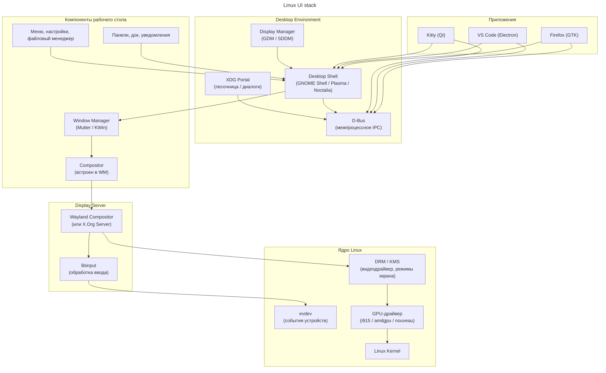
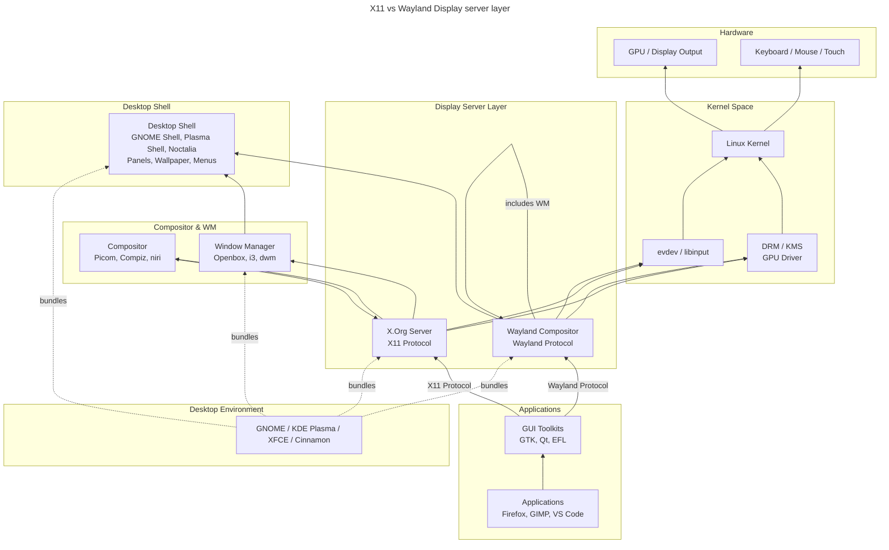
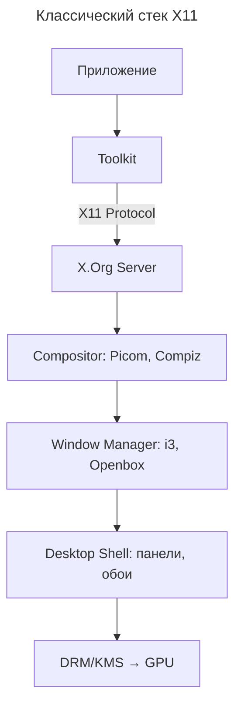
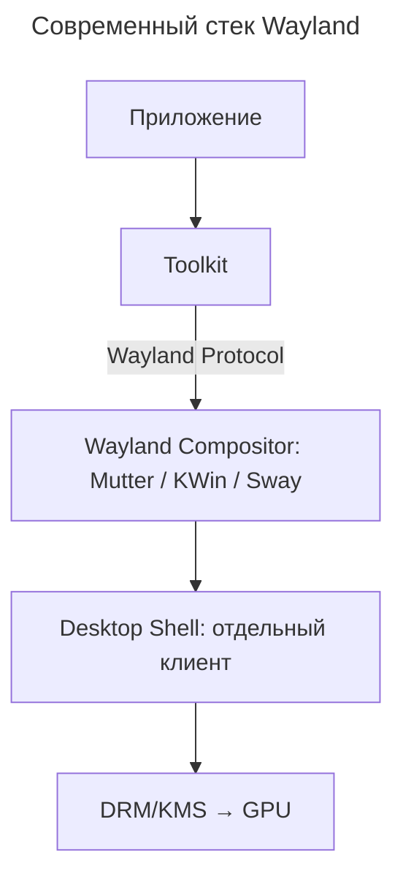

---
aliases:
  - Cinnamon
  - Compositor
  - COSMIC
  - D-Bus
  - DE
  - Desktop Environment
  - Desktop Shell
  - Display Manager
  - Display Server
  - DRM
  - EFL
  - evdev
  - GDM
  - GNOME
  - GNOME Shell
  - GPU
  - GTK
  - Hyprland
  - i3
  - KDE
  - Kernel Mode Setting
  - KMS
  - KWin
  - libinput
  - LightDM
  - LXQt
  - MATE
  - Mesa
  - Mutter
  - Picom
  - Plasma
  - Polybar
  - Qt
  - SDDM
  - Session Manager
  - sway
  - Wayland
  - Wayland Compositor
  - Window Manager
  - WM
  - X.Org
  - X11
  - XDG Portal
  - XFCE
  - Графический стек
  - Дисплейный сервер
  - Композитор
  - Менеджер окон
  - Оболочка рабочего стола
  - Рабочее окружение
---

## Графический стек GNU/Linux: от ядра до рабочего стола

В GNU/Linux графический стек — это не монолитная система, а набор слоёв, которые могут существовать как отдельные программы (классический X11) или быть объединены в один процесс (современный Wayland). Именно поэтому говорят: «X — это не Linux, это пользовательское пространство». Ядро даёт только DRM/KMS и evdev — всё остальное можно заменить, пересобрав сессию.

Ниже разберём каждый слой, его роль и примеры, а затем сведём всё в диаграммы.

### Схема Linux UI stack

Приложения общаются с оболочкой рабочего стола и D-Bus; оболочка через менеджер окон и композитор обращается к дисплейному серверу, а тот — к подсистемам ядра (DRM/KMS, evdev, GPU-драйвер).

### Слои снизу вверх

#### Linux Kernel (ядро)

Самый нижний уровень. Управляет аппаратурой напрямую.

Что ядро делает для графики:

- **DRM (Direct Rendering Manager)** — подсистема ядра, которая берёт на себя управление видеовыходами и буферами.
- **KMS (Kernel Mode Setting)** — часть DRM; ядро само переключает разрешения экрана, частоту обновления, глубину цвета (раньше это делал X-сервер).
- **GPU-драйверы** — `i915` (Intel), `amdgpu` (AMD), `nouveau` (NVIDIA open-source), `nvidia` (проприетарный модуль).
- **evdev** — интерфейс событий ввода (клавиатура, мышь, тачпад).
- **Framebuffer** — базовый вывод на экран без ускорения.

Без ядра ни один графический компонент не увидит ни экран, ни клавиатуру.

#### Драйвер GPU (Userspace)

Реализация API рендеринга (OpenGL, Vulkan) в пространстве пользователя. Получает команды от приложений и транслирует их в инструкции для GPU через DRM в ядре.

Примеры: Mesa (открытые драйверы Intel, AMD, Nouveau), проприетарный драйвер NVIDIA.

#### Display Server (сервер отображения)

Посредник между приложениями и оборудованием. Определяет протокол, по которому приложения запрашивают буферы для рисования и получают события ввода.

X11 — классический протокол: приложения-клиенты отправляют команды рисования X.Org Server'у, есть сетевая прозрачность. Wayland — современный: приложения сами рисуют в свои буферы, а сервер только их компонует.

| | X.Org (X11) | Wayland |
|---|---|---|
| Возраст | 1984+ | 2008+ |
| Архитектура | Клиент-сервер, всё через один сокет | Протокол, каждый клиент — напрямую композитору |
| Композитинг | Надстройка (Compiz, Picom) | Встроен в compositor |
| Безопасность | Все окна видят всё | Изоляция клиентов |
| Модель рисования | Приложения шлют команды серверу | Приложения рисуют сами, сервер компонует |
| Примеры | `Xorg` | `weston`, `sway`, `mutter`, `kwin_wayland` |

Роль сервера: получать события ввода от ядра и распределять их окнам; принимать запросы на отрисовку и передавать буферы композитору.

В современном стеке **Wayland-композитор = Display Server + Compositor** в одном процессе.

#### Графический композитор (Compositor)

Собирает финальную картинку из всех окон.

Что делает:

- Берёт буферы каждого окна (off-screen).
- Применяет трансформации: прозрачность, тени, размытие, анимации, масштабирование.
- Отрисовывает итоговый кадр в **front buffer**, который DRM выводит на экран.
- Обеспечивает VSync (синхронизацию с частотой монитора).

Примеры:

- **Встроенные в WM:** Mutter (GNOME), KWin (KDE), sway (wlroots), Hyprland, Weston.
- **Отдельные (для X11):** Picom, Compton, Compiz.

Без композитора окна перерисовывают друг друга напрямую — отсюда «tearing» и невозможность сделать прозрачность.

#### Window Manager (менеджер окон)

Управляет **расположением и поведением окон**.

Роль:

- Раскладка окон (tiling / floating / табы).
- Рамки окон, кнопки свернуть/закрыть (в X11 — через *decorations*).
- Фокус, переключение (Alt-Tab), виртуальные рабочие столы, слои окон.
- В Wayland неотъемлемая часть Wayland Compositor'а.

Примеры:

| Тип | Примеры |
| --------------- | ----------------------- |
| Tiling | i3, sway, Hyprland, dwm |
| Floating (X11) | Openbox, Fluxbox, XFWM |
| Встроенные в DE | Mutter, KWin, XFWM |

#### Desktop Shell (оболочка рабочего стола)

«Обёртка» вокруг WM/композитора, дающая привычные элементы UI.

Что добавляет:

- Панель задач / док.
- Меню приложений, overview (обзор окон).
- Системный трей, уведомления, экран блокировки.
- Обои, виджеты.
- Файловый менеджер (иногда считается частью Shell).

Примеры:

- **GNOME Shell** (JS + Mutter)
- **Plasma Shell** (QML + KWin)
- **Cinnamon Shell**
- **COSMIC** (Rust, от System76)
- **LXPanel, Polybar** — минималистичные панели
- **swaybar + wofi** — минимальный shell на базе sway

#### Desktop Environment (рабочее окружение)

Самый верхний уровень — **полный комплект** для пользователя.

Включает в себя:

- Shell + WM/Compositor.
- Файловый менеджер (Nautilus, Dolphin, Thunar).
- Системные приложения (настройки, терминал, просмотрщик картинок).
- Темы, иконки, звуки.
- **D-Bus-сервисы** — единая шина IPC (уведомления, поиск, MPRIS для медиа).
- **XDG Desktop Portal** — безопасный доступ приложений к диалогам выбора файлов, скринкасту и т.п.
- **Display Manager** — экран входа (GDM, SDDM, LightDM).
- **Toolkit** — GTK (GNOME) или Qt (KDE).

Примеры DE:

| DE | Shell | WM/Comp | Toolkit | DM |
|---|---|---|---|---|
| GNOME | GNOME Shell | Mutter | GTK4 | GDM |
| KDE Plasma | Plasma Shell | KWin | Qt6 | SDDM |
| XFCE | xfce4-panel | XFWM | GTK3 | LightDM |
| Cinnamon | cinnamon | Muffin | GTK3 | LightDM |

Всего известных окружений много: GNOME, KDE Plasma, XFCE, Cinnamon, MATE, LXQt, Deepin, Budgie и другие.

#### GUI Toolkit (графический инструментарий)

Библиотеки, которые используют приложения, чтобы не рисовать кнопки и текстовые поля вручную. Тулкиты «под капотом» решают, как общаться с Display Server'ом (X11 или Wayland).

Примеры: GTK (GNOME, Cinnamon, XFCE), Qt (KDE, LXQt), EFL (Enlightenment).

#### Дополнительные компоненты

| Компонент | Роль | Примеры |
|---|---|---|
| Display Manager | Графический экран входа (логин/пароль) | GDM, SDDM, LightDM, LXDM |
| Session Manager | Управление жизненным циклом сессии, автозапуск | `systemd-logind`, `gnome-session`, `kdeinit` |
| libinput | Userspace-библиотека обработки ввода (замена старым драйверам X11) | используется X.Org и всеми Wayland-композиторами |

### Compositor vs window manager

Compositor отвечает за **сборку финального кадра** из буферов окон (тени, прозрачность, размытие, VSync, эффекты), а window manager — за **логику окон** (расстановка, фокус, переключение, горячие клавиши, поведение).

В X11 это часто **разные программы**: WM управляет окнами, а композитор может быть отдельным слоем поверх него (например, Picom).

В Wayland композитор обычно **совмещает обе роли**: он и дисплейный сервер, и оконный менеджер, и композитор в одном.

Коротко: **compositor = как рисуется кадр**, **window manager = как живут окна**.

### Как это работает вместе (коротко)

1. **Display Manager** запускается systemd-ом, показывает экран входа.
2. После логина запускается **сессия**: Wayland-композитор (например, Mutter).
3. Mutter берёт на себя роль **Display Server + Compositor + WM**.
4. **GNOME Shell** (JS-код) рисует поверх панель, меню, уведомления.
5. Приложения (Firefox, Nautilus) через **Wayland-протокол** отдают свои буферы в Mutter, а события ввода получают обратно.
6. Всё общение между сервисами (поиск, уведомления, медиа) идёт через **D-Bus**.
7. Когда приложение хочет открыть «Выбрать файл» — оно стучится в **XDG Portal**, который показывает родной диалог DE.
8. Готовый кадр Mutter через **DRM/KMS** попадает в **GPU-драйвер**, а тот — на матрицу экрана.

### X11 vs Wayland: полная схема слоёв

### Как связаны стеки: X11 vs Wayland

#### Классический стек (X11)

Проблема: X.Org Server — «божок в центре». Все данные проходят через него, что добавляет задержки и сложности.

#### Современный стек (Wayland)

Преимущество: композитор напрямую управляет буферами и выводом. Меньше слоёв — меньше задержек.

### Ключевой вывод

- X11 разделяет роли: Display Server, Compositor и WM могут быть разными процессами.
- Wayland объединяет Display Server + Compositor + WM в одну сущность — Wayland Compositor. Desktop Shell при этом часто остаётся отдельным (но привилегированным) клиентом.
- Desktop Environment — это «мета-пакет», который просто выбирает и настраивает совместимые компоненты из всех вышеперечисленных слоёв.
