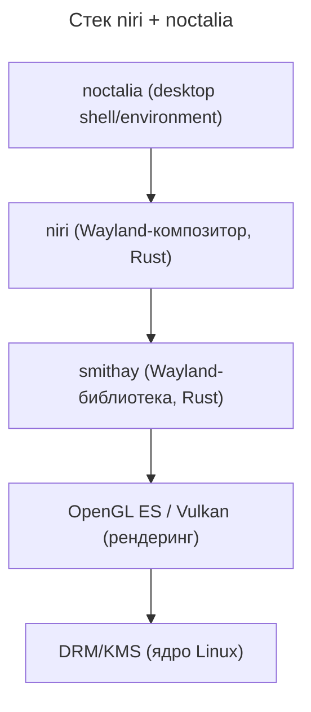
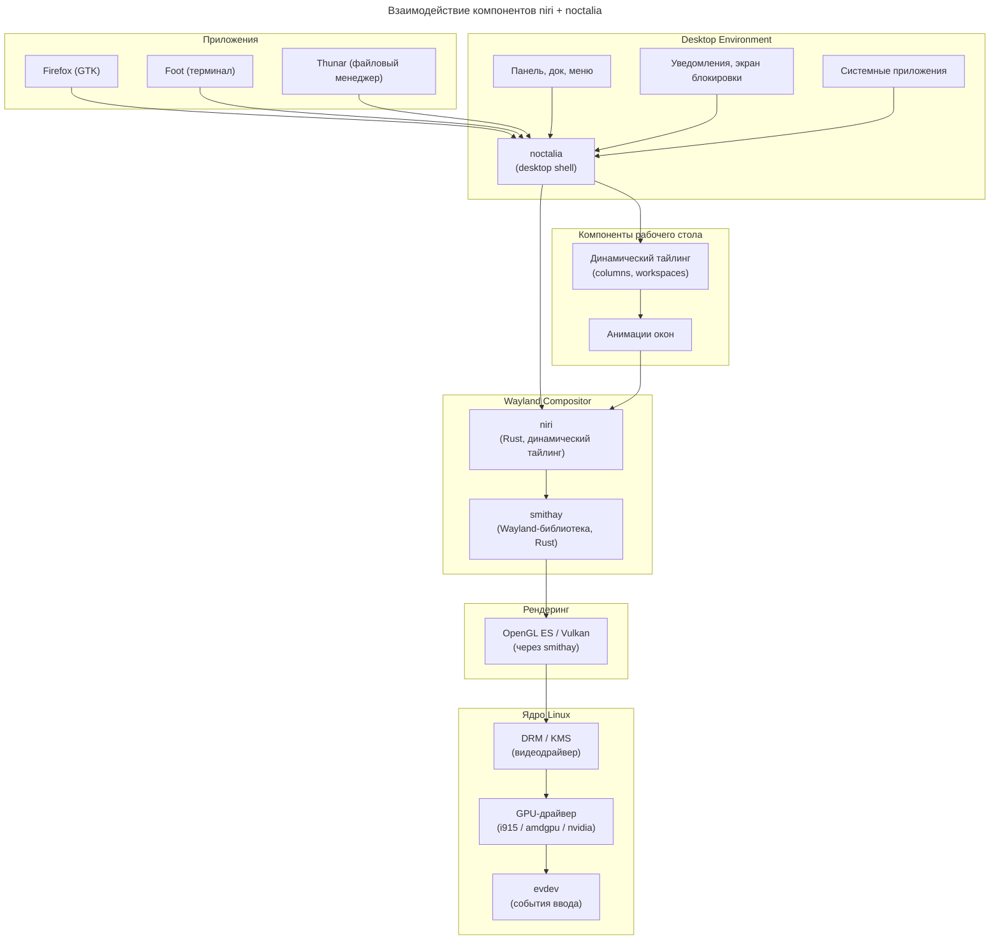

---
aliases:
  - DRM
  - Dynamic Tiling
  - KMS
  - OpenGL ES
  - Vulkan
  - Wayland
  - evdev
  - niri
  - noctalia
  - smithay
  - sway
  - wlroots
  - Динамический тайлинг
  - Композитор Wayland
---

## Архитектура niri + noctalia

### Схема стека



### Подробная mermaid-диаграмма



---

### Детальное описание компонентов

#### noctalia (desktop shell)

**Что это:** desktop environment/shell для niri, предоставляет пользовательский интерфейс.

**Роль:**

- панель задач (bar);
- меню приложений (launcher);
- уведомления;
- экран блокировки;
- системные апплеты (часы, громкость, сеть);
- обои рабочего стола.

**Технологии:**

- написан на Rust или использует Rust-библиотеки;
- интегрируется с niri через Wayland-протоколы;
- предоставляет XDG-совместимые диалоги.

---

#### niri (Wayland-композитор)

**Что это:** Wayland-композитор с динамическим тайлингом, написанный на Rust.

**Особенности:**

- **Динамический тайлинг** — окна автоматически организуются в колонки;
- **Плавные анимации** — встроенная поддержка анимаций окон;
- **Рабочие пространства** — виртуальные десктопы с анимацией переключения;
- **Написан на Rust** — безопасность памяти, современная архитектура;
- **Конфигурация** — TOML-файл (в отличие от sway, который использует свой синтаксис).

**Пример конфигурации (`~/.config/niri/config.kdl`):**

```kdl
output "DP-1" {
    mode "2560x1440@144"
    scale 1.25
}

input {
    keyboard {
        xkb {
            layout "us,ru"
        }
    }
}

binds {
    Mod+Return { spawn "foot"; }
    Mod+Q { close-window; }
}
```

---

#### smithay (Wayland-библиотека)

**Что это:** Rust-библиотека для создания Wayland-композиторов, аналог wlroots, но на Rust.

**Роль:**

- реализует Wayland-протокол;
- управляет окнами, вводом, рендерингом;
- предоставляет абстракции над DRM/KMS;
- поддерживает разные бэкенды рендеринга.

**Отличия от wlroots:**

| wlroots | smithay |
| --- | --- |
| Написан на C | Написан на Rust |
| Используется в sway, Hyprland | Используется в niri, cosmic-comp |
| Низкоуровневый API | Более высокоуровневый |
| Требует ручного управления памятью | Безопасность памяти (Rust) |

---

#### Рендеринг (OpenGL ES / Vulkan)

**Что используется:**

- **OpenGL ES** — основной бэкенд для 2D-рендеринга;
- **Vulkan** — экспериментальная поддержка через smithay.

**Как работает:**

- smithay получает буферы окон от приложений;
- niri применяет анимации, трансформации;
- финальный кадр рендерится через OpenGL ES;
- DRM/KMS выводит кадр на экран.

---

#### DRM/KMS (ядро)

**Роль:**

- **DRM (Direct Rendering Manager)** — управление GPU;
- **KMS (Kernel Mode Setting)** — переключение разрешений, частоты обновления;
- **GPU-драйверы** — i915 (Intel), amdgpu (AMD), nvidia (проприетарный);
- **evdev** — события клавиатуры, мыши, тачпада.

---

### Сравнение: sway vs niri

| Характеристика | sway | niri |
| --- | --- | --- |
| Язык | C | Rust |
| Библиотека | wlroots (C) | smithay (Rust) |
| Тайлинг | Статический (i3-стиль) | Динамический (колонки) |
| Анимации | Нет (нужен picom) | Встроены |
| Конфигурация | Свой синтаксис | TOML (KDL) |
| Desktop shell | swaybar + wofi | noctalia |
| Стабильность | Очень стабильный | Молодой проект |
| Память | Безопасность (C) | Безопасность (Rust) |

---

### Как это работает вместе

1. **Запуск:** systemd запускает niri.
2. **Инициализация:** niri использует smithay для создания Wayland-сервера.
3. **Рендеринг:** smithay настраивает OpenGL ES через DRM/KMS.
4. **Desktop shell:** noctalia подключается к niri через Wayland-протоколы.
5. **Приложения:** Firefox, Foot и др. отдают буферы в niri.
6. **Тайлинг:** niri автоматически организует окна в колонки.
7. **Анимации:** niri применяет плавные анимации через OpenGL ES.
8. **Вывод:** финальный кадр через DRM/KMS попадает на экран.
9. **Ввод:** события клавиатуры/мыши через evdev → niri → приложения.

---

### Преимущества niri + noctalia

**Особенности:**

- ✅ **Современный стек** — Rust, smithay, динамический тайлинг;
- ✅ **Встроенные анимации** — не нужен отдельный композитор;
- ✅ **Безопасность памяти** — Rust исключает многие классы багов;
- ✅ **Гибкая конфигурация** — TOML/KDL вместо специфичного синтаксиса;
- ✅ **Активная разработка** — молодой, но перспективный проект;
- ❌ **Молодой проект** — меньше документации, меньше плагинов;
- ❌ **Меньше совместимости** — некоторые X11-приложения могут работать хуже;
- ❌ **Требует Rust** — сложнее модифицировать для C-разработчиков;
- ❌ **noctalia** — тоже молодой, может не хватать функций.

---

### Альтернативы для niri

Если noctalia не подходит, можно использовать:

- **waybar** — универсальная панель для Wayland;
- **wofi / fuzzel / rofi-wayland** — launcher;
- **swaync** — центр уведомлений;
- **swaylock** — экран блокировки;
- **grim + slurp** — скриншоты.

Но noctalia даёт **единый опыт** — всё интегрировано и настроено для работы с niri.
