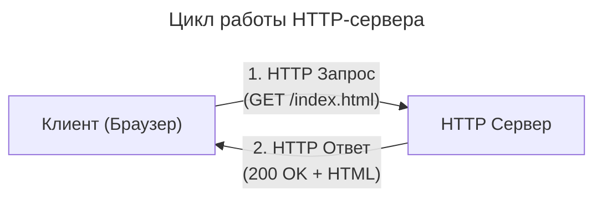
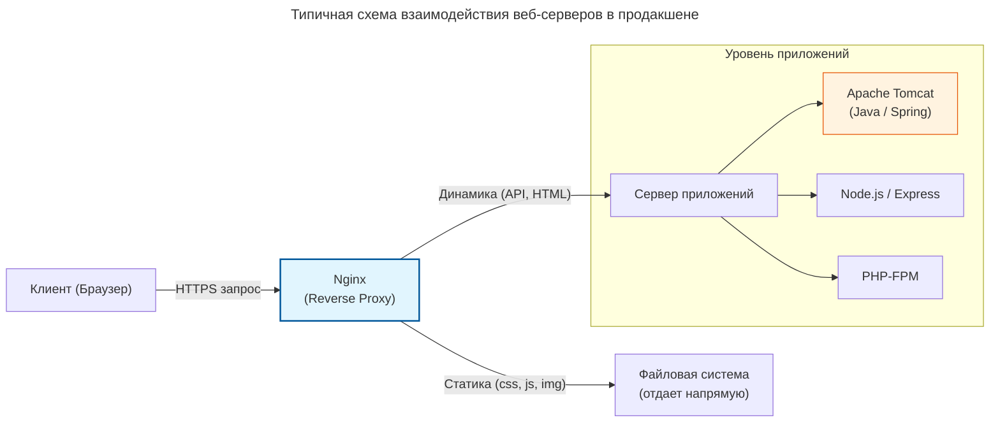

---
aliases:
  - Apache
  - Caddy
  - Engine-X
  - HTTP Server
  - http-server
  - http-server-express
  - IIS
  - Internet Information Services
  - LiteSpeed
  - Microsoft IIS
  - Nginx
  - Node.js
  - OpenLiteSpeed
  - Tomcat
---
## HTTP-сервер

HTTP-сервер — это программа (или физический компьютер), которая постоянно слушает сетевые запросы от клиентов (обычно веб-браузеров) и отправляет им ответы по протоколу HTTP.

**Как это работает HTTP-сервер**

Визуализация базового цикла взаимодействия:

1. **Запрос:** Клиент отправляет запрос на сервер (например, "покажи страницу /index.html").
2. **Обработка:** Сервер находит нужный файл на диске, либо запускает внутренний код для генерации данных.
3. **Ответ:** Сервер отправляет клиенту результат (HTML-страницу, картинку, JSON или код ошибки, например, 404).

**Основные задачи**

* **Раздача статики:** Быстрая отдача готовых файлов (HTML, CSS, JavaScript, изображений) прямо с диска.
* **Обработка динамики:** Выполнение серверного кода (на Java, Python, PHP, Node.js) и возврат сгенерированного контента.
* **Маршрутизация:** Перенаправление запросов на нужные внутренние сервисы или балансировка нагрузки (функция [[nginx-conf|Reverse Proxy]]).

**Популярные примеры**

* **Классические веб-серверы:** [[nginx|Nginx]], Apache, Caddy.
* **Серверы приложений:** Apache Tomcat (для Java), Gunicorn (для Python).
* **Встроенные решения:** Встроенный HTTP-модуль Node.js или Python.

## Популярные веб-серверы
В современной инфраструктуре понятие «веб-сервер» часто объединяет два разных типа программного обеспечения:
1. **Классические веб-серверы:** Занимаются обработкой HTTP-запросов, отдачей статических файлов, SSL-терминацией и проксированием ([[nginx|Nginx]], Apache, Caddy).
2. **Серверы приложений (Application Servers):** Непосредственно исполняют бизнес-логику на特定ном языке программирования (Tomcat, Node.js, Gunicorn).

Ниже приведен список самых популярных решений на рынке.

---

### 1. Nginx (Engine-X)
* **Тип:** Классический веб-сервер / [[nginx-conf|Reverse Proxy]] / Балансировщик.
* **Архитектура:** Асинхронная, событийно-ориентированная.
* **Для чего лучше всего:** Раздача статики, проксирование запросов к бэкенду, [[nginx-conf|балансировка нагрузки]], защита от DDoS.
* **Особенность:** Потребляет минимум памяти даже при десятках тысяч одновременных подключений. Является де-факто стандартом для фронтенда в современной веб-разработке.

### 2. Apache HTTP Server
* **Тип:** Классический веб-сервер.
* **Архитектура:** Процесно-ориентированная или поточная (MPM: Prefork, Worker, Event).
* **Для чего лучше всего:** Shared-хостинг, проекты, требующие гибкой настройки на уровне директорий (`.htaccess`), legacy-проекты на PHP.
* **Особенность:** Огромная экосистема модулей. Позволяет пользователям менять конфигурацию без доступа к правам root (через `.htaccess`), но это снижает производительность.

### 3. Apache Tomcat
* **Тип:** Сервер приложений (Servlet Container / Web Container).
* **Архитектура:** Многопоточная, управляемая JVM (Java Virtual Machine).
* **Для чего лучше всего:** Запуск Java-приложений (Java Servlets, JSP, Spring Boot в виде WAR-файлов).
* **Особенность:** **Важно не путать с Apache HTTP Server.** Tomcat не предназначен для эффективной раздачи статики или работы как полноценный Reverse Proxy. В продакшене его почти всегда ставят *за* Nginx или Apache, которые принимают HTTPS-трафик и отдают статику, а Tomcat обрабатывает только динамические Java-запросы.

### 4. Microsoft IIS (Internet Information Services)
* **Тип:** Классический веб-сервер.
* **Архитектура:** Поточная, глубоко интегрированная в ОС Windows.
* **Для чего лучше всего:** Корпоративные среды на базе Windows Server, приложения на ASP.NET, C#, интеграция с [[active-directory|Active Directory]].
* **Особенность:** Имеет удобный графический интерфейс (GUI) для управления, но привязывает инфраструктуру к экосистеме Windows.

### 5. LiteSpeed / OpenLiteSpeed
* **Тип:** Высокопроизводительный веб-сервер.
* **Архитектура:** Событийно-ориентированная (как у Nginx).
* **Для чего лучше всего:** Хостинг сайтов на WordPress, Magento и других PHP-фреймворках.
* **Особенность:** OpenLiteSpeed — это бесплатная версия с открытым исходным кодом. LiteSpeed Web Server (платная) является прямой заменой Apache (понимает файлы `.htaccess`), но работает в разы быстрее благодаря собственному движку обработки PHP (LSAPI).

### 6. Caddy
* **Тип:** Современный веб-сервер.
* **Архитектура:** Написан на языке Go, многопоточный.
* **Для чего лучше всего:** Быстрый запуск микросервисов, внутренних инструментов, небольших проектов.
* **Особенность:** Главная "киллер-фича" — **автоматическое получение и обновление HTTPS-сертификатов** (Let's Encrypt) без какой-либо дополнительной настройки. Конфигурационный файл (`Caddyfile`) максимально прост и читаем.

### 7. Node.js (встроенный HTTP-сервер или фреймворки типа Express)
* **Тип:** Сервер приложений / Веб-сервер.
* **Архитектура:** Асинхронная, событийно-ориентированная (Event Loop).
* **Для чего лучше всего:** Микросервисы, SPA (Single Page Applications), real-time приложения (WebSockets).
* **Особенность:** Часто используется как самостоятельный веб-сервер в разработке, но в продакшене его рекомендуется размещать за Nginx для кэширования, сжатия (gzip) и защиты.

---

### Сравнительная таблица

| Сервер        | Тип                | Основной стек         | Ключевое преимущество                                       |
| :------------ | :----------------- | :-------------------- | :---------------------------------------------------------- |
| **Nginx**     | Веб-сервер / Proxy | Любой (универсальный) | Максимальная производительность и низкое потребление памяти |
| **Apache**    | Веб-сервер         | PHP, Python, Ruby     | Гибкость через `.htaccess`, огромная база модулей           |
| **Tomcat**    | Сервер приложений  | Java (JVM)            | Стандарт де-факто для Java Servlets и JSP                   |
| **IIS**       | Веб-сервер         | .NET, C#, Windows     | Глубокая интеграция с ОС Windows и корпоративными сервисами |
| **LiteSpeed** | Веб-сервер         | PHP, WordPress        | Скорость Nginx + совместимость с конфигурацией Apache       |
| **Caddy**     | Веб-сервер         | Любой (Go)            | Автоматический HTTPS и простейшая конфигурация              |

---

### Типичная архитектура в продакшене

В реальных высоконагруженных проектах эти серверы не конкурируют, а **работают вместе**, образуя стек.

**Как это работает:**
1. Nginx принимает внешний трафик, расшифровывает SSL (HTTPS), сжимает данные и отдает все статические файлы сам, не нагружая приложение.
2. Если запрос требует выполнения кода (например, `/api/users`), Nginx проксирует его на внутренний порт, где слушает Tomcat, Node.js или PHP-FPM.
3. Сервер приложений выполняет бизнес-логику, обращается к базе данных и возвращает результат (обычно JSON или HTML) обратно в Nginx, который отдает его клиенту.
