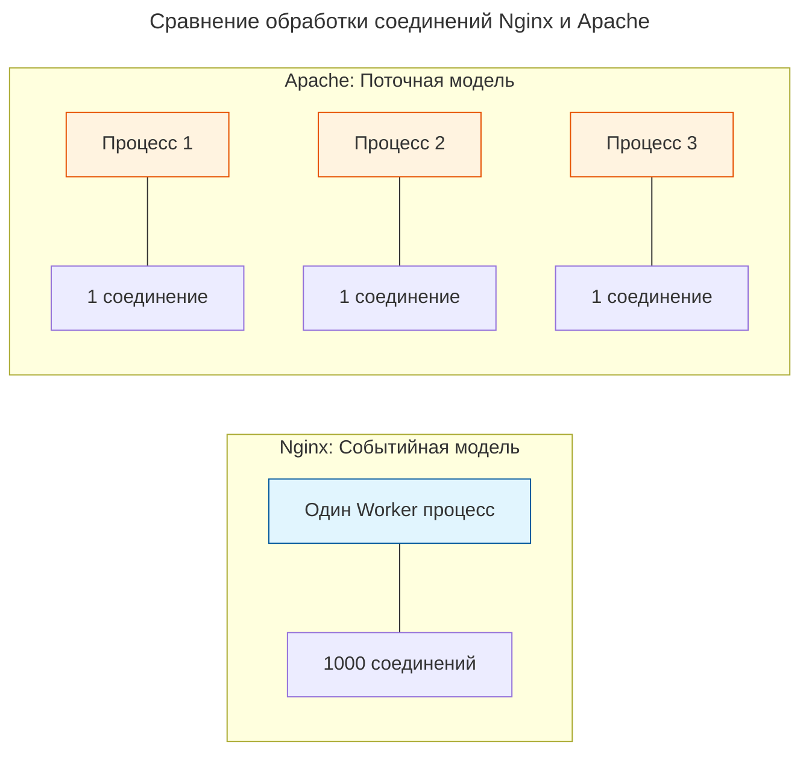

---
aliases:
  - Apache
  - Nginx
---
## Nginx

**Nginx** (произносится как *«engine-x»*) — это высокопроизводительный HTTP-сервер, обратный прокси-сервер, балансировщик нагрузки и почтовый прокси-сервер.

Если говорить просто, это программа, которая стоит «на входе» в ваш сервер, принимает все запросы от пользователей (из браузера) и решает, что с ними делать дальше: отдать файл напрямую или передать вашему приложению (на Node.js, Python, Java и т.д.).

### Основные роли Nginx

В современной веб-разработке Nginx чаще всего выполняет три задачи:

1. **Раздача статических файлов:** Nginx умеет отдавать HTML, CSS, JavaScript, картинки и видео невероятно быстро. Гораздо быстрее, чем это делают приложения на Node.js или Python.
2. **Обратный прокси (Reverse Proxy):** Nginx принимает HTTP-запросы от клиентов и перенаправляет их на внутренние серверы (бэкенд). При этом пользователь не знает, на каком порту и каком языке написано ваше приложение.
3. **Балансировщик нагрузки (Load Balancer):** Если у вас несколько серверов с приложением, Nginx может равномерно распределять входящий трафик между ними, чтобы ни один сервер не был перегружен.
4. **SSL/TLS Termination:** Nginx принимает зашифрованный HTTPS-трафик, расшифровывает его и передает вашему приложению уже обычный HTTP, снимая с приложения нагрузку по шифрованию.

### Почему Nginx такой быстрый? (Архитектура)

Главное отличие Nginx от классических серверов (например, Apache) заключается в архитектуре:

* **Apache (процессная/поточная модель):** На каждое подключение клиента создается отдельный поток или процесс. Если подключилось 1000 человек, нужно 1000 потоков. Это быстро съедает оперативную память.
* **Nginx (событийно-ориентированная модель):** Использует асинхронный подход. Один рабочий процесс (worker) может обрабатывать тысячи соединений одновременно, переключаясь между ними при наступлении событий (например, «файл прочитан с диска», «данные получены от бэкенда»). Это требует минимум памяти и обеспечивает огромную скорость.

### Как устроена конфигурация (nginx.conf)

Конфигурация Nginx состоит из вложенных блоков. Основные директивы, которые нужно знать:

* `http`: Глобальный блок для всех веб-настроек.
* `server`: Описывает виртуальный хост (конкретный сайт или домен).
* `location`: Определяет, как обрабатывать запросы к конкретным URL-адресам.

Пример базовой конфигурации для проксирования Node.js приложения и раздачи статики:

```nginx
http {
  # Настройки кэширования и сжатия
  gzip on;

  server {
    # Слушаем 80 порт (HTTP)
    listen 80;
    # Доменное имя
    server_name example.com;

    # Блок для статических файлов (картинки, CSS)
    location /static/ {
      root /var/www/myapp;
      expires 30d;
    }

    # Блок для всех остальных запросов (API, страницы)
    location / {
      # Передаем запрос на внутренний сервер приложения
      proxy_pass http://127.0.0.1:3000;
      
      # Передаем реальный IP клиента и имя хоста приложению
      proxy_set_header Host $host;
      proxy_set_header X-Real-IP $remote_addr;
    }
  }
}
```

### Резюме: зачем он нужен разработчику?

Если вы пишете бэкенд на Node.js, Python (Django/FastAPI), Go или Java, вам **не нужно** вешать это приложение напрямую на 80 или 443 порт в интернете.

Вместо этого вы запускаете приложение на локальном порту (например, 3000), а перед ним ставите Nginx. Nginx берет на себя всю рутину: принимает HTTPS, сжимает данные (gzip), кэширует статику, защищает от медленных клиентов и красиво распределяет нагрузку, позволяя вашему коду заниматься только бизнес-логикой.

## Nginx vs Apache

Nginx и Apache — два самых популярных веб-сервера в мире. Они решают одну и ту же задачу (отдача контента по HTTP/HTTPS), но используют совершенно разные подходы к архитектуре и обработке запросов.

### Главное архитектурное отличие

Фундаментальная разница кроется в том, как серверы управляют подключениями клиентов.

**Apache (Процессно-ориентированная модель)**
Исторически Apache создает отдельный процесс или поток для каждого клиентского соединения. Если на сервер пришло 1000 одновременных запросов, Apache должен породить 1000 потоков. Это требует много оперативной памяти и ресурсов процессора, что приводит к замедлению при высоких нагрузках (проблема C10k).

**Nginx (Событийно-ориентированная модель)**
Nginx использует асинхронный подход. Один рабочий процесс (worker) может обрабатывать тысячи соединений одновременно. Он не блокируется, ожидая ответа от диска или сети, а переключается на обработку других событий. Это делает его крайне легковесным и быстрым.

Визуализация разницы в обработке соединений:



### Сравнительная таблица

| Характеристика | Nginx | Apache |
| :--- | :--- | :--- |
| **Архитектура** | Асинхронная, событийная | Синхронная, процессная/поточная (MPM) |
| **Обработка статики** | Очень быстрая, требует мало памяти | Медленнее, потребляет больше ресурсов |
| **Обработка динамики** | Только через внешние процессы (FastCGI, uWSGI, прокси) | Может встраивать интерпретаторы внутрь (mod_php, mod_python) |
| **Конфигурация** | Только глобальные файлы конфигурации | Глобальные файлы + локальные `.htaccess` в папках |
| **Перезагрузка** | Graceful (без обрыва текущих соединений) | Graceful, но может быть тяжелее для системы |
| **Модули** | Динамически загружаемые (с версии 1.9.11) | Динамически загружаемые (DSO) |

### Ключевые различия в деталях

#### 1. Файлы .htaccess
Это одно из самых заметных отличий для разработчиков.
Apache позволяет размещать файлы `.htaccess` в любой директории. Сервер читает их при каждом запросе и применяет правила на лету. Это удобно для shared-хостинга (пользователи могут менять настройки без доступа к главному конфиг), но сильно снижает производительность.
Nginx полностью игнорирует `.htaccess`. Вся конфигурация задается централизованно в файлах `nginx.conf`. Это требует прав root-пользователя для изменений, но работает намного быстрее.

#### 2. Исполнение динамического кода (PHP, Python)
Apache может запускать код (например, PHP) прямо внутри своего процесса с помощью модулей вроде `mod_php`. Это просто в настройке, но "съедает" много памяти, так как каждый поток Apache загружает интерпретатор PHP.
Nginx не умеет исполнять код. Он работает только как прокси. Для PHP он всегда использует внешний процесс (PHP-FPM), передавая ему запросы по протоколу FastCGI. Это сложнее в первоначальной настройке, но гораздо эффективнее по памяти.

### Когда что выбирать

**Выбирайте Nginx, если:**
* У вас высокие нагрузки и много одновременных подключений.
* Вы раздаете много статического контента (картинки, видео, CSS/JS).
* Вы используете современные бэкенды (Node.js, Go, Python, Java, PHP-FPM).
* Вам нужен быстрый и надежный Reverse Proxy или балансировщик нагрузки.

**Выбирайте Apache, если:**
* Вы используете shared-хостинг и вам критически важна возможность использовать `.htaccess`.
* У вас legacy-проект на PHP, который исторически настроен на `mod_php`.
* Вам нужна максимальная совместимость со старыми модулями и специфическими директивами, которые есть только в Apache.

### Идеальный тандем: Nginx + Apache

В реальных высоконагруженных проектах часто не выбирают "или/или", а используют оба сервера вместе. Nginx ставится "фронтендом", а Apache работает "бэкендом".

Пример настройки Nginx для проксирования запросов на Apache:

```nginx
# Конфигурация Nginx как фронтенда
server {
  listen 80;
  server_name example.com;

  # Nginx сам быстро отдает всю статику
  location /static/ {
    root /var/www/html;
    expires 30d;
  }

  # Всё остальное Nginx передает на Apache
  location / {
    proxy_pass http://127.0.0.1:8080;
    proxy_set_header Host $host;
    proxy_set_header X-Real-IP $remote_addr;
    proxy_set_header X-Forwarded-For $proxy_add_x_forwarded_for;
  }
}
```

В такой связке Nginx принимает весь трафик, обрабатывает SSL, сжимает данные (gzip), кэширует статику и защищает Apache от медленных клиентов. Apache в это время занимается только тем, что умеет лучше всего — обработкой сложной бизнес-логики и динамического контента, работая на внутреннем порту (например, 8080).
