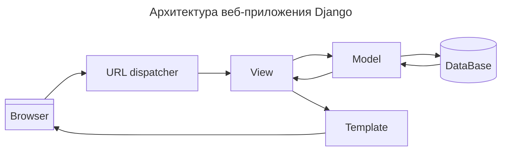
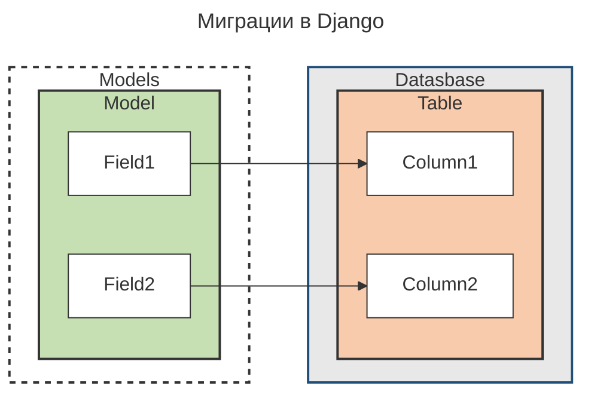

---
aliases:
  - Django
  - Django Framework
  - Framework
  - Django MVT
  - MVT
  - MTV
  - MVC
  - Django Model
  - Django View
  - Django Template
  - Template
  - Field lookup
  - Field lookups
  - istartswith
  - manage.py
  - django-admin
  - Django admin
  - startproject
  - startapp
  - runserver
  - createsuperuser
  - collectstatic
  - makemigrations
  - settings.py
  - urls.py
  - urlpatterns
  - views.py
  - models.py
  - forms.py
  - admin.py
  - apps.py
  - tests.py
  - wsgi.py
  - asgi.py
  - __init__.py
  - DjangoJSONEncoder
  - Cross Site Request Forgery
  - WSGI
  - ASGI
  - Asynchronous Server Gateway Interface
  - Django Forms
  - forms.Form
  - Django REST Framework
  - Django REST framework
  - django-rest-framework
  - Джанго
  - Лук-апы полей
  - Диспетчер запросов
  - Субдиспетчеры маршрутов
  - Спецификаторы
---

# Архитектура Django MVT

> [!important] **MVT**
> — паттерн проектирования приложений:
> 1. **Model** — the **data** you want to present, usually data from a database.
> 2. **View** — a **request handler** (**обработчик запросов**) that returns the relevant template and content — based on the request from the user.
> 3. **Template** — a text file (like an HTML file) containing the **layout of the web app**, with logic on how to display the data.

## Структура приложения Django



- **URL dispatcher** получает запрос в форме URL и определяет, какой ресурс должен обрабатывать данный запрос.
  - Обычно находится в файле `urls.py`.
- **View** обрабатывает запрос и отправляет ответ пользователю. При обработке запроса может происходить обращение к **модели** (базе данных). При формировании ответа могут применяться шаблоны **templates**.
  - В архитектуре MVC этому компоненту соответствуют контроллеры (но не представления).
  - Обычно находится в файле `views.py`.
- **Model** описывает данные, используемые в приложении. Отдельные классы, как правило, соответствуют таблицам в базе данных.
  - Обычно находится в файле `models.py`.
- **Template** представляет логику представления в виде сгенерированной HTML-разметки.
  - В MVC этому компоненту соответствует View, то есть представления.
  - Обычно находится в папке `templates`.

## Фреймворк Django

> [!important] **Фреймворк**
> (framework — каркас, структура) — программная платформа, определяющая структуру программной системы; программное обеспечение, облегчающее разработку и объединение разных компонентов большого программного проекта.

**Преимущества**
- **Reusability** компонентов — также называется **DRY** (Don't Repeat Yourself).
- **Ready-to-use features** — готовые функции, например:
  - login system (система входа);
  - database connection (подключение к базе данных);
  - **CRUD**-операции (Create Read Update Delete).

# Модель (Model)

Есть асинхронная передача данных в БД — транзакции. Можно, но не нужно, выполнять SQL напрямую.

## Объектно-реляционное отображение (ORM)

> [!important] **Объектно-реляционное отображение (ORM)**
> — система виртуальных объектов, которая позволяет взаимодействовать с БД без использования SQL.

Все структуры базы данных описываются в `models.py`. Изменения в структуре БД инициируются при помощи `migrations`.

## Определение моделей

Пример определения модели:

```python
from django.db import models

class Person(models.Model):
  name = models.CharField(max_length=20)
  age = models.IntegerField()
```

Более сложные структуры таблиц и связи между моделями (например, one-to-many) описаны в документации Django.

## QuerySets

Примеры запросов через QuerySet API:

```python
# SELECT * FROM members
mydata = Members.objects.all().values()
# SELECT firstname, lastname FROM members ORDER BY lastname ASC, id DESC
mymembers = Members.objects.all().order_by('lastname', '-id').values('firstname', 'lastname')
# SELECT * FROM members WHERE lastname = 'Refsnes' AND id = 2
mydata = Members.objects.filter(lastname='Refsnes', id=2).values()
# SELECT * FROM members WHERE firstname = 'Emil' OR firstname = 'Tobias'
mydata = Members.objects.filter(Q(firstname='Emil') | Q(firstname='Tobias')).values()
# SELECT * FROM members WHERE firstname LIKE 'L%'
# применение Field lookups
mydata = Members.objects.filter(firstname__startswith='L').values()
# аналогичен all().values(), только возвращает не словарь, а список кортежей
mymembers = Members.objects.values_list('firstname', 'lastname')
```

### Field lookups

Лук-апы полей применяются прямо к названию поля через `__`. Перечень лукапов:

| Lookup keyword | Description |
| -------------- | ----------- |
| contains | Contains the phrase |
| icontains | Same as contains, but case-insensitive |
| date | Matches a date |
| day | Matches a date (day of month, 1-31) (for dates) |
| endswith | Ends with |
| iendswith | Same as endswith, but case-insensitive |
| exact | An exact match |
| iexact | Same as exact, but case-insensitive |
| in | Matches one of the values |
| isnull | Matches NULL values |
| gt | Greater than |
| gte | Greater than, or equal to |
| hour | Matches an hour (for datetimes) |
| lt | Less than |
| lte | Less than, or equal to |
| minute | Matches a minute (for datetimes) |
| month | Matches a month (for dates) |
| quarter | Matches a quarter of the year (1-4) (for dates) |
| range | Match between |
| regex | Matches a regular expression |
| iregex | Same as regex, but case-insensitive |
| second | Matches a second (for datetimes) |
| startswith | Starts with |
| istartswith | Same as startswith, but case-insensitive |
| time | Matches a time (for datetimes) |
| week | Matches a week number (1-53) (for dates) |
| week_day | Matches a day of week (1-7) 1 is sunday |
| iso_week_day | Matches an ISO 8601 day of week (1-7) 1 is monday |
| year | Matches a year (for dates) |
| iso_year | Matches an ISO 8601 year (for dates) |

## Миграции



Создание и применение миграций:

```bash
python manage.py makemigrations
python manage.py migrate
```

# Представление (View)

## Обработка запроса

Пример обработчика запроса:

```python
from django.http import HttpResponse

def index(request):
  host = request.META["HTTP_HOST"]  # получаем адрес сервера
  user_agent = request.META["HTTP_USER_AGENT"]  # получаем данные браузера
  path = request.path  # получаем запрошенный путь
  return HttpResponse(f"""
    <p>Host: {host}</p>
    <p>Path: {path}</p>
    <p>User-agent: {user_agent}</p>
  """)
```

### HttpRequest

Каждый метод обработки запроса получает объект `request` типа `HttpRequest`. Он хранит информацию о запросе, в частности содержит поля:

- `scheme` — схема запроса (http или https).
- `body` — тело запроса в виде строки байтов.
- `path` — путь запроса.
- `method` — метод запроса (GET, POST, PUT и т.д.).
- `encoding` — кодировка.
- `content_type` — тип содержимого запроса (значение заголовка `CONTENT_TYPE`).
- `GET` — объект в виде словаря, который содержит параметры запроса GET.
- `POST` — объект в виде словаря, который содержит параметры запроса POST.
- `COOKIES` — отправленные клиентом куки.
- `FILES` — отправленные клиентом файлы.
- `META` — хранит все доступные заголовки http в виде словаря. Набор заголовков зависит от клиента и сервера, в том числе ключи:
  - `CONTENT_LENGTH` — длина содержимого.
  - `CONTENT_TYPE` — MIME-тип запроса.
  - `HTTP_ACCEPT` — типы ответа, которые принимает клиент.
  - `HTTP_ACCEPT_ENCODING` — кодировка, в которой клиент принимает ответ.
  - `HTTP_ACCEPT_LANGUAGE` — язык ответа, который принимает клиент.
  - `HTTP_HOST` — хост сервера.
  - `HTTP_REFERER` — страница, с которой клиент отправил запрос (при её наличии).
  - `HTTP_USER_AGENT` — юзер-агент или информация о браузере клиента.
  - `QUERY_STRING` — строка запроса.
  - `REMOTE_ADDR` — IP-адрес клиента.
  - `REMOTE_HOST` — имя хоста клиента.
  - `REMOTE_USER` — аутентификационные данные клиента (при наличии).
  - `REQUEST_METHOD` — тип запроса (GET, POST).
  - `SERVER_NAME` — имя хоста сервера.
  - `SERVER_PORT` — порт сервера.
- `headers` — заголовки запроса в виде словаря.

**Полезные методы HttpRequest**
- `get_full_path()` — возвращает полный путь запроса, включая строку запроса.
- `get_host()` — возвращает хост клиента. Для этого используются значения заголовков `HTTP_X_FORWARDED_HOST` (если включена опция `USE_X_FORWARDED_HOST`) и `HTTP_HOST`.
- `get_port()` — возвращает номер порта.
- `request.GET.get('param', default)` — значение по умолчанию для параметра, для которого не задано значение.

### HttpResponse

Сигнатура конструктора:

```python
HttpResponse.__init__(content=b'', content_type=None, status=200, reason=None, charset=None, headers=None)
```

Пример формирования ответов:

```python
def index(request):
  # можно ответить шаблоном
  return render(request, "contact.html")
  # можно передать в шаблон переменные
  data = {"header": "Hello Django", "message": "Welcome to Python"}
  return render(request, "index.html", context=data)
  # можно добавлять в headers свои параметры, которые можно будет потом считать в HttpRequest
  return HttpResponse("Hello METANIT.COM", headers={"SecretCode": "21234567"})
  # можно сформировать любой ответ
  return HttpResponse("Произошла ошибка", status=400, reason="Incorrect data")
  return HttpResponse("<h1>Hello</h1>", content_type="text/plain", charset="utf-8")

def user(request):
  age = request.GET.get("age", 0)
  name = request.GET.get("name", "Undefined")
  return HttpResponse(f"<h2>Имя: {name}  Возраст: {age}</h2>")

def user_info(request, name="Undefined", age=0):
  # можно передавать в обработчик ответов свои аргументы
  return HttpResponse(f"<h2>Имя: {name}  Возраст: {age}</h2>")
```

### Статусы ответа

Доступны объекты следующих классов:

```python
HttpResponseNotModified()                        # 304 (Not Modified)
HttpResponseBadRequest("Bad Request")            # 400 (Bad Request)
HttpResponseForbidden("Forbidden")               # 403 (Forbidden)
HttpResponseNotFound("Not Found")                # 404 (Not Found)
HttpResponseNotAllowed("Method is not allowed")  # 405 (Method Not Allowed)
HttpResponseGone("Content is no longer here")    # 410 (Gone)
HttpResponseServerError("Server Error")          # 500 (Internal Server Error)
```

Пример использования:

```python
def access(request, age):
  # если возраст НЕ входит в диапазон 1-110, посылаем ошибку 400
  if age not in range(1, 111):
    return HttpResponseBadRequest("Некорректные данные")
  # если возраст больше 17, то доступ разрешен
  if age > 17:
    return HttpResponse("Доступ разрешен")
  # если нет, то возвращаем ошибку 403
  else:
    return HttpResponseForbidden("Доступ заблокирован: недостаточно лет")
```

### JsonResponse

Пример ответа в формате JSON:

```python
from django.http import JsonResponse

def index(request):
  return JsonResponse({"name": "Tom", "age": 38})
```

Любой объект класса можно сериализовать как JSON и отправить:

```python
from django.http import JsonResponse
from django.core.serializers.json import DjangoJSONEncoder

class Person:
  def __init__(self, name, age):
    self.name = name  # имя человека
    self.age = age  # возраст человека

class PersonEncoder(DjangoJSONEncoder):
  def default(self, obj):
    if isinstance(obj, Person):
      return {"name": obj.name, "age": obj.age}
    return super().default(obj)

def index(request):
  bob = Person("Bob", 41)
  return JsonResponse(bob, safe=False, encoder=PersonEncoder)
```

### Редирект в представлении

Способы редиректа в представлении:

```python
def contact(request):
  return HttpResponseRedirect("/about")

def details(request):
  return HttpResponsePermanentRedirect("/")
```

### Cookie (куки)

**Передать куки**
- `set_cookie(key, value='', max_age=None, expires=None, path='/', domain=None, secure=False, httponly=False, samesite=None)` — задать куки.
- `set_signed_cookie(key, value, salt='', max_age=None, expires=None, path='/', domain=None, secure=False, httponly=False, samesite=None)` — задать шифрованные куки. Параметр `salt` обязателен для шифрования.

**Чтение куки**
- Для чтения простых куки используется `request.COOKIES`.
- `get_signed_cookie(key, default=RAISE_ERROR, salt='', max_age=None)` — чтение шифрованных куки.

## URL dispatcher (диспетчер запросов)

Пример диспетчера:

```python
from django.urls import path
from hello import views
from books import views as books_views
from contact import views as contact_views
from django.views.generic import TemplateView

urlpatterns = [
  # можно из диспетчера напрямую вывести готовый шаблон
  path("about/", TemplateView.as_view(template_name="about.html")),
  # в большинстве случаев ответ обрабатывается представлением
  path('', views.index, name='home'),
  path('book', books_views.index, name='book'),
  path('contact', contact_views.main, name='contact'),
]
```

Переменная `urlpatterns` определяет набор сопоставлений функций обработки с определёнными строками запроса. В примере при обращении к корню сайта `''` вызывается метод `index(request)` из представления `views.py` приложения `hello`.

`path(route, view, kwargs=None, name=None)` — метод, который сопоставляет пути с методами представления:
- `route` — шаблон адреса URL, которому должен соответствовать запрос.
- `view` — функция-представление, которая обрабатывает запрос.
- `kwargs` — дополнительные аргументы, которые передаются в функцию-представление.
- `name` — название маршрута.

`re_path(route, view, kwargs=None, name=None)` задаёт обработчик маршрутов с помощью регулярных выражений. Очередность маршрутов в `urlpatterns` имеет значение: при совпадении первого `route` обработка останавливается, и более точный маршрут, даже если он есть, может не быть обработан.

Пример с регулярными выражениями:

```python
urlpatterns = [
  re_path(r'^about/contact/', views.contact),
  re_path(r'^about', views.about),
  path('', views.index),
]
```

### Парсинг параметров строки запроса

Примеры парсинга параметров:

```python
from django.urls import path
from hello import views

urlpatterns = [
  re_path(r"^user/(?P<name>\D+)/(?P<age>\d+)", views.user),  # парсинг по P-строке
  path("user/<str:name>", views.user),  # парсинг по спецификатору параметра
  path("", views.index)
]
```

Для маршрута `user/<str:name>` определён параметр `name`, который соответствует параметру `name` в функции `views.user`. Параметры запроса описываются в форме `<спецификатор:название_параметра>`. По умолчанию Django предоставляет следующие **спецификаторы**:

- `str` — строка за исключением символа "/". Используется по умолчанию, если спецификатор не указан.
- `int` — положительное число.
- `slug` — последовательность символов ASCII, цифр, дефиса и символа подчеркивания, например, `building-your-1st-django-site`.
- `uuid` — идентификатор UUID, например, `075194d3-6885-417e-a8a8-6c931e272f00`.
- `path` — любая строка, которая также может включать символ "/", в отличие от спецификатора `str`.

Количество и названия параметров в шаблонах адресов URL должны соответствовать количеству и названиям параметров соответствующих функций, обрабатывающих запросы по данным адресам.

Другой метод парсинга параметров запроса — **парсинг по P-строке**. Общее определение параметра соответствует формату `(?P<имя_параметра>регулярное_выражение)`.

### Субдиспетчеры маршрутов через инклюзию

Два варианта организации субдиспетчеров:

```python
# первый вариант — обращение к диспетчеру приложения
# ./project/urls.py
from django.urls import include, path

urlpatterns = [
  # path('', RedirectView.as_view(url='members/')),
  path('members/', include('members.urls')),
]

# ./members/urls.py
from django.urls import path
from . import views

urlpatterns = [
  path('', views.index, name='index'),
  path('add/', views.add, name='add'),
  path('add/addrecord/', views.addrecord, name='addrecord'),
  path('delete/<int:id>', views.delete, name='delete'),
  path('update/<int:id>', views.update, name='update'),
  path('update/updaterecord/<int:id>', views.updaterecord, name='updaterecord'),
]

# второй вариант — обращение к представлениям
product_patterns = [
  path("", views.products),
  path("comments", views.comments),
  path("questions", views.questions),
]

urlpatterns = [
  path("", views.index),
  path("products/<int:id>/", include(product_patterns)),
]
```

### Редирект в диспетчере адресов

Пример редиректа в диспетчере:

```python
from django.views.generic.base import RedirectView

urlpatterns = [
  path('', RedirectView.as_view(url='members/'))
]
```

# Шаблоны (Template)

## Управляющие структуры

Шаблоны Django позволяют выполнять код с помощью тегов ``, выводить переменные `{{ }}` и использовать управляющие конструкции.

Пример шаблона с управляющими структурами:

```django
<!-- исполнение кода  -->

<!-- вывод переменных {{ }} -->
<h1>Hello {{ firstname }}, how are you?</h1>

<!-- template tags -->

  <h1>Hello</h1>

  <h1>Bye</h1>


  <h1>{{ x }}</h1>

<ul>
  
    <li>{{ x.firstname }}</li>
  
    <li>No members</li>
  
</ul>
```

Пример рендеринга шаблона в представлении:

```python
def testing(request):
  template = loader.get_template('template.html')
  context = {
    'firstname': 'Linus',
  }
  return HttpResponse(template.render(context, request))
```

### Условный оператор

Примеры условий:

```django

  <h1>Hello</h1>



  
    <h1>YES</h1>
  
    <h1>NO</h1>
  



```

### Оператор for, forloop, cycle

Пример цикла `for` с `reversed` и ``:

```django

  <li style='background-color:'>
    {{ forloop.revcounter }}) {{ x.id }} {{ x.firstname }} {{ x.lastname }}
  </li>

  <p>данные ещё не подгрузились</p>

```

- `reversed` — итерирует по QuerySet с конца.
- `` — выводится, если передан пустой массив данных.
- Специальные переменные для удобного вывода данных массива:
  - `forloop.counter`, `forloop.revcounter`, `forloop.counter0`, `forloop.revcounter0` — порядковый номер объекта в итераторе с начала или конца, начиная с 1 или 0.
  - `forloop.first`, `forloop.last` — возвращают булево значение.
  - `forloop.parentloop` — обращение к объекту вышестоящего итератора.
- `cycle` — позволяет создать список, который будет итерироваться по кругу внутри цикла. Текущий элемент можно выводить в переменную и перезапускать итератор при помощи ``.

Пример с `cycle`:

```django
<ul>
  
    
    
      
    
    <li style='background-color:{{ bgcolor }}'>{{ x.firstname }}</li>
  
</ul>
```

### Комментарии

Комментарии не выводятся в верстке. Бывают однострочные и многострочные:

```django
<h3>Django tags {# Комментирую важный заголовок #}</h3>

  <h3>тут будем испытывать теги</h3>

```

### Расширение и включение шаблонов (extends, include)

`extends` обеспечивает вложенность шаблонов. `include` позволяет включать контент из другого шаблона.

Базовый шаблон:

```django
<html>
  
  
  <hr/>
  
  
  
</html>
```

Дочерний шаблон:

```django


  <h1>Members</h1>


  lorem ipsum


```

### Инклюзия с контекстом

Шаблон, использующий переменные:

```django
<div>Руководство по {{ tutorial }} на {{ site }}</div>
```

Инклюзия в другом шаблоне:

```django

{# инструкция only сообщает прочим переменным пустое значение #}

```

Инклюзия в обработчике:

```python
def index(request):
  return render(request, "index.html", context={"site": "METANIT.COM"})
```

### Фильтры (filter)

При помощи `filter` можно преобразовывать содержимое переменной. Набор фильтров перечисляется через `|`.

```django

  <h1>Hello everyone, how are you?</h1>

<h1>Hello {{ firstname|first|lower }}, how are you?</h1>

  <h1>The price is {{ x|add:"10" }} dollars.</h1>

```

Доступные фильтры:

| Filter | Description |
| ------ | ----------- |
| add | Adds a specified value. |
| addslashes | Adds a slash before any quote characters, to escape strings. |
| capfirst | Returns the first letter in uppercase. |
| center | Centers the value in the middle of a specified width. |
| cut | Removes any specified character or phrases. |
| date | Returns dates in the specified format. |
| default | Returns a specified value if the value is False. |
| default_if_none | Returns a specified value if the value is None. |
| dictsort | Sorts a dictionary by the given value. |
| dictsortreversed | Sorts a dictionary reversed, by the given value. |
| divisibleby | Returns True if the value can be divided by the specified number, otherwise it returns False. |
| escape | Escapes HTML code from a string. |
| escapejs | Escapes JavaScript code from a string. |
| filesizeformat | Returns a number into a file size format. |
| first | Returns the first item of an object (for Strings, the first character is returned). |
| floatformat | Rounds floating numbers to a specified number of decimals, default one decimal. |
| force_escape | Escapes HTML code from a string. |
| get_digit | Returns a specific digit of a number. |
| iriencode | Converts an IRI into a URL friendly string. |
| join | Returns the items of a list into a string. |
| json_script | Returns an object into a JSON object surrounded by `<script></script>` tags. |
| last | Returns the last item of an object (for Strings, the last character is returned). |
| length | Returns the number of items in an object, or the number of characters in a string. |
| length_is | Returns True if the length is the same as the specified number. |
| linebreaks | Returns the text with `<br>` instead of line breaks, and `<p>` instead of more than one line break. |
| linebreaksbr | Returns the text with `<br>` instead of line breaks. |
| linenumbers | Returns the text with line numbers for each line. |
| ljust | Left aligns the value according to a specified width. |
| lower | Returns the text in lower case letters. |
| make_list | Converts a value into a list object. |
| phone2numeric | Converts phone numbers with letters into numeric phone numbers. |
| pluralize | Adds a 's' at the end of a value if the specified numeric value is not 1. |
| pprint | |
| random | Returns a random item of an object. |
| rjust | Right aligns the value according to a specified width. |
| safe | Marks that this text is safe and should not be HTML escaped. |
| safeseq | Marks each item of an object as safe and the item should not be HTML escaped. |
| slice | Returns a specified slice of a text or object. |
| slugify | Converts text into one long alphanumeric-lower-case word. |
| stringformat | Converts the value into a specified format. |
| striptags | Removes HTML tags from a text. |
| time | Returns a time in the specified format. |
| timesince | Returns the difference between two datetimes. |
| timeuntil | Returns the difference between two datetimes. |
| title | Upper cases the first character of each word in a text, all other characters are converted to lower case. |
| truncatechars | Shortens a string into the specified number of characters. |
| truncatechars_html | Shortens a string into the specified number of characters, not considering the length of any HTML tags. |
| truncatewords | Shortens a string into the specified number of words. |
| truncatewords_html | Shortens a string into the specified number of words, not considering any HTML tags. |
| unordered_list | Returns the items of an object as an unordered HTML list. |
| upper | Returns the text in upper case letters. |
| urlencode | URL encodes a string. |
| urlize | Returns any URLs in a string as HTML links. |
| urlizetrunc | Returns any URLs in a string as HTML links, but shortens the links into the specified number of characters. |
| wordcount | Returns the number of words in a text. |
| wordwrap | Wraps words at a specified number of characters. |
| yesno | Converts Booleans values into specified values. |
| i18n | |
| l10n | |
| tz | |

### Статические файлы (static)

Изображения, CSS и JS подгружаются через специальный механизм `static`. Для этого:
1. В папке приложения создаём папку `static` и помещаем туда файлы статического контента.
2. В шаблоне, в котором требуется подгрузка статического контента, прописываем две команды.

Пример подключения статики в шаблоне:

```django


```

## Теги шаблонов

Примеры тегов и фильтров:

```django
# первая буква будет заглавной
{{ message|capfirst }}
# фильтр cut удаляет из строки определённую подстроку

  {{ message|cut:"был" }}

# форматирование даты
<h2>{{ my_date|date:"d.m.Y" }}</h2>
<h2>{{ my_date|date:"H:i" }}</h2>
<h2>{{ my_date|date:"c" }}</h2>
<h2>{{ my_date|date:"SHORT_DATE_FORMAT" }}</h2>
# форматирование списка
{{ users|join:", " }}
```

Доступные теги:

| Tag | Description |
| --- | ----------- |
| autoescape | Specifies if autoescape mode is on or off |
| block | Specifies a block section |
| comment | Specifies a comment section |
| `` | Protects forms from Cross Site Request Forgeries |
| cycle | Specifies content to use in each cycle of a loop |
| debug | Specifies debugging information |
| extends | Specifies a parent template |
| filter | Filters content before returning it |
| firstof | Returns the first not empty variable |
| for | Specifies a for loop |
| if | Specifies an if statement |
| ifchanged | Used in for loops. Outputs a block only if a value has changed since the last iteration |
| include | Specifies included content/template |
| load | Loads template tags from another library |
| lorem | Outputs random text |
| now | Outputs the current date/time |
| regroup | Sorts an object by a group |
| resetcycle | Used in cycles. Resets the cycle |
| spaceless | Removes whitespace between HTML tags |
| templatetag | Outputs a specified template tag |
| url | Returns the absolute URL part of a URL |
| verbatim | Specifies contents that should not be rendered by the template engine |
| widthratio | Calculates a width value based on the ratio between a given value and a max value |
| with | Specifies a variable to use in the block |

## Ошибка 404

Для автоматической обработки ошибки 404 отключите `DEBUG` в `settings.py`, задайте `TEMPLATES['DIRS']` и создайте файл `templates/404.html` — он будет обслуживаться автоматически.

# Формы

Формы размещаются в файле `forms.py`.

Пример чтения данных POST-запроса:

```python
def postuser(request):
  # получаем из данных запроса POST отправленные значения по умолчанию
  name = request.POST.get("name", "Undefined")
  age = request.POST.get("age", 1)
  langs = request.POST.getlist("languages", ["python"])
  return HttpResponse(f"<h2>Name: {name}  Age: {age}</h2>")
```

При объявлении формы доступны типы полей и значений, а также виджеты Django.

Пример формы на основе `forms.Form`:

```python
from django import forms

class UserForm(forms.Form):
  name = forms.CharField()
  age = forms.IntegerField()
  # можно задать label, значение по умолчанию, подсказку
  age2 = forms.IntegerField(label="Возраст", initial=18, help_text="подсказка")
  # можно использовать один из виджетов Django
  comment = forms.CharField(label="Комментарий", widget=forms.Textarea)
  # можно задать очередность полей
  # field_order = ["age", "name"]
```

Передача формы в шаблон:

```python
from django.shortcuts import render
from .forms import UserForm

def index(request):
  userform = UserForm()
  return render(request, "index.html", {"form": userform})
```

Вывод формы в шаблоне:

```html
<body>
  <form method="POST">
    
    <table>
      {{ form }}
    </table>
    <input type="submit" value="Send" >
  </form>
</body>
```

В начале формы размещается тег Django ``, который защищает приложение от CSRF-атак, добавляя в форму скрытое поле csrf-токена.

Способы отрисовки полей формы:
- `form.as_table()` — отображение в виде таблицы.
- `form.as_ul()` — отображение в виде списка.
- `form.as_p()` — каждое поле формы отображается в отдельном параграфе.
- `form.as_div()` — каждое поле формы отображается в отдельном блоке `div`.

Поддерживаются валидация полей, сложное форматирование и стилизация формы.

# Создание проекта

Создание виртуального окружения и проекта:

```powershell
python -m venv .venv
.venv\Scripts\activate.bat                        # cmd
Set-ExecutionPolicy -ExecutionPolicy RemoteSigned -Scope CurrentUser
.venv\Scripts\Activate.ps1
python -m pip install --upgrade pip
pip install Django
django-admin --version
# инициализация проекта
django-admin startproject myProject
python manage.py runserver                        # запуск сервера
python manage.py createsuperuser
cd myProject
python manage.py startapp members                 # создание приложения members
deactivate                                        # выход из виртуального окружения
```

Команда `python manage.py runserver` запускает виртуальный сервер Django, доступ к которому по умолчанию на `http://127.0.0.1:8000/`.

## Структура проекта

- `manage.py` — выполняет различные команды проекта, например, создаёт и запускает приложение.
- Папка `myProject` — содержит следующие файлы:
  - `__init__.py` — указывает, что папка, в которой он находится, рассматривается как модуль. Это стандартный файл для программы на языке Python.
  - `settings.py` — содержит настройки конфигурации проекта.
  - `urls.py` — содержит шаблоны URL-адресов, по сути определяет систему маршрутизации проекта.
  - `wsgi.py` — содержит свойства конфигурации **WSGI** (Web Server Gateway Interface). Используется при развертывании проекта.
  - `asgi.py` — название файла представляет сокращение от **Asynchronous Server Gateway Interface** и расширяет возможности WSGI, добавляя поддержку взаимодействия между асинхронными веб-серверами и приложениями.

## Развертывание приложения

1. `python manage.py startapp hello` — создать приложение, где `hello` — название приложения.
2. Добавить в `settings.py` в `INSTALLED_APPS` — `'hello.apps.HelloConfig'`.
3. Добавить обработку запроса в главный диспетчер адресов и описать вывод ответа в файле представления приложения.


### Структура папки приложения

- Папка `migrations` — предназначена для хранения миграций — скриптов, которые позволяют синхронизировать структуру базы данных с определениями моделей.
- `__init__.py` — указывает интерпретатору Python, что текущий каталог рассматривается в качестве пакета.
- `admin.py` — предназначен для административных функций, в частности, здесь производится регистрация моделей, которые используются в интерфейсе администратора.
- `apps.py` — определяет конфигурацию приложения.
- `models.py` — определение моделей, которые описывают используемые в приложении данные.
- `tests.py` — хранит тесты приложения.
- `views.py` — определяет функции, которые получают запросы пользователей, обрабатывают их и возвращают ответ.

### Синхронизация моделей с БД

- `python manage.py migrate` — синхронизирует состояние базы данных с текущим набором моделей и миграций.
- `python manage.py makemigrations <app>` — создаёт новые миграции на основе изменений, внесённых в модели.

# FAQ

## Статические файлы при выключенном DEBUG

При выключенном `DEBUG` отдача статических и медиа-файлов настраивается вручную.

Маршрут для отдачи медиа-файлов:

```python
from django.views.static import serve

url(r'^media/(?P<path>.*)$', serve, {'document_root': settings.MEDIA_ROOT})
```

Указание корня статики:

```python
STATIC_ROOT = 'static'
```

Сбор статики:

```bash
python manage.py collectstatic
```

## Админ-панель

Создание суперпользователя:

```bash
python manage.py createsuperuser
```

## Переименовать проект

- Переименовать папку `oldprojectname` в `newprojectname`.
- В `manage.py`: изменить `os.environ.setdefault('DJANGO_SETTINGS_MODULE', 'oldprojectname.settings')`.
- В `newprojectname/wsgi.py`: изменить `os.environ.setdefault('DJANGO_SETTINGS_MODULE', 'oldprojectname.settings')`.
- В `newprojectname/settings.py`: изменить `ROOT_URLCONF = 'oldprojectname.urls'` и `WSGI_APPLICATION = 'oldprojectname.wsgi.application'`.
- В `newprojectname/urls.py`: заменить `oldprojectname` в добавленной строке.

## Тестирование

Для тестирования можно использовать заготовки из [репозитория Django](https://github.com/django/django/tree/main/tests) и официальную документацию — [Обзор тестирования Django](https://docs.djangoproject.com/en/4.1/topics/testing/overview/).

## settings.py

### Папка общих шаблонов проекта

Общие шаблоны проекта подключаются через параметр `DIRS`:

```python
TEMPLATES = [
  {
    'DIRS': [BASE_DIR / 'templates'],
  },
]
```

**См. также**
[[django-rest-framework]]
