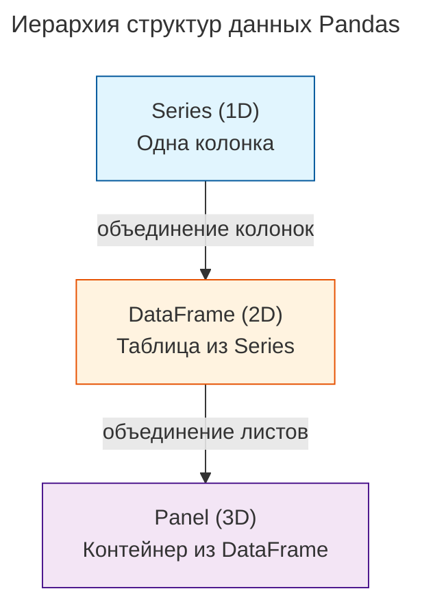

---
aliases:
  - broadcasting
  - CSV
  - Data processing
  - Data Science
  - JSON
  - Matplotlib
  - mean
  - Measures of Central Tendency
  - median
  - Numerical Python
  - Numpy
  - NumPy
  - Pandas
  - Python data processing
  - read_csv
  - SQL
  - Standard Deviation
  - Statistics
  - Variance
  - Дисперсия
  - Лонгитюдные данные
  - Медиана
  - Наука о данных
  - Обработка данных
  - Основы статистики
  - Панельные данные
  - Серии
  - Среднее арифметическое
  - Среднеквадратичное отклонение
  - Стандартное отклонение
  - Статистика
  - Фрейм данных
---

## Обработка данных в Python

### Статистические показатели

> [!important] The **mean** and the **median** are called **Measures of Central Tendency**, as they describe where the center of our data is.

- **Среднее арифметическое** — `mean`: сумма всех членов / количество.
- **Медиана** — `median`: серединное значение в списке значений `[14, 18, 19, 24, 26, 33, 42, 55, 67]`.
- **Дисперсия** — `Variance`: числовой показатель рассеивания (разброса значений) от среднего арифметического. Дисперсия — это среднее арифметическое `квадратов отклонений`.
- **Стандартное отклонение** — `Standard Deviation` (среднеквадратичное отклонение): показатель разброса значений относительно их среднего значения.
- Среднее значение — числовая характеристика множества чисел — некоторое число, заключённое между наименьшим и наибольшим из их значений. Часто обозначается либо чертой сверху: `x¯`, либо угловыми скобками: `<x>`. В зависимости от контекста задачи выделяют разные виды средних значений: среднее арифметическое, среднее квадратическое, среднее гармоническое, среднее по непрерывности …

$D(x) = \frac{\displaystyle\sum_{i=1}^{n}(x_i - x¯)^2}{n}$ — **Дисперсия, D, Variance**

$σ = \sqrt{D(x)}$ — **Среднеквадратичное отклонение, σ (сигма), Standard Deviation**

Пример: вычисление показателей на Python и NumPy

```python
'''
sum_nums 298
mean 33.1
variance, D(x) 292.5
Standard Deviation σ 17.1
'''
import math
nums = [14, 18, 19, 24, 26, 33, 42, 55, 67]
# сумма 298
sum_nums = sum(nums)
print ( 'sum_nums',sum_nums )
# среднее арифметическое значение 33.1
mean = round ( sum(nums)/len(nums), 1)
print ( 'mean',mean )
# дисперсия Variance 292.5
_tls = []
for n in nums:
    _tls.append( (n - mean)**2 )
variance = round ( sum(_tls)/len(_tls), 1)
print ('variance, D(x)', variance)
# Среднеквадратичное отклонение Standard Deviation 17.1
sigma = round ( math.sqrt(variance), 1)
print ('Standard Deviation, σ', sigma)
# считаем ТОТ ЖЕ РЕЗУЛЬТАТ при помощи модуля numpy
import numpy as np
np_nums = np.array(nums)
print ('apply NUMPY module')
print ('sum_nums', np_nums.sum() )
print ('mean, median',round(np.mean(np_nums), 1), round(np.median(np_nums), 1) )
print ('variance, D(x)', round(np.var(np_nums), 1))
print ('Standard Deviation, σ', round(np.std(np_nums), 1) )
```

## Библиотеки Python для data science

**Data Science** uses various techniques and methods to extract knowledge and insights from data. Most popular Python libraries used in Data Science: `numpy`, `pandas` and `matplotlib`.

### Matplotlib

Модуль, в котором можно строить графики (**plot**).

### Pandas

Надстройка над numpy. `Pandas` от термина "panel data", панельные данные.

> Панельные данные или **лонгитюдные данные** — используемые в социальных науках и эконометрике многомерные данные, получаемые серией измерений или наблюдений за несколько периодов времени для одних и тех же компаний или людей. Исследование, в котором используются панельные данные, называется панельным исследованием.

Импорт библиотеки pandas

```python
import pandas as pd
```

## Pandas

### Сводная таблица

| Data Structure | Dimensionality | Format | Описание |
|----------------|----------------|--------|----------|
| **Series** | 1D | Column | Одномерный массив с индексом (одна колонка) |
| **DataFrame** | 2D | Single Sheet | Двумерная таблица (несколько колонок, как Excel-лист) |
| **Panel** | 3D | Multiple Sheets | Трёхмерный контейнер из нескольких DataFrame (как несколько листов Excel) |

### Пример данных

**Series** — три отдельных одномерных колонки:

| name | | age | | marks |
|------|---|-----|---|-------|
| 0 Rukshan | | 0 25 | | 0 85 |
| 1 Prasadi | | 1 25 | | 1 90 |
| 2 Gihan | | 2 26 | | 2 70 |
| 3 Hansana | | 3 24 | | 3 80 |

**DataFrame** — единая таблица:

| | name | age | marks |
|---|--------|-----|-------|
| 0 | Rukshan | 25 | 85 |
| 1 | Prasadi | 25 | 90 |
| 2 | Gihan | 26 | 70 |
| 3 | Hansana | 24 | 80 |

**Panel** — несколько слоёв (листов) с одинаковой таблицей.

### Иерархия структур



**Ключевая идея**

Структуры вложены друг в друга по принципу размерности:

- **Series** → строится из одной колонки
- **DataFrame** → строится из нескольких Series (колонок)
- **Panel** → строится из нескольких DataFrame (листов)

> ⚠️ **Примечание**: структура `Panel` была удалена из pandas начиная с версии 0.25.0. Для работы с многомерными данными теперь рекомендуется использовать `MultiIndex` в DataFrame или библиотеку `xarray`.

#### Основные методы

- `DataFrame.loc[source]` — access a group of rows and columns by label(s) or a boolean array.
- `DataFrame.iloc[source]` — purely integer-location based indexing for selection by position, used for **[[python-data-structures|slicing]]**.

Пример: создание DataFrame и чтение данных

```python
import pandas as pd
data = {
   'ages': [14, 18, 24, 42],
   'heights': [165, 180, 176, 184]
}
df = pd.DataFrame(data, index=['James', 'Bob', 'Amy', 'Dave'])
print(df.loc["Bob"])
'''
ages        18
heights    180
Name: Bob, dtype: int64
'''
print(df[["ages", "heights"]])
'''
         ages  heights
James    14      165
Bob      18      180
Amy      24      176
Dave     42      184
'''
# output third row
print(df.iloc[2])
# first 3 rows
print(df.iloc[:3])
# rows 2 to 3
print(df.iloc[1:3])
# slicing by conditions
print(df[(df['ages']>18) & (df['heights']>180)])
# пример: чтение файла и добавление колонки
df = pd.read_csv("https://www.sololearn.com/uploads/ca-covid.csv")
df.drop('state', axis=1, inplace=True)
# добавление колонки
df['month'] = pd.to_datetime(df['date'], format="%d.%m.%y").dt.month_name()
df['weekday'] = df['date'].dt.strftime("%A")
df.set_index('date', inplace=True)
print(df.head())
print(df.describe())
print(df['month'].value_counts()) # количество строк с таким значением
print(df.groupby('month')['cases'].sum()) # группировка по значению для подсчета результата
# добавим колонку и выведем фрейм с максимальным значением
df['ratio'] = df['deaths'] / df['cases']
print (df[df['ratio']==df['ratio'].max()])
```

Pandas поддерживает чтение данных из CSV, JSON и SQL. Данные читаются как DataFrame. Навигация по читаемым данным при помощи методов `.head(), .tail()`.

- `DataFrame.head(n=5), DataFrame.tail(n=5)` — return the first n rows.
- `df.set_index("date", inplace=True)` — позволяет менять колонку-индекс в датафрейме.
- `df.drop('state', axis=1, inplace=True)` — позволяет удалить колонку или строку. За это отвечает параметр axis, где 1 — колонка, 0 — строка.
- `df.describe()` — для каждой серии выводит основные статистические показатели: среднее, медиану, стандартное отклонение, дисперсию, min, max, 25/50/75%, count.
- `df['month'].value_counts()` — количество строк с таким значением.
- `df.groupby()...` — группировка для агрегации данных…

## Numpy

**NumPy** (**Num**erical **Py**thon) is a Python library used to work with numerical data.

Пример: базовые операции с массивами NumPy

```python
import numpy as np
x = np.array([1, 2, 3, 4])
x = np.array([[1, 2, 3]
            , [4, 5, 6]
            , [7, 8, 9]])
print('x:\n',x,'\n')
print('x[1][2]',x[1][2]) #6
print('x.ndim',x.ndim) # 2
print('x.size',x.size) # 9
print('x.shape',x.shape) # (3, 3)
np.arange(-3, 3, 0.5, dtype=float)
# array([-3.0, -2.5 -2.0, -1.5 -1.0, -0.5, 0.0, 0.5, 1.0, 1.5, 2.0, 2.5])
x = np.arange(1, 7)
print(x) #[1 2 3 4 5 6]
z = x.reshape(2, 3)
print(z) #[[1 2 3]
         # [4 5 6]]
x = np.arange(1, 10)
print(x)      # [1 2 3 4 5 6 7 8 9]
print(x[0:2]) # [1 2]
print(x[:2])  # [1 2]
print(x[5:])  # [7 8 9]
print(x[-3:]) # [7 8 9]
print(x[(x>5) & (x%2==0)]) # [6 8]
x = np.array([14, 18, 19, 24, 26, 33, 42, 55, 67])
print(np.mean(x))   # среднее арифметическое
print(np.median(x)) # медиана
print(np.var(x))    # дисперсия
print(np.std(x))    # стандартное отклонение
```

### Свойства и методы массива NumPy

Arrays have properties, which can be accessed using a dot.

- `.ndim` — returns the number of dimensions of the array.
- `.size` — returns the total number of elements of the array.
- `.shape` — returns a tuple of integers that indicate the number of elements stored along each dimension of the array.
- `np.append(arr, values, axis=None)` — append values to the end of an array.
- `np.insert(arr, obj, values, axis=None)` — insert values along the given axis before the given indices.
- `np.delete(arr, obj, axis=None)` — return a new array with sub-arrays along an axis deleted. For a one dimensional array, this returns those entries not returned by arr[obj].
- `np.sort(arr, axis=- 1, kind=None, order=None)` — return a sorted copy of an array.
- `np.arange([start, ]stop, [step, ]dtype=None, *, like=None)` — allows you to create an array that contains a range of evenly spaced intervals (similar to a Python range).
- `arr.reshape(rows, cols)` — поменять число рядов, колонок в массиве.
- `arr.flatten()` — сделать массив плоским, в 1 строку.
- NumPy understands that the given `math operation` should be performed with each element. This is called **broadcasting**. e.g. `x*2`.
- `arr.sum(), .max(), .min()` — trivial methods.
- `np.mean(arr), np.median(arr), np.var(arr), np.std(arr)` — среднее арифметическое, медиана, дисперсия, стандартное отклонение.
